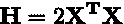

# 线性回归建模和普通最小二乘法的基础(OLS)

> 原文：<https://towardsdatascience.com/regularized-linear-regression-models-57bbdce90a8c?source=collection_archive---------7----------------------->

## [正则化线性回归模型](https://towardsdatascience.com/tagged/regularized-regression)

## 线性回归的上下文、获得 OLS 模型估计量的优化以及使用 Numpy 的 Python 实现

模型系数值随着正则化罚值的增大而变化(*图片由作者提供)*

嘿👋

欢迎来到关于**正则化线性回归建模的三部分深入探讨的第一部分——**用于监督学习任务的一些最流行的算法**。**

在进入方程式和代码之前，让我们先讨论一下本系列将涵盖的内容。

**第一部分**将包括关于回归的介绍性讨论、对线性回归建模的解释以及对*(OLS)模型的介绍(通过使用 NumPy 在 Python 中实现发现，使用应用优化理论推导出模型估计器)。*

*OLS 模式的弊端和一些可能的补救措施将在第二部分</regularized-linear-regression-models-44572e79a1b5>**中讨论。一个这样的补救方法， ***岭回归*** ，将在这里给出解释，包括其模型估计器的推导和 Python 中的 NumPy 实现。***

***[**第三部分**](/regularized-linear-regression-models-dcf5aa662ab9) 以对的解释结束这一系列的帖子，剩下的规则化线性模型: ***【套索】******弹性网*** 。求解这些模型比以前的情况更复杂，因为需要离散优化技术。这种复杂性的原因，*路径坐标下降*算法及其基于 NumPy 的 Python 实现，以及一些总结性的评论都在本文中给出。***

***模型和包含的实现在葡萄酒质量预测数据集上进行了测试，其代码和结果可以在项目资源库 [**这里**](http://github.com/wyattowalsh/regularized-linear-regression-deep-dive) 中查看***

# ***介绍***

***管理决策、组织效率和创收都是可以通过利用基于数据的洞察力来改进的领域。目前，随着技术可及性进一步延伸，市场竞争优势更加难以获得，人们更容易找到这些见解。一个寻求在收集的数据样本中实现价值的领域是预测分析。通过利用数学/统计技术和编程，从业者能够识别数据中的模式，从而产生有价值的见解。***

******回归*** 是预测分析中的一种技术，用于在给定一个或多个相关特征变量的情况下预测连续响应变量的值。这类算法通过对样本数据集进行训练来学习输入(特征)变量和输出(响应)变量之间的关系，从而完成这项任务。如何学习这些关系，并进一步用于预测，因算法而异。从业者面临着回归建模算法的选择，然而，线性回归模型由于其易于应用和高度可解释性而倾向于在过程的早期探索。***

# ***线性回归建模***

***线性回归模型通过对样本数据拟合线性函数来学习输入-输出关系。这可以用数学方法形式化为:***

******

***方程式#1***

***因此，响应被建模为输入变量乘以线性系数的加权和，其中包含误差项。在涉及优化的未来步骤中，使用向量符号将被证明是有用的。线性建模方程可以这样表示:***

******

***等式#2***

***上面等式中需要注意的一个重要方面是有一列 **1** 被附加到设计矩阵中。这使得系数向量的第一个系数可以用作截距项。如果在此之后不寻求截距，此栏可以省略。***

***因此，模型训练的目标是找到系数向量的估计值，***【β̂】，*** ，其然后可以与上述方程一起使用，以在给定新特征数据的情况下对响应进行预测。这可以通过将最优化理论应用于上述模型方程以导出模型系数估计器的方程来实现，该方程最小化通过对样本数据进行训练而发现的模型误差的概念。***

## ***最小化模型误差的概念***

***为了考虑如何最小化模型误差，必须首先考虑模型误差。单次预测的预测误差可以表示为:***

******

***方程式#3***

***因此，在向量表示法中，所有预测的总模型误差可以被发现为:***

******

***方程式#4***

***然而，对于寻找最小整体模型误差的用途，上面的*l₂范数不是一个好的目标函数。这是因为负误差和正误差将相互抵消，因此最小化将发现目标值为零，即使实际上模型误差要高得多。****

****这种有符号误差消除问题可以通过对模型的预测误差求平方来解决，产生误差平方和(SSE)项:****

********

****方程式#5****

****这个术语可以用向量符号表示为:****

********

****方程式#6****

****正如在未来的优化应用中所看到的，该函数更适合用作**损失函数**，一个最小化的函数，它恰当地模拟了给定技术的误差。除了正则化线性模型，许多不同的模型都使用 SSE 误差项作为它们各自损失函数中的一项。****

# ******普通最小二乘法******

****既然已经介绍了线性建模和误差，我们可以继续讨论最简单的线性回归模型，*(OLS)。在这种情况下，简单的 SSE 误差项就是模型的损失函数，可以表示为:*****

**********

*****方程式#7*****

*****使用这个损失函数，现在可以将问题形式化为*最小二乘*优化问题。该问题用于导出模型参数*的估计值，使结果的实际值和预测值之间的 SSE 最小化，并形式化为:******

**********

*****等式 8*****

*****添加 1/(2n)项是为了简化梯度的求解，并允许目标函数通过**大数定律**收敛到模型误差的期望值。*****

*****借助于问题的无约束性质，通过设置损失函数(目标)的梯度等于零并求解系数向量的合成方程， ***β̂.，可以获得 OLS 估计器的封闭形式的解*** 这产生了以下估计量:*****

********

****方程式#9****

****然而，这可能不是唯一的最优估计，因此它的唯一性应该得到证明。要做到这一点，只需表明损失函数(等式)。#8)是凸的，因为凸函数的任何局部最优性也是全局最优性，因此是唯一的。****

****一种可能的方法是通过二阶凸性条件来说明这一点，二阶凸性条件规定，如果一个函数是连续的、两次可微的，并且有一个相关的半正定的 Hessian 矩阵，则该函数是凸的。由于其二次性质，OLS 损失函数(方程式。#8)既是连续的又是两次可微的，满足前两个条件。****

****为了建立最后一个条件，OLS·海森矩阵被发现为:****

********

****方程式#10****

****此外，这个 Hessian 可以表示为正半定的:****

********

****方程式#11****

****因此，通过凸性的二阶条件，OLS 损失函数(等式)。#8)是凸的，因此上面找到的估计量(等式#9)是 OLS 问题的 ***唯一的*** 全局最小化器。****

## ****使用 Python 和 NumPy 实现估计器****

****使用矩阵求逆来求解 OLS 估计器不能很好地缩放，因此使用 LAPACK *_gesv* 例程的 NumPy 函数`solve`被用来寻找最小二乘解。该函数在 A 为平方且满秩(线性无关列)的情况下解方程。然而，在 A 不是满秩的情况下，则应该使用函数`lstsq` ,该函数利用 xGELSD 例程，从而找到 A 的奇异值分解。****

****在 OLS 的 Python 中，带有可选截取项的一个可能的实现是:****

****使用 Python 和 NumPy 实现 OLS****

# ******结论******

****希望你喜欢 ***正则化线性回归模型的第一部分。*👍******

****请务必查看第二部分</regularized-linear-regression-models-44572e79a1b5>**以了解为什么 OLS 模型有时无法准确执行，以及如何使用 ***岭回归*** 进行帮助，并阅读第三部分 以了解两个更正规化的模型: ***【套索】****弹性网。***********

****见 [**此处**](https://github.com/wyattowalsh/regularized-linear-regression-deep-dive/blob/master/SOURCES.md) 为创建这一系列帖子所利用的不同来源。****

****如果你愿意，请留下评论！我一直在努力改进我的帖子(逻辑上，语法上，或者其他方面),并且很乐意讨论任何相关的东西！😊****