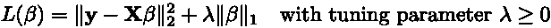

# 使用 NumPy 在 Python 中实现套索和弹性网的路径坐标下降

> 原文：<https://towardsdatascience.com/regularized-linear-regression-models-dcf5aa662ab9?source=collection_archive---------13----------------------->

## [正则化线性回归模型](https://towardsdatascience.com/tagged/regularized-regression)

## 解释解决一些最流行的监督学习算法

模型系数值随着正则化罚值的增大而变化(*图片由作者提供)*

你好。👋

欢迎来到深入探讨**正则化线性回归建模**的三部分的最后一部分！在[**第一部分**](/regularized-linear-regression-models-57bbdce90a8c) 中，建立了线性模型，并推导出 OLS，显示了如何求解模型系数，以预测给定新特征数据的响应。接下来，在第二部分**、 ***中，讨论了 OLS 模型的过拟合*** 问题，并且提出了 ***岭回归*** 作为通过正则化来帮助减少过拟合的技术。建筑脱离了与山脊回归相同的概念， ***套索*** 和 ***弹性网*** 现已呈现。本系列以对所介绍技术的用例的一般考虑作为结束。**

**模型和包含的实现在葡萄酒质量预测数据集上进行了测试，其代码和结果可以在项目资源库 [**这里**](http://github.com/wyattowalsh/regularized-linear-regression-deep-dive) **中查看。****

# **回归的套索**

**套索，或 ***最小绝对收缩和选择操作符*** ，包括添加一个 ***L₁*** 惩罚到 OLS 损失函数([第一部分](/regularized-linear-regression-models-57bbdce90a8c) : Eq。#7)，对于相关调谐参数 ***λ*** 的足够大的值，使选择性模型参数为零。换句话说， ***套索*** **执行自动特征选择**产生模型系数的向量，其稀疏度(为零的元素的数量)根据调谐参数的大小而变化。**

*****拉索*** 损失函数可以形式化为:**

****

**方程式#1**

**与前面的情况类似，截距项可以通过设计矩阵的数据扩充来包含，设计矩阵有一列 **1** s。此外，将问题公式化为*最小二乘*优化问题产生:**

****

**等式#2**

**然而，与以前的情况不同，这个问题没有封闭形式的解决方案。这是由于添加了 ***L₁*** 罚值使得函数由于非平滑的绝对分量而不再是连续可微的。为了解决这个问题，需要应用离散优化技术来搜索最优解。**

**为此存在许多算法，例如 ***LARS*** (最小角度回归)和 ***向前逐步回归*** ，然而，在本工作中利用了 ***路径坐标下降*** 算法。简而言之，该算法在保持所有其他参数不变的情况下，一次优化一个参数。**

## **路径坐标下降**

**在开始算法之前，所有特征应该被标准化为具有零平均值和一的方差。从那里， ***p+1*** 长度系数向量被初始化为零。然后，对所有系数进行循环，直到达到收敛，此时系数值稳定，且变化不超过某个容差。在每个周期内，对于每个系数，计算更新，随后对其应用软阈值算子。**

**最简单形式的 ***坐标下降*更新**使用设计矩阵中所有其他特征的部分残差，为每个系数计算简单(单一变量，而非多元回归)最小二乘系数值。在这种情况下，部分残差被发现为:**

****

**方程式#3**

**因此，特定系数值的估计值可由下式得出:**

****

**方程式#4**

**现在，由调谐参数决定的惩罚通过软阈值算子被包括在模型中。这表示为:**

****

**方程式#5**

*****幼稚更新*** 可以用来提高效率。这些更新可通过以下途径找到:**

****

**方程式#6**

**其中 ***rᵢ*** 是所有样本的当前模型残差， ***n*** 。**

**当样本的数量远大于特征的数量(***n***>>***p***)时，可以通过使用**协方差更新**来进一步提高效率。对于这些更新， ***的第一项天真的更新了上面的*** 等式(Eq。#6)被替换为:**

****

**方程式#7**

**利用 ***热启动*** 也能带来效率提升。使用 ***热启动*** ，拟合一系列模型——调谐参数值从最大调谐参数值下降到最小调谐参数值，最小调谐参数值是最大值的某个小因子(千分之一)——将每次迭代的系数初始化为最后一次迭代的解。很多情况下，对于一些小的 ***λ，拟合这条路径的模型其实比单个模型更快。*** 因此路径可以表示为:**

****

**等式 8**

**其中 ***𝜖*** 通常为 0.001，在对数标度上有 100 个间隔值。**

**此外，可以通过找到将使所有模型系数的估计为零的最小值来找到开始路径的调谐参数的最大值。这是因为任何高于该值的值都会导致系数向量的总体稀疏性。路径(起点)的最大值可由下式得出:**

****

**方程式#9**

**通过提供开始搜索最优性的起点，热启动可以多次加速收敛，并且还将*路径方式*置于 ***路径方式* *坐标下降*** 算法中。**

## **使用 NumPy 在 Python 中实现套索**

**对 ***【套索】*** (带有调整收敛容差、路径长度和返回路径的选项)实现 ***路径坐标下降*** t 的一种可能方式是:**

**使用 Lasso 的 Numpy 进行回归的 Python 实现**

# **弹性网**

**在这种形式的正则化线性回归中，OLS 损失函数通过向损失函数添加***【l₁】***和***【l₂】***罚值来改变，其中调谐参数控制正则化的强度和不同罚值之间的平衡。该损失函数可以形式化为:**

****

**方程式#10**

**既有***【l₁】***和****惩罚，弹性网*** 用于在脊回归和套索之间提供一种折衷，使系数趋向于零，并选择性地趋向于零。这里， ***α*** 可以认为是决定 ***L₁*** 罚加比例的参数，而 ***λ*** 可以认为是要应用的正则化强度。***

******弹性网*** 损失函数也用于形式化一个*最小二乘*优化问题:***

******

***方程式#11***

***与套索类似，通过设计矩阵扩充包括截距，为数学完整性添加 1/(2n)项，并且由于*罚项导致闭合形式的解不存在，因此实施 ***路径坐标下降*** 来求解。****

****就像在 ***套索中一样，路径坐标下降*** 用于求解模型系数估计值，但是需要对更新方程进行更改，以考虑双重惩罚。在这种情况下，在软阈值化之后获得的第 ***j*** 个系数值现在被发现为:****

********

****方程式#12****

****软阈值操作符与 ***套索*** 更新中应用的操作符相同(等式。#5):****

********

****方程式#13****

****此外，**幼稚更新**或**协方差更新**可以与**热启动**一起使用。对于**热启动**，最大 ***λ*** 值可以计算为:****

********

****方程式#14****

## ****使用 NumPy 在 Python 中实现****

****实现 ***路径式坐标下降*** 的一种可能方法是求解 ***弹性网*** (带有调整收敛容差、路径长度和返回路径的选项):****

****使用 NumPy 在 Python 中回归的弹性网****

# ****结论****

****在整个系列中，不同的正则化形式的线性回归已经被检验为克服过度拟合 ***普通最小二乘*** 模型的训练数据的趋势的工具。 ***弹性网***——由于其在正则化种类之间的平衡——倾向于最健壮地帮助**过拟合**问题，然而， ***【套索】*** 由于其**自动特征选择**在许多情况下肯定可以证明是有帮助的。 ***岭回归*** 也是一个很好的工具，可以用来确保减少可能的模型过拟合，因为它将模型系数收缩到零，从而减少模型方差。****

****该系列的标题图像很好地展示了 ***岭回归*** 和 ***套索*** 之间的区别，可以看出，对于 ***岭回归*** 情况，左边的模型系数都向零收缩，而对于 ***套索*** 情况，右边的系数以选择性的顺序变为零。****

****恭喜你！🎉🎊🥳****

****你坚持到了这个系列的结尾！****

****我希望这些帖子内容丰富，有助于您了解更多关于 ***正则化线性回归*** 以及求解相关模型所需的必要的**优化**。****

****见 [**这里**](https://github.com/wyattowalsh/regularized-linear-regression-deep-dive/blob/master/SOURCES.md) 为不同的来源，利用创造这一系列的职位。****

****如果你刚刚开始这个系列，请确保查看第一部分**和第二部分[**！**](/regularized-linear-regression-models-44572e79a1b5)******

******如果你愿意，请留下评论！我一直在努力改进我的帖子(逻辑上，语法上，或者其他方面),并且很乐意讨论任何相关的东西！👋******