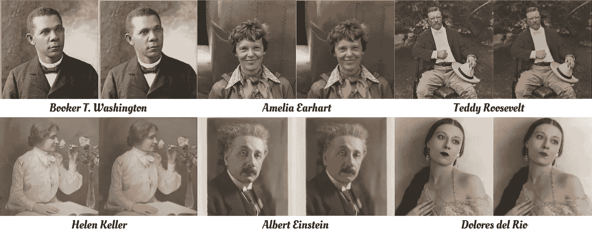
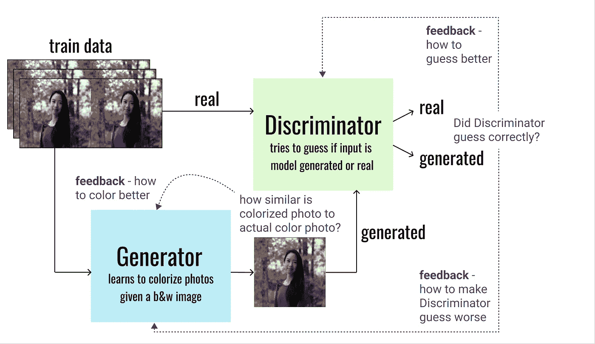
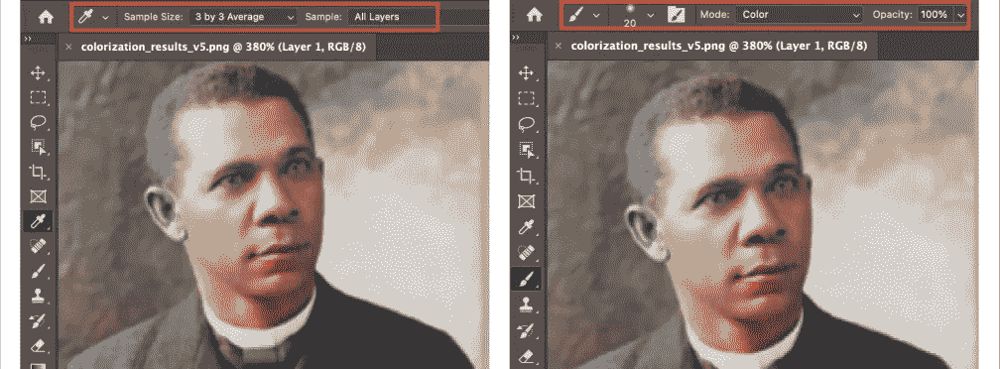
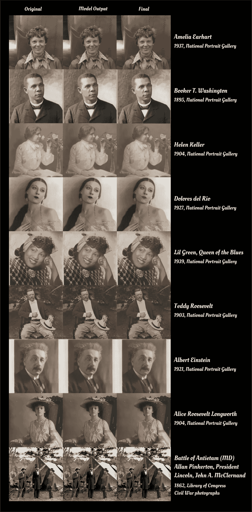

# 以 Pix2Pix 为助手，用彩色再现历史

> 原文：<https://towardsdatascience.com/reimagining-history-in-color-with-pix2pix-as-an-assistant-23d6e4a64e75?source=collection_archive---------29----------------------->

## [实践教程](https://towardsdatascience.com/tagged/hands-on-tutorials)

## 创意和人工智能合作:一个训练有素的 pix2pix 模型如何帮助着色

使用 pix2pix 帮助着色史密森尼国家肖像画廊的历史肖像的结果集锦

人类天生就有创造力。新的工具释放了潜伏在尚未开发的创客浪潮中的创造力，他们找到了意想不到的方式来展示他们的艺术能力。根据 [Pfeiffer 咨询公司的一项研究](https://www.pfeifferreport.com/wp-content/uploads/2018/10/Creativity-and-technology-in-the-age-of-AI.pdf)，即使是有经验的艺术家也认为新技术是创造力的推动者。这项研究发现，74%的艺术过程，从设想一件艺术作品到实现它，由许多艺术家不介意自动化的繁琐步骤组成。这就是一些艺术家认为机器学习可以有所帮助的地方。作为一名业余艺术家，我正在接受机器学习方面的研究生培训，我一直在探索这种可能性。在本文中，我将描述我如何训练 pix2pix 模型成为黑白照片着色的有用助手。该模型的输出提供了一个非常有用的基础，减少了我需要在 Adobe Photoshop 中对史密森尼国家肖像画廊的历史肖像进行着色和恢复的手工工作。虽然我不能声称彩色是历史上准确的，我很高兴与结果！

如果你是彩色化的新手，看看一些艺术家通过这些 Reddit 线程[这里](https://www.reddit.com/r/ColorizedHistory/)和[这里](https://www.reddit.com/r/Colorization/)制作的迷人作品。除了在原始黑白照片上绘制彩色图层的[手工流程](https://dynamichrome.com/process)之外，彩色艺术家还根据相似的彩色图像和历史记录进行广泛的研究，以尽可能准确地添加颜色。这是一个劳动密集型过程，但产生的结果往往是惊人的。例如，Mario Unger 花了 3000 个小时来修复和着色一组历史照片，但是看看他惊人的[结果](https://mymodernmet.com/colorized-black-and-white-historical-photos-mario-unger/)。我发现，当历史看起来更像我们生活的世界时，我们可以更好地与历史联系起来。

最近，史密森尼博物馆以开放数据的形式分享了数百万份资产，鼓励公众投入其中进行创作。史密森尼开放存取馆包括了许多来自国家肖像画廊的历史肖像。给这些肖像上色不是很好吗？由于我没有彩色艺术家的精细技能，我决定训练一个 pix2pix 模型来帮助我。

## **为着色训练 pix2pix】**

pix2pix 模型是用于图像到图像翻译的条件生成对抗网络(cGAN)。对于彩色化，模型被训练成将黑白(b&w)图像翻译成彩色图像。该模型由两个子组件组成:(1)一个被训练为向黑白图像添加颜色的生成器，以及(2)一个学习区分原始彩色图像和由生成器创建的彩色图像的鉴别器。彩色图像数据集用于训练数据。从每个图像中去除颜色以创建黑白和彩色图像对。生成器学习给 b&w 图像着色，以便它们欺骗鉴别器认为它们是原件，同时尽可能地再现图像的原始颜色。鉴别器学习识别图像何时被发生器着色。通过这个竞争过程，模型学习在多次迭代中改进它的着色。自从[论文](https://arxiv.org/pdf/1611.07004.pdf)的作者发布他们的[代码](https://github.com/phillipi/pix2pix)以来，许多研究人员和艺术家已经以创造性的方式使用 pix2pix。此处的[社区贡献部分显示了示例。](https://phillipi.github.io/pix2pix/)

用于着色的 pix2pix，高级概念(图片由作者提供)

现在有了模型本身的一些背景，让我们想象 pix2pix 是一个彩色化艺术家的学徒。对于学习如何将黑白图像转换成彩色图像的学徒来说，我们必须向其展示许多例子——越生动越好。我使用了 [COCO 数据集](https://cocodataset.org/#home) (35k 张图片)的一个子集，只过滤最丰富多彩的图片。在对这个数据集进行训练后，pix2pix 了解了一些世界的颜色，但它仍然不知道如何很好地给人的图像着色。因为目标是给肖像上色，它的下一步训练需要集中在这个任务上。我用我的个人照片和从 Unsplash 选择的照片创建了一个更小的高质量的人物图像数据集(2k 图像)。然后，因为旧的历史图像通常比现代数码照片模糊，我也给训练图像添加了随机模糊。现在，pix2pix 将建立在它已经从 COCO 那里学到的基础上，并进一步训练将稍微模糊的人的照片翻译成彩色图像。

## 模型结果

经过培训，我的 pix2pix 助手学会了很有帮助。使用史密森尼肖像作为我的测试数据，pix2pix 很好地为黑白图像添加了颜色，尽管我的训练数据存在明显的偏差。由于我的训练集很小，该模型更容易过度拟合——也就是说，该模型学习了特定于训练数据的模式，并错误地将这些特定内容应用于看不见的图像。例如，我的许多训练图像包含涂口红的人，结果，一些历史人物在输出中被涂上了口红😬。改进模型的一个简单方法是使用更大、更多样化的训练集。

总的来说，结果当然不是完美的，但仍然提供了一个很好的起点。虽然我没有彩色艺术家的精湛技巧，但 pix2pix 帮助我尝试了彩色化。

## **用 Photoshop 做最后的润色**

使用模型输出，用 Photoshop 添加最后的润色是非常容易的。

突出显示工具的 Photoshop 截图(作者提供的图片)

因为基色已经在图像中了，所以我使用了带有“3x3 样本平均值”的滴管工具来从图像的特定部分拾取颜色。选择颜色后，我使用“颜色”模式下的画笔工具，在模型遗漏或颜色不正确的区域涂色。该画笔将仅调整图像中的颜色，而不改变像素强度值(即高光/阴影等)。不会被打扰)。我使用的具体设置在上图中突出显示。然后，为了消除原始照片的损坏，如划痕或钢笔痕迹，我使用标准笔刷设置来覆盖它。我花了不到 5 分钟编辑每张图片。继续滚动查看最终结果！

## **最终结果**

按照顺序，该图显示了原始图像、经过训练的 pix2pix 模型输出和 Photoshop 编辑后的最终图像(作者提供的图)(文章末尾的图像参考链接)

感谢阅读，我希望你喜欢最后的结果。像 pix2pix 这样的模型有可能使着色这样的任务变得更容易实现。熟练的着色艺术家也可以发现这种模型有助于减少完成成品所需的繁琐工作。他们可以利用节省下来的时间专注于更新颜色，以获得历史准确性或艺术天赋。非常感谢史密森尼博物馆发布了如此令人难以置信的数据集，供研究人员探索历史——在这种情况下，用颜色重新想象历史🎨

思考的食粮——机器学习和循环中的创意还能产生什么？💡

**图片参考(原件链接):**

1.[阿米莉亚·埃尔哈特](https://www.si.edu/object/amelia-earhart:npg_NPG.2011.77.8?edan_q=amelia%2Bearhart&edan_fq%5B0%5D=media_usage:CC0&oa=1&destination=/search/collection-images&searchResults=1&id=npg_NPG.2011.77.8)

2.[布克·华盛顿](https://www.si.edu/object/booker-t-washington:npg_NPG.79.208)

3.[海伦·凯勒](https://www.si.edu/object/helen-adams-keller:npg_NPG.91.105?edan_q=helen%20keller&destination=/search/collection-images&searchResults=1&id=npg_NPG.91.105)

4.[多洛里斯·德尔·利奥](https://www.si.edu/object/dolores-del-rio:npg_NPG.2006.70)

5.[莉莉·格林](https://www.si.edu/object/gelatin-silver-print-lil-green-queen-blues:nmaahc_2015.97.38.25)

6.泰迪·罗斯福

7.[阿尔伯特·爱因斯坦](https://www.si.edu/object/albert-einstein:npg_S_NPG.84.288)

8.爱丽丝·罗斯福·朗沃斯

9.[林肯——内战照片](https://www.loc.gov/resource/cwp.4a40254/)