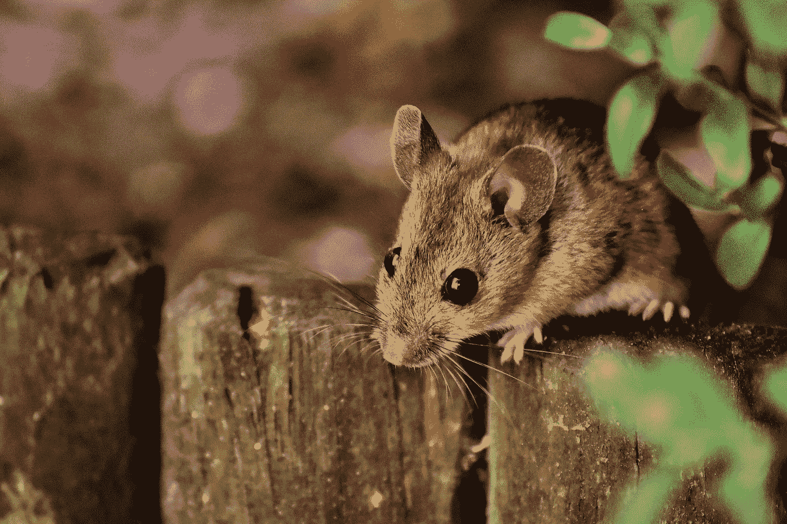
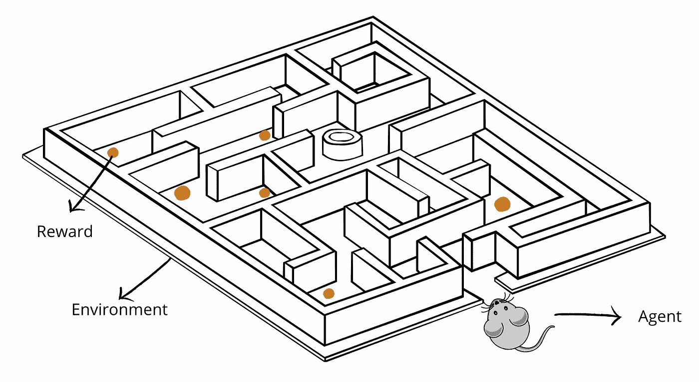
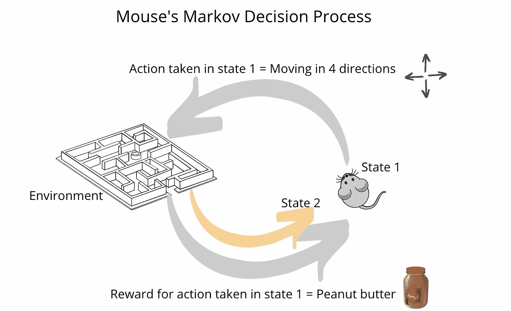

# 小鼠的强化学习

> 原文：<https://towardsdatascience.com/reinforcement-learning-3f87a0290ba2?source=collection_archive---------28----------------------->

没有动物的生活不值得 living❤️去过

## 相似的动物和计算机是如何学习的？

# 强化学习

强化学习(RL)是一种深度学习，在过去几年中受到了很多关注。这对于我们想要训练 AI 掌握某些我们不完全理解的技能的情况是有用的。

RL 有一个代理人，他在不确定的**环境**中采取**行动**，目标**是最大化累积**报酬**。代理从它的错误中学习，并且它的决策算法改进。**

当我读到 RL 概念时，我认为它与动物如何学习和做决定非常相似。

# 小鼠迷宫实验:

下面是马蒂亚斯·万德尔非常著名的视频。他正在制作不同类型的迷宫，并在老鼠探索不同的迷宫时观察它们。老鼠正在复杂的动态环境中学习智能行为。

# RL 与动物学习

下面是老鼠迷宫实验和 RL 概念之间的类比。

作者图片

**代理:**决定采取什么动作的组件。在这种情况下，我们的代理是鼠标。

**环境:**代理运行的物理世界。**迷宫**就是环境。

**动作:**代理的方法，允许它交互和改变它的环境，从而在状态之间转移。在这种情况下，**鼠标向右、向左、向前和向后的运动**就是动作。

**状态:**任务的当前世界或环境的表示。鼠标相对于迷宫的**位置**和**状态**。

**奖励:**环境的反馈。在这种情况下，吃花生或葵花籽就是奖励。这是让老鼠继续探索的即时奖励。

**惩罚:**负面奖励，对不良行为的惩罚。当鼠标卡在一个**窄孔**中时，被扣分。

**奖励最大化:**在 RL 中，代理人的座右铭是获得最高的奖励。我们的老鼠的目标是最大化奖励，这意味着**吃了最多的食物。**

**目标:**让老鼠**解决迷宫**。如果它快速解决迷宫，它导航更快，在更短的时间内获得更多的花生。

**利用:**当老鼠学会如何在迷宫中导航时，它可以利用，即使没有效率也要继续走同样的路。

**探索:**我们的老鼠认为尝试许多不同的行动是值得的，以便能够最大化未来的回报。所以，这只老鼠的贪婪和好奇让它不断尝试其他路径，寻找最短的一条。

**策略:**鼠标获得最多奖励的策略。正如你在这个视频中看到的，它有一个贪婪的方法。老鼠是既贪婪又好奇的哺乳动物，所以它们更喜欢探索和利用。

## **勘探开发权衡**

代理不能同时探索和利用。如果它**利用**，它会选择最安全的方式，以便能够在它开始探索的路径上吃到最多的食物，或者**探索**，找到能够在迷宫中导航的其他路径。

代理人应该如何平衡探索和开发？该策略为代理提供了一些关于如何平衡这两者的信息。

在这个实验中，老鼠的探索-利用困境根据食物的数量和迷宫的难度而变化。

在 6:00 的视频中，马蒂亚斯放了很多花生和种子，老鼠停止探索，它只是继续吃。

**价值函数:**几乎所有的强化学习算法都是基于估计价值函数——状态的函数，估计智能体处于给定状态有多好。

它是从状态 1 开始的预期收益，遵循预定的政策。

在这种情况下，值函数是鼠标到目前为止所做工作的总结。

## **马尔可夫决策过程:**

马尔可夫决策过程(MDP)是一个描述强化学习环境的数学框架。下图显示了 MDP 中代理与环境的交互:

作者图片

# 结论

强化学习正在以与人类和动物开发智能相同的方式产生人工智能。RL 是直观的，因为我们在世界上行动，我们得到奖励或惩罚，我们学习。这是一种强化学习。如果我们可以教会机器如何像人类和/或动物一样学习和行动，RL 可能是人工智能的未来。