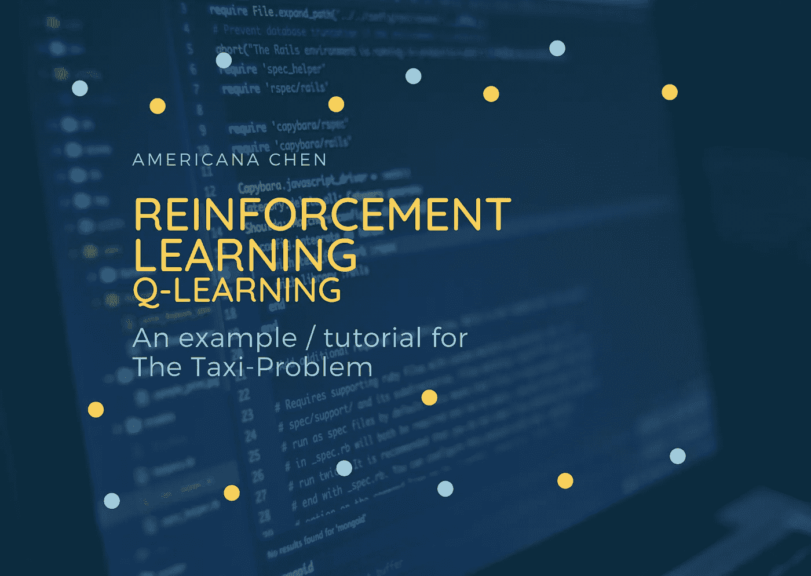
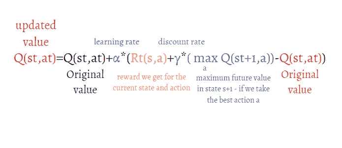
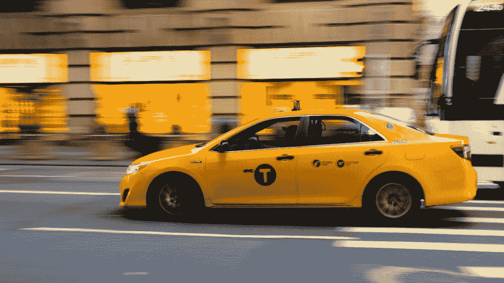
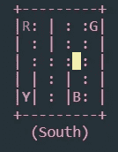

# 强化学习和 Q 学习 Python 中“出租车问题”的一个例子

> 原文：<https://towardsdatascience.com/reinforcement-learning-and-q-learning-an-example-of-the-taxi-problem-in-python-d8fd258d6d45?source=collection_archive---------9----------------------->

Americana 使用 Canva 制作的图像

# **新手入门指南**

数据科学家的典型路径是从探索性数据分析到机器学习，再到深度学习，然后再到强化学习，就像机器学习课程的结构一样，比如著名的吴恩达“机器学习”课程。**从机器学习到深度学习往往更直观，然而，当继续处理强化学习问题时，可能会更令人困惑。**马尔可夫决策过程、奖励函数、贝尔曼方程等概念似乎在不同的宇宙中。在我自己的学习过程中，我发现**通过一个例子和强化学习模型的实际实施可以帮助我理清概念。**通过玩模型来调整参数，欣赏可视化效果，都可以帮助你加深对强化学习的理解。

在这篇文章中，我将向你简单明了地介绍强化学习和 Q-learning，然后分享**一个使用 Q-learning 技术解决强化学习问题的例子——python**中的“出租车问题”。你可以下载代码并坚持下去，我希望这能给你一些关于什么是强化学习以及如何在简单的问题环境中实现它的基本概念。

# 一些注意事项:

*   一些代码可能不是最有效的，因为我自己也是初学者，欢迎在评论中给出任何建议！
*   代码的基本结构受到了其中一门 Udemy 课程的启发——[机器学习、数据科学和用 Python 进行深度学习](https://www.udemy.com/course/data-science-and-machine-learning-with-python-hands-on/)由 Frank Kane 教授的 [Sundog Education。出于探索的目的，我在模型构建中做了参数调整部分和一些更改，以及我的解释和见解。](https://www.udemy.com/user/frankkane/)

# **什么是强化学习？**

图片来源:unsplash by[Arseny Togulev](https://unsplash.com/@tetrakiss)

简而言之，强化学习不同于典型的“输入 x，输出 y”监督学习问题，因为**它涉及一个代理与其周围环境进行交互，以确定采取什么样的最佳行动。****环境可能是不确定的、复杂的，代理的行为也可能是概率性的，而不是确定性的。**这使得问题看起来极其复杂，因此我们需要首先定义以下典型强化学习问题的设置:

1.  **状态空间**

这定义了代理可能处于的所有可能状态，注意，当我们定义状态时，我们必须非常小心，以使定义包含我们需要知道的所有信息，以确定下一个状态。例如，如果我们正在解决一个汽车驾驶问题，我们可能需要知道位置的(x，y)坐标，x 方向的速度，y 方向的速度，甚至 x 和 y 方向的加速度。

状态空间可以是离散的(有限的)或连续的(无限的)。

**2。动作空间**

这通常比定义状态空间更简单。动作空间是代理可以采取的所有可能的动作。例如，在网格中行走的简单机器人具有向左、向右、向前、向后行走的动作空间。因此，典型地，动作空间是有限的，并且与状态空间相比具有少得多的元素。

**3。转移概率**

转移概率是到达下一个状态的概率— ( St+1)，假定代理处于当前状态(St)并执行了一个动作(at)。这一部分表明代理的行为是随机的，机器人不按照你的指示行动的可能性总是存在的！这个概念在马尔可夫决策过程中使用，但在 Q-Learning 中是一个必要的组件，所以我们不会对它进行过多的阐述。

**4。奖励**

回报是状态和行动 R(s，a)的函数，我们可以把它看作是对代理人快速有效地达到预期目标的激励。我们通常为我们希望代理达到的状态设置一个正的奖励值，并为代理采取的每一个额外步骤设置一个小的惩罚(负奖励)。

在许多实际情况下，奖励并没有很好地定义，所以我们需要首先运行一个由代理执行的随机行为的大样本，并收集信息来估计奖励。

**5。政策**

该策略将状态映射为动作，因此它将当前状态作为输入并输出供代理采取的动作，在 MDP 问题中，我们希望找到最优策略，然而在 Q 学习问题中，它也不是关键的。

在 RL 问题中，代理人希望最大化其总报酬。它不断地与环境互动，探索并收集信息，了解在特定状态下执行某个动作会得到什么样的回报，然后在每个状态下搜索要采取的最佳动作。

# q 学习

q 学习是一种基于价值的学习算法**。代理的目标是优化一个“价值函数”以适应它所面临的问题。我们之前已经定义了一个奖励函数 R(s，a)，在 Q 学习中，我们有一个**值函数**，它类似于奖励函数**，但是它针对给定的策略评估特定状态中的特定动作。它考虑了采取特定行动所带来的所有未来回报，而不仅仅是当前的回报。**在 Q 学习过程中，我们有一个 Q 表，它存储每个状态和每个可能动作的 Q 值，**代理探索环境并迭代地更新 Q 值。****

# 学习过程

**第一步:初始化**

将 Q 表中的所有 Q 值初始化为 0，代理不知道它所处的环境。

**第二步:探索空间**

代理通过在其所处的状态下执行动作来不断探索环境。这里我们有一个**探索 vs .开发**的问题:虽然如果我们将动作定义为代理继续执行返回最高价值函数的动作，问题肯定会收敛到全局最优，但这个过程可能会很慢，很痛苦。在具有大状态动作空间的设置中，我们希望代理偶尔随机选择其动作，并且有机会更快地找到最优值。

你可以考虑这样一种情况，亚马逊不断推荐与你购买的产品相似的产品，但偶尔它可能会随机向你展示一些东西，而且总有可能产品实际上符合客户的偏好。这为推荐系统提供了关于客户的新信息，否则需要更长时间才能变得清楚。

我们可以实现探索策略的方式是使用ε贪婪策略，其中存在ε的概率，我们采取随机行动，而不是最大化价值函数的行动，当我们到达代码部分时，这将变得更清楚。

**第三步:观察奖励**

当探索时，代理将观察它从执行状态(st)中的特定动作(at)到下一个状态(st+1)得到什么奖励。

**第四步:更新价值函数**

在观察到奖励之后，代理使用下面的公式更新特定状态和动作对的值函数，这返回更新的 Q 表。

我们有学习率和贴现率作为两个超参数。您可以将贴现率视为一个调整参数，以激励代理更快地实现目标，因为它“贴现”状态(st+1)中的未来值。学习率控制着当前值相对于新值的权重。

更新规则(图片由 Americana 制作)

# **出租车问题**

图片来源:unsplash 作者[凯·皮尔格](https://unsplash.com/@kaip)

出租车问题是由 OpenAI Gym 的贡献者构建的，open ai Gym 是一个开源库，你可以用 python 安装它来访问不同的环境，供你探索、开发、测试和练习强化学习算法。我强烈建议你安装它并跟随它，在看完我的例子后，你也可以探索其他的标准环境，如“GymFC”:一个飞行控制调整和训练框架，“GymGo”:棋盘游戏 Go，它们都将是你练习和“强化”你对 RL 理解的很好的资源。

<https://github.com/openai/gym/blob/master/gym/envs/toy_text/taxi.py>  

# 问题说明:

*   从随机状态开始，我们的工作就是把出租车开到乘客所在的位置，接乘客开车到目的地，把客户放下，然后这一集就结束了。
*   网格中有 4 个指定位置，用**红色— 0、绿色— 1、黄色— 2 和蓝色— 3** 表示，蓝色字母对应上车位置，紫色字母表示下车位置。实线表示出租车不能通过的墙，而实心矩形表示出租车，当它是黄色时，它是空的，当它是绿色时，它载着一名乘客。

*   每个状态由 4 个条目的元组定义:(taxi_row，taxi_col，passenger_location，destination)。例如，图像显示 state (2，3，2，0)，这意味着我们位于行索引 2(注意 python 索引从 0 开始，因此这意味着行 3)和列索引 3，乘客位于黄色，编码为 2，我们的目的地为红色，编码为 0。
*   状态空间:我们可以看到，我们的状态空间由 **500 个可能的状态**组成，有 25 个可能的出租车位置、5 个乘客可能的位置(包括乘客在出租车中的情况)和 4 个目的地位置
*   动作空间:有 **6 个离散的确定性动作:** 0 —向南移动，1 —向北移动，2 —向东移动，3 —向西移动，4 —搭载乘客，5 —放下乘客
*   奖励:除了运送乘客获得+20 奖励外，每多走一步有 R=-1 的惩罚，非法执行“上车”和“下车”行为导致 R=-10

# 下面是代码！

首先，我们导入开源库——gym，并开始使用 taxi 环境。在这里，我们使用版本 3，但新版本不断发布，所以如果它不工作，然后尝试 v2 或 v4。

我们可以用可爱的小出租车使用 **streets.render()** 输出我们环境的可视化。

我们将为我们的问题设置一个初始状态，代理从行索引 2 和列索引 3 开始，我们需要从黄色点接客户，并在红色点放下他。

q 表的初始化被生成为 2D Numpy 数组，该数组表示我们的虚拟空间中的每个可能的状态和动作对。参数是指定的，10000 个历元意味着我们将重复让出租车探索 10000 次。

当我们从 0 和 1 之间的均匀分布生成随机值并将其与我们的 epsilon(探索率)进行比较时，epsilon 贪婪策略开始发挥作用，如果随机值较小，我们从我们的动作空间中采取随机动作，如果不是，我们查看当前的 Q 表并采取使价值函数最大化的动作。

然后，我们执行动作，观察奖励，更新 Q 值，并将状态(st)更新为“下一个状态”(st+1)。

现在我们来看看结果！如果我们在初始状态，最高值是-2.3639511，这对应于向左走一步，如果我们回头看我们最初的可视化，我们可以看到，如果出租车想从黄点搭载乘客，向左移动显然是最佳选择！你可以玩这个，检查不同的状态，这是一个很好的检查，看看你的模型是否收敛。

使用我们计算的 Q 表，我们可以指导出租车司机现在做他的工作。这段代码随机初始化一个状态，并要求出租车司机根据生成的 Q 表执行任务。我们已经将出租车可以走的步数限制为最多 25 步，以防我们的出租车司机运气真的不好，我们重复这个过程 10 次，计算出租车司机完成评估我们模型的任务所需的平均步数。

我们可以看到平均步数是 13.9，还不错！

为了改进我们现有的模型，我们需要调整我们的超参数。如果我们希望我们的模型达到更好的结果，这一步是非常重要的，在这种情况下，我们希望出租车司机能够以更少的步骤执行任务。因此，首先我重新定义了 Q 学习过程和平均行程长度函数的计算，以测试不同的学习率、折扣因子和探索率(ε)。

需要注意的一点是，因为我们在测试平均步数时，初始状态是随机生成的，每次结果都可能不同，所以**我们取 10 次平均步数的平均值！**听起来令人困惑，但是如果你仔细观察上面的代码，它会变得更加清晰。最佳的折现因子是 0.9，所以我们固定 0.9 并尝试不同的学习率，对探索率也是如此。

最后，结合每个参数的最优结果，我们取得了更好的结果，**平均步数从 13.9 减少到 11.8！**

你可以从 Jovian 下载这段代码，玩得开心点！

<https://jovian.ai/americanachen/qlearning-med>  

***访问***[***【www.enlightmentblog.com】***](http://www.enlightmentblog.com/)***获取更多真知灼见，优质文章***

# Enlightment 简介:

[**Enlightment**](http://www.enlightmentblog.com/)**是一个博客和网络平台**，围绕分享、激励和联系的主题而构建。它旨在促进全球有抱负的大学生之间的思想交流。

该平台继续提供由有抱负的学生创作的高质量内容，可以分发这些内容以激励他人，帮助大学生培养分析和创新思维。我们也渴望建立社区，为有相似兴趣、志向或来自同一所大学的学生牵线搭桥。

> 今天就加入我们，享受无广告、无订阅的无缝阅读体验。

# 关注我们/连接到:

脸书:[https://www.facebook.com/Enlightmentblog](https://www.facebook.com/Enlightmentblog)insta gram:[@ enlightmentblog 2021](https://www.instagram.com/enlightmentblog/)Linkedin:[https://www.linkedin.com/company/enlightment-blog](https://www.linkedin.com/company/enlightment-blog)