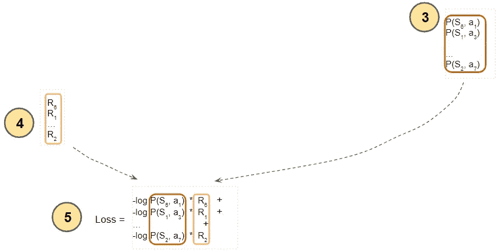

# 直观解释的强化学习(第 6 部分):策略梯度，循序渐进

> 原文：<https://towardsdatascience.com/reinforcement-learning-explained-visually-part-6-policy-gradients-step-by-step-f9f448e73754?source=collection_archive---------3----------------------->

## 直观强化学习系列

## 一个温和的指南，加强算法，在简单的英语

迈克尔·泽兹奇在 [Unsplash](https://unsplash.com?utm_source=medium&utm_medium=referral) 上的照片

这是我关于强化学习(RL)系列的第六篇文章。我们现在已经很好地理解了构成 RL 问题的基础的概念，以及用于解决它们的技术。我们还详细研究了两种基于值的算法——Q 学习算法和深度 Q 网络(DQN)，这是我们深入强化学习的第一步。

在本文中，我们将继续我们的深度强化学习之旅，并了解我们第一个使用策略梯度技术的基于策略的算法。我们将一步一步地介绍增强算法，这样我们可以看到它与 DQN 方法的对比。

这里是对本系列之前和之后文章的一个快速总结。我的目标是不仅要理解事物是如何工作的，还要理解它为什么会这样工作。

1.  [基本概念和术语介绍](/reinforcement-learning-made-simple-part-1-intro-to-basic-concepts-and-terminology-1d2a87aa060) *(什么是 RL 问题，以及如何使用马尔可夫决策过程和概念(如回报、价值和政策)中的技术将 RL 问题解决框架应用于该问题)*
2.  [解决方案方法](/reinforcement-learning-made-simple-part-2-solution-approaches-7e37cbf2334e) *(概述流行的 RL 解决方案，并根据这些解决方案之间的关系进行分类。贝尔曼方程的重要提示，它是所有 RL 算法的基础。)*
3.  [无模型算法](/reinforcement-learning-explained-visually-part-3-model-free-solutions-step-by-step-c4bbb2b72dcf) *(基于价值和基于策略的解决方案的异同，使用迭代算法逐步提高预测。剥削、探索和贪婪的政策。)*
4.  [Q-Learning](/reinforcement-learning-explained-visually-part-4-q-learning-step-by-step-b65efb731d3e) *(对该算法进行深入分析，这是后续深度学习方法的基础。发展直觉，了解为什么这个算法会收敛到最优值。)*
5.  [深度 Q 网络](/reinforcement-learning-explained-visually-part-5-deep-q-networks-step-by-step-5a5317197f4b) *(我们的第一个深度学习算法。一步一步地演示它是如何工作的，以及为什么做出那些架构选择。)*
6.  **策略梯度 *—本文*** *(我们第一个基于策略的深度学习算法。)*
7.  演员评论家*(复杂的深度学习算法，结合了 Deep Q 网络和策略梯度的优点。)*
8.  惊喜话题😄*(敬请期待！)*

如果您还没有阅读之前的文章，那么最好先阅读一下，因为本文建立在我们在那里讨论的许多概念之上。

# 政策梯度

通过深 Q 网络，我们间接地获得了最优策略。网络学习输出给定状态的最佳 Q 值。这些 Q 值随后被用于导出最优策略。

因此，它需要使用一个隐式策略，这样它就可以训练自己，例如，它使用一个ε-贪婪策略。

另一方面，我们可以建立一个直接学习最优策略的神经网络。它不是学习一个将状态作为输入并输出所有动作的 Q 值的函数，而是学习一个输出可以从该状态采取的最佳动作的函数。

更准确地说，它输出的不是单一的最佳行动，而是从该状态可以采取的行动的概率分布。然后可以通过从概率分布中取样来选择动作。

(图片由作者提供)

这正是最佳政策。

# 架构组件

策略网络是一个相当标准的神经网络体系结构，它被训练来预测最佳策略。就像 DQN 一样，如果你的状态可以通过一组数字变量来表示，那么它可以像一个带有几个隐藏层的线性网络一样简单。或者，如果您的州数据表示为图像或文本，您可能会使用常规的 CNN 或 RNN 架构。

策略网络获取当前状态，并预测从该状态要采取的动作的概率分布。

(图片由作者提供)

训练数据是在与环境交互并存储观察结果时从实际经验中收集的。储存了一段经历。每个样本由一个(状态、动作、回报)元组组成。

# 高级工作流

高层次的工作流程是策略梯度经过许多时期的训练。每个时期有两个阶段。在第一阶段，它从环境中收集一集的训练数据。在第二阶段，它使用训练数据来训练策略网络。

(图片由作者提供)

现在让我们放大这个第一阶段。

(图片由作者提供)

策略网络充当代理，并与情节的环境进行交互。从当前状态，策略网络预测动作的概率分布。然后，它从这个分布中抽取一个动作，在环境中执行它，并返回一个奖励和下一个状态。它将每个观察结果保存为训练数据的样本。

政策网络保持固定，在此阶段不会改善。

(图片由作者提供)

现在，我们将放大流程的下一个阶段。

(图片由作者提供)

在一集结束时，训练数据被输入到策略网络。它从数据样本中提取当前状态和动作，并预测该动作的概率。

(图片由作者提供)

贴现回报是通过从数据样本中提取回报来计算的。

(图片由作者提供)

贴现收益和行动概率用于计算损失以训练策略网络。策略网络学习预测更好的行动，直到找到最佳策略。

(图片由作者提供)

# 基于策略的解决方案比基于价值的解决方案有一些优势

基于值的解决方案学习一个值函数，该值函数输出可以从一个状态采取的所有动作的 Q 值。他们会努力解决行动数量非常大的问题。例如，您可以有连续的动作(例如，机器人可以旋转任何角度，包括从 0 度到 360 度的分数角度，抬起手臂或转动头部任何角度，以某个范围内的任何实数速度移动，等等)，这导致无限数量的动作。

另一方面，像策略梯度这样的基于策略的解决方案学习输出动作概率分布的策略函数，因此，它们可以处理具有大量动作的问题。

这也意味着政策梯度可以学习确定性政策和随机政策，在随机政策中不总是存在单一的最佳行动。因为代理通过从概率分布中取样来选择动作，所以它每次都可以改变它的动作。

另一方面，对于基于价值的解决方案，通过挑选具有最高 Q 值的动作，从最优 Q 值中导出最优策略。因此，他们只能学习确定性政策。

最后，因为基于策略的方法直接找到策略，所以在训练时间方面，它们通常比基于值的方法更有效。

# 政策梯度确保充分探索

与使用隐式ε-贪婪策略的基于值的解决方案相反，策略梯度在进行中学习它的策略。

在每一步，它通过对预测的概率分布进行采样来选择一个动作。结果，它最终采取了各种不同的行动。

当训练开始时，它输出的动作的概率分布是相当均匀的，因为它不知道哪些动作是优选的。这鼓励了探索，因为这意味着所有的行为都是同样可能的。随着训练的进行，概率分布收敛于最佳动作，从而最大限度地利用。如果某个状态只有一个最佳行动，那么这个概率分布就是一个退化分布，导致一个确定性策略。

# 政策梯度损失函数

通过 Q-学习和 DQN，我们有了一个目标 Q 值来与我们预测的 Q 值进行比较。所以为它定义一个损失函数是相当容易的。然而，对于政策梯度，没有这样的目标特征来比较其预测的动作概率分布。

我们所能得到的是一个选择的行为是否会带来积极的或消极的回报。在这种情况下，我们如何用它来定义损失函数呢？

让我们考虑一下，我们希望损失函数达到的目标。如果一个行为导致积极的回报，我们希望这个行为变得更有可能(即。增加它的可能性)并且如果它导致一个负的回报，我们想要那个行动变得不太可能(即。降低其概率)。

然而，对于积极行动，我们不想将其概率增加到 1，这意味着它成为唯一要采取的*行动，因为所有其他行动的概率将减少到 0。类似地，对于一个消极的行动，我们不想把它的概率降低到 0，这意味着这个行动将*永远*不会被采取。我们想继续探索和尝试不同的行动多次。*

相反，对于一个积极的行动，我们希望概率稍微增加，同时稍微减少所有其他行动的概率(因为它们的总和必须是 1)。这使得这一行动的可能性略有增加。

换句话说，如果我们采取行动 a1，P(a)是采取行动' a '的概率，我们希望最大化 P(a1)。由于损失函数通过最小化而不是最大化来工作，因此我们可以等效地使用 1 — P(a1)作为我们的损失。当 P(a1)接近 1 时，它接近 0，因此它鼓励网络通过增加 P(a1)来修改其权重以调整概率分布。

类似地，对于消极行为。

概率表示为浮点数，当这些数字非常小(接近 0)或非常大(接近 1)时，这些计算会导致数字溢出问题。

为了避免这种情况，我们通常使用-log (P(a1))，它的行为相当于 1-P(a1)。当 P(a1)接近 1 时，它也接近 0，但是“log”不会遇到溢出问题，因为这些值的优势是具有从(–∞，0)到(0，1)的更宽范围。

最后，我们不想给每一个行动分配相同的权重。那些在事件中导致更多奖励的行为应该得到更高的权重。因此，我们使用每个行动的贴现回报来确定其贡献。所以损失函数是-log (P(a)) * Rt，其中 Rt 是行动' a '的贴现收益。这样，每一个行动的概率都与该行动的贴现回报成比例地更新。

# 详细操作

现在让我们来看看策略梯度的加强算法的详细操作。从某个初始起始状态开始，策略网络将当前状态作为输入，并输出所有动作的概率分布。

(图片由作者提供)

然后，我们通过从该分布中取样来选择一个动作。

(图片由作者提供)

这个动作被反馈给环境，环境产生下一个状态和奖励。下一个状态被反馈到策略网络中。

(图片由作者提供)

观察到的经验的每个样本被存储为训练数据。请注意，在此阶段，策略网络权重保持固定。

(图片由作者提供)

我们继续这样做，直到这一集结束。之后，我们开始使用训练数据作为输入来训练策略网络的阶段。训练批次包含一集样本。

(图片由作者提供)

该事件中访问的每个州都被输入到策略网络中。

(图片由作者提供)

策略网络预测来自这些状态中的每一个的所有动作的概率分布。

(图片由作者提供)

获得每个状态下实际采取行动的概率。

(图片由作者提供)

计算每个样本的折现回报，作为奖励的加权和。

(图片由作者提供)

然后将行动概率乘以折现回报。我们希望最大化这一点，但由于神经网络通过最小化损失来工作，我们取其负值，这达到了相同的效果。最后，把所有状态的这些负数加起来。

(图片由作者提供)

综上所述，这是计算损失的完整流程。

(图片由作者提供)

这种损失用于训练策略网络，然后在下一个时期重复该循环。

(图片由作者提供)

# 结论

我们现在已经了解了为什么使用基于策略的策略梯度方法，以及该算法是如何工作的。在[之前的](/reinforcement-learning-explained-visually-part-5-deep-q-networks-step-by-step-5a5317197f4b)文章中，我们也看到了基于值的 DQN 算法。

在下一篇文章中，我们将最终了解一种更高级的 RL 解决方案，称为 Actor-Critic，它将以创新的方式结合这两种方法的优势。

最后，如果你喜欢这篇文章，你可能也会喜欢我关于变形金刚和音频深度学习的其他系列。

</transformers-explained-visually-part-1-overview-of-functionality-95a6dd460452>  </audio-deep-learning-made-simple-part-1-state-of-the-art-techniques-da1d3dff2504>  

让我们继续学习吧！