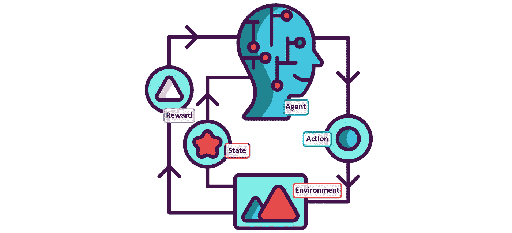
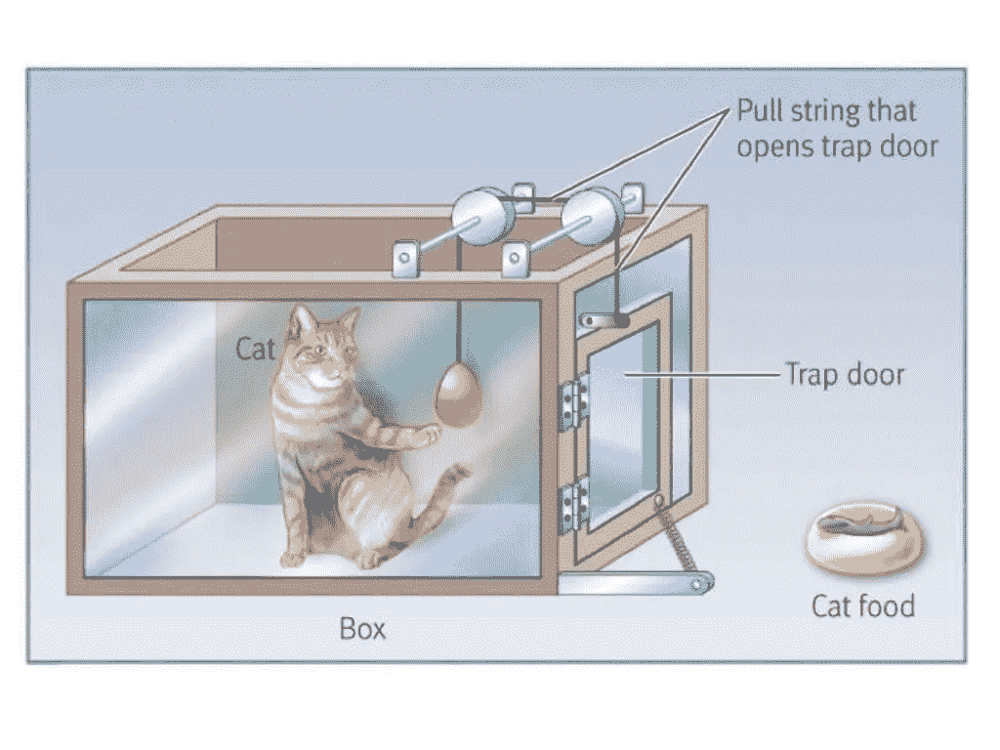
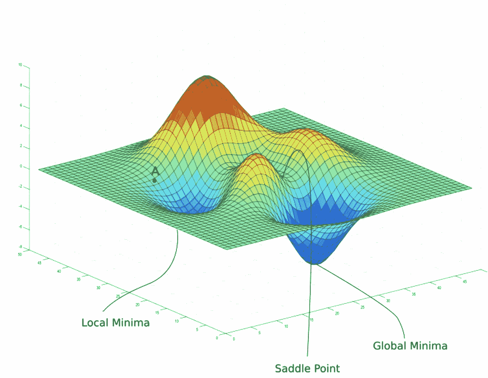
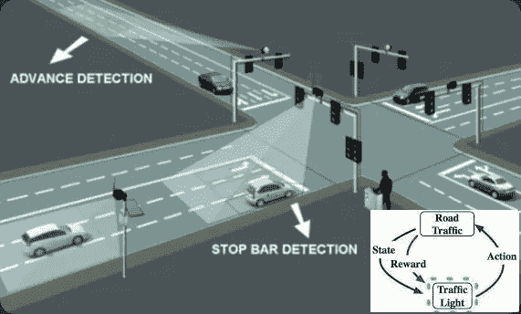

# 强化学习

> 原文：<https://towardsdatascience.com/reinforcement-learning-fda8ff535bb6?source=collection_archive---------12----------------------->

## [思想和理论](https://towardsdatascience.com/tagged/thoughts-and-theory)

## 对这种特殊形式的机器学习的历史、现代和未来应用的回顾

强化学习([图片](https://cdn.iconscout.com/icon/premium/png-512-thumb/reinforcement-learning-2040769-1721120.png)由[图标上的平面图标显示](https://iconscout.com/)授权给克里斯·马奥尼)

# 内容

1.[简介](#b1da)
2。[历史发展(1992 年以前)](#5554)
— 2.1。[并行开发](#ca1d)
———2 . 1 . 1。[试错学习](#703d)
— — 2.1.2。[最优控制问题](#757c)
———2 . 1 . 3。[时间差异学习方法](#4b10)
— 2.2。[综合发展](#51b2)
3。[现代发展(1992 年后)](#7383) — 3.1。[桌游发展](#70c7)
— 3.2。电脑游戏的发展。[当前动态](#19c2)
5。[未来发展](#e66f)
6。[结论](#fd37)
7。[参考文献](#4bed)

# 1.介绍

强化学习并不是一个新概念，而是在 70 多年的学术严谨中发展成熟的。从根本上说，强化学习是一种机器学习的方法，通过这种方法，算法可以在给定的环境中做出决定并采取行动，并通过反复试错的行动来学习做出什么样的适当决定。在 20 世纪 90 年代的研究中，强化学习的学术论述追求三个并行的研究“线索”(试错法、最优控制和时间差)。然后，强化学习能够继续掌握下棋、下围棋和无数电子游戏。强化学习的现代应用使企业能够优化、控制和监控各自的流程，达到惊人的准确度和精细度。因此，强化学习的未来既令人兴奋又令人着迷，因为该研究旨在提高算法的可解释性、可问责性和可信度。

# 2.历史发展(1992 年以前)

萨顿和巴尔托( [2018](#2338) )讨论了强化学习的三个“线索”:1)通过试错法学习；2)最优控制问题；和 3)时间差异学习方法。这些线索在 20 世纪 80 年代交织在一起之前，由研究人员独立进行，导致了我们今天所知道的强化学习的概念。

## 2.1.并行发展

**2.1.1。通过反复试验学习**

桑代克效应定律([图片](https://www.researchgate.net/profile/Dyar-Jabbary/publication/329428575_Edward_L_Thorndike_Trial_and_Error_Theory/links/5c3bcfaf458515a4c7247ad8/Edward-L-Thorndike-Trial-and-Error-Theory)由[迪亚尔·贾巴里](https://www.researchgate.net/profile/Dyar-Jabbary)在[研究之门](https://www.researchgate.net/)上拍摄)

在观察动物智力时，桑代克( [1911](#b219) )将试错法定义为“效果法则”,它与给定情况下产生的满意或不适的感觉相关联。当明斯基( [1954](#f99b) )假设使用 SNARCs(随机神经模拟强化计算器)时，这一概念被整合到机器学习模拟中，当明斯基( [1961](#acc3) )解决“信用分配问题”时，这一概念被进一步具体化；也就是如何在许多可能产生成功的决策中分配成功的功劳。计算试错过程的研究被推广到模式识别([Clark&Farley 1955](#aa51)； [Farley & Clark 1954](#5036) )之前，通过使用错误信息更新连接权重来适应监督学习([Rosenblatt 1962](#b35d)； [Widrow &霍夫 1960](#0b4f) )。由于传统的试错法和错误损失函数之间的区别模糊，在整个 20 世纪 60 年代和 70 年代，很少有出版物专门讨论强化学习。约翰·安德瑞就是这一领域的一名研究者，他开发了斯特拉系统([安德瑞 1963](#86da) )，该系统通过与环境的互动进行学习，还开发了具有“内心独白”的机器([安德瑞&卡辛 1969](#7fac) )，以及后来可以向老师学习的机器([安德瑞 1977](#6cee) )。不幸的是，正如萨顿&巴尔托( [2018](#2338) )所讨论的，安德烈的开创性研究并不为人所知，也没有对后续的强化学习研究产生很大影响。

2.1.2。最优控制的问题

最优控制的问题([图像](https://miro.medium.com/max/3076/1*ZC9qItK9wI0F6BwSVYMQGg.png)由 [Pradyumna Yadav](https://pradyyadav.medium.com/) 对 [AnalyticsVidhya](https://medium.com/analytics-vidhya)

对“最优控制”的研究始于 20 世纪 50 年代，被定义为“一个控制器，以最小化动态系统随时间推移的行为的测量”([萨顿&巴尔托 2018](#2338) )。Bellman ( [1957a](#b611) )在 Hamilton ( [1833](#5617) 、 [1834](#4be1) )和 Jacobi ( [1866](#b90b) )的工作基础上开发了一种专门用于强化学习的方法，该方法使用动态系统的状态动态定义函数方程，并返回最优值函数。这种“最优回报函数”现在通常被称为贝尔曼方程，从技术上来说，这是一类用于解决控制问题的方法，也是贝尔曼的书*动态规划* ( [贝尔曼 1957a](#b611) )的主要焦点。贝尔曼继续介绍了马尔可夫决策过程([1957 b](#83da))——他将其定义为“最优控制问题的离散随机版本”——霍华德( [1960](#1d73) )利用该过程定义了马尔可夫决策过程的政策迭代方法。在 20 世纪 60 年代和 70 年代，在“最优控制”领域没有太多的研究；然而，Bryson ( [1996](#0bb1) )指出，自 20 世纪 80 年代以来，在诸如部分可观测的马尔可夫决策过程及其应用、近似方法、异步方法和动态规划的现代处理等领域发表了许多论文。

**2.1.3。时间差异学习方法**

时间差分学习从数学微分中获得灵感，旨在从一组已知变量中获得预测。但一个重要的区别是，它是通过从价值函数的当前估计值进行引导来实现的。它类似于 Monde Carlo 方法( [Hammersley 1964](#10d5) )，但它能够在最终结果已知之前，在后期迭代阶段调整最终预测(蒙特卡罗无法做到)；如 Sutton ( [1988](#9cc0) )举例说明的，在给定的星期天，为下一个星期六创建预报，然后在实际的星期六天气已知之前，在星期五更新星期六预报。

时间差异法的起源植根于动物学习心理学( [Thorndike 1911](#b219) )，尤其是“次级强化物”的概念。实际上，当次级强化物(如刺激物)与初级强化物(如食物或疼痛)配对时，次级强化物具有与初级强化物相似的性质。明斯基( [1954](#f99b) )是第一个意识到时间差异方法对于强化学习的重要性的人，尽管萨缪尔( [1959](#161b) )似乎是第二个意识到这种重要性的人，但是他在他的工作中并没有提到明斯基。Minsky ( [1961](#acc3) )在 Samuel ( [1959](#161b) )的工作基础上，加强了这个概念对强化学习理论的重要性。当 Klopf ( [1972](#0367) ， [1975](#ede0) )研究大系统中的强化学习时，时间差分法和试错法变得纠缠不清，这些强化学习由大系统的单个子组件概念化，每个子组件都有自己的兴奋性输入作为奖励，抑制性输入作为惩罚，并且每个子组件都可以相互强化。

## 2.2.综合发展

利用 Klopf 的观点，Sutton ( [1978a](#0197) 、 [1978b](#af3e) 、 [1978c](#560b) 、 [1984](#2e0a) )进一步发展了与动物学习理论的联系，并进一步探索了学习受时间连续预测变化驱动的规则。这项工作实际上为强化学习的研究打开了学术闸门，随后几年见证了许多有影响力的发展，例如:

*   经典条件作用的心理模型(巴尔托&萨顿 [1981a](#7602) 、 [1981b](#51ac) 、[1982](#b8eb)；萨顿&巴尔托 [1981a](#8c25) ，[1981 b](#fbb5))；
*   经典条件作用的神经元模型([Klopf 1988](#3cb4)；[特索罗 1986](#39d1))；
*   经典条件作用的时差模型(萨顿和巴尔托 [1987](#b95a) ，[1990](#e4d6))；
*   应用于极点平衡问题的“演员-评论家架构”([巴尔托等人，1983](#1330))；
*   “演员-评论家架构”的扩展以及与反向传播神经网络技术的集成([Anderson 1986](#1c4b)；[萨顿 1984](#2e0a))；
*   将时间差学习从控制决策中分离出来，并引入`lambda()`属性( [Sutton 1988](#9cc0) )。

当 Watkins ( [1989](#8279) )开发了 Q-Learning([Watkins 1989](#8279))时，强化学习起源的三个“线程”最终被联合起来，该 Q-Learning 由 Werbos ( [1987](#1ce7) )加强，他主张试错学习和动态编程的融合。在这之后，研究人员探索了强化学习的自动化电子实现，并能够取得一些惊人的结果。

# 3.现代发展(1992 年后)

## 3.1.棋盘游戏的发展

1992 年，Tesauro 能够在他开发的 TD-Gammon 程序中实现这些概念( [Tesauro 1994](#d705) )，该程序能够在双陆棋游戏中达到“大师级别”。研究已经转向尝试将这一成功应用于国际象棋游戏(Baxter 等人 [2000](#ea1a) ，[2001](#3a4a)； [Thrun 1995](#b96f) )。IBM 开发 DeepBlue 的唯一目的就是下棋。然而，它遭受了维数灾难，因为算法花费了太多的时间来计算，它无法在未来'看'得足够远，并且它因非常糟糕的开局移动而臭名昭著( [Szita 2012](#c52b) )。然而，深蓝在 1997 年战胜了一位世界冠军。[征 1997](#433d)；[新生儿 2000](#ab52)；[桑托 1997](#e14f) 。

研究人员接着进行了一个更大甚至更复杂的游戏:围棋。虽然做了很多尝试，试图学习如何玩这个游戏(布兹 [2006a](#5d4f) ，[2006 b](#4e1a)； [Bouzy &赫尔姆斯泰特 2004](#5061)；库仑 [2007a](#a9bd) 、[2007 b](#e71e)；[达尔 1999](#6110)；[盖利&银 2008](#0eaa)；[盖利等人 2006 年](#30eb)； [Schraudolph 等人 2001 年](#398b)； [Silver et al. 2008](#71b9) )，没有人能够战胜世界冠军，直到谷歌的 AlphaGo 在 2016 年夺冠([Borowiec 2016](#bff9)；[莫耶 2016](#b94f) )。DeepBlue 和 AlphaGo 的区别在于，DeepBlue 利用并行化的基于树的搜索方法和定制的硬件进步，有效地使用“蛮力”来计算赢得游戏所需的所有步骤([boro wiec 2016](#bff9)；[新生儿 2000](#ab52))；但是这种方法在围棋中是不可能的，因为有太多的走法和可能的组合，计算开销是不可能的。相比之下，AlphaGo 利用了蒙特卡洛模拟、蒙特卡洛树搜索、贝叶斯优化和实际观看世界冠军之前的比赛的组合([陈等人 2018](#fe01)；[福 2016](#a0cc)；[惠勒 2017](#66bf) )，以便建立一个足够强大的模型，并且不需要对未来的移动进行蛮力计算。这些发展标志着强化学习领域的重大进步，并使整个世界能够看到这种特殊的机器学习技术的一些可能性。

## 3.2.电脑游戏的发展

雅达利游戏([图片](https://scontent-syd2-1.xx.fbcdn.net/v/t1.18169-9/14344753_357669837897331_4452619001162145046_n.jpg?_nc_cat=101&ccb=1-3&_nc_sid=e3f864&_nc_ohc=CLFxqaOcxuQAX-Isp3w&_nc_ht=scontent-syd2-1.xx&oh=b1a89d5cef7db2909bf902c037c01d1c&oe=60CA8BFB)由脸书[雅达利 2600](https://www.facebook.com/atari2600system)

随着二十世纪八十年代和九十年代儿童的成长，许多人玩雅达利电子游戏。它们于 1977 年发布，包含 526 款游戏，包括经典游戏，如 Pong、Breakout 和 Space Invaders。Atari 模拟器为强化学习算法提供了一个理想的环境来学习如何玩游戏([Hausknecht et al . 2014](#9d1e)；[凯泽等人 2019](#c1dc)； [Mnih 等人 2013](#f4d8) )由于其基于像素的显示和简单的控制选项。玩了一段时间游戏后，研究人员观察到算法使用了一些令人印象深刻的技术；比如在《突围》中，它能够钻一个洞，以便用更少的努力赢得比赛。这表明了强化学习的力量，特别是它能够学习某些规则和实践，而这些规则和实践不是以编程方式告诉模型的( [Berges 等人和](#aa00)；[帕特尔等人 2019](#0db0)；[两分钟论文 2015](#8340) 。许多其他计算机游戏也看到了强化学习的发展，包括像 Snake，Flappy Bird，Angry Birds 和 Candy Crush 这样的游戏。自 Atari 游戏以来，现代计算机游戏已经取得了实质性的进步，并且它们提供了更加复杂和动态的环境，这为强化学习的应用提供了大量的学习机会。

# 4.当前的发展

红绿灯自动化([图片](https://encrypted-tbn0.gstatic.com/images?q=tbn:ANd9GcQ-IXKdWEQVI7OS8KykSSsYqhskLg-AqdZ_D7FDOhUKk3WBvrnOcPdhhU66G3ElP1PV_eY&usqp=CAU)由[小源等人](https://arxiv.org/pdf/1803.11115.pdf)在 [Arxiv](https://arxiv.org/) 上拍摄)

虽然强化学习的历史令人着迷，但现代强化学习的应用确实令人兴奋。在最近的一篇文章中，Garychl ( [2018](#8f43) )列举了一些强化学习在当今工业中应用的例子；包括:计算机集群中的资源管理、交通灯控制、机器人、网络系统配置、化学、广告和游戏。洛里卡( [2017](#639d) )将这些机会整合为三个主要的应用主题，这些主题可以应用于任何行业的任何业务:优化(如流程规划、产量管理、供应链)、控制(如自动驾驶汽车、工厂自动化、风力涡轮机控制)以及监控和维护(如质量控制、预测性维护、库存监控)。所有这些应用程序都提供了一个环境、一个动作、一个响应和一种优化方法，因此为强化学习算法应用于这些特定情况提供了机会。

很简单，当企业面临以下任何场景时，它们应该寻求在自己的人工智能战略中实施强化学习( [Chahill 2017](#aa85) ):

*   他们使用模拟，因为系统或过程太复杂(或太危险)，无法通过试错法来教授机器；或者
*   他们正在处理大的国家空间；或者
*   他们正在寻求通过优化运营效率和提供决策支持来增强人工分析和领域专家的能力。

# 5.未来发展

强化学习的未来是一个非常主观的讨论，在这个讨论中，许多人可能会有不同的观点。强化学习的未来有两个主要方向，可以概括如下:

1.  未来是光明的，强化学习被广泛采用和实施，并继续对人类产生积极影响；或者
2.  未来是严峻的，人们反对强化学习在他们生活中的逐步渗透，人工智能的未来发展集中在强化学习以外的技术上。

强化学习领域所取得的惊人进步及其对我们社会的积极影响表明，这一趋势将会持续下去，并将延续到未来。戈德布( [2018](#2f56) )讨论了强化学习的光明前景，而基尔希特( [2019](#7f0e) )讨论了强化学习将继续取得实质性进展，并将使企业的日常生活变得更加轻松和高效。在这两种选择中，这种光明的未来是最有可能的。

自动驾驶汽车([图片](https://www.shutterstock.com/image-photo/young-woman-reading-book-autonomous-car-671755273)由 [metamorworks](https://www.shutterstock.com/g/chombosan) 在 [Shutterstock](https://www.shutterstock.com/) 授权给 Chrism Mahoney)

然而，如果不讨论人工智能兴起背后的一些社会担忧，以及一些好莱坞电影对人工智能产生的一些焦虑，那将是不负责任的。Frye ( [2019](#2a59) )围绕 AI &特别是强化学习讨论了一些令人担忧的问题，提到强化学习是不安全的，因为任务规范(难以精确指定 AI 智能体应该执行什么任务)，以及不安全的探索(智能体从试错中学习，这意味着它必须先犯错误才能知道不做什么)，这可能导致我们的同胞发生事故和受伤(或更糟)。特别是如果我们考虑自动驾驶汽车的例子。Knight ( [2017](#d483) )明确探索了这个例子，重点关注 Nvidia 自动驾驶汽车，它不是通过给它的任何编程命令，而是通过观察其他司机来学习驾驶。虽然这本身是一个令人印象深刻的壮举，但潜在的问题是，创造者不知道计算机如何或为什么做出决定，这无疑会将人们的生命置于危险之中。因此，在强化学习被更广泛的社区广泛接受和采用之前，还需要做一些改进。那些领域是对创作者的可解释性和对用户的责任性。一旦这两个问题得到整改，那么人工智能和强化学习无疑会变得更加值得信赖。

# 6.结论

强化学习自 20 世纪 50 年代出现以来已经走过了漫长的道路；它在发展和成熟的道路上还有很长的路要走。从 20 世纪 90 年代的理论和概念进步来看，强化学习已经征服了国际象棋、围棋和无数电子计算机游戏。强化学习也开始在商业和工业中出现，并且在我们现代社会日益增长的挑战中继续被证明是有益和有用的。强化学习的未来将很快以许多许多不同的方式渗透到我们的日常生活中；但在此之前，它的可解释性、可问责性和可信度等一些基本问题都得到了纠正。尽管如此，强化学习的未来似乎是漫长而光明的，我们将继续从这个强大的人工智能领域看到许多伟大的事情。

# 7.参考

安德森，C. 1986，*用多层联结主义系统学习和解决问题(适应性，策略学习，神经网络，强化学习)*，马萨诸塞大学阿姆赫斯特分校博士论文。

Andreae，J. 1963，“Stella:一个学习机器的方案”，*国际会计师联合会会议录卷*，第 1 卷，第 2 号，第 497–502 页，ISSN:1474–6670，DOI:10.1016/s 1474–6670(17)69682–4。

安德烈，J. 1977，*用可教的机器思考*，ISBN:学术出版社，伦敦。

Andreae，J. & Cashin，P. 1969，“具有独白的学习机器”，*国际人机研究杂志*，第 1 卷，第 1 期，第 1–20 页，ISSN:0020–7373，DOI:10.1016/s 0020–7373(69)80008–8。

巴尔托，A. &萨顿，R. 1981a，*适应性智能的目标寻求成分:初步评估*。

巴尔托，A. &萨顿，R. 1981b，“地标学习:联想搜索的一个例证”，*生物控制论*，第 42 卷，第 1 期，第 1-8 页，ISSN:0340-1200，DOI: 10.1007/BF00335152。

巴尔托，A. &萨顿，R. 1982，“通过神经元样适应性元素模拟经典条件作用中的预期反应”，*行为大脑研究*，第 4 卷，第 3 期，第 221–35 页，ISSN:0166–4328，DOI:10.1016/0166–4328(82)90001–8。

巴尔托，a .，萨顿，R. &安德森，C. 1983，“能解决困难的学习控制问题的神经元样自适应元件”， *IEEE 系统、人与控制论汇刊*，第 SMC-13 卷，第 5 期，第 834–46 页，ISSN:0018–9472，DOI:10.11109/台积电。19804.888686666007

Baxter，j .，Tridgell，A. & Weaver，L. 2000，“利用时间差学习下棋”，*机器学习*，第 40 卷第 3 期，第 243 页，ISSN:0885–6125，DOI: 10.1023/A:1007634325138。

Baxter，j .，Tridgell，A. & Weaver，L. 2001，“强化学习与国际象棋”，*学习玩游戏的机器*，第 91–116 页。

贝尔曼，R. 1957a，*动态规划*，ISBN: 069107951x，普林斯顿大学出版社。

Bellman，R. 1957b，“一个马尔可夫决策过程”，*数学与力学杂志*，第 6 卷第 5 期，第 679–84 页，ISSN: 00959057。

伯杰斯，v .、饶，P. & Pryzant，R. nd，“雅达利突围的强化学习”，*斯坦福大学*，<[https://cs.stanford.edu/~rpryzant/data/rl/paper.pdf](https://cs.stanford.edu/~rpryzant/data/rl/paper.pdf)>。

Borowiec，S. 2016，*alpha Go Seals 4-1 战胜围棋特级大师 Lee Sedol* 《卫报》查看 2020 年 5 月 31 日，<[https://www . FBE . hku . hk/f/page/75261/Reading % 201 _ alpha Go % 20 Seals % 204-1% 20 Victory % 20 over % 20Go % 20g rand master % 20 Lee % 20 Sedol . pdf【T12](https://www.fbe.hku.hk/f/page/75261/Reading%201_AlphaGo%20seals%204-1%20Victory%20over%20Go%20Grandmaster%20Lee%20Sedol.pdf)

Bouzy，B. 2006a，“将浅的和选择性的全局树搜索与蒙特卡罗用于围棋相关联”，*计算机和游戏*，第 3846 卷，第 67-80 页，DOI: 10.1007/11674399_5，施普林格柏林海德堡，柏林，海德堡。

Bouzy，B. 2006b，“蒙特卡罗围棋的移动修剪技术”，*计算机游戏进展*，第 4250 卷，第 104-19 页，DOI: 10.1007/11922155_8。

Bouzy，b .和 Helmstetter，B. 2004，“蒙特卡罗围棋发展”，*计算机游戏的进步*，第 159–74 页，施普林格。

布赖森，A. 1996，“最优控制”， *IEEE 控制系统*，第 16 卷第 3 期，第 26–33 页，ISSN:1066–033 x，DOI: 10.1109/37.506395。

Chahill，D. 2017，*为什么强化学习可能是复杂工业系统的最佳 Ai 技术*，查看 2020 年 5 月 31 日，<[https://www . bons . Ai/blog/Ai-Reinforcement-Learning-strategy-Industrial-Systems](https://www.bons.ai/blog/ai-reinforcement-learning-strategy-industrial-systems)>。

Chen，y .，Huang，a .，Wang，z .，Antonoglou，I .，Schrittwieser，J. & Silver，D. 2018，《Alphago 中的贝叶斯优化》，*，*，ISSN:2331–8422，< [，](https://arxiv.org/pdf/1812.06855.pdf) >。

Clark，W. & Farley，B. 1955，“自组织系统中模式识别的一般化”，*1955 年 3 月 1-3 日西方联合计算机会议论文集*，第 86-91 页，DOI: 10.1145/1455292.1455309，<【https://dl.acm.org/doi/abs/10.1145/1455292.1455309】>。

库隆，R. 2007a，“计算围棋游戏中走法的 Elo 等级”，【https://hal.inria.fr/inria-00149859/document】电脑游戏工作坊、<、[、](https://hal.inria.fr/inria-00149859/document)、>。

Coulom，R. 2007b，“蒙特卡罗树搜索中的有效选择性和备份算子”，载于 H. Herik，P. Ciancarini 和 H. Donkers。(编辑。)，*电脑与游戏*，第 4630 卷，第 72–83 页，施普林格。

达尔，F. 1999，“Honte，一个使用神经网络的围棋程序”，*学习玩游戏的机器*，第 205–23 页，<[http://citeseerx.ist.psu.edu/viewdoc/download?doi = 10 . 1 . 1 . 50 . 2676&rep = re P1&type = pdf](http://citeseerx.ist.psu.edu/viewdoc/download?doi=10.1.1.50.2676&rep=rep1&type=pdf)>。

法利，B. &克拉克，W. 1954，“用数字计算机模拟自组织系统”，*信息理论 IRE 专业组汇刊*，第 4 卷，第 4 期，第 76–84 页，ISSN:2168–2690，DOI:10.11109/tit . 1991996

Frye，C. 2019，*现实世界中强化学习的危险*，查看 2020 年 5 月 31 日，<[https://faculty . ai/blog/The-Dangers-of-Reinforcement-Learning-in-The-Real-World/](https://faculty.ai/blog/the-dangers-of-reinforcement-learning-in-the-real-world/)>。

傅，M. 2016，“Alphago 与蒙特卡罗树搜索:仿真优化视角”，载于 *2016 冬季仿真会议*，IEEE，第 659–70 页，<[https://doi-org . ez proxy . lib . uts . edu . au/10.1109/WSC . 2016.7822130](https://doi-org.ezproxy.lib.uts.edu.au/10.1109/WSC.2016.7822130)>。

Garychl 2018，*强化学习在现实世界中的应用*，查看 2020 年 5 月 31 日，<[https://towardsdatascience . com/Applications-of-Reinforcement-Learning-in-Real-World-1a 94955 BCD 12](/applications-of-reinforcement-learning-in-real-world-1a94955bcd12)>。

Gelly，s .和 Silver，D. 2008，“在 9 X 9 计算机围棋中达到大师水平”，载于 https://www.aaai.org/Papers/AAAI/2008/AAAI08-257.pdf>*AAAI*第 8 卷第 1537-40 页。

Gelly，s .、Wang，y .、Munos，R. & Teytaud，O. 2006 年，*用蒙特卡罗围棋*、<、、>中的模式修改 Uct。

戈德布，C. 2018，*强化学习的光明前景*，查看 31/5/2020，<[https://medium . com/apteo/The-Bright-Future-of-Reinforcement-Learning-a 66173694 f88](https://medium.com/apteo/the-bright-future-of-reinforcement-learning-a66173694f88)>。

汉密尔顿，W. 1833，*关于通过特征函数*的系数表达光的路径的一般方法，&行星，ISBN:p . d .哈代印刷。

汉密尔顿，W. 1834，*关于以前应用于光学的一般数学方法在动力学中的应用*，ISBN:p . d .哈代印刷。

哈默斯利，J. 1964，*蒙特卡罗方法*，ISBN: Methuen，伦敦。

Hausknecht，m .、Lehman，j .、Miikkulainen，R. & Stone，P. 2014，“一种用于一般 Atari 游戏的神经进化方法”， *IEEE 计算智能和游戏中的人工智能汇刊*，第 6 卷，第 4 期，第 355–66 页，ISSN:1943–068 x，DOI:10.11109/TCI AIG . 2013 . 20133106

霍华德，R. 1960，“动态规划和马尔可夫过程”。

Jacobi，K. 1866 年，*在克莱布什的《科学知识分子学术讨论会》之前。*

Kaiser，l .，Babaeizadeh，m .，Milos，p .，Osinski，b .，Campbell，r .，Czechowski，k .，Erhan，d .，Finn，c .，Kozakowski，p .，Levine，s .，Mohiuddin，a .，Sepassi，r .，Tucker，G. & Michalewski，H. 2019，“基于模型的强化学习用于 Atari”，载于 arXiv.org*ICLR*，[https://arxiv.org/pdf/1903.00374.pdf](https://arxiv.org/pdf/1903.00374.pdf)>。

金，D. 1997，《卡斯帕罗夫对深蓝:终极人对机器挑战》，*机器挑战，特拉法尔加广场*。

Kirschte，M. 2019，*对强化学习有什么期待？*，2020 年 5 月 31 日查看，<[https://towards data science . com/what-to-expect-from-reinforcement-learning-a 22 e 8 c 16 f 40 c](/what-to-expect-from-reinforcement-learning-a22e8c16f40c)>。

Klopf，A. 1972，*大脑功能和适应系统:一种异质理论*。

Klopf，A. 1975，“自然智能与人工智能的比较”， *ACM SIGART Bulletin* ，第 52 期，第 11–3 页，ISSN:0163–5719，DOI:10.1145/1045236.104236 . 1045237。

Klopf，A. 1988，“经典条件作用的神经元模型”，*心理生物学*，第 16 卷第 2 期，第 85–125 页，ISSN:0889–6313，DOI:10.3758/BF 0333113。

骑士，W. 2017，*Ai 核心的黑暗秘密*，2020 年 5 月 31 日查看，<[https://www . technology review . com/2017/04/11/5113/The-Dark-Secret-at-The-Heart-of-Ai/](https://www.technologyreview.com/2017/04/11/5113/the-dark-secret-at-the-heart-of-ai/)>。

Levy，S. 1997，“人与机器”，*新闻周刊*，第 129 卷第 18 期，第 50–6 页，ISSN: 00289604。

Lorica，B. 2017，*强化学习在工业中的实际应用:强化学习的商业和工业应用概述*，查看 2020 年 5 月 31 日，<[https://www . oreilly . com/radar/Practical-Applications-of-Reinforcement-Learning-in-Industry/](https://www.oreilly.com/radar/practical-applications-of-reinforcement-learning-in-industry/)>。

明斯基，M. 1954，*神经模拟强化系统理论及其对脑模型问题的应用*，普林斯顿大学博士论文。

明斯基，M. 1961，“迈向人工智能的步骤”，*IRE 会议录*，第 49 卷，第 1 期，第 8-30 页，ISSN:0096-8390，DOI:10.1109/Jr proc . 1961 . 2877771 . 1961 . 287771

Mnih，v .、Kavukcuoglu，k .、Silver，d .、Graves，a .、Antonoglou，I .、Wierstra，d .、Riedmiller，M. 2013，《用深度强化学习玩雅达利》，*ArXiv.org*、<[https://arxiv.org/pdf/1312.5602.pdf](https://arxiv.org/pdf/1312.5602.pdf)>。

Moyer，C. 2016，*谷歌的 Alphago 如何击败一个围棋世界冠军*，《大西洋》，查看 31/May/2020，<[https://www . thealantic . com/technology/archive/2016/03/The-invisible-opposite/475611/](https://www.theatlantic.com/technology/archive/2016/03/the-invisible-opponent/475611/)>。

新生儿，M. 2000，《深蓝对 Ai 的贡献》，*数学与人工智能年鉴*，第 28 卷第 1 期，第 27–30 页，ISSN:1012–2443，DOI: 10.1023/A:1018939819265。

Patel，d .、Hazan，h .、Saunders，d .、Siegelmann，H. & Kozma，R. 2019，“应用于 Atari Breakout Game 的转换到脉冲神经元网络平台后增强学习策略的改进鲁棒性”，*神经网络*，第 120 卷，第 108–15 页，ISSN:0893–6080。

罗森布拉特，F. 1962，*神经动力学原理:感知机和大脑机制理论*，ISBN:斯巴达图书公司，华盛顿特区

Samuel a . 1959，“使用跳棋游戏进行机器学习的一些研究”， *IBM 研发杂志*，第 3 卷第 3 期，第 210–29 页，ISSN:0018–8646，DOI: 10.1147/rd.33.0210

Santo，B. 1997，“IBM 为人机复赛调整深蓝”，*电子工程时报*，第 946 期，第 111–2 页，ISSN:0192–1541。

Schraudolph，n .，Dayan，P. & Sejnowski，T. 2001，“通过时间差分方法学习评估围棋位置”，*博弈中的计算智能*，第 77–98 页，Springer，[https://snl.salk.edu/~schraudo/pubs/SchDaySej01.pdf](https://snl.salk.edu/~schraudo/pubs/SchDaySej01.pdf)>。

Silver，d .、Sutton，r .和 m .üller，2008，“基于样本的学习和带有永久和短暂记忆的搜索”，载于*国际机器学习会议*，第 968–75 页。

萨顿，R. 1978a，*学习理论对大脑单通道理论的支持*，ISBN。

萨顿，R. 1978b，“单通道理论:学习的神经元理论”，*大脑理论通讯*，第 3 卷，第 3 期，第 72–4 页。

萨顿，R. 1978c，*经典和工具条件作用中的期望的统一理论*，ISBN。

萨顿，R. 1984，*强化学习中的时间学分分配*，博士论文，ProQuest 学位论文出版。

Sutton，R. 1988，“通过时间差异的方法学习预测”，*机器学习*，第 3 卷第 1 期，第 9–44 页，ISSN:0885–6125，DOI: 10.1023/A:1022633531479。

萨顿，R. &巴尔托，A. 1981a，“一个构建和使用其世界内部模型的适应性网络”，*认知和大脑理论*，第 4 卷，第 3 期，第 217–46 页。

萨顿，r .和巴尔托，A. 1981b 年 b，“走向适应网络的现代理论:期望和预测”，*心理评论*，第 88 卷，第 2 期，第 135-70 页，ISSN:0033-295 x，DOI:10.1037/0033-295 x . 88 . 2 . 135

萨顿，r .和巴尔托，A. 1987，“经典条件作用的时间差模型”，载于*认知科学学会第九届年会会议录*，华盛顿州西雅图，第 355–78 页。

萨顿，r .和巴尔托，A. 1990，“巴甫洛夫强化的时间导数模型”，m .加布里埃尔和 j .摩尔(编辑)，*学习和计算神经科学:适应性网络的基础*，第 497–537 页，麻省剑桥麻省理工学院出版社。

萨顿，r .和巴尔托，A. 2018，*强化学习:导论*，第二版。，ISBN: 9780262039246，麻省理工学院出版社，马萨诸塞州剑桥，<[https://web . Stanford . edu/class/psych 209/Readings/suttonbartoiprlbook 2 nded . pdf](https://web.stanford.edu/class/psych209/Readings/SuttonBartoIPRLBook2ndEd.pdf)>。

Szita，I. 2012，“游戏中的强化学习”，载于 M. Wiering 和 M. van Otterlo(编辑。)，*强化学习:最先进的*，第 539–77 页，DOI:10.1007/978–3–642–27645–3 _ 17，施普林格柏林海德堡，柏林，海德堡，<[https://doi.org/10.1007/978-3-642-27645-3_17](https://doi.org/10.1007/978-3-642-27645-3_17)>。

Tesauro，G. 1986，“经典条件作用的简单神经模型”，*生物控制论*，第 55 卷，第 2–3 期，第 187–200 页，ISSN:0340–1200，DOI: 10.1007/BF00341933。

Tesauro，G. 1994，“Td-Gammon，一个自学的双陆棋程序，实现大师级的游戏”，*神经计算*，第 6 卷，第 2 期，第 215–9 页，ISSN:0899–7667。

桑代克，E. 1911，*动物智力:实验研究*，ISBN: 9780765804822，麦克米伦公司。

Thrun，S. 1995，“学习下棋”，载于*神经信息处理系统进展*，第 1069–76 页，<[http://papers . neur IPS . cc/paper/1007-学习下棋. pdf](http://papers.neurips.cc/paper/1007-learning-to-play-the-game-of-chess.pdf) >。

TwoMinutePapers 2015， *Google Deepmind 的深度 Q-Learning 玩雅达利突围*，2020 年 5 月 31 日查看，<[https://www.youtube.com/watch?v=V1eYniJ0Rnk](https://www.youtube.com/watch?v=V1eYniJ0Rnk)>。

沃特金斯，C. 1989，*从延迟奖励中学习*，博士论文，[https://www . research gate . net/publication/33784417 _ Learning _ From _ Delayed _ Rewards](https://www.researchgate.net/publication/33784417_Learning_From_Delayed_Rewards)>。

Werbos，P. 1987，“构建和理解适应性系统:工厂自动化和大脑研究的统计/数值方法”， *IEEE 系统、人和控制论汇刊*，第 17 卷第 1 期，第 7-20 页，ISSN:0018-9472，DOI: 10.1109/TSMC.1987.289329，< [https://www.aaai](https://www.aaai.org/Papers/Symposia/Fall/1993/FS-93-02/FS93-02-003.pdf)

惠勒，T. 2017，*alpha go Zero——它是如何和为什么工作的*，2020 年 5 月 31 日观看，<http://tim.hibal.org/blog/alpha-zero-how-and-why-it-works/>T2。

Widrow，b .和 Hoff，M. 1960，“自适应开关电路”， *1960 年 Wescon 会议记录第四部分*，第 94–104 页，麻省理工学院出版社，马萨诸塞州剑桥。

维基百科 2020，*雅达利 2600* ，浏览 2020 年 5 月 31 日，<[https://en.wikipedia.org/wiki/Atari_2600](https://en.wikipedia.org/wiki/Atari_2600)>。