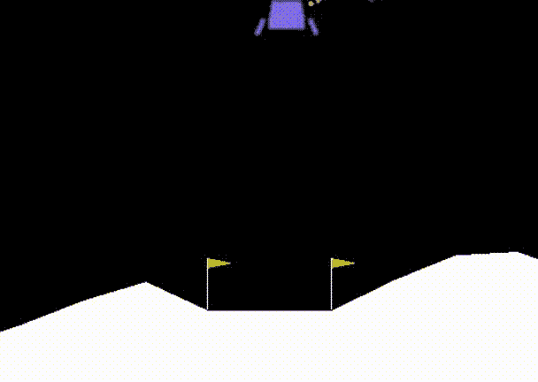
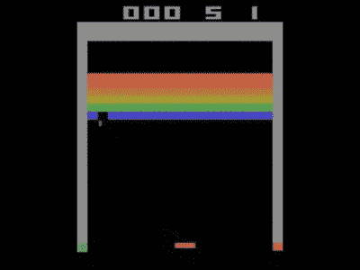
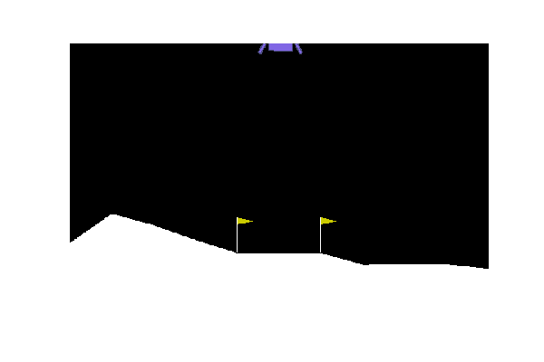
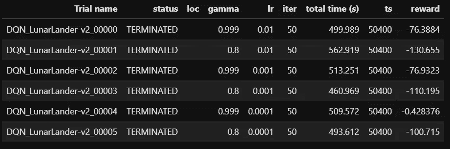
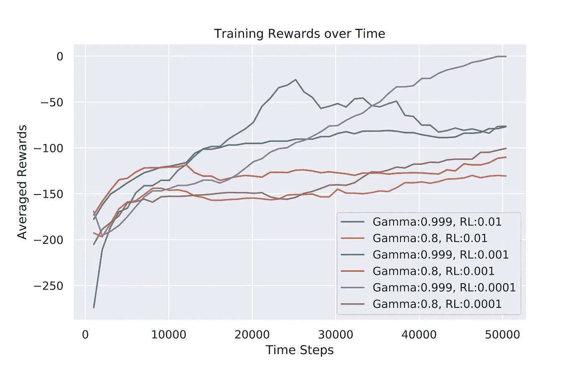
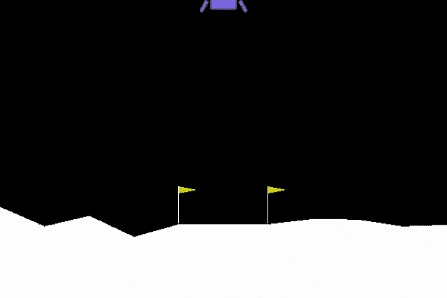

# 面向任何人的强化学习:开放 AI 健身房和 Ray

> 原文：<https://towardsdatascience.com/reinforcement-learning-for-anyone-open-ai-gym-and-ray-ee365a7d1ecc?source=collection_archive---------17----------------------->

## 使用开放 AI Gym 和 Ray Python 库创建和优化强化学习代理的实用介绍



(图片转载自[https://imgur.com/gallery/OVvOuYZ](https://imgur.com/gallery/OVvOuYZ))

# 介绍

[Open AI Gym](http://gym.openai.com/docs/) 是典型强化学习(RL)任务的开源接口。因此，使用开放式人工智能健身房可以变得非常容易地开始强化学习，因为我们已经提供了各种不同的环境和代理。我们剩下要做的就是编写不同的算法并测试它们，以便让我们的代理学习如何以最好的方式完成不同的任务(正如我们将在后面看到的，使用[雷](https://docs.ray.io/en/master/installation.html)可以很容易地做到这一点)。此外，Gym 还兼容其他 Python 库，如 Tensorflow 或 PyTorch，因此可以轻松创建深度强化学习模型。

开放人工智能健身房提供的不同环境和代理的一些例子有:雅达利游戏、机器人任务、控制系统等…



图 1:雅达利游戏示例[1]

如果你有兴趣了解更多关于强化学习主要概念背后的理论，更多信息可以在我的前一篇文章中找到。

# 开放 AI 健身房

在这一节中，我们现在将浏览开放人工智能健身房图书馆的一些基础知识。首先，我们可以通过使用以下命令轻松安装该库:

```
pip install gym
```

一旦安装了这个库，我们就可以实例化一个环境。对于这个例子，我们将使用[月球着陆器](https://gym.openai.com/envs/LunarLander-v2/)。在这个场景中，我们的目标是让我们的代理学会正确地将他们的飞船降落在两面旗帜之间(我们的着陆平台)。代理人着陆越精确，他所能获得的总回报就越大。为了实现这个目标，代理可以在任何时间点选择以下四个动作中的任何一个:启动左发动机，启动右发动机，关闭发动机，什么也不做。

为了快速可视化这个场景，让我们实例化环境，并让我们的代理迭代地采取从环境中采样的随机动作(图 2)。

```
import gymenv = gym.make("LunarLander-v2")
env.reset() # Instantiate enviroment with default parameters
for step in range(300):
    env.render() # Show agent actions on screen
    env.step(env.action_space.sample()) # Sample random action
env.close()
```



图 2:代理执行随机操作

为了提高代理的性能，我们可以利用 ***步骤*** 函数返回的信息:

*   ***观察*** =执行动作后的环境信息(如棋盘游戏中的棋盘位置、像素坐标等……)。
*   ***奖励*** =量化表示我们之前的行为有多积极(越积极越好)。
*   ***done*** =是一个布尔值，显示我们是否到达了可用的最后一次迭代(例如，我们达到了目标，我们用完了可用的最大步骤)。
*   ***信息*** =调试实用程序。

利用这些信息和学习算法(例如 Q 学习、SARSA 或深度强化学习)，我们将能够快速解决不同环境中的大量问题。

# 光线

Ray [2]是一个用于多处理的开源 Python 框架，它还提供了一个强化学习库(RLlib)和一个超参数优化库(Tune ),作为其信息结构的一部分，以便大规模创建强化学习模型。

在我们之前的例子中，使用开放式人工智能健身房可以轻松地创建环境和代理，而 Ray 将帮助我们更容易地测试和优化我们代理的不同学习算法。

可以使用以下命令为 Linux 用户轻松安装 Ray:

```
pip install ray
```

对于 Windows 用户来说，虽然还没有提供完全的支持，但是可能需要使用一个用于 Linux 的 [Windows 子系统](/setting-up-a-data-science-environment-using-windows-subsystem-for-linux-wsl-c4b390803dd)(或者使用免费工具，比如 Google Colab！).

# 深度 Q 学习示例

现在我们已经成功地引入了 Gym 和 Ray，我们准备着手解决之前描述的[月球着陆器](https://gym.openai.com/envs/LunarLander-v2/)问题。本文使用的所有代码都可以在我的 Github 档案中找到。首先，我们需要导入所有需要的库。

```
import ray
from ray import tune
from ray.rllib import agents
import pandas as pd
import matplotlib.pyplot as plt
import seaborn as sns
sns.set()
```

接下来，使用 Ray 我们可以很容易地实例化一个[深度 Q 网络](https://rllib.readthedocs.io/en/latest/rllib-algorithms.html#dqn) (DQN)架构来训练我们的代理。使用深度 Q 网络是为了通过用能够学习如何正确估计 Q 值(函数逼近)的神经网络来替换基于表 Q 学习的算法，从而容易地扩展它们。如果你有兴趣了解更多关于这个话题的信息，我强烈建议你看一看[理查德·萨顿和安德鲁·巴尔托](https://web.stanford.edu/class/psych209/Readings/SuttonBartoIPRLBook2ndEd.pdf)的《强化学习:导论》。

在[这个链接中可以找到所有不同的算法的完整列表。](https://rllib.readthedocs.io/en/latest/rllib-algorithms.html)

在 run 函数中，我们可以设置允许的最大时间步长数，并传递不同的配置参数，以定制我们的网络。最后，使用 ***tune.grid()*** 功能，我们可以额外执行网格搜索，以便实时改进我们的一些模型[超参数](/hyperparameters-optimization-526348bb8e2d)(例如，gamma 和学习速率)。

```
results = tune.run(
    'DQN', 
    stop={
        'timesteps_total': 50000
    },
    config={
    "env": 'LunarLander-v2',
    "num_workers": 3,
    "gamma" : tune.grid_search([0.999, 0.8]),
    "lr": tune.grid_search([1e-2, 1e-3, 1e-4]),
    }
)
```

训练完我们的代理后，将返回一个包含所有主要训练指标的数据帧(图 3 ),然后我们可以使用它来确定哪个超参数组合可以为我们的代理带来更大的回报。



图 3:培训指标的总结

利用返回的数据框架和记录的信息，我们可以很容易地看到一些关键的训练指标，例如使用不同的参数(如 gamma 和学习率值)如何随着时间的推移产生不同的奖励(图 4)。



图 4:超参数优化报告

最后，使用我们确定的最佳超参数，我们可以实例化一个新的 DQN 模型，并使用模型配置设置中的***“monitor】:True***将代理的性能记录为视频。

```
ray.init()config = {'gamma': 0.999,
          'lr': 0.0001,
          "n_step": 1000,
          'num_workers': 3,
          'monitor': True}
trainer2 = agents.dqn.DQNTrainer(env='LunarLander-v2', config=config)
results2 = trainer2.train()
```

正如我们在图 5 中看到的，我们的代理成功地学会了如何完成我们的任务！



图 5:训练有素的代理

*希望你喜欢这篇文章，感谢你的阅读！*

# 联系人

如果你想了解我最新的文章和项目[请关注我的媒体](https://pierpaoloippolito28.medium.com/subscribe)并订阅我的[邮件列表](http://eepurl.com/gwO-Dr?source=post_page---------------------------)。以下是我的一些联系人详细信息:

*   [Linkedin](https://uk.linkedin.com/in/pier-paolo-ippolito-202917146?source=post_page---------------------------)
*   [个人博客](https://pierpaolo28.github.io/blog/?source=post_page---------------------------)
*   [个人网站](https://pierpaolo28.github.io/?source=post_page---------------------------)
*   [中等轮廓](https://towardsdatascience.com/@pierpaoloippolito28?source=post_page---------------------------)
*   [GitHub](https://github.com/pierpaolo28?source=post_page---------------------------)
*   [卡格尔](https://www.kaggle.com/pierpaolo28?source=post_page---------------------------)

# 文献学

[1]2018 秋季 CS498DL，作业 5:深度强化学习(伊利诺伊大学香槟分校)，SVETLANA LAZEBNIK。访问地点:[http://slazebni.cs.illinois.edu/fall18/assignment5.html](http://slazebni.cs.illinois.edu/fall18/assignment5.html)

[2] PyPI: Ray:统一 ML 生态系统的并行分布式 Python 系统。访问地点:[https://pypi.org/project/ray/](https://pypi.org/project/ray/)