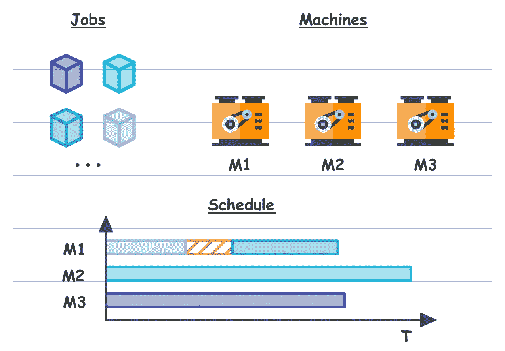
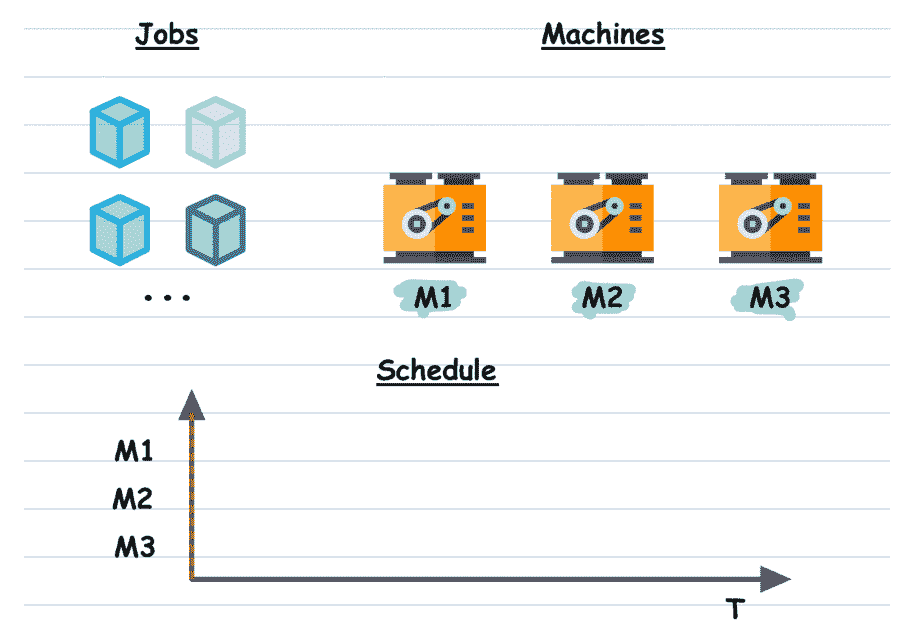
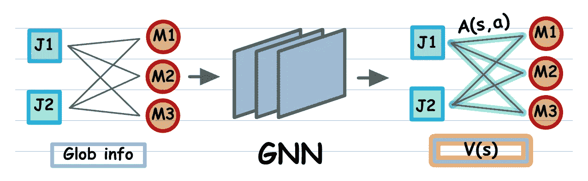

# 生产调度的强化学习

> 原文：<https://towardsdatascience.com/reinforcement-learning-for-production-scheduling-809db6923419?source=collection_archive---------5----------------------->

## 面向应用的综述我们最新的关于组合优化的强化学习的论文

照片由[丹尼尔·史密斯](https://unsplash.com/@smudgern6)在 [Unsplash](https://unsplash.com/?utm_source=medium&utm_medium=referral) 上拍摄

最近，我有幸成为在 SoCS'21 上发表论文[“SOLO:在线搜索，离线学习”](https://arxiv.org/abs/2104.01646)的团队的一员。虽然这篇论文相当实用，但它仍然是作为科学出版物来写的，对于不习惯的人来说可能很难读懂。因此，我决定写一个简短的概述，并强调其主要发现。

首先，让我描述一下生产调度的问题，这是 SOLO 最初的动机。

# 问题设置

给定一组异构机器和一组异构生产作业，计算最小化指定度量的处理调度。异构意味着机器和作业可以具有不同的属性，例如，机器的不同吞吐量和作业的不同所需处理时间，以及实际中更多的属性。此外，真正的问题由于一组强加的约束而变得复杂，例如类别`**A**`的作业不能在类别`**B**`的机器上处理，等等。

从理论上讲，该问题是“作业调度”问题的一个复杂实例，与“有能力限制的车辆路径”问题一起被认为是组合优化的经典问题。虽然这个问题是 NP 难的(在多项式时间内没有精确的解)，但 CO 社区对它进行了很好的研究，提供了一些方法来解决它的理论(简化)版本。然而，大多数方法都无法处理现实世界中的问题规模或我上面提到的额外约束。这就是为什么大多数时候业内人士求助于某种形式的随机搜索结合特定领域的试探法。

生产计划概述。时间表以时间线图的形式呈现。条形的颜色与作业相对应，其长度决定了加工时间。红色条纹表示机器的停机时间。[机器图标通过“flatcoin.com”在“带归属的 flatcoin 许可证”下显示。其余由作者提供]

在我看来，生产调度问题结合了对现实世界应用的潜在影响和学习方法领域令人兴奋的研究机会。听起来像是应用研究小组的天作之合，不是吗？因此，我认为建立这个项目来开发一个基于学习的解决方案是一个非常容易的决定。在那之后不久，我就加入了这个项目。

# 从组合优化到马尔可夫决策过程

我们的努力始于众所周知的观察，即一些 CO 问题可以转化为马尔可夫决策过程(MDP)或在线组合问题，因为它们在 CO 社区中被提及。为此，我们定义了代表部分解决方案的状态、动作和描述问题状态如何随着所采取的每个动作而演变的转移函数。让我们考虑一个“作业调度”问题的在线公式的例子。在高层次上，我们可以将我们的状态定义为队列中所有作业和所有机器的聚合信息。动作可以定义为“在空闲机器`**M1**`**”**上从队列中处理作业`**J1**`。然后，转换函数将负责从队列中删除作业`**J1**`，并更新机器`**M1**`的状态，推进当前时间以及您的特定公式所需的任何其他内容。

在线调度问题。图例相当于概览图。机器名称上的绿色阴影表示它在当前时间步长是自由的(红色-被占用)。计划图中的红色虚线表示当前时间步长。[机器图标通过“flatcoin.com”在“带归属的 flatcoin 许可证”下显示。其余由作者提供]

根据 MDP 公式，行动的顺序可以针对特定的指标(奖励)进行优化。沿着这条路走下去的第一步是为你的决策过程开发一个模拟器。我们已经基于 SimPy 包将我们的生产调度问题模拟器实现为一个离散事件模拟器。因为我们的目标是一个真实的用例，所以我们必须确保:

1.  工件和机器属性的分布尽可能地符合实际情况。这需要大量的数据科学工作。
2.  模拟器包括额外工作的到达。这对于模拟调度解决方案在真实工厂中连续运行的条件是必要的。同样，这个到达过程必须是随机的，分布尽可能地与现实相匹配(数据科学工作)。

# 寻找经典还是寻找经典

好吧，你的 MDP 有一个模拟器，现在呢？同样，这里有一些方法可以应用。正如我已经提到的，实践中最流行的选择是某种形式的随机搜索结合启发式搜索。对于我们的项目，我们决定从蒙特卡罗树搜索(MCTS)开始，因为它有吸引力的理论保证，并且在强化学习社区(顺便说一下，我们来自那里)很受欢迎。在我们的日程安排问题的背景下，需要了解 MCTS 的要点:

1.  MCTS 必须在生产中实时运行，它的性能受到适合您时间预算的迭代次数(即树扩展)的限制。您不希望为接下来的几个作业优化调度的时间超过处理这些作业的时间，是吗？
2.  对于随机问题，MCTS 需要大量的迭代来计算一个像样的结果。如上所述，我们的问题必须是随机的，以模拟现实世界的设置。
3.  对于问题中的任何随机过程，MCTS 计算一个蒙特卡罗估计。在搜索过程中，没有简单的方法可以明确地使用可靠的作业到达分布估计值(根据历史数据计算)。

前两点可以通过优化模拟器和 MCTS 实现的运行时，以及将计算扩展到月球来解决。然而，对于大多数真实的用例，您可以扩展的范围是有限的。这就是为什么有大量的研究工作旨在通过利用某种形式的学习来优化 MCTS 的趋同性(你知道它将走向何方，不是吗？).不过，第三点更有趣。人们可以想象，考虑到一个良好估计的工作到达分布可以解锁一些先进的战略。例如，为特定类别的作业(经常到达的)预留一台机器，或者打赌更适合当前时间表的作业的到达，等等。这些策略可能会导致更好的时间表，并根据您的生产规模节省大量成本。

# 搜索还是强化学习还是两者都有？

那么，我们如何超越 MCTS 的表现呢？鉴于我们的背景和对基于学习的方法的偏见，答案很简单。“让我们应用强化学习”。我们确信 RL 非常适合解决这个问题的一些原因:

1.  大多数 RL 算法需要相当长的离线训练时间。然而，一旦经过训练，它们的执行速度会比基于搜索的方法快得多。该属性也称为计算压缩。
2.  给定足够强大的函数近似(即神经网络)和足够的训练时间，RL 算法在模拟中击败了竞争对手。幸运的是，对于我们的生产调度问题，使用历史数据，我们可以建立一个相当精确的模拟，并可以在一定程度上缩小“模拟与真实”的差距。
3.  可以将关于环境中随机性的明确知识注入到 RL 算法中。一些 RL 方法甚至可以以原则的方式解决问题的随机性(贝叶斯 RL)。因此，我们有可能解开上述“亲”调度策略。

在设计我们的 RL 解决方案时，我们受到最近大量研究的启发，这些研究证明 Alpha*系列算法可以成功应用于 CO 问题。Alpha*指的是 AlpahGo、AlphaZero(你一定听说过它们)，以及在训练或执行过程中利用 MCTS 或其他搜索形式的任何 RL 算法。

AlphaZero 是一种非常先进的算法，需要大量的工程工作和大量的培训时间。它依赖于一个结合了策略和状态值估计器角色的神经网络。在训练期间，MCTS 迭代被压缩到网络的策略“部分”中。网络的值“部分”被训练来预测状态值的蒙特卡罗估计。将 MCTS 投射到策略网络中，以单次转发的计算成本实现了令人难以置信的执行性能。尽管它可能是我们设置中最吸引人的一点，但策略网络也可能是该方法中最需要数据和计算的组件。当时对我们来说是不可行的。这就是为什么我们决定从简单开始。

我们在执行时离开了 MCTS，转而致力于它更快的收敛。我们离线训练了 Q-网络，使用了著名的 DQN 以及最近所有的修改，比如决斗，双 Q，优先重放等等。一旦经过训练，我们就用它来删除 MCTS 运行期间的可能动作集，即丢弃在树扩展期间被预测为具有低值的动作。此外，我们使用 Q-network 作为从非访问状态推出的策略。假设网络被适当地训练，这两点应该导致更快地收敛到 MCTS 所要求的可靠的状态值估计。因此，在生产中运行调度时，您可以在计算预算内获得更好的操作。

# 问题编码的问题

要回答的最后一个问题是如何对问题状态进行编码，以及为 Q-网络选择哪种架构。最正统的方法是将有关排队作业和机器的观察信息嵌入向量空间，并将离散动作定义为所有可能的“作业到机器”组合集合中的索引。然后，可以使用卷积层、递归层或全连接层来构建网络架构。但是，你已经猜到了，有两个要点必须考虑进去:

1.  模拟的不同状态可能包括队列中不同数量的作业和可能不同数量的机器。
2.  Q-network 应该对队列中作业的顺序和机器的顺序不敏感(或者说以一种特殊的方式敏感)。

第一点意味着我们的状态-动作向量空间可以有不同的大小。然而，这个问题仍然可以通过一些实现技巧来解决，比如裁剪作业队列和动作屏蔽。第二点更重要，值得举个小例子:

*让我们假设对于调度过程的某些状态，动作“作业* `***J1***` *到机器* `***M1***` *”得到最高的 Q 值。现在，我们交换了队列中的第一个和第二个作业，其他都保持不变。我敢打赌，你会期望看到得分最高的动作现在变成了“作业* `***J2***` *到机器* `***M1***` *”。*

从数学上讲，对于我们的问题，Q-网络应该表示一个等变映射。等方差意味着对于映射输入中的任何排列，在输出中都必须观察到相同的排列。训练一个等变的 CNN 或 RNN 是一项相当具有挑战性的任务。幸运的是，有一种不同的神经网络可以轻松实现等变映射——图形神经网络(GNN)。这就是为什么我们决定以二分图的形式对调度问题状态进行编码。该图由两个不相交且独立的组件组成，分别代表作业和机器。每个作业节点都连接到每个机器节点。边缘对应于动作，可以解释为“在机器`**V**`上安排作业`**U**`”。此外，我们维护状态信息的全局特征向量，这些信息既不能直接归因于作业，也不能直接归因于机器。由于 GNNs 的设计和我们的图的二分结构，我们的 Q-网络现在对于工件和机器顺序的排列是等变的。

网络架构概述。在输入二分图中，正方形对应于工作顶点，圆形对应于机器顶点。底部的矩形代表整个图形的全局特征向量。在处理后的图表中，行动优势以绿色突出显示，状态值以黄色突出显示。[图片由作者提供]

GNN 的另一个有用属性是处理任意图形拓扑的能力，只要所有节点具有相同的特征维度(对于边也应该如此)。换句话说，GNN 可以处理具有不同数量的节点和边的图，这意味着我们也成功地解决了在问题状态下改变作业数量的问题。

在所提出的 Q 网络架构中，GNN 是自由设计组件。可以针对具体问题进行调整。特别地，对于生产调度问题，我们使用了具有注意力和编码解码层的消息传递 GNN。在通过 GNN 的正向传播之后，我们将输出图的边解码为状态-动作对的优点，并将全局图状态解码为当前子问题(状态)的值，即决斗图-Q-网络。

# 结论

当把所有的东西放在一起，我们得到了我们的方法——SOLO:在线搜索，离线学习。现在你明白这个名字的由来了。我希望我已经设法让这个方法对不习惯科学出版物的读者更加透明。然而，我在这篇文章的幕后留下了相当多的细节和有趣的见解。因此，如果我设法激起了至少一点兴趣，我强烈建议阅读原文。

虽然，这篇论文不会以任何方式传达为了使这个看似简单的方法运行而投入到这个项目中的巨大工程努力。为此，我要再次感谢所有的合作者。

如果您有任何其他问题，请随时写评论。