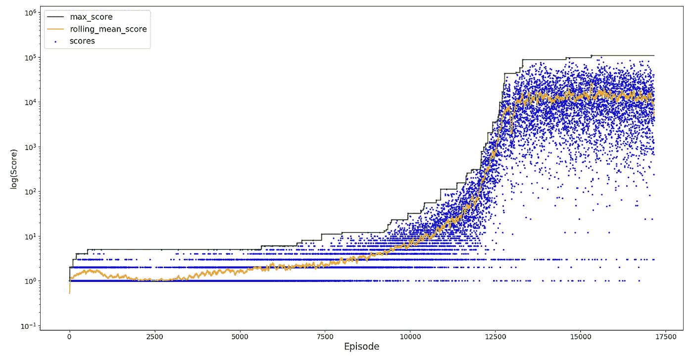

# Python 中带 Flappy Bird 的强化学习

> 原文：<https://towardsdatascience.com/reinforcement-learning-in-python-with-flappy-bird-37eb01a4e786?source=collection_archive---------12----------------------->

## Q-learning 和 RL 考虑事项的演练


活着，活着。(*图片来自作者，*资产来自 [FlapPyBird](https://github.com/sourabhv/FlapPyBird) )

# 介绍

2014 年，热门游戏《沉睡者》席卷了移动游戏世界。它已经在 PyGame 中实现，但最有趣的是它非常适合强化学习。代理(鸟)只能执行 2 个动作(拍打或什么都不做)，并且只对 1 个环境变量(即将到来的管道)感兴趣。这个问题非常简单，非常适合从头开始用 Python 实现强化学习。

**本文对该项目进行了更高层次的概述。代码和结果可以在 GitHub** [**这里**](https://github.com/anthonyli358/FlapPyBird-Reinforcement-Learning) **找到。**

# q 学习

Q-learning 是一种无模型强化学习算法，通常用于学习给定特定状态下代理采取的最佳行动。当代理人在特定状态下采取行动时，它会收到奖励(或惩罚)，代理人的目标是使其总奖励最大化，因此在采取行动时，它还必须考虑潜在的未来奖励。对于 Flappy Bird，代理是其可能的动作是不做任何事情或拍打翅膀的鸟，并且其当前状态由以下各项定义:

*   与即将到来的管道的距离
*   `y`到即将到来的底部管道的距离
*   鸟的当前 y 轴速度`v`
*   顶部和底部即将到来的管道之间的距离`y1`

第一次达到一个新的状态时，一个 Q 值被初始化(0 就可以了)，代理将执行默认的动作并获得奖励。如果以前遇到过一个状态，代理将执行具有最高 Q 值的动作(奖励最多的动作)。然后更新 Q 值，并将该值插入状态×动作 Q 表中的相应单元。


当代理对不同的状态采取不同的动作时，Q 表被更新。下一次代理遇到状态 1 时，它将摆动，对于状态 2，它将什么也不做。(*图片作者)*

Q 值根据几个参数更新:

```
# Update q values in a 2d array
Q[state, action] = Q[state, action] + alpha * (reward + gamma * np.max(Q[new_state, :]) — Q[state, action])
```

*   αα是步长，它决定了旧信息在多大程度上被遗忘以利于新信息。
*   γγ决定了未来奖励的重要性。例如，γ=0 意味着代理将只考虑其当前报酬。
*   Q[状态，动作]是当前的 Q 值。

# 结果

## 初步训练

奖励函数被定义为死亡罚-1000 分，否则罚 0 分，这样代理的关注点就是得到尽可能高的分数。这确保了奖励功能在每一集之后都有足够的影响，而在实现中，分数增加奖励+1 意味着惩罚几乎没有影响。

在α=0.7 和γ=0.95 的情况下，代理最初在没有任何探索的情况下被训练大约 10，000 集，并且几乎能够达到 100 万的分数。已经记录了 y 轴，以便可以更清楚地看到分数的滚动增加。


特工在学习生存。(*图片作者)*

## 经验回放:灾难性遗忘

尽管代理在初始训练后表现良好，但要进一步提高却需要更长的时间。这是因为代理需要很长时间才能到达死亡的场景，即使这样它也只能从死亡中学习一次。通过引入经验回放，代理可以尝试多次困难场景，直到克服困难或陷入恢复循环(此处设置为 100 次尝试)。在通过困难场景时，在失败时，它从开始重新开始，以避免连续增加所达到的最大分数。


加载 Q 表，从初始训练开始继续，但进行经验回放。(*图片作者)*

代理的性能有了初步的提高，因为它能够从更困难的场景中学习，但是它的性能很快下降到以前的最大值以下。

这被称为灾难性遗忘，它通常会导致代理性能的振荡，因为它会忘记和重新学习要采取的最佳行动。通过从相同的场景失败中反复学习，代理过度拟合，并且忘记了先前可概括的 Q 值。

## 体验回放:回放缓冲区

为了克服灾难性遗忘，在训练智能体时会添加阿尔法衰减，帮助它保留早期学习的信息，同时仍然从更少的场景中学习。此外，被视为陷入循环的尝试次数减少到 50 次，并且在体验重放期间，会创建一个“重放缓冲区”，其中包含所有采取的操作。然后以小批量的方式更新 Q 表，一旦体验重放完成，就对 5 次尝试进行采样。


这只鸟的记忆力更好。(*图片作者)*

这个代理差不多能达到一千万的评分。虽然随着训练持续超过 10，000 集，观察到表现下降，但它能够从这种最初的遗忘中恢复。虽然没有花费更多的时间来训练这个代理，但是可以预期代理的性能会随着它忘记和重新学习要采取的最佳动作而波动。随着 alpha 继续衰减，这将最终使代理在其最大值附近保持稳定。

## ε贪婪政策

我们现在尝试新训练的代理，引入探索率ε，这提供了探索随机动作的机会，直到它在 10，000 集后从 0.1 衰减到 0，以及α衰减，它在 20，000 集后从 0.7 衰减到 0.1。



经典的 sigmoid 增长曲线。(*图片作者)*

由于α和ε衰减，该代理比初始训练中学习得更慢，但是一旦它达到略低于 100 万的最佳性能，就稳定得多。这个最高分数比我们没有探索时的分数要低，可能是因为 alpha 衰减提高了稳定性，但代价是代理学习得更慢。

# 最终验证和想法

从上面我们可以看到，最终表现最好的代理是用经验重放和重放缓冲区训练出来的。代理性能经过 25 次运行验证。


🐤那是个不错的高分！(*图片作者)*

代理表现不错，持续过 10 万，最高分达到 500 万以上。它能够通过大多数情况，但当更困难的情况出现时，它不能永远活着，这意味着它有时会很早就死去。

*   稳定性:变异系数(标准差/平均值)为 0.967。这是预料之中的，因为在随机环境中，只有当智能体能够克服所有情况并且永不死亡时，它才能完全稳定。
*   平均分:平均分 2001434。这是代理人始终能够达到的一个很高的分数，超过了任何人类游戏。
*   最高分:25 轮最高分是 6，720，279。这是一个接近默认最大训练值 1000 万的高分，再次超过任何人类游戏。

## 未来的工作

*   更长的训练时间，表现最好的代理总共训练了 15 个小时，只达到了 10，674 集
*   实施[优先体验回放](https://arxiv.org/abs/1511.05952)
*   训练一个在飞鸟环境中永不死亡的特工

# 参考

*   许宏涛，用强化学习训练一只永远不会死的 flappy bird(2020)，[https://towards data science . com/Use-reinforcement-learning-to-train-a-flappy-bird-NEVER-to-die-35b 9625 aa ECC](/use-reinforcement-learning-to-train-a-flappy-bird-never-to-die-35b9625aaecc)