# 强化学习不仅仅是为了玩游戏

> 原文：<https://towardsdatascience.com/reinforcement-learning-is-not-just-for-playing-games-1de449800fe2?source=collection_archive---------9----------------------->

## [行业笔记](https://towardsdatascience.com/tagged/notes-from-industry)

## 多臂强盗如何能帮助一个创业公司


图片由米歇尔·莱曼(Pexels)提供

*我们都看过很多文章，在这些文章中，强化学习(RL)代理被用于穿越冰冻的湖泊、爬山、为城市中的出租车选择最佳路线等。游戏对现实生活中的代理人提出了重大挑战，因为它们需要我们做出几个决定。正常情况下，我们必须优化这些决策，以提高我们的整体得分(或者不要掉进冰封的湖中的一个洞，否则我们会遇到麻烦)。游戏也以一种美丽的方式展示了代理背后的数学原理。但是，RL 不是玩游戏；而是要培养能自己做决定的特工。*

## 多股武装匪徒

基本的强化学习算法之一是多臂土匪。强化学习和其他类型的学习之间最重要的区别是，它使用评估所采取的行动的训练信息，而不是通过提供正确的行动来指导[1]。

在概率论中，多臂土匪问题被定义为有限数量的资源，这些资源必须在竞争的备选方案之间分配，以便最大化它们的预期回报。基本的想法是，我们可以在各种选项中进行选择，以最大化我们的回报。但是我们不知道哪些替代方案会给我们提供更高的分数。如果我们知道就不会有问题。因此，我们在一个不确定的环境中运作。虽然 MAB(多臂土匪问题)被认为是一个相当简单的 RL 方法，其潜在的应用范围可能是显着的。让我们用一个真实的例子来说明它是如何工作的。

## 一家电动汽车初创企业

一家新的电动汽车初创公司刚刚完成了她的商业计划。电动滑板车的市场正在增长。每年，市场都以两位数的速度扩张。因为越来越多的人使用它，市场细分正在从“驾驶乐趣”扩展到包括像上班、短途城市旅行、上大学等细分。每个新的细分市场都有新的客户需求:它不一定只是为了好玩。还有其他因素需要考虑，包括速度、安全性和舒适性。考虑到这一点，这家初创公司构建了一个极简风格的框架，可以用一系列备选方案进行修改(图 1)。因此，他们可以简单地生产这个框架并添加替代产品，而不是必须创建十个独立的产品。制造成本下降，上市时间也缩短。

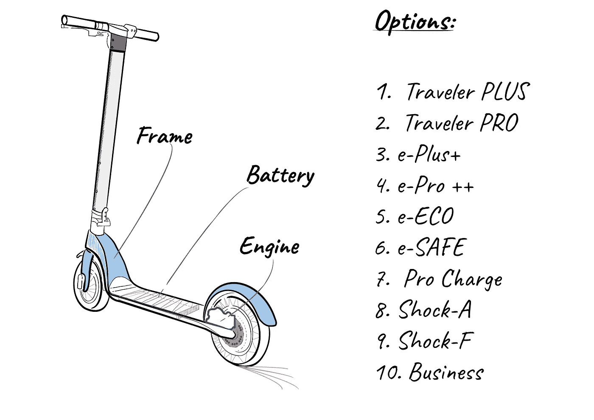

**图一。**电动滑板车创意。图片作者。

图 1 显示了选项:选项 1 和 2，具有更高速度的引擎。选项 3 至 6 具有更高容量的电池(3，4)，一种在制动时充电的电池(5)，增加了充电时间，以及(6)一种专为全路况保护的电池。选项 8 和 9 有特殊的踏板车框架加固，旨在成为事故的安全卫士:选项 8 是铝，9 是碳纤维。最后，选项 10 包括更大的车轮和定制的悬架，乘坐更加舒适。

## 问题是

这个“问题”和许多初创公司一样:现金。这对于将产品推向市场至关重要。机械工程师经理向团队的其他成员提出了一个关键问题:

*“我们有足够的资金制造 100 个基本框架和 100 个配件。接受和适应一个新配件需要三周时间。人们只是讨厌等这个产品等这么久。我们需要做一个初始库存，但是我们应该购买什么配件呢？我们每样都有十个吗？”*

这是一个棘手的问题。配件将符合最终产品，不能组合。到目前为止，我们有十个成品要展示。我们不知道哪些会更成功。我们的理想状态应该是有更多我们知道会卖得很快的最终产品，以及一些我们知道会卖得很慢的产品。第一次销售的收入可以用来投资新的配件，让我们的公司发展得更快。

## 营销研究

创业团队立即开始市场调研项目的工作。他们还发现了一份关于在大都市使用电动滑板车的报告[2]。在这篇文章中，他们就电动滑板车对潜在买家进行了一系列采访。图 2 展示了结果。

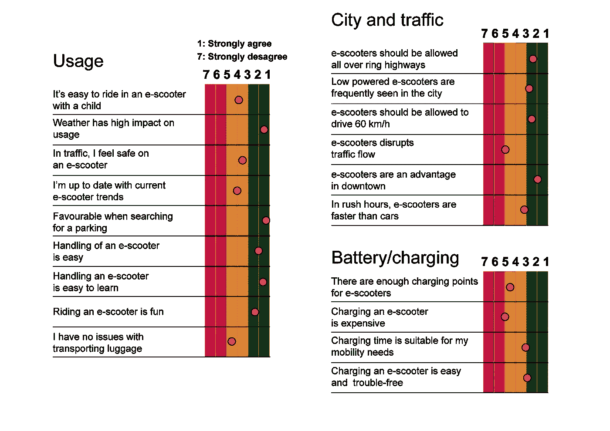

**图二**。电动滑板车基准。转载自哈特、科尼利厄斯&博根伯格、克劳斯。(2018).电动滑板车在城市环境中的使用。交通研究程序，37。**作者图片**

## 多武装匪徒在行动

强盗问题是玩家与游戏设备交互的顺序游戏。玩家通常被称为**学习者**，游戏设备是**环境。**游戏进行了 *n* 轮，其中 *n* 是一个被称为**地平线的正自然数。**在每一轮中，学习者首先从一组给定的动作中选择一个**动作*一个*一个**，然后环境会显示一个奖励。武装吃角子老虎是多武装强盗问题的典型例子。玩家必须选择一只手臂，机器会显示价格(奖励)。每次玩家选择并且 arm 正在执行一个**动作** *一个***该动作包含在玩家拥有的所有选项所代表的动作集合中。例如，如果吃角子老虎机有十只手臂，那么玩家有十个可能的动作可供选择。动作序列被记录在一个**历史**中，玩家从过去的动作(历史)中学习以优化未来的步骤。从历史到行动的映射称为**策略** (π)。政策是玩家对这个环境的了解。玩家可以有一些关于环境的先验信息。该信息被称为**环境类**【3】**，也称为**真值**【1】，表示为*【𝑞∗(𝑎】*。我们可以说一个行为的真正价值是当这个行为被选择时的平均回报。****

********

******图三。**计算真值。图像由 Pavel Danilyuk (Pexels)提供。****

****想象一下，有人在赌场里看别人玩老虎机。在最后一个小时，他看到了一台报价高于其他机器的机器。其余机器价格较低。当前面的玩家离开后，我们的玩家选择这台机器(一号机器),因为他知道前一个小时有两个高价。当然，这在统计学上并不显著，但这是我们玩家拥有的所有信息。****

****通过重复的行动选择，我们希望通过将我们的行动集中在最佳选择上来最大化我们的赢款。由于我们不能确切地知道动作值，我们必须对其进行估计。这就是土匪算法的作用。****

## ****探索与开发****

****当玩家开始游戏时，他使用先前学习的信息(环境等级或真实值)从上面的例子中选择一号机器。这被称为利用，它适用于利用他已经拥有的知识。然而，我们的玩家也想尝试不同的杠杆来获得更多的知识(也许那里有一些有趣的东西)。这就是所谓的探索。土匪问题的解决方案是估计行动的价值，以便使用这些估计来创建行动选择决策，从而在某个时间段内最大化期望的总回报。****

> ****土匪问题的解决方案是估计行动的价值，以便使用这些估计来创建行动选择决策，从而在某个时间段内最大化期望的总回报。****

****平衡勘探和开发将是我们估算的一个基本计算。当我们总是利用当前的知识来最大化即时回报时，我们使用的是*贪婪的*行动选择方法。一直贪婪地行动的一个替代方案是专门花一点时间(有概率 *ε* )去探索其他替代方案。然后我们使用*ε-贪婪*行动选择方法。概率ε是帮助我们平衡*勘探和*开发选择方法的参数。我们什么时候使用一个或另一个？从长远来看，贪婪方法的表现要差得多，因为它经常无法执行次优的操作。当我们有低不确定性的真实值时，投入大量时间去探索就没有意义了。我们可以利用现有的知识。但是当这个真实值有很高的不确定性时，我们预计利用这个知识是不够的，所以我们应该去探索，以最大化我们的奖金。****

## ****可以用多臂土匪解决我们的创业问题吗？****

****我们初创公司面临的挑战是资源分配。我们的资源有限，必须有效地管理它们，以使我们的收益最大化(以同样的投资获得更多的销售)。我们有 10 种竞争的可能性(如果我们选择一种，我们就不能选择其他的)。考虑开一家街边商店，在那里你可以每天买一件成品(镜架+配件)。选择什么样的商店将是一个行动。顾客可以走进商店，购买或不购买最终产品。然后你回家，第二天早上你带着另一个选择，重复同样的方法 n 个时间步。当然，我们不打算创建一个企业，只销售一种产品。我们打算建一个商店，在那里我们将出售我们所有的产品。然而，这是一个类似于之前解释的多武装匪徒问题的场景。然后，我们可以使用多臂 bandit 解决启动问题，以确定最佳配件选择，从而在第一个百台批量测试中最大化我们的销售额。****

## ****一些数学和伪代码****

****在多臂问题中，有许多方法可以估计最佳行动值。我们将采用之前描述的*ε-贪婪*动作选择方法以及*置信上限*动作选择方法。图 4 和图 5 显示了这两种方法。****

****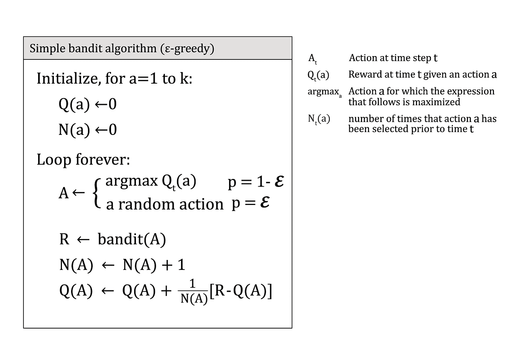****

******图 4** 。完整 bandit 算法的伪代码，使用增量计算的采样平均值和**ε**-贪婪动作 a 选择[1]。图片作者。****

****Bandit 算法必须跟踪收集的所有奖励。它必须使用该记录( *Qn* )估计所有 *n* 奖励的平均值。这可以通过以下方式实现[1]:****

> *****新估计* ← *旧估计+步长【目标-旧估计】*****

****其中[Target-Old Estimate]是估计误差(等于 Rn-Qn)。这个误差被称为学习者相对于策略的*后悔*，它被定义为使用 n 轮策略的总期望总回报与学习者在 *n* 轮中收集的总期望回报之间的差值。****

****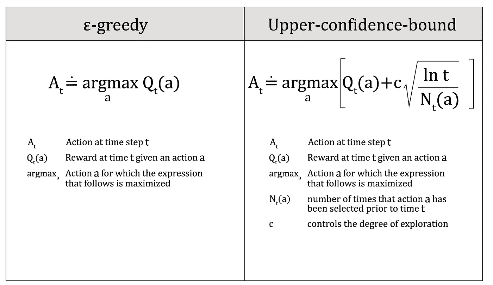****

******图五**。贪婪方法和置信上限方法的区别。图片作者。****

*****置信上限*方法基于非贪婪行为的最佳潜力选择*非贪婪*行为，同时考虑其估计值与最大值的接近程度以及这些估计值中的不确定性。记住*非贪婪*动作被*ε-贪婪动作选择*方法强制随机尝试。****

## ****用 python 定义我们的问题****

****为了开始解决我们的问题，给这个创业公司最好的建议，我们必须定义环境。我们要做的第一件事是定义我们真正的价值观。正如我们的时代开始做的那样，我们将利用市场调查[2]来估计真实价值。****

****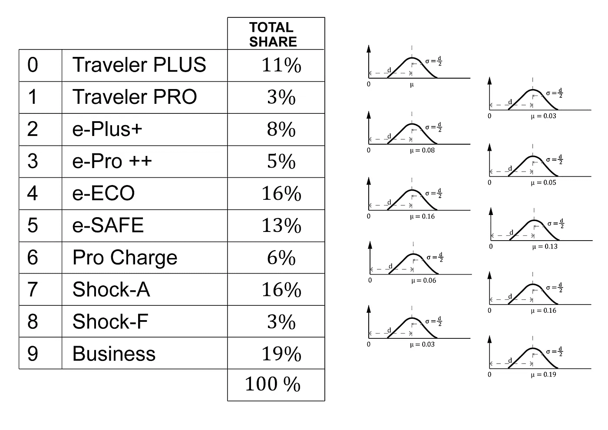****

******图 6** 。来自市场调查的真实价值。图片作者。****

****图 6 显示了我们所有附件的列表。我们将为我们的销售建立一个市场份额。我们将建立一个列表，条件是所有市场份额的总和为 100(或归一化为 1)。然后，我们通过给一些选项赋予更大的价值来完善这个列表，研究表明这些选项与客户更相关。较低的等级被分配给那些看起来不太重要的特征。总数是 100 英镑。这个列表可以归一化为 sum 1。然后我们有了下面的列表，可以直接用 Python 生成:****

```
**m_size = [0.11, 0.03, 0.08, 0.05, 0.16, 0.13, 0.06, 0.16, 0.3, 0.19]**
```

****我们在这个价值上有很多不确定性。我们的估计来自市场调查中的一些定性反应。为了包括这种不确定性，我们可以认为我们的*真值*不是这个值。相反，我们将把它们视为概率分布，其中 *𝜇* 等于这个值，而 *𝜎* 等于 *𝜇 / 2。是的，𝜇值越高，𝜎值就越高。我们有点保守，所以我们不太确定那些我们认为会有更多销量的配件。对于那些我们认为销量会减少的车型，我们的不确定性会减少。根据经验，销售越多，不确定性就越大。*****

****在这些值上，我们有一个重要的不确定性。我们的估计是基于市场调查的定性回答。我们可以通过假设我们的**真值**不是这些值来包含这种不确定性。相反，我们会认为它们是正态分布，其中 *𝜇* 等于我们的**真值**列表， *𝜎 =𝜇 / 2。*的确，对于更高的 *𝜇* 值，我们也有更高的 *𝜎* 值。我们有点保守，所以我们不确定我们认为会畅销的配件。对于那些认为我们销量会下降的人来说，我们的不确定性更小。此外，我们估计配件的价值会更高(销售额会更高)。考虑到这种不确定性，我们的环境可以在一个类中写成如下形式:****

```
*****class* BanditEnv:**
    ***def* __init__(*self*):**
        self.size = 10
        self.means = m_size
    ***def* step(*self*, *action*):**
        assert action == int(action)
        assert 0 <= action < self.size
        reward = np.random.normal(loc=self.means[action], 
                 scale=self.means[action]/2) **#gaussian distribution**
        **return reward****
```

****现在我们必须根据图 4 定义我们的算法:****

```
*****def* epsilon_greedy(*env*, *nb_total*, *eps*, *eps_factor*=1.0):**
    rewards = []
    Q = np.zeros(env.size)   ***# shape: [n_arms]***
    N = np.zeros(env.size)   ***# shape: [n_arms]***
    for _ in range(nb_total):
        if np.random.rand() > eps:
            A = np.random.choice(np.flatnonzero(Q == Q.max())) 
        else:
            A = np.random.randint(env.size)  **# explore randomly**
            R = env.step(A)
            N[A] += 1   
            Q[A] += (1/N[A]) * (R - Q[A]) ***# incremental mean***          
            eps *= eps_factor ***# epsilon decay***
            rewards.append(R) **return Q, np.array(rewards)****
```

****其中 ***env*** 是我们的环境， ***nb_total*** 是我们实验的时间步数，***EPS***=*ε*和 ***eps_factor*** 是 *ε* 的衰减因子。该计算将给出在 *nb_total* 步骤后计算的“市场份额”的新列表，以及每个时间步骤获得的奖励。****

```
**env = BanditEnv()
nb_total=1000
epsilon = 0.1
**Q, rewards** = epsilon_greedy(env, nb_total= nb_total, eps=epsilon)**
```

****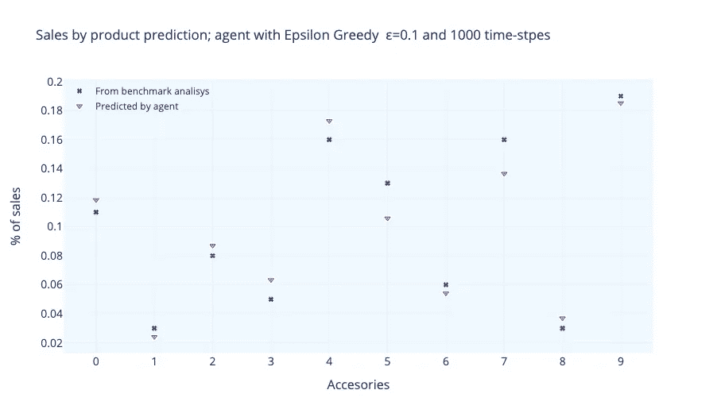****

******图 7**:ε= 0.1，1000 时间步的ε-贪婪算法结果。作者图片****

****图 7 显示了 *ε* =0.1 的结果。在 1000 个时间步之后，我们可以将我们的真实值与计算值进行比较。除了一些附件之外，结果与我们的初始值相当接近。我们可以把时间步长想象成每次消费者来到我们的商店购买一个选项。控制**勘探开发**平衡和时间步长是计算的重要参数。 *ε* =0.1 的值表示该算法将其计算成本的 10%分配给“探索”新动作。如果我们增加这个数量，我们将冒算法对低回报行为分配过多权重的风险，这将对优化问题产生影响。图 8 可以帮助我们评估这种行为。****

****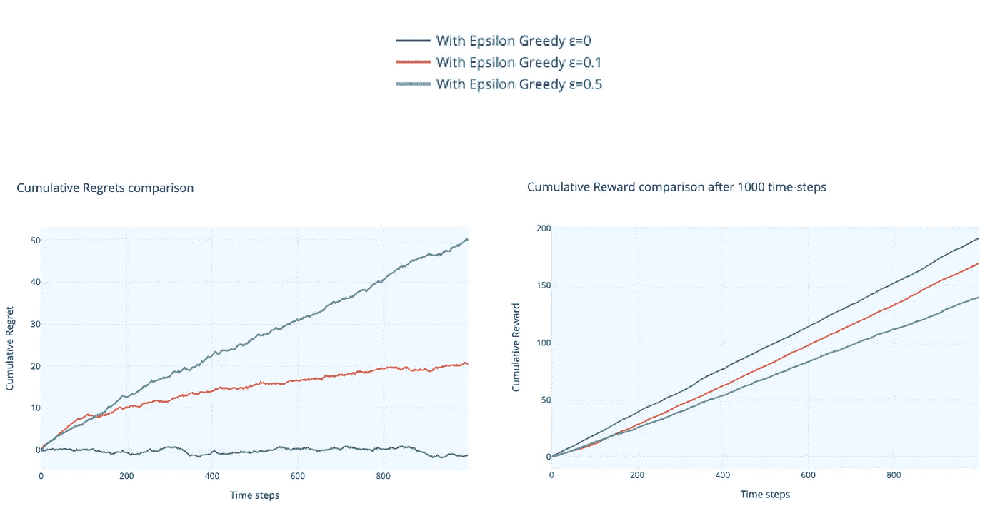****

******图 8** 。累积遗憾和累积回报(ε=0.1)。图片作者。****

****我们可以看到，累积的*回报*和累积的*遗憾*必须随时间增长。后悔不是线性上升的，这一点很关键(就像 *ε* =0.0 的情况一样)。我们还可以看到，较高的值( *ε* =0.5)比较低的值( *ε* =0.1)后悔增加更强，*奖励*也是如此。我们希望看到*奖励*的大幅增长。这两个指标可以被认为是我们代理的性能指标。****

****在图 9 中，我们可以看到使用*置信上限*算法获得的结果。使用该算法时， *c* 的典型值为 1.41 (√2)。我们看到计算出的市场份额与我们的真实值非常相似。数值越高，不确定性越高(更高的 *𝜎* ) *。*所以，环境的不确定性也是一个深刻影响最终结果的话题。如果我们对我们的环境说，我们非常确定我们的真实值(低不确定性)，算法将显示与我们非常相似的结果。如果我们不太确定(高度不确定)，值可能相差很大。****

****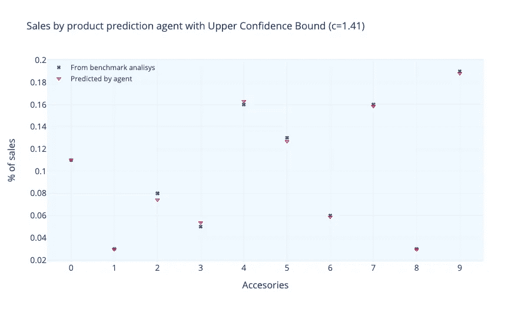****

******图 9** 。1000 个时间步后 c= √2 的置信上限算法****

****让我们比较两种算法。在图 10 中，我们可以看到两种算法的*后悔*与时间步长的比较。ε贪婪算法的性能明显优于 T36 算法。*遗憾*呈线性增长，大约 300 个时间步长会降低其增长率。****

****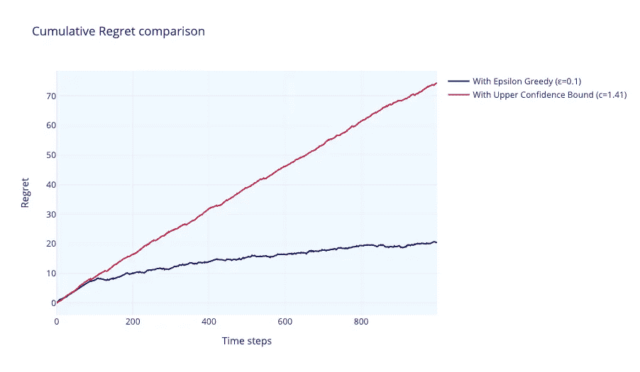****

******图 10** 。算法上的后悔比较。图片作者。****

## ****环境不确定性****

****我们已经强调了环境不确定性在两种算法的最终结果中的作用。在上面的例子中，我们引入了真实值，其中𝜎的值为*𝜇/的值为*2。我们将对我们的算法说，我们甚至更不相信我们给出的值。我们将通过选择𝜎等于 𝜇来实现(通过 *𝜎* = 𝜇，我们增加了两倍的不确定性)。两种算法都显示真实值和计算值之间的差异较大，其中 *ε-greedy* 的差异明显较大。在图 11 中，我们可以看到两种算法如何显示真实值和计算值之间的较大差异，ε-greedy 清楚地显示了最大的差异。****

****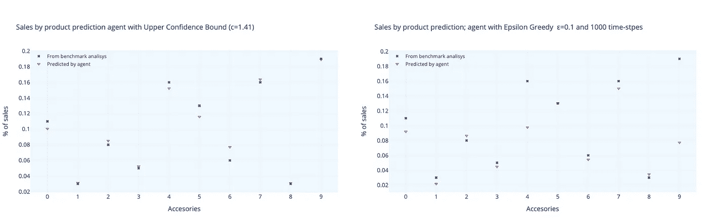****

******图 11** 。更高的不确定性环境， *𝜎* = 𝜇.图片作者。****

## ******结论******

****这是我们可以向这家初创公司展示的最终表格，比较了我们从市场研究中获得的值和我们的算法计算出的值:****

****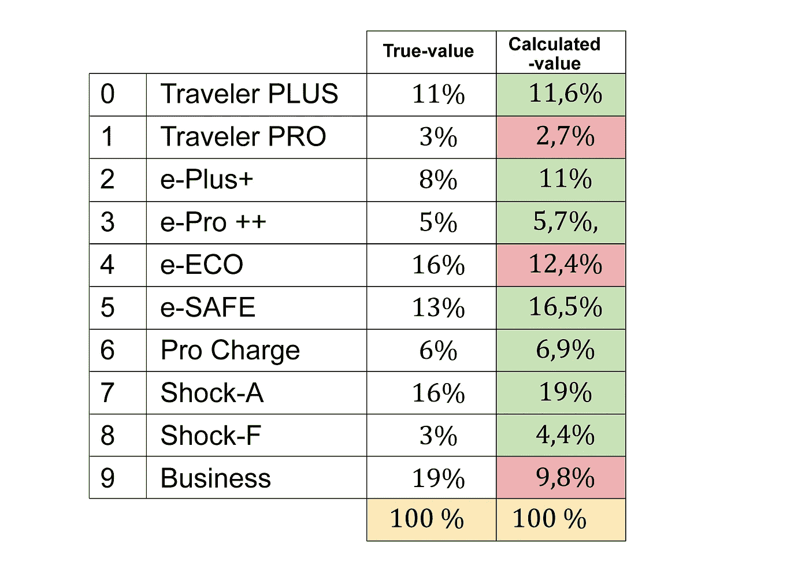****

******图 12** :最终结果。图片作者。****

****我们已经展示了简化版的多臂强盗方法在解决现实世界的问题时是多么的有用。资源分配是大多数组织中经常出现的一种决策问题。这些决策可以在各种复杂的环境中重现。在这篇文章中，我们使用了一个非常简单的设置来描述一个常见的决策过程。我们已经展示了如何使用多臂 bandit 算法来自动化这个决策过程，以便在不确定的条件下获得更准确的结果。****

## ****Python 代码****

****我们使用 *numpy* 库进行算法，使用 [*plotly*](https://plotly.com/python/) 进行绘图。代码可以在这里找到[。](https://github.com/Javihaus/Bandits-algorithms-in-real-world)****

## ****参考资料:****

****[1]理查德·萨顿和安德鲁·g·巴尔托(2020)，《强化学习:导论》。麻省理工学院出版社。****

****[2]哈特、科尼利厄斯&博根伯格、克劳斯(2018)。电动滑板车在城市环境中的使用。运输研究程序。37.10.1016/j.trpro.2018.12.178****

****[3]拉蒂摩尔和 Csaba szepesva ri(2020 年)。强盗算法。剑桥大学出版社。****