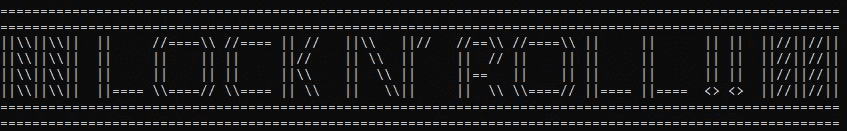
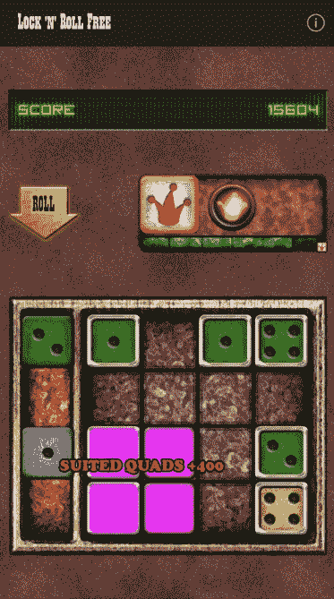
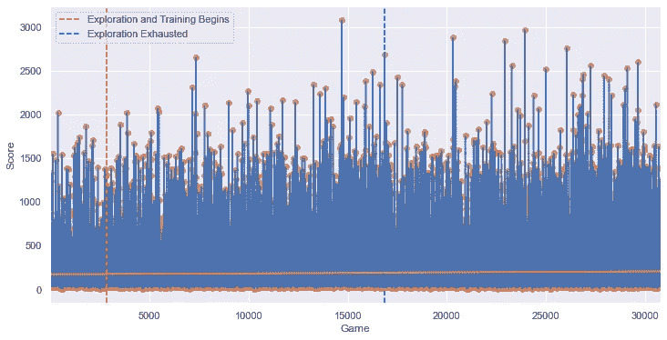

# 强化学习锁定 N' Roll

> 原文：<https://towardsdatascience.com/reinforcement-learning-lock-n-roll-eec6719dfe1?source=collection_archive---------60----------------------->

## 利用双深度 Q 网络学习随机状态博弈



**作者图片**

Lock N' Roll 由 Armor Games 于 2009 年创建。这是一个为那些智力水平高的人设计的游戏，那些被选中的少数人拥有巨大的智商和数学及概率思维的倾向。普通的游戏玩家不可能理解如此复杂和高级的娱乐。

或者，也许这只是我告诉自己的，以证明我的朋友中有少数人听说过它，这是我最喜欢的浪费时间的方式之一。这是一种需要在 4x4 网格上以不同组合和图案放置不同颜色骰子(红色、黄色、绿色或蓝色，编号为 1-4)以最大化点数输出的游戏。当你没有骰子或者你想对棋盘的当前状态进行评分时，你选择显示“掷骰子”的按钮，它也会锁定你的移动，这样你放置的骰子就不能再被操纵了。掷骰子后获得的骰子是随机的。小丑是在达到一定的总点数后获得的，它们可以放在棋盘上的任何地方，以模仿任何给定骰子的效果。当棋盘上满是骰子并且你不再开玩笑时，游戏结束。骰子可以通过获得高分组合来清除。有什么不喜欢的？

[](https://armorgames.com/play/4283/lock-n-roll) [## 装甲游戏中的锁定滚动游戏

### 锁-n-Roll，一款由 Armor Games 为您带来的免费在线益智技能游戏。摇滚是一个有趣的和…

armorgames.com](https://armorgames.com/play/4283/lock-n-roll) 

作者图片

多年来，我断断续续地在手机上安装这款应用，试图完善我自己的游戏方法。我如何在下一次掷骰子时最大化清除空间的机会？设置 400 点移动清除 4 个空格，还是 200 点移动清除 6 个空格，哪个更重要？什么时候我应该使用小丑？通过多次试错，我完善了自己的策略，从我刚开始时的 1000 分是一个不错的分数，到能够持续达到 20000 分以上，甚至几次达到数百万分。然而，尽管我通过我崭露头角的摇滚天赋获得了许多荣誉(我说的“许多荣誉”是指“许多浪费的时间”)，我总是想知道是否有办法表面上“解决”这个游戏，采用最佳策略，一个统治所有人的策略。这个游戏有超过 20 万亿种可能的状态，而我并没有我想要的那么强的数学背景，这个任务看起来总是令人生畏。

# 双重深度 Q 学习

格雷格·苏尔马出场了。格雷格·苏尔马不认识我，我也不认识他，但不管出于什么原因，当我读到他的 [Medium 文章](https://gsurma.medium.com/atari-reinforcement-learning-in-depth-part-1-ddqn-ceaa762a546f)关于使用机器学习来训练一个 AI 玩雅达利游戏达到高于平均水平时，我想到了尝试用 Lock N' Roll 做同样的事情。也许有办法解决这个游戏？我是一名受过 Python 编程艺术训练的数据科学家，但我没有多少强化学习的背景。我的专业更倾向于预测时间序列。

尽管如此，我还是决定接受这个挑战。尽管数学家可能会拿着铅笔和纸坐下来，试图证明一组最佳规则，以最大化潜在的总点数，但这种方法涉及训练代理多次玩游戏，每次都评估游戏的游戏性，并形成策略，以最大化每次移动获得的奖励或远离惩罚它的移动。它怎么知道哪种移动是哪种？程序员告诉它。这个过程通常被称为强化学习。

在强化学习技术的保护伞下，有深度 Q 学习(DQL)。DQL 使用神经网络模型来“记忆”人工智能过去的动作，并通过参考其记忆来系统地重新训练自己。然后，它通过不仅预测它将立即获得的奖励，而且预测该移动将导致的下一个状态，并对在该未来状态中获得的预测点数应用折扣奖励，来决定它的未来移动。通过多次重复这个过程，并在初始训练阶段使用更多的随机探索，它在其内存中串连起足够的奖励和贴现的未来奖励，以形成“马尔可夫链”，这是一个贝叶斯概念，我认为这是游戏的潜在路径。随着足够多的马尔可夫链形成，人工智能可以开始形成一个关于最佳游戏的理论。

当可用的移动和需要考虑的变量达到一定的规模和复杂性时，双深度 Q 学习(DDQL)就变得必要了。DDQL 系统地“解除”某些移动，由于潜在学习功能中次优收敛的可能性，AI 开始错误地偏向 DQL。无偏过程是通过第二个神经网络(目标网络)完成的，它有助于平衡代理可用移动的范围，因此它不断学习什么移动实际上是最好的。这两个网络系统地同步在一起。代码如下所示:

在我看来，这是一个教授 AI Lock N' Roll 的完美框架，这需要提前考虑你当前骰子放置最可能导致的移动，我很快就知道我需要使用双重深度 Q 学习，而不是深度 Q 学习，因为训练过程中涉及到无数的复杂性。

我面临的一个挑战是弄清楚如何让计算机知道某些移动并不总是可用的。我在网上找到的关于使用 DDQL 的例子并不清楚如何解决这个问题，在线论坛上的许多讨论似乎表明，该框架只有在不需要限制动作空间时才可能实现，即所有动作在任何时候都是可用的。因此，我决定总是让人工智能从 16 步棋中选择，标记为 0-15。根据它决定采取的行动，下一个可用的骰子(按字母顺序排序)被放置在最接近所选骰子的可用空间上。如果没有骰子可用，如果已经赢得了一个小丑，将使用它。每次放置芯片后，它都会锁定并滚动。这些都是重要的限制，在我自己尝试了这些限制后，我发现获得 5，000-12，000 分是一个相当稳定的结果，但我不能获得更多的分数。

它每走一步得到的奖励是它走一步得到的分数，如果这步棋导致游戏结束，它的惩罚是-500。

我还需要处理一个很大的观察空间，这个空间造成了很多冗余。例如，因为我需要通过神经网络传递一个数字向量，所以使用了一个热编码技术来表示棋盘上的每个空格是如何被覆盖或未被覆盖的，以及哪些骰子当前可用。这意味着使用的四个变量是红色、蓝色、绿色或黄色骰子当前是否在任何给定的空间上。如果在那个空间里有一个红色的骰子，指示其他三种颜色的变量将总是零。这只是为了代表棋盘上一个空间的颜色；还有棋盘上的数字和玩家可以使用的骰子和玩笑。我想不出在这些特征之间建立顺序关系来消除编码过程中的冗余。

为了解决这个问题，我使用 PCA 将观察空间的维度从 193 减少到 154，同时保持超过 99.95%的数据集原始方差。我也尝试使用线性判别分析，但最终选择了主成分分析减少。我仍在学习其他可能更适合这种情况的减排技术。

然后，我没有意识到我会有一个问题——我的硬件。训练这该死的东西花了很长时间。为了让电脑播放并记住 50 万次，我不得不等了三天多。更不用说我很快看到的所有失败的实验都是行不通的。我敢肯定，我的 Windows Surface 笔记本电脑对于这个问题来说不是最佳选择，因为它在训练时达到了非常高的温度，也许我可以编写一个时空复杂度更低的实际游戏，但在我获得更多计算能力之前，我会让 50 万次训练迭代的结果保持原样。

郑重声明，我不认为我对这些问题的任何解决方案是完美的。我刚刚进入这个领域，意识到我还有很多东西要学习。然而，也许我分享我的一些挑战可能对其他人有用，或者我可以从关于潜在改进的评论中学习。

# **结果**

结果喜忧参半。我认为有明确的迹象表明我的人工智能学会了，但远没有我希望的那么多。在 50 万次尝试后，它平均可以得到 200 分，并且经常超过 1000 分。它的最高分是 3000 多一点。手动测试代理时，我注意到它可以识别一些模式中的一些组合，这将为它赢得巨大的分数，但它很难识别好的移动，即使是对我来说很明显的移动。它和我的水平相差甚远，但从统计数据来看，它明显好于 random。一个随机代理平均 165 左右，很少得分超过 1000。



作者图片

```
random score mean: 164.47355516637478
ai train mean: 188.473811164714
ai non-random train mean: 199.63831736189402
Ttest_indResult(statistic=-4.57018461548957, pvalue=4.906525386975824e-06)
Ttest_indResult(statistic=-6.165806097995396, pvalue=7.170408706268266e-10)
```

在未来，我想用更有效的简化过程来完善这种方法，用遗传算法来寻找最佳神经网络，用一种方法来限制任何给定状态下的动作空间，以便人工智能正在玩的游戏更能代表真实的游戏体验，并在我的硬件中增加计算能力，以训练它进行至少 100 万次或最多 500 万次迭代。然而，对于我第一次尝试创建一个学习代理(从建立到现在只花了我一个月的空闲时间)，我很满意我构建了一个学习*的代理。*

我打算最终创建这个应用程序的版本 2，但是现在，我要休息一下。如果您感兴趣，下面是包含所有代码的 GitHub 资源库。

[](https://github.com/mikekeith52/LockNRoll) [## mikekeith52/LockNRoll

### 用双深度 q 学习的强化学习来学习一个随机状态的博弈——Mike Keith 52/lockn roll

github.com](https://github.com/mikekeith52/LockNRoll)