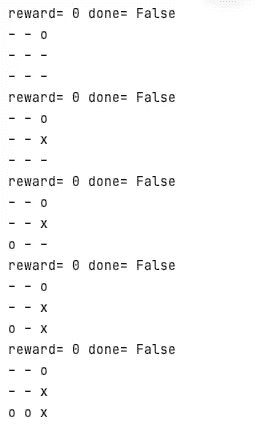
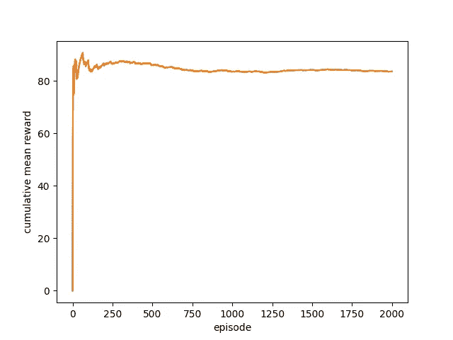

# 强化学习 Q-从零开始用非法动作学习

> 原文：<https://towardsdatascience.com/reinforcement-learning-q-learning-with-illegal-actions-from-scratch-19759146c8bf?source=collection_archive---------6----------------------->

## 这是一个井字游戏的例子，展示了当某些动作对于特定的状态是禁止的时候，如何编写 RL Q-learning 算法


[井字游戏动画](https://commons.wikimedia.org/wiki/File:Tic-tac-toe-animated.gif)

有一天，我看着我 18 个月大的儿子学习如何用勺子吃饭，我意识到，一旦他的碗空了，他会立即放下勺子，向我要食物。他根据碗中食物的位置和数量来调整拿勺子的方式，而只要没有食物了，他自然不会做任何无用的努力。这让我想起了我遇到的一些 RL 问题:在一些特定的情况下，并不是所有的行为都是允许的:例如，当电梯已经在顶层时，它永远不能上升，当已经达到最低温度时，HVAC 系统将总是停止冷却。

在本文中，我将以井字游戏为例，构建一个基于游戏规则存在非法行为的 Q 学习算法。接下来，你将会读到:

1.  井字游戏的 RL 环境。
2.  带有非法行为的 Q 学习算法。

所有的代码都在我的 [Github](https://github.com/ShuyangenFrance/tic-tac-toe/tree/main/tic-tac-toe) 上，以防你需要更多的细节。

# 井字游戏环境

井字游戏或 Xs 和 Os 是两个玩家的游戏，他们轮流用 *X* 或 *O* 标记 3×3 网格中的空间。成功在水平、垂直或对角线上放置三个标记的玩家获胜。

我们将使用[健身房](https://gym.openai.com/)来设置井字游戏环境。一般来说，RL 环境有四个关键功能:初始化、重置、步进和渲染。

## 初始化

初始化函数主要是对奖励、done(检查游戏是否结束的值)进行初始化，特别设置了动作空间和观察(状态)空间。在井字游戏中，两个玩家(让我们称他们为玩家 O 和玩家 X)中的每一个都可以采取 9 种可能的行动:他想要标记的网格之一。一个状态由一个 3×3 的数组表示，其中每个元素可以有三个可能的值:0 表示未被标记，1 表示已被玩家 O 标记，2 表示已被玩家 X 标记)。**注意，并非所有状态都允许所有动作:玩家不能标记已经被占据的格子。**

```
import gym
from gym import spaces
import numpy as npclass TicTacToe(gym.Env):
    metadata = {'render.modes': ['human']}def __init__(self):
        super(TicTacToe, self).__init__()
        self.states = np.zeros((3,3))
        self.counter = 0
        self.done = 0
        self.reward = 0
        self.action_space=spaces.Discrete(9)
        self.observation_space=spaces.Box(low=0,high=2, shape=(3,3))
```

## 重置

重置功能旨在将环境设置为初始状态。在我们的示例中，我们简单地将完成和奖励值设置为零，并将状态设置为游戏板上没有任何标记。

```
def reset(self):
        self.states=np.zeros((3,3))
        self.counter = 0
        self.done = 0
        self.reward = 0
        return np.array(self.states)
```

## 步骤

阶跃函数是动作的函数，它可能是环境中最重要的部分。它代表了环境状态将如何随着一个给定的行动而转变，以及我们将获得什么样的回报。在井字游戏中，一旦执行了一个合法的动作，就会有四种不同的状态:玩家 O 赢，玩家 X 赢，游戏继续或者没人赢但游戏结束。

由于篇幅限制，这部分代码被省略了，但是实现非常直接:我们只需要在每个动作之后检查游戏是否继续，如果不是，谁赢了。此外，如果玩家 O 赢了，我们设置奖励为 100，玩家 X 赢了，奖励为-100。在游戏没有结束的情况下，我们对中间步骤不给予任何奖励。请在我的 Github 上查看详细信息。

## 提供；给予

render 函数将环境渲染到屏幕上。例如，它打印游戏的以下报告:



作者图片

# q-用非法行为学习

一旦井字游戏的环境设定好了，我们就真的要训练代理人(玩家)了。在这个例子中，我将使用最基本的 RL 算法 q-learning:在一项工作中，Q-learning 寻求学习一种使总回报最大化的策略。它是一种表格方法，创建形状[状态，动作]的 q 表，并在每次训练后更新和存储 q 函数值。训练完成后，以 q 表为参考，选择奖励最大化的动作。请注意，我们游戏中的每个状态都由一个 3 乘 3 的数组表示:我们首先需要一个函数(state_to_number)来将每个状态更改为一个整数:

```
def __init__(self,alpha = 0.1,gamma = 0.6,epsilon = 0.1,epochs=5000):
        self.alpha=alpha
        self.gamma=gamma
        self.epsilon=epsilon
        self.epochs=epochsdef state_to_number(self, state):
        state = state.reshape(9)
        number = 0
        for i, num in enumerate(state):
            number += num * 3 ** (len(state) - i - 1)
        return int(number)
```

回想一下，在我们的井字游戏环境中，q_table 不能到处填充:玩家不能标记已经被他自己或他的对手标记的网格。在这种情况下，我们简单地以下面的方式屏蔽禁止的动作:我们将表中相应的元素设置为 nan，并通过忽略相应行中的 nan 值来选择 argmax。有人建议设置一个很大的负值作为无效行为的奖励，但这不是一个好主意，因为无效行为仍有可能以很小的概率被选择。

```
def learn(self,env):
        if env.env_name=="tictactoe":
            self.q_table = self.q_table(env)
            for i in range(self.epochs):
                state = env.reset()epochs, reward, = 0, 0, 0
                done = Falsewhile done !=True:
                    if random.uniform(0, 1) < self.epsilon:
                        action = env.action_space.sample()  # Explore action space
                        #forbiden ilegal action
                        while state[int(action / 3)][action % 3] !=0:
                            action=env.action_space.sample()
                    else:
                        action_value_list=self.q_table[self.state_to_number(state)]
                        for action,action_value in enumerate(action_value_list):
                            if state[int(action / 3)][action % 3]!=0:
                                action_value_list[action]=np.nan
                        action = np.nanargmax(action_value_list)  # Exploit learned values
                    next_state, reward, done, info = env.step(action)
                    old_value = self.q_table[self.state_to_number(state), action]
                    next_max = np.nanmax(self.q_table[self.state_to_number(next_state)])
                    new_value = (1 - self.alpha) * old_value + self.alpha * (reward + self.gamma * next_max)
                    self.q_table[self.state_to_number(state), action] = new_value
                    state = next_stateepochs += 1
```

我们显示了训练集的奖励的累积平均值，我们可以看到奖励收敛到大约 80%，也就是说，玩家 O 有 80%的机会赢得游戏。并且当然在以后的游戏中不会采取无效动作。



作者图片

# 结论

在这篇文章中，我用井字游戏展示了当一些动作是非法的时候如何对待 RL，以及如何在训练中用一个从零开始构建的简单 q-learning 示例来屏蔽它们。必要的屏蔽步骤防止代理在学习中无效。