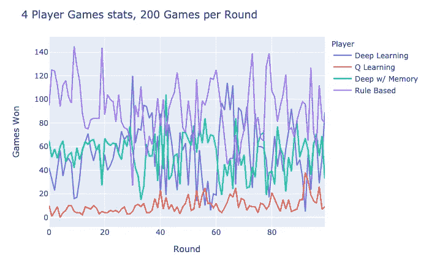

# 强化学习& SushiGo！第二部分

> 原文：<https://towardsdatascience.com/reinforcement-learning-sushigo-pt-2-ca636a0b0a?source=collection_archive---------62----------------------->

如果你还没有检查过这个项目的 [Pt.1](/reinforcement-learning-sushi-go-238ad9bd7311) ，请在阅读这个之前快速浏览一下！

三文鱼 Nigiri，作者图片。(鸣谢:Kiwiwii)

上次我们讨论了用 RL 来分析寿司围棋的博弈。虽然学习算法是相对有效的，但实现对原始游戏进行了一些简化。也就是说，代理人在每场游戏中只玩一轮而不是三轮，一副牌中没有布丁和筷子，并且代理人不记住前一手牌中的牌。这一次，我们将添加一些额外的功能，看看学习进展如何！

## 添加布丁和内存

为了在游戏中添加布丁，玩家需要玩 3 次才能完成一场真正的游戏，因为布丁分数只会在游戏结束时添加。这在理论上应该“平滑”胜率曲线，因为玩家需要在 3 轮结束时获得最高分。

另外，我为一个深度学习代理增加了内存容量。也就是说，代理可以记住它以前的手牌，所以它知道什么样的牌还在外面。

4 名玩家，包括布丁&每场比赛使用 3 轮。底部的“回合”表示 200 次训练+ 200 次评估游戏

似乎随着随机玩家的消失和记忆代理的加入，基于规则的玩家变得最强。基于规则的播放器已根据上次实验后的结果进行了调整，并根据优先级进行抽签:

1.  芥末
2.  鱿鱼 Nigiri
3.  三文鱼酱
4.  生鱼片
5.  布丁
6.  天妇罗
7.  3 Maki
8.  2 Maki
9.  1 Maki
10.  饺子
11.  鸡蛋 Nigiri

这个简单的规则打败了两个“努力”的深度学习玩家！如果你不知道如何玩这个游戏，这个图表可以作为一个很好的等级列表。

## 两个玩家

在让深度学习代理输给基于规则的玩家之后，我开始思考为什么会出现这种情况。从理论上讲，深度学习玩家复制基于规则的玩家的策略应该没有问题，而且他们有能力做得更多。其中一个可能性是，在 4 人游戏中，奖励发生的频率较低，尤其是当玩家表现良好的时候。因为只有赢得一场比赛才会产生积极的回报，没有导致胜利的好棋根本不会得到回报。这可能导致收敛困难。

解决这个问题的一个方法是减少对手。玩家少意味着代理商更容易赢，给它更多的学习机会！

两个玩家，无视筷子

深度学习代理似乎能够在单挑中击败基于规则的玩家！更少的玩家意味着更少的功能，因为代理不需要查看更多玩家的棋盘，记忆更少的手牌。结果，玩家能够发现更多的图案。

## 记忆

该游戏的主要挑战之一是记忆以前的牌局。如果你在捡生鱼片或芥末之类的东西，你需要知道剩下的牌里有多少生鱼片和芥末。我个人很难知道所有钥匙卡的号码，因为你还需要检查其他玩家拿了什么。

代理人显然可以记住以前的牌局，但在利用这些信息时可能会有问题。在之前的手里见过多个生鱼片，说明你从现在的手里拿起生鱼片更顺手。让我们看看代理是否能有效地利用这些信息。

两个玩家，有记忆对没有记忆

在实验过程中，似乎两个玩家都没有明显的优势。注意，没有记忆的代理在开始时更有效，因为较少的特征更容易学习关系。不清楚这些记忆是否对特工有帮助。

## 筷子

筷子确实有点讨厌。正确使用筷子可能是游戏中最难的部分，因为正确的时间很难确定。对于深度学习代理来说，这就更难了。拥有筷子开启了行动的可能性。如果选择用一双筷子，一次可以挑两张牌！因为有 12 张不同的牌，所以可能的组合数是 12 * 13 / 2 = 78！(两张卡的顺序无所谓)。如果你不用筷子，那么你可以选一张 12 的牌。基本上，使用现有的模型架构，让筷子将行动空间从 12 增加到 90。

此外，由于你并不总是有筷子，学习哪些组合很难得到的数据。让我们看看代理在双人游戏中的表现

两个玩家，用筷子

不幸的是，我们的代理人无法击败基于规则的玩家，甚至基于规则的玩家根本不会使用筷子！拥有大的行动空间当然导致了学习的退化。

## 冷启动

我们要评估的最后一件事是冷启动/热启动的想法。由于代理需要赢得游戏来学习，如果它从未赢得任何游戏，它将根本不会学习。想象一个代理人和一个真正优秀的人比赛，代理人赢的很少，所以它会学得很慢。在另一个极端，如果代理人与某人对弈非常糟糕，任何动作都会导致胜利，因此代理人根本不学习。

为了评价冷启动的效果，我在一个状态下有两个没有记忆的深度学习代理。他们中的一个玩了 40k 游戏，而另一个没有。

两名球员，训练 vs .冷启动

“新”代理在实验开始时有一段艰难的时间，但在大约 10k 场比赛后，它能够回升其胜率。有趣的是，预先训练的代理人后来能够重新获得优势，并在整个实验中保持良好的领先优势。

## 结论

第一部分展示了强化的力量，第二部分展示了它的一些弱点和局限性。

虽然行动奖励结构对于模拟类似人类的学习非常有用，但在现实生活中，奖励往往更加复杂。在这个游戏中，代理人只把赢得一场游戏作为奖励。然而，对于人类来说，像做芥末+鱿鱼套餐、成功拒绝其他玩家的生鱼片这样的事情本身就很有价值。这有助于人类更快地学习游戏，但从长远来看，也让我们更有可能做出次优决策。使用简单的奖励有助于代理人只为胜利而战，但收敛肯定会很棘手，尤其是在多人游戏中。

动作空间的大小对收敛也有重要作用。当行动空间变得太大时，代理很难画出特征和输出之间的关系。在我们的案例中，对可能的组合使用一个热编码似乎不足以让代理学习如何正确使用筷子。也许把筷子当作连续挑选两张卡片的工具会更容易学习。

最后，这个实验显示了 RL 对噪声的脆弱性。所有的特征输入都应该在一定程度上影响代理的决策，但有些特征不是很有用，比如其他玩家的棋盘。在数据量很小的情况下，有很多对手会让代理“分心”去学习什么是真正重要的。相比监督学习，我觉得 RL 对输入更敏感，当然也需要更细致的架构设计。

就是这样！我希望你喜欢这篇文章，并且学到了一些关于强化学习的东西。一如既往，这里是[回购](https://github.com/Gravellent/sushigo-rl)。请在评论中告诉我你的想法！