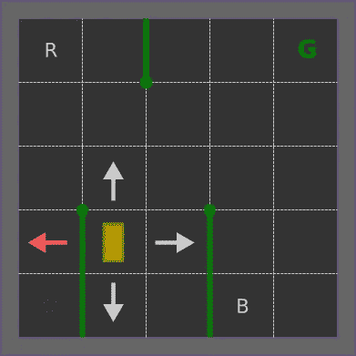
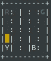
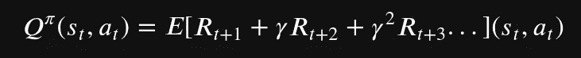
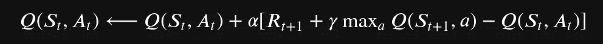

# 强化学习——用 Q-Learning 教出租车开车

> 原文：<https://towardsdatascience.com/reinforcement-learning-teach-a-taxi-cab-to-drive-around-with-q-learning-9913e611028f?source=collection_archive---------10----------------------->

## 初学者的强化学习

## 用 OpenAI-gym 和 Python 温和地介绍 RL

[来自彼得卡斯普日克](https://unsplash.com/photos/NZOgPLpL4Lk)的 Unsplash

为了娱乐和工作，我经常玩机器学习。我用 PyTorch 和 TensorFlow 为 NLP、视觉和医疗保健建立了深度学习模型。然而，强化学习对我来说仍然是一个谜，阅读大量关于 Deepmind、AlphaGo 等的内容非常有趣。现在有多一点时间，我决定深入研究 RL，试图了解基本知识。

我的选择是使用一个简单的基本例子，python 友好的，OpenAI-gym 是一个非常好的框架。我选择的玩具例子是出租车环境。这个[环境](https://gym.openai.com/envs/Taxi-v3/)很简单:

> 有 4 个地点(用不同的字母标记)，你的工作是在一个地点接乘客，在另一个地点让他下车。你成功下落获得+20 点，每一个时间点损失 1 点。非法上下车行为还会被扣 10 分。

OpenAI taxi-V3 环境。作者图片

如文件所述，你开出租车。桌子的四个角上有四个位置。一个乘客在一个地方等出租车，你必须把他送到指定的地方。你每走一步都会得到奖励，在旅途中会受到较低的处罚，如果你在错误的地点让乘客上车或下车，则会受到较高的处罚，但如果你成功了，你会得到一大笔奖励。简单得要命。

## 州

在 RL 中，一个州是…你的代理人(你的出租车)所在的州。在出租车问题中，状态由网格上的位置(0 到 4 之间的一行和一列数字)、从四个选项中让乘客下车的位置以及可以在四个位置之一或出租车内的乘客来描述。

如果你数得好，那么我们有 5x5x5x4=500 个可能的状态。

## 行动

现在的行动。总共有六种可能的行动。有了你的出租车，你可以试着向四个基本方向移动:南、北、东或西。这并不意味着这一举动是允许的，也是不可能的。还有另外两个可能的动作，它们是总共六个动作的拾取或放下。

*   0 =南方
*   1 =北方
*   2 =东部
*   3 =西方
*   4 =拾取
*   5 =衰减

请注意，如果您试图移动到未经授权的位置，您不会受到更多处罚。例如，在上图中，你不能移动到西方，但你仍然得到`-1`惩罚，不多也不少。当你试图移动到 5x5 网格以外时，情况也是如此。然而，如果你试图在错误的地点让乘客上车或下车，你将受到严厉的处罚。

# 玩 OpenAI-gym 和 python

既然我们已经描述了环境，是时候用 python 来玩一玩了。OpenAI 为我们提供了一个已经完全编码的健身房环境，所以这个任务非常简单。

## 翻译

第一步是渲染随机环境。

随机环境样本状态

通过调用`reset`方法`state = env.reset()`也很容易生成一个新的环境。

## 四处走动

当你试图在一个环境中玩耍时，你必须告诉它你想做什么，你采取什么行动。例如，在上面的例子中，你可能想去北方。北方行动的代号是`1`,所以在这个方向上执行一个步骤我们称之为

这个调用返回一个元组`(204, -1, False, {'prob': 1.0})`，其中的组件是

*   **状态**:环境的新状态，编码从 1 到 500
*   **奖励**:你行动得到的奖励。-1 表示你只是移动了
*   **done** :一个布尔值，表示我们是否成功地放下了之前搭载的乘客
*   **信息**:与我们的使用无关的信息

请注意，我们可以选择随机选择一个动作。`gym`框架为我们提供了一个有用的方法。

# Q-learning 的温和介绍

好吧，那么 Q-learning 是关于什么的呢？我知道为了训练深度学习模型，我需要大量数据，可能是带注释的数据，我需要一种方法让模型学习一个函数，以最小化训练数据和预测之间的误差。然而，强化学习没有相同的方法。在这里，我们需要我们的代理探索它的环境，让它决定采取哪种行动来最大化它的预期回报。所以现在，我们看到了 RL 的一个基本概念，它是探索(环境)和利用(他所学到的)之间的权衡。

现在，你如何探索一个新的环境并利用你从经历中学到的东西？想象你在迷宫里。你知道有一个出口，你必须找到它。想象一下，你有一个很好的记忆，一个足够大的记忆来记住你最后的许多动作。考虑到这一点，你可以想象你可以重建一个迷宫的精神图像，以便能够后退一步，探索一条通往出口的新道路。当然，如果你设法用糖果找到出口，你会得到奖励:)你刚刚构建的是一种表格，你确切地知道该做什么，从迷宫中的任何地方去哪里找到出口。在 RL 中，这个表被称为 Q 表。

Q-table 是为每对`(state, action)`找到一个`Q-value`的表格。对于每一个`state`，我们可以有几个可能的`actions`，所以有几个`Q-values`。目标是学会为每个`state`选择更高的`Q-value`，这意味着选择最有机会获得最大奖励的`action`。

要开始学习，一般会随机初始化`Q-table`(或者初始化为 0)。然后，代理通过随机选择一个动作来探索它的环境，并为它的动作获得奖励。这个想法是让代理探索环境并获得一些奖励。但是过了一段时间，我们需要利用收集到的信息。从给定的`state`中，代理必须计算其可以采取的每个行动的预期回报，并选择具有最大预期回报的行动:

预期回报

RL 的核心由贝尔曼方程给出，它告诉我们如何更新`Q-table`的`Q-values`:

q 值更新

在哪里

*   ***α*** 是学习率
*   ***γ*** 是一个折扣因子，给予下一个奖励或多或少的重要性

代理通过查看某个`action`的奖励和下一个`state`的最大奖励来学习在`state`中应该采取的正确行动。直觉告诉我们，较低的贴现因子设计了一个贪婪的代理人，他想要立即的回报，而不是向前看。

## 探索与利用

我们已经提到过几次了，但是我们现在更清楚地看到了探索和开发之间的权衡。如果我们让代理总是随机选择一个动作，它最终会学习`Q-table`，但是这个过程永远不会有效率。相反，如果我们只选择一个基于最大化`Q-value`的动作，代理将倾向于总是采取相同的路线，过度适应当前的环境设置。此外，它将遭受巨大的变化，因为它将不能在另一个环境设置中找到适当的路由。

为了防止这两种情况发生，并试图找到一种折衷方案，我们添加了另一个超参数ε`ϵ`，它是我们选择随机行动而不是根据`Q-table`计算的行动的概率。玩弄这个参数可以让我们找到一个平衡点。

# 用 python 实现

我知道你在找什么，所以首先这是代码

简单吧？但正如它看起来令人惊讶的那样，这段代码从探索一个环境中学习了一个`Q-table`，没有历史的良好标记的数据，就像一个基本的智能会做的那样。厉害！

但是为了说服你，为什么不玩我们的新玩具呢？

# 结论

哦耶！我们刚刚完成了第一个 RL-toy 代理。理解 RL 的基础既不需要复杂的数学也不需要困难的算法。只用几行代码，我们就能训练一个代理人玩出租车游戏。

旅程才刚刚开始。现在，我们可以使用各种超参数，看看它们对训练和代理性能的影响。为了评估性能，你需要做的就是和代理一起玩几次(编写一个简单的 for 循环，不要用手做！)并查看超参数如何影响平均预期奖励和完成一集的平均步骤数。

此外，请继续关注 RL 和 DL 的共轭世界，在即将到来的[帖子](https://medium.com/mlearning-ai/deep-q-learning-with-pytorch-and-openai-gym-the-taxi-cab-puzzle-e7a3028f732#5aec-da0488a82349)中用 DL 模型替换`Q-table`！