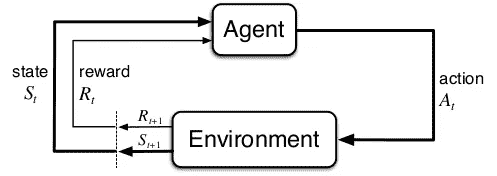
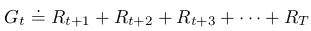
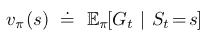
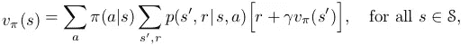

# 强化学习被发现

> 原文：<https://towardsdatascience.com/reinforcement-learning-uncovered-135509cbbc4c?source=collection_archive---------25----------------------->

## 强化学习简介:从主体和环境到状态值和贝尔曼方程

让事情变酷的随机图像！(图片来自 [pixabay](https://pixabay.com/illustrations/artificial-intelligence-brain-think-4469138/) 上的 [geralt](https://pixabay.com/users/geralt-9301/)

# 介绍

强化学习是人工智能中最激动人心和最有前途的研究课题之一。在过去的几年中，它被反复证明是最有效的研究领域之一，能够在许多环境中击败人类。在 [2016 年](https://en.wikipedia.org/wiki/AlphaGo)一名 RL 特工在围棋比赛中击败了 Lee Sedol，而在 [2019 年](https://en.wikipedia.org/wiki/AlphaStar_(software))在星际争霸比赛中进行了大师级的比赛。但是强化学习到底是如何工作的呢？

在本教程中，我们将以最简单的方式讲解强化学习的基础知识，试图在没有复杂公式的情况下**分解和证明**主要概念。我是一名数学家，所以我会死一点点，但希望最后，你已经很好地掌握了什么是强化学习，更重要的是，你想知道更多！

毕竟 RL 没那么复杂。相信我，就像这个世界上的所有事情一样，这只是一个真正掌握基础知识的问题。

# 代理和环境

在最核心的地方，强化学习是基于一个**代理，它与一个** **环境**反复交互。

代理人可以代表一切能够行动的事物:一个扑克玩家，一个股票市场的交易者，我的可怜的，老的，坏的，累的，打扫我房子的机器人吸尘器。相反，对于我们的代理人来说，环境是所有的外部事物:所有的对手玩家、庄家、扑克玩家的牌、所有投资于市场的人以及交易者的市场本身、我的房子和房子里的所有物品。

代理在环境中采取的每一个动作都会导致两件事情发生:

1.  一个**奖励**被提供给代理人，它量化了代理人在特定情况下采取行动所获得的好处。
2.  **环境变化**:我们的行为导致环境从某个特定的情况、条件、环境(我们将使用**状态这个术语**)转移到另一个通常不同的情况。

这就像在电子游戏中:当你(代理人)杀死(扮演)游戏(环境)中的坏龙时，你的技能点增加(获得奖励)，龙不再是你游戏的一部分(游戏状态改变)。

我确信你们中的许多人都熟悉下面的图表，它描述了代理和环境之间的循环。

强化学习循环:在时间 t，主体采取行动，环境返回奖励和新状态。在时间 t+1，循环重复。

在这一点上，一个合理的问题可能是:好的，好的，太好了，伙计！但是**这种媒介与环境的相互作用会持续多久**？嗯，我们有两个选择:

*   代理人和环境之间的互动**永远持续**。这可能是一个温度调节器的例子，每天为房间设定合适的温度(理论上没有预定的结束时间)
*   代理和环境之间的交互**在某个点**结束。这可能是游戏[纸牌](https://en.wikipedia.org/wiki/Patience_(game))的情况，例如，当我们(代理)赢或输时，游戏结束。重要提示:在这种情况下，总会有一个特定的状态代表游戏的结束。这被称为**结束状态，**并且游戏直到结束状态的单次运行被称为**一集**。

由于第二种情况更直观，也更容易解释，我们将重点关注它，但请记住，一切都可以自然地扩展到无止境的框架。

# 退货和政策

现在，作为这个世界上的每个人，我们的代理人对最大化其回报感兴趣(每个人都想变得富有，对吗？).但是我们的经纪人是个聪明人！因此，它的目标不是最大化此时此地获得的回报(我们称之为**即时回报**)，而是最大化他现在和未来与环境的所有互动中获得的回报。我不认识你们，但是如果我能在接下来的 20 天里每天得到 2 美元，我现在不会选择 10 美元！所以，代理人真正想要的是采取行动，从现在开始最大化**及时收到的回报**。事实上，这个数量被称为**回报，因此代理人希望最大化其回报。**下面是我们刚才所说的数学翻译。在下面的等式中， *t* 代表我们现在所处的当前通用时间步长，而 *T* 是我们到达结束状态的时间步长。

在这样做的时候，我们可怜的代理人仍然有一个问题:在许多许多的环境中，它通过采取一些行动所达到的状态或者它得到的回报有很高的不确定性。想想吧。如果我们(代理人)在市场(环境)上买入(行为)一只股票，我们不确定第二天价格会涨(正回报)还是会跌(负回报)。如果我们(经纪人)向那个女生(环境)表白我们的爱(行为)，我们不是完全确定答案对吗？形式化强化学习的人设想了在主体-环境交互过程中出现的三种不确定性:

*   **奖励**。通过应用我们的行动，我们不确定环境会提供一个独特的和确定的回报。
*   **下一个州。**通过应用该动作，我们不确定环境是否会以唯一且确定的下一状态移动。
*   我们可能会以一种不确定的方式在环境中行动。在给定的状态下，我们可能根据某种概率选择向左或向右。

其中，代理只能控制最后一个。虽然奖励和下一个状态确实依赖于环境动态，但是**代理只能决定如何行动**。在每种状态下，它可以通过选择一个动作来确定性地进行游戏，也可以在多个可能的动作中随机选择。我们会说代理有一个**策略**，**，这意味着它有一个在整个游戏中使用的策略**。在一个给定的状态下，策略告诉代理将选择哪个动作，以及它将采取该动作的概率。

另一个随机图像让事情更酷！(图片来自[图片](https://pixabay.com/users/geralt-9301/)上[图片](https://pixabay.com/illustrations/web-network-programming-3706553/)

# 国家的价值

所以，我们意识到我们的代理对它的未来有不确定性！但是它如何处理它们呢？可怜的家伙，它只是想最大化它的回报！嗯，诀窍不仅仅是考虑一个与特定的行动、奖励和下一个状态序列相关的可能回报，而是考虑与所有可能发生的行动、奖励和下一个状态的特定序列相关的所有可能回报。代理人需要考虑从所有可能达到的未来可能收到的所有回报，并根据其发生的概率对其进行平均。

从当前状态开始，我们可以暂时把它想象成一棵树的根，代理模拟**一个可能的动态演变**(即动作序列、奖励和下一个状态)直到一集结束。当到达树的末端并遍历树时，代理将其从一个状态到另一个状态获得的奖励乘以该动态发生的概率(即，选择该动作、获得该奖励并在该状态结束的概率)。一旦到达结束状态，代理通过考虑不同的可能演化创建另一个分支，并重复该过程。这是一次又一次的重复，直到**所有可能从我们的状态导出的分支都被认为是**。最后一步，对所有这些量求和以计算**加权平均值，该平均值定义了****状态的值，因为它表达了根据所有可能的未来回报和相关不确定性，代理在该状态下有多好。**

**注意重要的一点。我们在上面说过，在三种类型的不确定性中，代理人**只能控制其行为方式**(即其政策)，而下一个状态和回报确实取决于环境动态。因此，当我们评估状态的价值时，我们可以**确定某个策略**并计算所有可能的下一个状态和奖励的价值。换句话说，**我们可以使状态值依赖于策略，这样改变策略就改变了状态值。**对于住在你里面的数学家来说，这写为:**

****

**它大致是这样的:当我们玩策略 pi 时，状态 s 的值等于我们从考虑所有可能发生的未来开始玩策略 pi 得到的所有收益的加权平均值。**

**现在，让我们通过一个例子来关注这些概念。假设你正处于决定是否向那个女孩(或男孩)表白你隐藏的、巨大的、疯狂的爱情的境地。你有两个选择(行动):你申报，你不申报。如果你说有 0.5%的可能性，她会同意。如果她说是，你会很开心，所以这会给你+100 的回报。但如果她说不，你会难过，对自己多一点不自信，对人类和人际关系多一点不信任:我们可以用一个满分 60 来量化所有这些奇怪但充满激情的情感旋风。另一方面，如果你选择了另一个选项，并且没有向那个女孩表白，你生活在一个永恒的假设场景中，但是避免了自己遭受痛苦的风险，所以以 1.0 的概率你得到了(比如说)-10 的回报。那么，这种状态的价值是什么？嗯，我们还需要明确政策。的确，**保单的数量是无限的**，因为不仅你(代理人)可以选择申报或不申报，你也可以根据某种概率申报或不申报。为了简单起见，让我们比较来自两个确定性策略的两个最简单的情况:**

*   **你坚定地选择声明。在这种情况下，出现+100 的可能性为 0.5，出现-60 的可能性为 0.5。通过展开树的分支，我们得到 100*0，5 = 50 和 0，5 *(60)=-30。如果我们加起来，我们得到 50-30 = 20。此外，我们需要考虑另一个分支。但是由于另一个分支出现的概率为零(因为我们的策略不允许选择它)，所以它的返回值为 0(应该是 0 *(10))。因此，再次求和，我们得到状态值，在这种情况下是 1 * 20+0 *(10)= 20。没那么糟！**
*   **玩家坚决选择不声明。在这种情况下，推理是相似的，我们有一个确定性的返回 0 * 20+1.0 *(10)=-10**

**就是这样！但是 20 比-10 大，所以这里有一个数学上的解释，为什么你应该永远追求它！**

# **贝尔曼方程**

**贝尔曼方程是本教程的最后一步。简单地说，它代表了**一种表达状态价值的方式，而不需要每次都执行**从考虑所有可能的未来中得出的所有计算。在许多设置中，实际上应用我们上面描述的加权平均过程实际上是不可能的:**有太多的状态和太多可能的情节发展**。以国际象棋为例，状态数大约是 10 * 120(10 乘以 120 乘以 0)。可以想象，计算每个州的可能回报确实需要很长时间！贝尔曼方程来拯救:即使它不能完全解决问题，它提供了一种简化和加速计算的方法。**

**贝尔曼方程的核心点是，它**仅仅根据可以从它到达的下一个状态的值来表达一个状态的值，**并且以这种方式忽略所有剩余的未来相关性。换句话说，如果我们知道下一个状态的确切值(实际上也知道直接的环境动态)，我们就可以准确地计算出我们现在所处状态的值。从它的表情可以看出这一点至关重要:**

****

**你可以注意到，当我们玩策略 pi 时，状态 s 的值取决于即时的环境动态(即我们在 s 中采取的行动，获得下一个状态的概率和获得的奖励)和下一个状态值。**

**此外，贝尔曼方程提出了一种计算状态值的有趣方法。我们说过，我们现在可以计算**状态的值，仅仅是根据可以到达的下一个状态的值。但是这个推理也适用于每一个下一个状态:所以如果我们知道下一个下一个状态的精确值，我们就可以精确地导出下一个状态的值。推理一个状态接一个状态地重复，直到结束一个状态:如果我们知道结束状态的确切值，我们可以计算紧接在那之前的状态的值，并且知道我们可以回到第一个状态。****

**最后，重要的是要注意到，即使它加快了计算速度，贝尔曼方程也不能具体应用于真正大型的国家博弈。尽管如此，我们必须至少扫描一次所有可能的状态，**，这在许多环境中是禁止的**。**

# **结论**

**就是这样。恭喜你成功地走了这么远！希望你喜欢这篇关于强化学习的介绍，就像我在写它的时候一样！到目前为止，您应该对强化学习的基本概念有了相当的了解，并且能够进入下一个级别(..还是插曲！).有问题请随时评论！**

**回头见，保持黄金！:)**