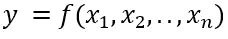
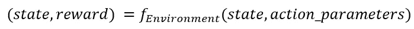
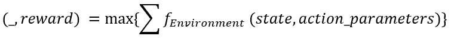
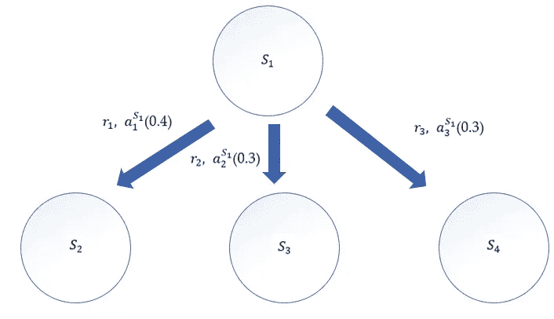

# 强化学习 vs 贝叶斯优化:何时使用什么

> 原文：<https://towardsdatascience.com/reinforcement-learning-vs-bayesian-optimization-when-to-use-what-be32fd6e83da?source=collection_archive---------4----------------------->

## 强化学习，贝叶斯优化，最优化，机器学习

## RL 与贝叶斯优化方法的比较研究

在 [Unsplash](https://unsplash.com?utm_source=medium&utm_medium=referral) 上拍摄的 [ThisisEngineering RAEng](https://unsplash.com/@thisisengineering?utm_source=medium&utm_medium=referral)

***来自《走向数据科学》编辑的提示:*** *虽然我们允许独立作者根据我们的* [*规则和指导方针*](/questions-96667b06af5) *发表文章，但我们并不认可每个作者的贡献。你不应该在没有寻求专业建议的情况下依赖一个作者的作品。详见我们的* [*读者术语*](/readers-terms-b5d780a700a4) *。*

优化是大多数机器学习问题的关键。在某个地方，从某种意义上说，我们总是需要优化一个表达式。这可能是一个更大问题的一小部分。但是，优化将会存在。在一般的数学意义上，我们所说的最优化是指找到一个函数的最小值或最大值(如果存在的话)。函数的性质可能有很多种。在本文中，我们将讨论两种优化方法的区别:强化学习&贝叶斯方法。我们不会深入讨论实现的细节，我们的讨论将集中在适用性上&可以应用两种方法的用例类型。

## 贝叶斯优化——一种无状态方法

考虑如下任意随机函数:

看起来很简单，对吧？现在，如果你被要求找出 f 的最大(或最小)值，那么你可以简单求导并解方程。这是一种传统技术。但是，如果你不知道它的本体或代数形式，也就是说，f 是黑盒，那该怎么办？还有，解决办法是有的。您将启动一组随机参数组合(x1，x2，..，xn)并调用 f 得到不同的 y 值，得到其中的最大值(或最小值)。如果 f 容易调用的话是可行的。但是，如果它是黑匣子并且打电话的成本很高，该怎么办呢？每次调用都会给整个流程带来成本。像上面那样的随机搜索在那里是不可行的。我们必须进行某种智能搜索来检查调用的数量，但我们仍然应该能够找到最大值(或最小值)。贝叶斯方法可以做到。里面的术语很少。

**代理模型**

贝叶斯方法围绕原始函数迭代地建立代理模型。代理模型不过是一个高斯回归处理器。它用于获得给定的一组 x 值的近似输出(y 值),就像调用了原始函数一样，尽管它并没有被调用。该模型用于搜索参数空间并获得 x 的值，其中 y 是最大的(或最小的)。

**采集功能**

这是一个度量标准，有助于选择最有可能给出更好的 y 值的下一个 x 值。当然，整个过程本质上是迭代的。*采集函数*在 x 值的随机数组上进行评估，给出该度量最大值的函数被选为下一个 x 值。在计算该度量时，替代模型被用于 x 值的随机搜索。它不需要调用实际的 f 函数。

你可能会问，“我们对下一个 x 值或 y 值的理解是什么？”实际上，贝叶斯是一种完全迭代的方法。它使用“先验/后验”组合的贝叶斯概念。从每次迭代中，从*采集函数* &中获得最佳 x 值，从实际 f 函数(后验)中获得相应 y 值。并且它们被添加到“代理”模型(如先前的),导致模型“更新”。因此，当前迭代的*后验*被添加到下一次迭代的*先验*列表中。

最后，我们从先前的列表中获取最大(或最小)值，并将其作为最优值(最大或最小)返回。

> 现在，问题是为什么我们称之为“无状态”方法？请注意，函数 f 的每次单独调用都是相互独立的。它不依赖于先前调用的一些状态值。当然，它是先验/后验相关的，但它们不是函数的“状态”。它们只是输入/输出值。

**寻找复杂深度神经网络的超参数**

考虑具有超参数阵列的非常深的神经网络。它可以是每个不同隐藏层的大小、隐藏层的数量、删除层的数量等。当然，训练这样一个复杂的模型需要大量的时间和资源。我们如何从模型中找出能够给出最佳(最大)准确度(分类或回归)的最佳超参数集？我们可以将其视为一个假设的高成本黑盒函数，它接受一系列超参数并返回准确性(分类的百分比准确性或回归的 R2 度量)。该功能涉及用交叉验证集训练模型。我们不能在这里使用随机搜索，因为它将招致大量的时间和资源。贝叶斯优化就是答案。

## 强化学习——一种有状态的方法

在强化学习(RL)中定义函数本身有点棘手。人们经常对 RL 实际上做什么感到困惑。它除了优化什么也不做。它不直接进行任何类型的分类、回归或聚类，而这些都是典型的 ML 方法。当然，你可以在里面使用 RL，反之亦然。RL 中有两个关键术语:*环境* & *智能体*。

**环境**

它是存在的虚拟或物理黑盒系统，通过代理执行一些 I/O 操作。代理不知道环境的内部情况。它只是向环境发送信息，并作为回报获得一些输出作为奖励。

**功能感知**

环境保持其状态，并且在环境中存在状态转换。它接受一些动作并返回奖励作为输出。所以，它可以被认为是一个假设的函数。考虑自动驾驶汽车的使用案例。驱动程序是一个与汽车及其摄像头交互的代理。汽车和摄像机充当环境。当然，汽车有状态。状态可能是其速度和方向的组合，并且这些会不断改变导致的状态转换。代理(驱动程序应用程序)采取“行动”并将这些行动发送给汽车，作为回报，汽车获得一些“奖励”(在这种情况下，奖励可以是汽车前面的物体图像，可以进一步分析)。因此，目的是找出汽车平稳行驶的最佳方向。

我们可以将“环境”表达为一个假设的目标函数 f:

注意，状态总是与函数交换。例如，汽车的当前状态将明显影响其未来状态和奖励。

> 与贝叶斯方法不同，在 RL 中，由于状态的交换，函数调用相互依赖，因此使其成为“有状态的”。

现在，问题是我们是否像贝叶斯理论一样最大化“环境”？不完全是。这里采用累积的方法。序列的 fRL 的总和实际上是最大的。如下图所示:

所以，总回报实际上是最大化的。理由可以解释。

> 与贝叶斯方法不同，RL 是一个连续的而不是一次性的过程
> 
> RL 用于来自系统的值流的情况，并且在任何给定的情况下，值的最大累积和是期望的输出。

现在让我们看看 RL 中环境的状态转换是怎样的:

有四个州:S1、S2、S3 和 S4。假设以 0.4 的概率采取行动 a1，回报为 r1，环境从 S1 状态变为 S2 状态。类似的逻辑也适用于 S3 和 S4。从 S2、S3 或 S4 可以有其他状态转换。从前面的讨论中，我们可以说 r1 将试图找到(r1 + … + rn)的最大值，即在一个完整的状态转换周期后的总回报(例如:S1->S2->S5->..->Sn)

**股票交易用例**

考虑一段时间内股票交易的情况。股票是按顺序买卖的，在期末，我们的目标是利润最大化。这里可以应用 RL。我们把股市看作黑箱，每个阶段的“*环境*”和“*利润*，可以认为是“*回报*”。“状态”可以是投资者的位置(根据金融术语，*长*或*短*)，而“动作”可以是代理(投资者)的当前投资。RL 可以帮助我们决定投资组合的投资策略。它不仅可以获得最大利润，而且每个阶段的状态序列&最优行动将我们引向正确的方向。

> 由于环境是黑箱，我们无法使用传统的数值或分析优化方法(如寻找导数)。RL 为我们提供了一些特殊的技术来实现这一点。

**代理人**

代理是与“环境”互动并不断获取回报的程序。它还在每个阶段采取行动。动作作为消息发送到触发状态转换的“环境”。我们可以说代理是驱动程序。您已经看到了上面的状态转换图，其中提到了许多操作。请注意，环境本身不能采取行动，它只接收命令形式的行动。动作完全由代理控制。

**模拟环境**

像贝叶斯方法中的“代理”一样，我们经常需要对环境建模，即环境功能。实际上，在真实场景中，状态和动作的组合可以产生“计算和组合”爆炸。也许不可能遍历每个状态-行为组合并找出最大值。这就是为什么，可能需要一个模型作为环境的代理。在训练 RL 模型时，这个代理模型必须用来自真实“环境”的输出来训练。这个代理可以在任何阶段针对给定的环境状态给出最优的行动或回报。在生产设置时，这非常方便。你不必经历每一个&每一个状态-动作组合，这会导致执行非常慢。*深度 Q 学习、交叉熵、策略梯度*是一些常见的环境建模技术。

## RL 和贝叶斯方法的比较研究

从上面的讨论中，我们可以在高层次上找出 RL 和贝叶斯方法在应用领域的差异。

> 贝叶斯是一个一次性优化程序，其中函数的成本是非常重要的标准。

您可以通过一次调用带有最佳参数的函数来获得最佳值。

*函数本质上是无状态的，不依赖于调用历史或任何状态值。*

在深度神经网络示例中，DNN 模型不依赖于具有不同超参数集的先前构建的模型。每个模型都是相互独立的。记住*成本*是贝叶斯方法中最重要的标准，当你总是处理重复使用的非常昂贵的东西时，你应该考虑贝叶斯。

贝叶斯方法非常常用于任何机器学习或深度学习模型的各种超参数搜索。

> RL 是一个循序渐进的优化过程。环境成本一般不会发挥那么大的价值。

一般来说，你不会通过单个交互(单个函数调用)从环境中获得最优值。相反，你需要打一系列的电话，然后把这些值加起来。最重要的是，叫声相互交换状态，并决定下一个奖励。

*函数调用，即与环境的交互相互依赖*

在股票交易的例子中，当前头寸(多头或空头)可能会影响你在下一个窗口投资的决定。“位置”就是这里的环境状态。

> 在这两种情况下，功能或环境对你来说都是黑箱。从分析上来说，你不能优化它。但是，你需要分析，你试图解决什么样的优化问题:它是无状态的还是有状态的？然后决定方法。

## 在 RL 中使用贝叶斯方法

是的，那也是可能的。如果在任何 RL 算法或模型中，需要一些一次性优化，那么我们可以使用贝叶斯方法。考虑 RL 的深度 Q 学习方法。在那里，一个深度神经网络被训练来模拟状态与 q 值的映射。该网络可能具有许多超参数，并且可以通过前面讨论的贝叶斯方法明确地找到最佳组合。