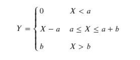
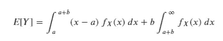
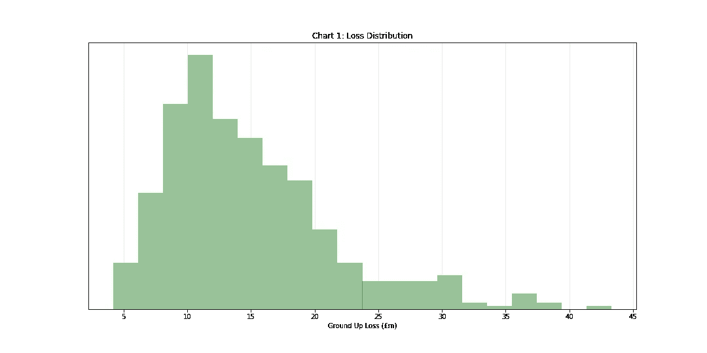
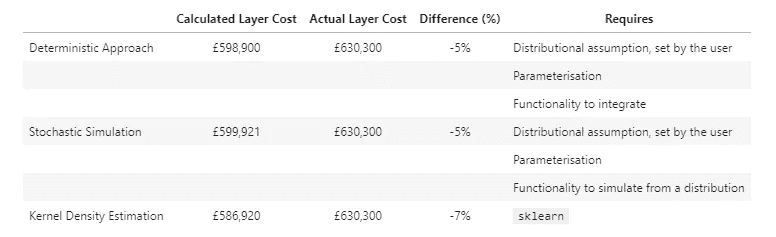

# 再保险定价，数据科学方法

> 原文：<https://towardsdatascience.com/reinsurance-pricing-the-data-science-way-a1b35d3ea715?source=collection_archive---------13----------------------->

## 超额损失再保险定价的介绍以及确定性、随机和核密度估计方法的比较。

[斯科特·格雷厄姆](https://unsplash.com/@homajob?utm_source=medium&utm_medium=referral)在 [Unsplash](https://unsplash.com?utm_source=medium&utm_medium=referral) 上拍照

“保险公司的保险”，再保险是一个有趣和富有挑战性的工作领域。多种多样的合同类型和有限的数据历史使得再保险合约的定价在大多数情况下具有挑战性。

随着时间的推移，这些复杂的保险工具出现了不同的定价方法。

我将简要介绍和比较我见过的用于超额损失再保险合同定价的两种方法(确定性解决方案和随机模拟)，然后探讨一种不同的方法(核密度估计)。

# 超额损失分保

超额损失再保险是一种*非比例*再保险，旨在限制或限制保险公司的“每次风险”或“每次事件”损失。

通常这些合同的报价是提供超出超额部分的最大赔偿额。它们通常作为相邻的“层”提供，并被称为*层尺寸超出(xs)连接点*。

例如，超额损失合同 *1m xs 2m* 为超过 2m 的损失**部分提供了高达** 1m 的**赔偿:**

*   如果发生 250 万英镑的损失，该合同将提供 50 万英镑的保险
*   如果发生 400 万英镑的损失，该合约将提供 100 万英镑的保险
*   如果发生 50 万英镑的损失，该合同将不提供保险

让我们来看看计算再保险层价格背后的一些理论，这将方便地渗透到确定层技术价格的方法中。

# 确定性方法

我们感兴趣的是计算一层非比例再保险的期望损失成本。现在，让我们假设保险提供超过 a 的 b 的赔偿——也就是说，再保险人覆盖属于区间[ a，(a+b)]的索赔部分。

如果带有概率密度函数 *f* 的随机变量 *X* 代表“地面”保险损失，我们可以将再保险合同的损失 *Y* 定义为:

那么该层的预期损失可以写成:

*E[Y]* 代表再保险层的*技术价格*，即保本收取的保费。再保险人通常会将资本成本、管理费用和利润加载费用添加到技术价格中，以得出*办公室溢价*或*市场价*，但我们现在将忽略这些计算。

求解*E[Y]*——可能是数值求解——是确定超额损失保险定价的方法，因为*总是*产生相同的结果。虽然这在理论上是一种干净且令人愉快的方法，但是这种方法也有一些缺点:

*   它依赖于对基础索赔分布形式的准确假设 *X*
*   它要求用户精确地导出这个分布的参数

还有一个隐含的假设，即用户将能够执行复杂的集成。

Python 用户可以访问使数值积分相当简单的功能；只能访问电子表格的从业者可能会发现随机模拟照亮了他们的一天。

# 随机模拟

解决这个问题的随机方法非常简单，可以简单地概括如下:

1.  从假设的(适当的)参数化索赔分布中随机抽取一个样本 *X*
2.  应用再保险层结构来确定层损失并存储结果。
3.  重复很多很多次——比如说 10 万次。
4.  将模拟层损失成本的平均值作为该层的技术价格，即 *E[Y] =* 平均模拟结果。

虽然简单，但这个过程非常强大:

*   模拟的结果是结果的*分布*而不是单点估计，通过足够的模拟，结果收敛到封闭形式的解。
*   因此，计算均值、方差、峰度和偏斜度等统计数据非常简单。通过确定性方法来实现这一点可能有点棘手。
*   结果的分布允许我们很容易地得出置信区间和百分位数——这对理解和交流结果很有用。同样，当沿着确定性路线前进时，这可能会有点棘手。

不幸的是，这种方法还要求用户正确地指定和参数化基本权利要求分布；虽然对复杂的集成没有要求，但是用户需要能够从一个发行版中提取样本(多次)。

显然，非参数方法是可取的——如果它能匹配确定性方法和随机方法的性能！

# 核密度估计

核密度估计(KDE)是一种估计随机变量概率密度函数的非参数方法，通常用于根据数据样本进行总体推断的情况。

KDE 方法与随机模拟方法非常相似，除了我们使用 KDE 来估计基础索赔分布并从中抽取样本。

这听起来很简单，但它非常强大，因为它消除了用户在试图指定 *X* 的分布(和参数)形式时引入的错误。

# 我们走吧！

让我们指定一个工作流程来比较不同的方法:

1.  生成历史基础索赔数据，即 *X* 的实现。在这种情况下，我们将使用对数正态分布的样本。
2.  设置超额损失再保险合同详细信息。
3.  参数化我们观察到的对数正态分布；参数将从(1)中生成的数据中导出。
4.  计算确定层价格。
5.  计算模拟层价格。
6.  计算(KDE)模拟蛋鸡价格。
7.  比较结果和谈论商店。

## 在我们继续之前，先说一下对数正态分布…

对数正态分布是随机变量的连续概率分布，其*对数*呈正态分布。

因此，如果 *Y* 是对数正态分布，则𝑙𝑛(𝑌)是正态分布，即𝑙𝑛(𝑌)∞𝑁(𝜇,𝜎)。

该分布支持大于 0 的正值，并且是长尾的，非常适合于对可能属于我们再保险层的低频率、高严重性事件进行建模。

在本例中，我们将假设底层索赔分布 *X* 是对数正态分布。

# 1.生成数据

在 m 中，让我们从平均值为 15 的对数正态分布中抽取 500 个观察值。

[https://gist . github . com/Brad-Stephen-shaw/e73d D7 e 915 a 47 Fe 002 b 8101 a 096420 CB](https://gist.github.com/brad-stephen-shaw/e73dd7e915a47fe002b8101a096420cb)

作者图片

上图显示了从“真实”的索赔分布中随机抽取的 500 个观察值的直方图。正如预期的那样，所有的观察值都是非零的，并且分布向右倾斜。

# 2.设置再保险合同详细信息

让我们来给一份 500 万×200 万的合约定价，即 *a = 20* 和 *b = 5* 。简单。

# 3.将观察到的对数正态分布参数化

使用生成的数据，通过矩法将观察到的对数正态分布参数化。

作者图片

图表 2 显示了真实的底层索赔分布(蓝色)和根据观察结果参数化的分布(橙色)之间的差异和信息损失。我们稍后会更详细地讨论这一点。

# 4.确定层价格

让我们继续建设:

1.  一个 Python 函数，用于对两个边界之间的给定函数进行数值积分。
2.  描述参数化地面损失分布和再保险层内地面索赔的预期损失的 Python 函数。

确定层成本:598，900。

# 5.随机层价格

在`numpy`的帮助下，执行随机模拟并得出该层的技术价格非常简单:

随机层成本:599，921。

*读者将会注意到最终的层价格非常相似，并应记住随机模拟的结果应在足够重复的情况下收敛到闭合解。*

# 6.KDE 蛋鸡价格

这一次我们将依靠`sklearn`来执行 KDE，但是从 KDE 对象中提取样本并计算图层成本也非常简单。

KDE 模拟层造价:586920 英镑。

KDE 层成本与确定性的普通随机模拟相差不远——有意思！

# 7.比较结果和谈论话题

在我们比较结果之前，让我们计算一下“真实的”层成本。

真层成本:630，300。

让我们**总结并讨论……**

作者图片

我注意到一些事情:

1.  所有的方法都低估了该层的价格，尽管 KDE 的方法似乎是罪魁祸首。
2.  KDE 的结果并不比确定性模拟或普通模拟差多少。
3.  确定性方法和一般随机方法都要求用户指定底层的索赔分布。这可以被认为是为流程提供了额外的“信息”，因此我们应该期待更好的性能。

由于 KDE 是非参数的，本质上是“盲的”，我认为它的性能是令人钦佩的，精度的轻微损失是为该方法提供的增加的自由度所付出的可接受的代价。

**清谈俱乐部**

*   在现实中，观察到的数据将来自保险公司本身。可用的数据量取决于保险公司的地域、规模、索赔历史和业务范围。更有可能的是，数据将会很少，并且有 500 个观测数据可供使用将是一种罕见的奢侈。
*   在参数化分布或拟合 KDE 之前，应适当清理历史数据，根据趋势和通货膨胀进行调整，以及删除一次性事件并为中断的核保实践留出余地。与以往一样，在分析中包含大约是调整前附着点大小一半的声明也是一种很好的做法。
*   `sklearn`中的 KDE 功能包含一个**带宽**参数，该参数控制数据的拟合。增大参数值会提高 KDE 对象的概化能力，而减小参数值会提高 KDE 对观测数据的拟合。
*   在拟合 KDE 之前，将“相似的”历史数据汇集在一起，然后应用再保险合同细节，可以为分层价格提供不同的视角。举个例子:
*   来自多个保险公司的大量英国机动保险索赔可以集中在一起(在适当调整后),并使用 KDE 计算再保险层价格。
*   KDE 方法可用于英国汽车保险公司 X 的历史索赔，以得出分层价格。
*   保险公司 X 的价格可以与“市场”价格进行比较，并在计算市场价时进行相关调整。
*   在这种情况下，KDE 方法可能更可取，因为可能很难参数化“组合”分布。

免责声明:本笔记本中包含的所有统计数据和工作方式纯属假设，与实际事件毫无关系。