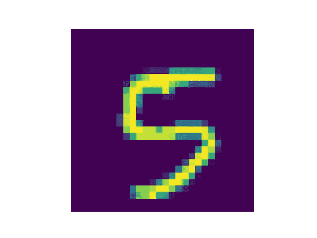
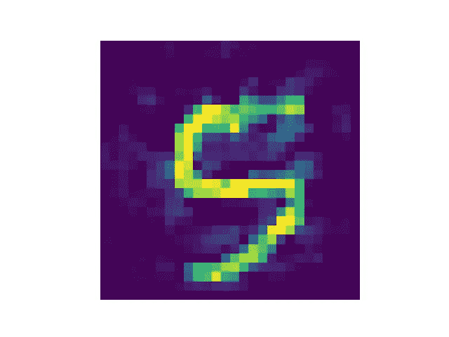

# 重塑对抗性机器学习:对抗性 ML 从零开始

> 原文：<https://towardsdatascience.com/reinventing-adversarial-machine-learning-adversarial-ml-from-scratch-c5330595ade0?source=collection_archive---------32----------------------->

## 理解神经网络的局限性和脆弱性

纳丁·沙巴纳在 [Unsplash](https://unsplash.com?utm_source=medium&utm_medium=referral) 上拍摄的照片

当我必须从头开始描述一件事情时，我学得最好！在“重新发明”的文章中，我将尝试描述为自己实现一项技术所必需的数学直觉！在本文中，我们将探索~对抗性机器学习的激动人心的世界~

首先，让我们为对抗性 ML 下一个工作定义:

> 对抗性 ML 涉及生成或防御旨在欺骗 ML 模型的输入的方法。

对我来说，对抗性 ML 对现代 ML 解决方案提出了最重要的理论挑战。它允许我们询问我们的网络所了解的决策界限，并迫使我们正面解决我们的模型的局限性。让我们开始吧！

# 一个痛苦的比喻…

忍耐一下！我觉得这可能是个还算过得去的动力吧！我想解释一下为什么我觉得对抗性 ML 这么有意思。为了说明背景，让我们从一个可笑的派对问题开始:**馅饼是馄饨吗？**

## …隐喻性的问题

让我们来解释为什么这个问题会成为朋友间有趣的争论。从根本上说，它探索了我们对饺子定义的边缘。问题是" Boyardee 主厨是馄饨吗？"让玩笑变得不那么有趣，因为我们都同意(除了偶尔的美食势利者)。Boyardee 主厨是“典型的”馄饨。它与我们头脑中典型的柏拉图式馄饨有着几乎所有的共同特征:它是一种方形的、带馅料的酱意大利面。另一方面，现在果酱馅饼…

## …隐喻的答案

人们可以用两种方式中的一种来回答。如果它是一种馄饨，那么馄饨是一种被描述为在一层薄薄的面团中填充的食品。如果不是，那么饺子更确切地说是意大利面食。

无论哪种情况，分歧都很有趣。它迫使我们解释什么样的特征是必要的和充分的，才能被归入馄饨的范畴。尽管 Boyardee 主厨是我们馄饨“决策界限”的中心，但果馅饼却在边缘。这场辩论很有趣，因为分歧揭示了人们不同的决策界限。

## …不那么隐喻的答案

谢谢你对我的包容！我认为对抗性 ML 是一种系统的、有理论动机的方式，用来问神经网络这类“决策边界”问题。从一个神经网络和我 100%同意的输入样本开始(例如，“这绝对是 MNIST 数 4！”)，我可以问我的神经网络在它声称样本不再来自该类之前需要进行什么编辑(即，“如果这 20 个像素是白色而不是黑色，我会将这个数字 4 称为数字 2”)。

类似于我们的馄饨问题，找到正好在边缘的样本——在类之间的边界——有助于突出我的模型和我可能不同意的地方。对我来说，这就是机器学习“可解释性”和“信任 AI”的症结所在。问题“你认为饺子是什么？”有时最好的回答是将问题重新定位为“在你称它为别的东西之前，我需要对这个饺子做什么改变？”如果我的模型和我不同意哪个输入落在边界的两边，我就不信任它！

在这里，我将通过最简单的过程在模型的决策边界附近生成“对立的例子”。在这个过程中，我们将建立一些关于对抗性机器学习的直觉。我们来看一些代码！

# 基本的 MNIST 建筑

为了解释对抗性的机器学习方法，我们需要一个目标模型来攻击。

## 资料组

我想证明，即使对于琐碎的分类问题，对抗性机器学习也是可能的:分类挑战在 ML 文献中一直被认为是“已解决”的。我还希望能够轻松地可视化我们生成的一些对立样本，这在图像数据上是最容易的。理想情况下，我也会避免自己寻找数据来源的问题；我不想要大量只处理数据加载的代码工件。

考虑到这些标准，我们将使用 [MNIST 数字数据集](https://en.wikipedia.org/wiki/MNIST_database) [1]！

## 体系结构

同样，我希望保持架构简单，这样我们就可以专注于对抗性 ML 的本质。

MNIST 模型训练的简单 Keras 实现。

最终的架构很简单(而且*非常*线性，注意没有激活)。我们有一个单一的[卷积层](https://keras.io/api/layers/convolution_layers/convolution2d/)，后面是[最大池](https://keras.io/api/layers/pooling_layers/max_pooling2d/)。最后，我们展平到一个有 10 个单元的[密集层](https://keras.io/api/layers/core_layers/dense/)，每个单元对应一个输出类。

CNN 架构示例。

该网络只有大约 10k 个参数，即使没有任何 GPU 资源，也能快速适应。

## 结果

对我来说，早停是在纪元 3 之后触发的。此时，验证准确度约为 98%。对于这个演示来说已经足够好了！

# 基本的对抗性攻击

为了建立关于对抗性机器学习如何工作的直觉，我们将为自己实现一个基本的“白盒”攻击，并可视化一些结果！

## “白盒”攻击定义

在本次讨论中，我们将重点关注“白盒”对抗性 ML:

> “白盒”攻击者被认为完全了解被攻击的模型:架构(例如，它是什么类型的模型？)，参数(即权重和偏差项是什么？)，以及给定输入的预测值(即，模型对该输入的预测是什么？).

如果人们对非“白盒”攻击感兴趣，请在评论中告诉我！

## 遵循直觉的梯度

在神经网络训练期间，我们通常会参与一个“[梯度下降](https://en.wikipedia.org/wiki/Gradient_descent)的过程在每一步，我们都在估计应该如何改变参数，以最小化“损失”(即误差)。“梯度”告诉我们增加或减少重量将如何影响我们的损失，我们在这个损失面上“下降”以提高我们的表现。我们认为输入数据是固定的，输出标签是固定的，权重是可变的。我们更新我们的权重，以减少每一步的误差。

为了生成一个对抗性的样本，我们将只是翻转这个逻辑！我们现在正在寻找与真实数据相似但最终被我们的模型错误分类的输入样本。我们假设我们已经有了一个经过充分训练的、高性能的模型，所以我们的权重现在是固定的。我们继续将我们的输出标签视为固定的。但是现在，我们将输入数据视为可变的。我们不是将损失最小化，而是将损失最大化(即“上升”损失面)。我们的梯度现在将告诉我们如何增加或减少我们的像素值将影响我们的损失，我们将在损失表面“上升”。

> 在训练期间，我们计算我们的**损失相对于我们的权重**的导数，并使用**梯度下降**来更新我们的权重到**最小化**我们的损失。
> 在攻击期间，我们计算我们的**损失相对于我们的输入像素**的导数，并使用**梯度上升**来更新我们的权重，以**最大化**我们的损失。

## 简单的“白盒”攻击实现

首先，我们需要一些快速的 Keras 逻辑来获得模型输出相对于输入像素的梯度。我们将“瞄准”一些期望的输出类别，而不是不加选择地最大化损失。例如，如果我们希望一个 4 被误分类为 2，我们将使用 2 的 *target_class* 。

计算特定目标类的梯度。

逻辑没那么差！我们只需要调用一次 *batch_jacobian* 来获得我们的梯度值！然后，我们只获取与我们想要的*目标类*相对应的值。

接下来，我们将想要更新我们的图像来增加损失，增加模型对*目标 _ 类*的信心。

基于梯度值更新输入图像以增加损失。

同样，逻辑也没那么糟糕！我们所做就是使用梯度矩阵，稍微调整它以使更新大小更加一致，将它添加到图像中，并剪切以避免像素值超出[0，1]范围。

如果我们考虑输出类的梯度值在每一步告诉我们什么，这是有意义的。梯度矩阵的正值告诉我们，使该位置的像素更亮(即，更接近 1)将导致目标类别中的更高置信度。类似地，梯度矩阵的负值告诉我们，使该位置处的像素更暗(即，更接近 0)将导致目标类中更高的置信度。

通过将重新调整的梯度值添加到我们的图像中，我们逐渐制作出一个具有更高可信度的分类为目标类的图像！

**可视化样品**

让我们随机抽取一个样本，使用我们开发的逻辑来创建一个视觉上相似的图像，这个图像被我们的网络错误地分类了。

从 MNIST 测试数据中选择一个随机元素。

图片作者。目前预测:5；信心:1.00。

现在我们有了一个图像样本，我们可以看到图像最初是如何被我们的模型分类的。

正如预期的那样，我们的模型以非常高的置信度正确地对样本进行了分类。现在，让我们以这张图片为起点，生成一个对立的样本…

更新输入样本，直到错误分类为 4。

很简单。我们只是在循环中重复执行之前定义的 *gradient_ascend* 步骤，直到分类行为发生变化。一旦我们欺骗了我们的模型，我们就终止。

图片作者。目前预测:4；信心:0.32。

哇！我们现在有一个几乎相同的图像，但我们的模型将其归类为其他东西。我们简单的白盒攻击成功了！

有趣的是，这个样本仍然*清晰*人类可识别。事实上，图像修改似乎是对像素内容的随机更新。我们在模型定义的 a 4 和 a 5 之间找到了一个样本。

将这一点与我们最初的比喻联系起来，该模型告诉了我它认为 4s 和 5s 之间的“边界”在哪里。显然，我们不同意…

# 离别的思绪

这多酷啊？！我们可以快速生成我们的模型误分类的视觉上相似的样本。如果我们查看测试数据的持续准确性(约 98%)，我们会确信该模型的表现符合预期。然而，在更仔细的检查下，很明显这个模型已经学习了与我们不一致的决策边界:在我看来那些不像四！

对抗性 ML 的分支对模型信任、可解释性和可解释性提出了有趣而重要的挑战。我希望你从这篇文章中带着对这个领域的类似的欣赏离开！

如果您有任何更正或想要建议更多的澄清，请留下您的评论。感谢阅读！

1.  MNIST 手写数字数据库。 [http://yann。](http://yann.)乐村。com/exdb/mnist/。1998 年 7 月
    知识共享署名-相同方式共享 3.0 许可证。