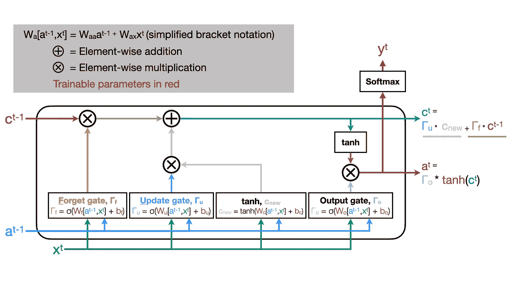
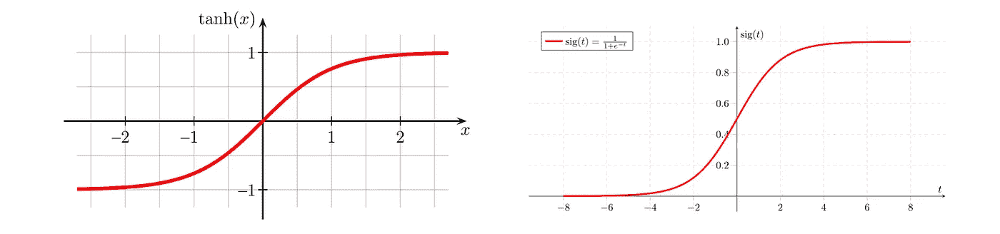
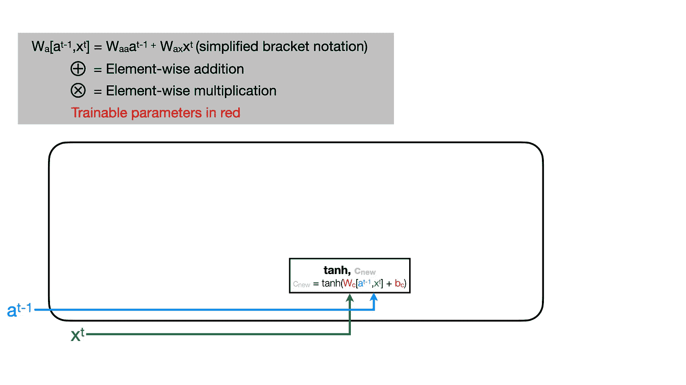
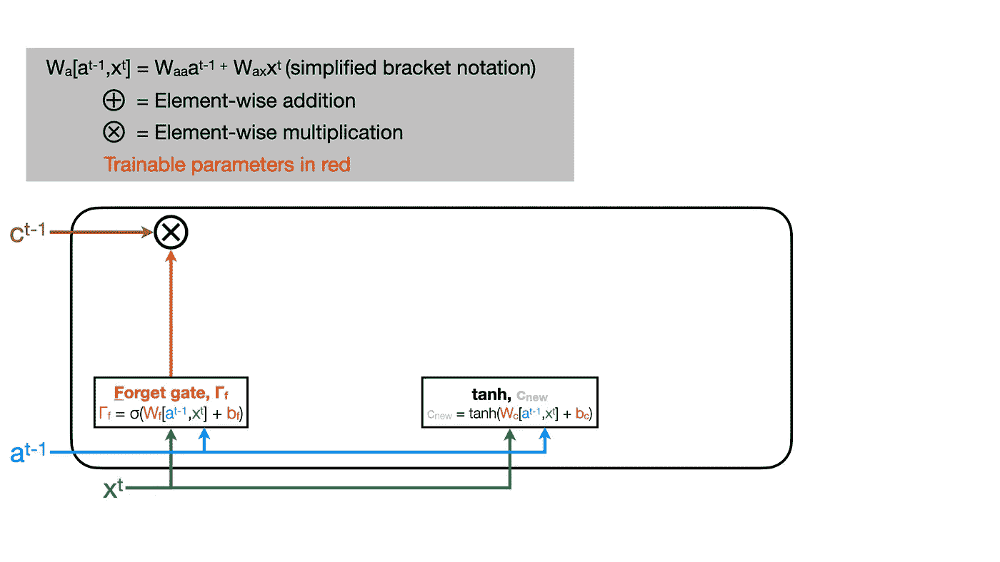
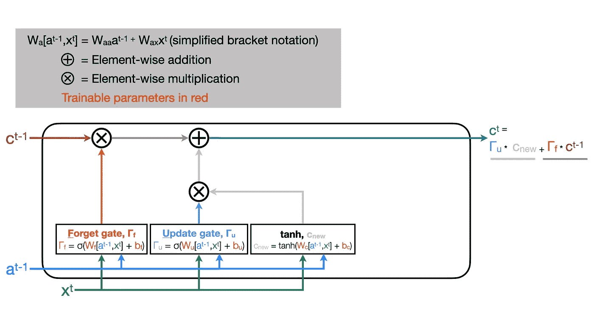
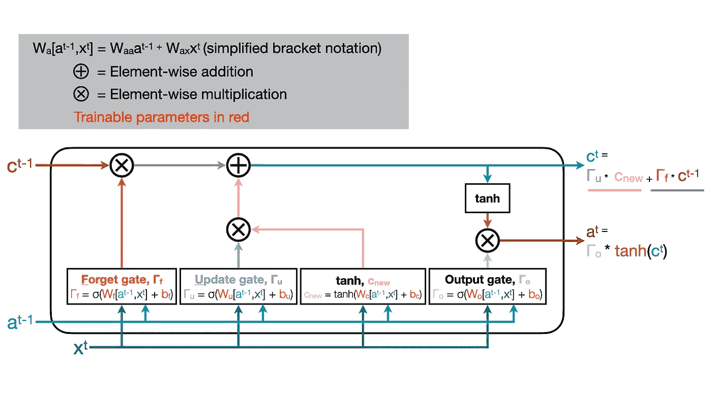
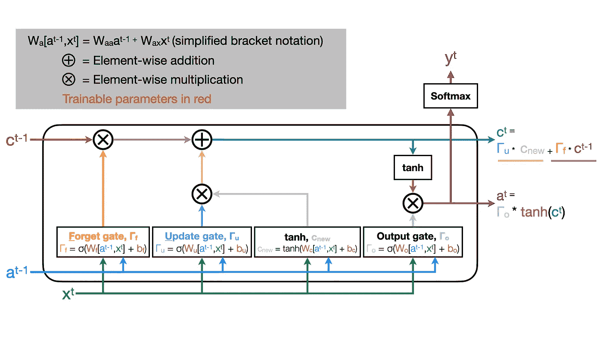

# 重塑 LSTM:从零开始的长短期记忆

> 原文：<https://towardsdatascience.com/reinventing-the-lstm-long-short-term-memory-from-scratch-3bf90d40057f?source=collection_archive---------8----------------------->

## 对 LSTM 单位的了解足以“改造”它！

当我必须从头开始描述一件事情时，我学得最好！在“重新发明”的文章中，我将尝试描述为自己实现一项技术所必需的数学直觉！

我不喜欢我找到的任何 LSTM 图形，所以我做了自己的！在任何上下文中随意重用，无需注明出处(不保留任何权利)。

## 为什么是 LSTMS？

RNNs 允许我们将神经网络方法的工具包应用于时间序列问题。然而，最初的 RNN 实现常常难以了解长期的时间依赖性。LSTMs 引入了细胞状态或“记忆”的向量，以提高网络学习特征之间可能关系的能力，即使特征之间相隔数百或数千个时间点。

## 我们要去哪里…

每个 LSTM 单元输出*两个*值:一个 a(激活)的向量和一个 c(ell)状态的记忆向量。直观地说，这允许我们的网络从时间序列数据中保持相关特征的记忆。网络可以保存信息，并在以后的时间点引用重要的上下文。我们将浏览各个部分，并讨论每个部分对 LSTM 函数的贡献！

完整的 LSTM 单元图，我们将依次理解每一块！图片作者。

## 乙状结肠和 tanh

双曲正切函数和 sigmoid 函数并排。(左)[极客 3](https://commons.wikimedia.org/wiki/User:Geek3) 上[维基媒体](https://commons.wikimedia.org/wiki/File:Hyperbolic_Tangent.svg) |(右)[马丁托马](https://commons.wikimedia.org/wiki/User:MartinThoma)上[维基媒体](https://commons.wikimedia.org/wiki/File:Sigmoid-function-2.svg)

为了理解 LSTM 行为，我们必须理解在引擎盖下使用的非线性函数。sigmoid 和双曲线正切函数在视觉上是相似的。然而，重要的是，sigmoid 函数*不会*呈现负值。sigmoid 的尾部大约等于零(对于域的负值，x < 0)和大约等于一(对于域的正值，x > 0)。出于这个原因，我们可以将 sigmoid 视为一个布尔选择器，它在接近 0 的值和接近 1 的值之间切换。

> 在 LSTM 单元中，sigmoids 应用于元素级乘法之前的值。这允许我们移除 sigmoid 为 0 的元素，并保留值为 1 的值。

## 创造新的记忆

让我们从时间点 *t* 开始，创建一个新的候选单元状态存储向量。稍后，我们将考虑使用这些值来覆盖前一个单元格的单元格状态向量( *t-1* )。这里，我们将使用我们的双曲正切函数( *tanh* )来计算当前特征( *x_t* ) )和前一个单元的激活( *a_t-1* )加上偏置项( *b_c* )的加权( *W_c* )和的非线性激活。

不要被吓倒！这种应用于加权和的非线性建立在与多层感知器中的单元相同的直觉上。我们通过梯度下降学习权重矩阵和偏差项。激活只是一个 tanh，而不是我们可能在其他上下文中更常见的激活函数，如 [relu](https://en.wikipedia.org/wiki/Rectifier_(neural_networks)) ！

我们将这个新的候选单元状态存储向量称为 *c_new* 。

图片作者。

## 遗忘之门

现在，我们需要弄清楚如何改变我们从前一个单元得到的单元状态记忆向量( *c_t-1* )。首先，让我们选择我们想要忘记的元素。

> 遗忘门根据前一个单元的状态存储向量(c_t-1)来确定要遗忘/记住哪些元素。

这个逻辑和我们之前用来确定新的候选记忆向量的逻辑完全一样。不过，这一次，我们将使用一个单独的权重矩阵( *W_f* )和偏差项( *b_f* )。我们希望这个门决定来自 *c_t-1* 的哪些值被保留或丢弃，所以我们希望大部分值接近 1(保留)或 0(丢弃)。如上所述，我们使用 sigmoid 激活来实现这一点，该激活主要返回 0(负尾)和 1(正尾)，然后是与 *c_t-1* 的逐元素乘法！

图片作者。

## 更新门

完成我们单元的状态存储向量后，我们现在将使用相同的 sigmoid 选择器逻辑，但应用了另一个可训练矩阵( *W_u* )和 bias ( *b_u* )。结果将与我们之前计算的候选单元状态记忆向量逐元素相乘( *c_new* )。

> 更新门确定我们想要从我们的候选单元状态存储器向量(c_new)中忽略/添加哪些元素。

现在，我们有了没有想要忘记的元素的 *c_t-1* 和只有想要添加到内存中的新值的 *c_new* 。将这两个量按元素相加产生更新的单元状态存储向量 *c_t* ，我们将把它传递给下一个 LSTM 单元！

图片作者。

## 输出门

最后，我们将计算一个激活( *a_t* )来传递给下一个单元格。幸运的是，逻辑全部被回收了！我们将通过一个最终的非线性双曲正切函数来传递我们的细胞状态记忆向量( *c_t* )。然后，我们将应用一个 sigmoid——就像对其他门一样——但是使用一组最终可训练的权重( *W_o* )和偏差( *b_o* )。tanh 输出和输出门值的逐元素乘法产生我们单元的激活( *a_t* ):传递给下一个单元的第二个值(t+1)。

图片作者。

## 可选的序列间返回

如果我们愿意，我们也可以预测每个时间点的数量。例如，使用我们的激活( *a_t* )我们可以应用一个 final sigmoid 来预测一个二进制值，或者应用一个 softmax 来执行多类分类( *y_t* )。这允许我们的 LSTM 层返回与输入序列长度相同的预测序列。

图片作者。

## …我们结束的地方！

你可以想象这种架构可以学习的复杂的非线性时态关系！将这些单元链接在一起能够模拟任意持续时间的复杂时序动态。

如果文章的文字或图像有助于解释 LSTMs，请为文章鼓掌！如果您有任何更正或想要建议更多的澄清，请留下您的评论。感谢阅读！