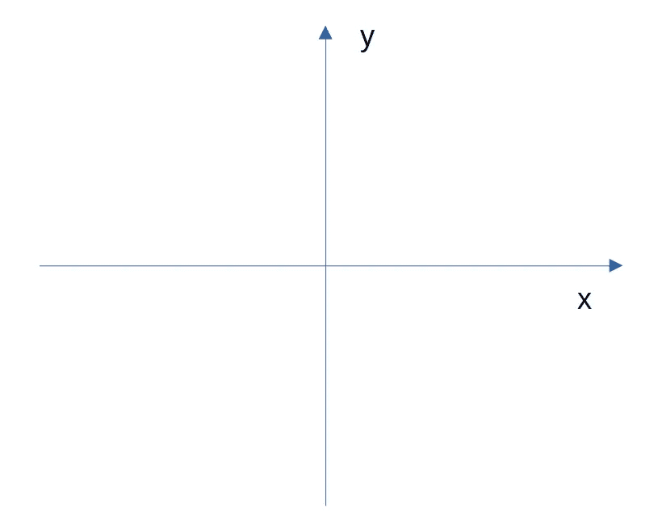
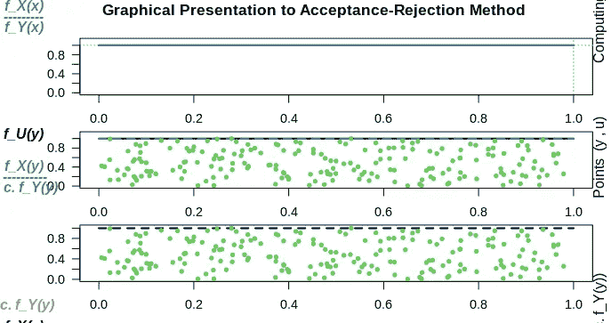
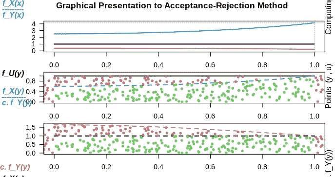
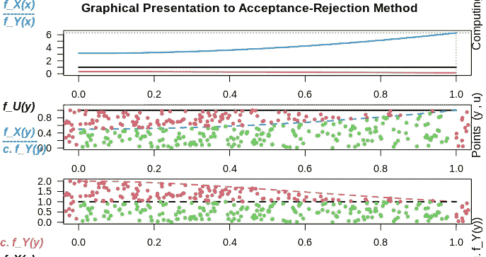
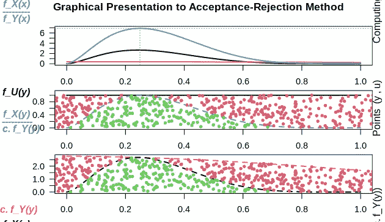

# R 中的拒绝采样

> 原文：<https://towardsdatascience.com/rejection-sampling-in-r-a3a37e9135ff?source=collection_archive---------15----------------------->

## 如何使用拒绝采样生成随机数


来源:图片由 [geralt](https://pixabay.com/users/geralt-9301/) 从 [Pixabay](https://pixabay.com/photos/businessman-control-success-3492380/) 拍摄

当从特定分布生成随机数时，这个过程可以在很大程度上自动化。

例如，如果想要生成 100 个属于 R 中的正态分布的随机数，执行起来很简单:

```
rnorm(100)
```

然而，这个过程实际上是如何工作的呢？一个算法如何知道一个随机数是否属于一个特定的分布？

答案是通过**拒绝采样**。

拒绝抽样是一种生成属于特定分布的随机数的方法。

# 剔除取样的工作原理

笛卡儿图由穿过定义空间的 x 轴和 y 轴组成。



来源:图片由作者创建

在图形的整个区域中，给定的分布(如正态分布)只能覆盖图形的给定部分。在这点上，如果一个人向棋盘随机投掷飞镖，那么落在正态分布区域内的飞镖将被接受，而在该区域之外的飞镖将被拒绝。

# AR 包的使用

虽然手动设置这种机制可能会被证明是一个繁琐的过程，但 R 中的 [AR 包](https://cran.r-project.org/web/packages/AR/AR.pdf)使这变得更加直观。

作为参考，AR 代表**接受-拒绝方法**，本质上意味着算法接受符合指定分布的随机数，而拒绝不符合的随机数。

让我们来看一些例子。

# 将 y 函数定义为均匀分布

首先，让我们考虑随机数界于 0 和 1 之间的均匀分布。

```
library(AR)simulation = AR.Sim( n = 200,
               f_X = function(y){dunif(y, min = 0, max = 1, log = FALSE)},
               Y.dist = "unif", Y.dist.par = c(0,1),
               Rej.Num = TRUE,
               Rej.Rate = TRUE,
               Acc.Rate = FALSE
)simulation
```

在这个例子中，函数(y)被定义为均匀分布`dunif(y, min = 0, max = 1, log = FALSE)`，其中 *Y.dist* 也被设置为均匀分布`unif` -其中 *Y.dist* 代表随机变量的分布名称，即我们指定生成的所有随机数都应该是均匀的。

下面是生成的模拟:

```
Optimal c = 1
The numbers of Rejections = 0
Ratio of Rejections = 0
> simulation
  [1] 0.698931268 0.385566025 0.268550105 0.645668389
  [5] 0.074197359 0.106701437 0.413400215 0.852781124
...
[193] 0.170901990 0.846563826 0.935788635 0.794019386
[197] 0.954960048 0.185282641 0.262304122 0.499565325
```

假设生成的随机数来自同一分布，则拒绝率为 **0** ，即所有生成的随机数都落在指定的分布内。

这是一个图形演示，我们看到所有随机数都以绿色突出显示，它们都属于接受区域:



然而，当从不同的分布中抽取随机数时，我们可以预期拒绝率将是显著的，因为均匀生成的随机数将不可避免地落在分布之外。

## Y.dist =正态分布

让我们指定 *Y.dist* 为正态分布。

```
simulation = AR.Sim( n = 200,
               f_X = function(y){dunif(y, min = 0, max = 1, log = FALSE)},
               Y.dist = "norm", Y.dist.par = c(0,1),
               Rej.Num = TRUE,
               Rej.Rate = TRUE,
               Acc.Rate = FALSE
)
simulation
```

这是生成的样本和拒绝分数。

```
Optimal c = 4.132
The numbers of Rejections = 646
Ratio of Rejections = 0.764
> simulation
  [1] 0.928162718 0.263720941 0.791635163 0.787643782
  [5] 0.682266914 0.609826459 0.526126303 0.303784735
...
[193] 0.528860424 0.945110000 0.263584707 0.958508588
[197] 0.136600285 0.855113058 0.952162865 0.776729036
```

我们看到在这种情况下获得了 0.764 的**拒绝率。**

下面是一个图形表示:



## Y.dist =柯西分布

柯西分布怎么样？

```
simulation = AR.Sim( n = 200,
               f_X = function(y){dunif(y, min = 0, max = 1, log = FALSE)},
               Y.dist = "cauchy", Y.dist.par = c(0,1),
               Rej.Num = TRUE,
               Rej.Rate = TRUE,
               Acc.Rate = FALSE
)
simulation
```

在这种情况下，观察到明显更高的废品率 **0.839** :

```
Optimal c = 6.283
The numbers of Rejections = 1042
Ratio of Rejections = 0.839
> simulation
  [1] 0.942316029 0.610005076 0.653872133 0.411678591
  [5] 0.350234804 0.511995680 0.962110053 0.224207609
...
[193] 0.320808401 0.788250465 0.805645829 0.214475551
[197] 0.471248814 0.015849055 0.715283175 0.067130172
```

这又是一个图示:



此外，也可以改变随机数本身产生的分布。

# 将 y 函数定义为贝塔分布

虽然这里选择了均匀分布，但原作者选择将 y 函数定义为 beta 分布。

从均匀分布中抽取属于正态分布的随机数时，拒绝率为 **0.764** 。

如果 y 函数被定义为贝塔分布呢？在尝试从该分布中识别正态分布的随机数时，会观察到更低或更高的拒绝率吗？

```
simulation = AR.Sim( n = 200,
               f_X = function(y){dbeta(y,2.7,6.3)},
               Y.dist = "norm", Y.dist.par = c(0,1),
               Rej.Num = TRUE,
               Rej.Rate = TRUE,
               Acc.Rate = FALSE
)
simulation
```

以下是样品和拒绝率:

```
Optimal c = 6.898
The numbers of Rejections = 1231
Ratio of Rejections = 0.86
> simulation
  [1] 0.36115666 0.41559791 0.38940239 0.36566013 0.60793899
  [6] 0.25795174 0.10902713 0.27325963 0.64264824 0.18258016
...
[191] 0.12631125 0.26920790 0.13224107 0.33171854 0.08197576
[196] 0.22850070 0.41424580 0.34925813 0.13344548 0.57013744
```

在这种情况下，当从贝塔分布采样时， **0.86** 的拒绝率明显更高，这意味着从均匀分布采样更有效(至少当试图从该分布生成正态分布随机数时)。



虽然这不会对生成的数字产生影响，但剔除率越低，效率越高，因为从更接近目标分布的分布中进行采样，必然会减少模拟生成适当随机数所需的时间。这就是所谓的**效率比**。

# 结论

拒绝抽样(也称为接受-拒绝算法)是概率领域中的一个关键工具，用于生成符合特定分布的随机数。

在本例中，您看到了:

*   什么是拒绝抽样及其在生成属于特定分布的随机数中的重要性
*   如何使用 R 中的 AR 包来实现这个目的
*   对不同分布进行采样以提高效率

非常感谢您的时间，任何问题或反馈都非常欢迎。

*免责声明:本文是在“原样”的基础上编写的，没有任何担保。它旨在提供数据科学概念的概述，不应被解释为专业建议。本文中的发现和解释是作者的发现和解释，不被本文中提到的任何第三方认可或隶属于任何第三方。*

# 参考

*   何塞·恩平科(2016 年)。用于概率、统计和机器学习的 Python
*   [综合 R 档案网:包‘AR’](https://cran.r-project.org/web/packages/AR/AR.pdf)