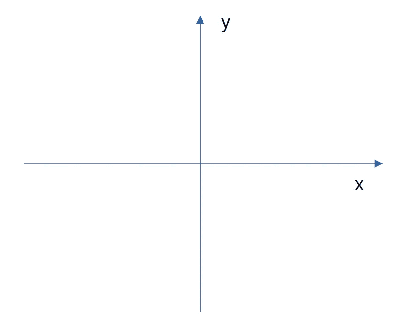
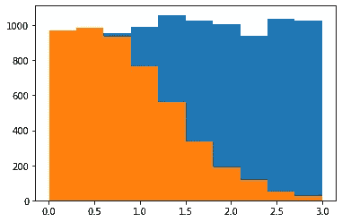
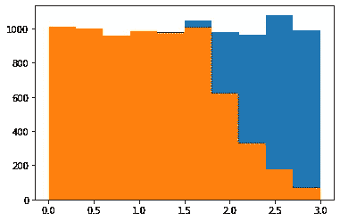
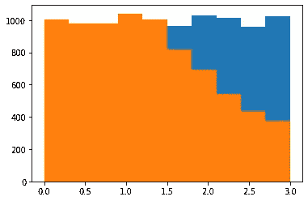

# 使用 Python 进行剔除采样

> 原文：<https://towardsdatascience.com/rejection-sampling-with-python-d7a30cfc327b?source=collection_archive---------9----------------------->

## 使用正态分布和柯西分布的示例


来源:图片来自[皮克斯拜](https://pixabay.com/illustrations/arrow-target-range-bullseye-sport-2889040/)

**拒绝抽样**是一种生成属于特定分布的随机数的方法。

例如，假设有人希望生成 1000 个服从正态分布的随机数。如果想在 Python 中使用 numpy 实现这一点，执行起来非常简单:

```
np.random.randn(1000)
```

然而，这个过程到底是如何工作的呢？在 Python 中生成随机数时，算法如何知道随机数是否属于特定的分布？这就是剔除抽样的用武之地。

# 拒绝抽样

我在本文开头提供了一张飞镖板的图片，这是有原因的——因为这是思考剔除抽样如何工作的最直观的方式。

笛卡儿图由穿过定义空间的 x 轴和 y 轴组成。



来源:图片由作者创建

在图形的整个区域中，给定的分布(如正态分布)只能覆盖图形的给定部分。在这点上，如果一个人向棋盘随机投掷飞镖，那么落在正态分布区域内的飞镖将被接受，而在该区域之外的飞镖将被拒绝。

让我们使用 Python 来看看这是如何工作的。

首先要做的是正确定义概率密度函数。参考 scipy.org 手册，提供了**范数**的概率密度函数。

这在 Python 中定义如下:

```
f=lambda x: np.exp(-(x**2)/2)/(sqrt(2*3.14))
```

José Unpingco 的 **Python for Probability，Statistics and Machine Learning(2016)**对拒绝抽样和其他概率方法进行了详细的概述，我会推荐这个标题，以便更深入地理解这个主题。Unpingco 使用拒绝方法来识别没有连续倒数的密度和卡方分布的样本。

在这种情况下，我改为为**正态**和**柯西**分布定义密度，同时对随机数 *u1* 和 *u2* 的规模做出不同的假设。然而，分析的最终目的保持不变——使用 *u1* 在 f(x)的域中选择随机数，然后 *u2* 根据以下标准接受或拒绝这些值:

```
idx,=np.where(u2<=f(u1)/M) # rejection criterion
```

选择 **0.3** 的刻度，产生 u1 和 u2 的随机样本。

```
M=0.3 #scale factor
Mu1=np.random.rand(10000)*3  # uniform random samples scaled out
u2=np.random.rand(10000)    # uniform random samplesidx,=np.where(u2<=f(u1)/M)
```

基于拒绝标准生成样本:

```
>>> v=u1[idx]
>>> varray([0.00879322, 0.19344109, 0.53193192, ..., 0.45176108, 0.78405714, 0.85680125])
```



来源:Jupyter 笔记本输出

在这里，我们可以看到遵循正态分布的样本以橙色突出显示。

我们想知道的一件事是效率比——也就是说，产生的随机数中有多大比例实际上属于定义的分布？

```
>>> u1_size=u1.size
>>> v_size=v.size>>> u1_size
10000>>> v_size
4931>>> efficiency=v_size/u1_size
>>> efficiency
0.4931
```

基于上述，49.31%的生成样本落在正态分布区域内。这意味着产生的一半样本被丢弃。

如果比例降低到 0.1 呢？



来源:Jupyter 笔记本输出

在这种情况下，正态分布覆盖更大的总面积，丢弃的样本更少。

效率也提高到 71.24%。

# 定义不同的概率密度

虽然缩放有助于提高效率，但理想的情况是确定一个具有更高效率的不同分布。

让我们试试柯西分布——它类似于正态分布，但尾部更重。

柯西分布的概率密度函数定义如下:

```
f=lambda x: 1/(3.14*(1+x**2))
```

再次为 M 设置 0.1 的**刻度。**



来源:Jupyter 笔记本输出

```
>>> u1_size=u1.size
>>> v_size=v.size
>>> efficiency=v_size/u1_size
>>> efficiency
0.7871
```

效率提高到 78.71%，表明柯西分布更适合模拟给定数据，分布的尾部越长，覆盖的区域越大。

# 结论

拒绝抽样(也称为接受-拒绝算法)是概率领域中的一个关键工具，用于生成符合特定分布的随机数。

在本例中，您看到了:

*   如何使用 scipy 定义概率密度函数
*   定义随机样本的拒绝标准
*   对不同分布进行采样以提高效率

非常感谢您的时间，任何问题或反馈都非常欢迎。你也可以在 michael-grogan.com[的](https://www.michael-grogan.com/)找到更多我的数据科学内容。

*免责声明:本文是在“原样”的基础上编写的，没有任何担保。它旨在提供数据科学概念的概述，不应被解释为专业建议。本文中的发现和解释是作者的发现和解释，不被本文中提到的任何第三方认可或隶属于任何第三方。*

# 参考

*   何塞·恩平科(2016 年)。用于概率、统计和机器学习的 Python
*   [scipy.org:统计函数(scipy.stats)](https://docs.scipy.org/doc/scipy/reference/stats.html)