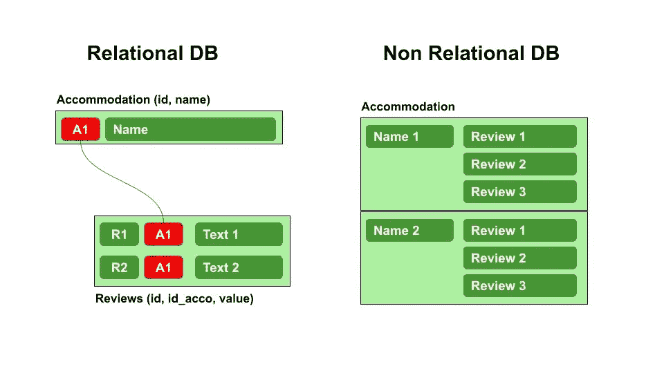
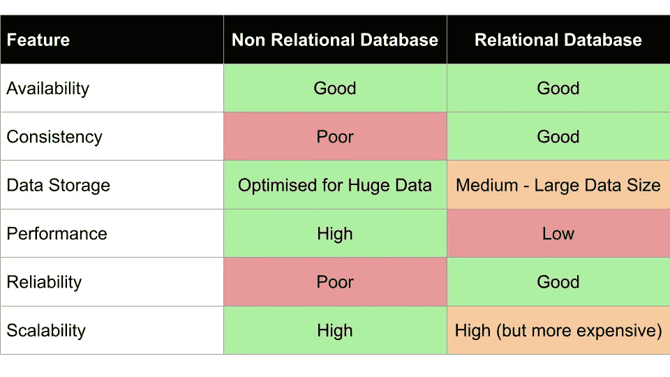

# 关系数据库与非关系数据库

> 原文：<https://towardsdatascience.com/relational-vs-non-relational-databases-f2ac792482e3?source=collection_archive---------5----------------------->

## 数据科学，初学者，数据库

## 关系数据库和非关系数据库的利弊。

作者图片

选择合适的数据库来存储数据并不总是一个容易的选择。事实上，如果在第一种情况下，使用关系数据库可能看起来更自然，在某些情况下这种选择可能不会成功。

在本文中，我试图描述关系数据库和非关系数据库之间的区别，试图强调它们的优缺点。

# 1 关系数据库

[关系数据库](https://aws.amazon.com/relational-database/?nc1=h_ls)是在它们之间具有预先建立的关系的项目的集合。所有的物品都组织在表格中，表格中的列代表**物品属性**。表格的每一行代表一个**单个数据项**。

为了唯一地标识表中的每个项目，应该为每个表定义一个**主键**。主键可以包含表中的一列或多列。多个表可以通过不同的**外键**相关联。

在不改变表结构的情况下，可以用不同的方式查询关系数据库。**结构化查询语言(SQL)** 是用来与关系数据库通信的最著名的接口。

SQL 数据库引擎的示例有:

*   [Mysql](https://www.mysql.com/)
*   [Postgres](https://www.postgresql.org/)
*   [微软 SQL Server](https://www.microsoft.com/en-us/sql-server/sql-server-downloads)
*   [SQLlite](https://www.sqlite.org/index.html) 。

总之，**在关系数据库中，所有的信息都是结构化的，也就是说，它们被组织在表格中**。

## 1.1 关系数据库的优点

*   非常适合结构化数据
*   使用现有的查询语言(SQL)
*   非常适合复杂的查询
*   轻松的数据导航
*   由于表之间的关系和约束，数据集成程度很高
*   交易安全
*   高可靠性

## 1.2 关系数据库的缺点

*   预先模式定义
*   无法适应不断变化的需求:对一个项目的动态更改会影响同一表中的所有其他项目
*   数据处理可能会很慢。使用昂贵的硬件可以实现高性能

# 2 个非关系数据库

非关系数据库是非结构化、结构化或半结构化项目的集合，通常以键值形式表示。集合中的每一项都可以代表一个文档、一个表或任何其他东西。

通常，相同或不同集合中的不同项目彼此不相关，尽管可以向一个项目添加引用(这样的标识符)来引用另一个项目。

非关系数据库引擎的例子有:

*   [MongoDB](https://www.mongodb.com/)
*   [阿帕奇卡珊德拉](https://cassandra.apache.org/_/index.html)
*   [雷迪斯](https://redis.io/)
*   [沙发底座](https://www.couchbase.com/)
*   [阿帕奇 HBase](https://hbase.apache.org/)

总之，**非关系数据库以非表格形式存储数据**。

## 2.1 非关系数据库的优点

*   灵活的数据模型
*   快速适应变化的需求:一个项目的动态变化不会影响其他项目
*   用很少的结构存储大量数据
*   高性能

## 2.2 非关系数据库的缺点

*   低可靠性
*   手动查询语言
*   很难验证数据的完整性和一致性

# 3 摘要

在本文中，我描述了关系数据库和非关系数据库的优缺点。下表总结了两个分析数据库提供的一些最重要的特性:

作者图片

如果你想了解更多关于关系数据库和非关系数据库之间的区别，你可以阅读 Kevin C Lee 提出的文章，标题为:[数据库管理——NoSQL vs . SQL(或 MongoDB vs. MySQL)](https://medium.com/analytics-vidhya/database-management-nosql-vs-sql-or-mongodb-vs-mysql-cfa351caf25a) 。

感谢您的阅读！你可以在这篇文章中读到更多关于我的信息。

这篇文章的摘要可以从[链接](https://www.slideshare.net/angelicaloduca/relational-vs-non-relational-databases)以幻灯片的形式下载。

# 相关文章

 [## 如何在 Python Pandas 中加载巨大的 CSV 数据集

### 可能会出现这样的情况，您的硬盘中有一个巨大的 CSV 数据集，占用了 4 或 5gb(甚至更多),而您…

towardsdatascience.com](/how-to-load-huge-csv-datasets-in-python-pandas-d306e75ff276)  [## 如何使用 Python 熊猫和 tabula-py 从 PDF 中提取表格

### 一个从 PDF 中提取重复表格的快捷脚本

towardsdatascience.com](/how-to-extract-tables-from-pdf-using-python-pandas-and-tabula-py-c65e43bd754)  [## 描述性分析的简明介绍

### 关于集中趋势、频率和分散指数的一些基本概念。

medium.com](https://medium.com/analytics-vidhya/a-gentle-introduction-to-descriptive-analytics-8b4e8e1ad238) 

# 新到中？您可以每月订阅几美元，并解锁无限的文章— [点击此处](https://alod83.medium.com/membership)。