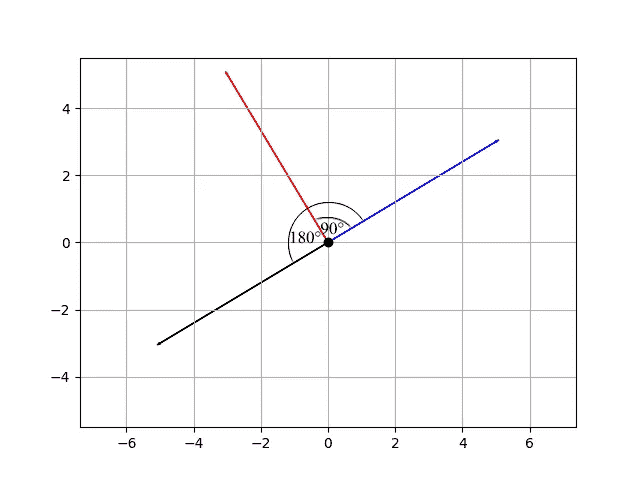
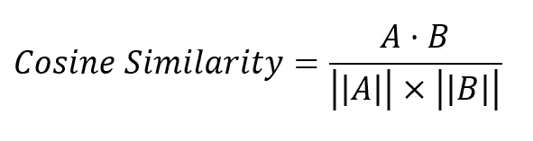
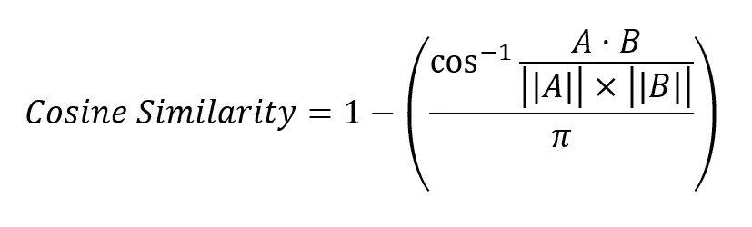
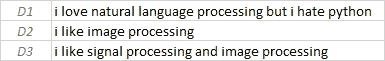
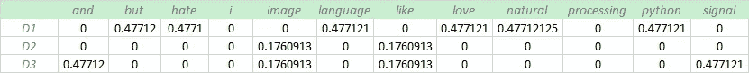
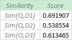
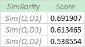

# 简化的相关性排名

> 原文：<https://towardsdatascience.com/relevance-ranking-simplified-e8eeea829713?source=collection_archive---------18----------------------->

## 自然语言处理

## 搜索引擎是如何工作的

约书亚·戈尔德在 [Unsplash](https://unsplash.com?utm_source=medium&utm_medium=referral) 上拍摄的照片

在信息检索方面，排名扮演着重要的角色。当我们使用浏览器搜索文档时，我们希望浏览器检索与我们的查询非常相似的文档。为此，我们需要一个好的检索模型。检索模型是匹配查询和文档的过程。如果检索到的文档与查询非常相似，则认为检索模型是好的。它是搜索引擎中使用的相关性排序算法的基础。在自然语言的情况下，最流行的检索模型被称为向量空间模型。

## 向量空间模型

向量空间模型是用于测量文档集合和查询之间的相似性的模型。查询和文档被表示为 n 维空间中的向量。将查询和文档转换成向量的过程称为文本向量化。TF-IDF 矢量器是最常用的文本矢量器之一。更多关于 TF-IDF [这里](/tf-idf-simplified-aba19d5f5530)。

 [## TF-IDF 简化版

### TF-IDF 矢量器简介

towardsdatascience.com](/tf-idf-simplified-aba19d5f5530) 

为了检索最相关的文档，我们计算查询和集合中每个文档之间的相似性。基于这些相似性，我们可以对文档的相关性进行排序。与查询具有最高相似性的文档是应该被检索并排列在顶部的文档。

## 余弦相似性

余弦相似性是衡量两个向量之间相似性的度量。从数学上讲，它度量的是多维空间中两个向量之间的夹角余弦。

作者图片

因此，它是方向的量度，而不是大小。方向相同的两个向量的余弦相似度为 1，方向相对于彼此偏离 90°的两个向量的余弦相似度为 0，因为 90°的余弦为 0，而方向相反的两个向量的相似度为-1，因为 180°的余弦为-1。余弦相似度特别用于正空间，其中结果被限制在 0 到 1 的范围内。余弦相似度由下式给出:

作者图片

正空间由下式给出:

作者图片

在文本相关性排序的情况下，余弦相似度应该限制在 0 和 1 之间，因为 TF-IDF 矩阵不包含任何负值。

## 例子

给定文档文本如下:

作者图片

和查询文本，如下所示:

作者图片

使用 TF-IDF 对文档文本进行矢量化

作者图片

使用 TF-IDF 对查询文本进行矢量化

作者图片

计算查询和每个文档文本之间的余弦相似度

作者图片

按升序对结果进行排序

作者图片

我们得到的文档相关性排序如下:

作者图片

## 结论

相关性排名是检索与查询非常相似的内容的好方法。它通常用于检索给定特定查询的最相关的文档。然而，相关性并不总是与文本有关，它可以应用于任何东西，只要数据可以用向量或矩阵表示。

## 先决条件

 [## TF-IDF 简化版

### TF-IDF 矢量器简介

towardsdatascience.com](/tf-idf-simplified-aba19d5f5530) 

## 参考

 [## 向量空间模型

### 向量空间模型(VSM)是基于相似性的概念。该模型假设文档的相关性…

www.sciencedirect.com](https://www.sciencedirect.com/topics/computer-science/vector-space-models)  [## 向量空间模型

### 向量空间模型或术语向量模型是一种代数模型，用于表示文本文档(和任何对象，在…

en.wikipedia.org](https://en.wikipedia.org/wiki/Vector_space_model)  [## 余弦相似性

### 余弦相似性是内积空间的两个非零向量之间的相似性的度量。它被定义为…

en.wikipedia.org](https://en.wikipedia.org/wiki/Cosine_similarity)  [## 余弦相似性-理解数学及其工作原理？(使用 python)

### 余弦相似性是一种度量标准，用于衡量文档的相似程度，而不考虑文档的大小。数学上…

www.machinelearningplus.com](https://www.machinelearningplus.com/nlp/cosine-similarity/)  [## 理解余弦相似性及其应用

### 理解在机器学习的不同领域和领域中使用的技术背后的基础知识。

towardsdatascience.com](/understanding-cosine-similarity-and-its-application-fd42f585296a)  [## TF-IDF 简化版

### TF-IDF 矢量器简介

towardsdatascience.com](/tf-idf-simplified-aba19d5f5530)  [## 相关性、排名和搜索

### 有趣的搜索查询之旅

medium.com](https://medium.com/swlh/relevance-ranking-and-search-a98b35ebc7b3)