# 使用隐式表示进行重新照明和材质编辑

> 原文：<https://towardsdatascience.com/relighting-and-material-editing-with-implicit-representations-cc967818b3c0?source=collection_archive---------22----------------------->

## [思想和理论](https://towardsdatascience.com/tagged/thoughts-and-theory)

## *了解我们如何为使用像 NeRF* 这样的隐式表示的场景添加重新光照和材质编辑功能

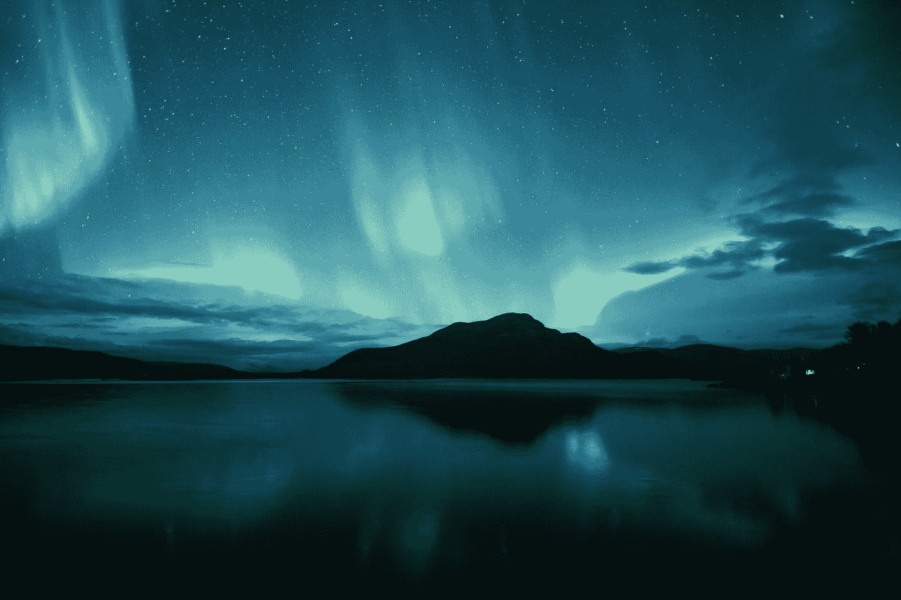

照片由[萨米·塔卡劳蒂奥](https://unsplash.com/@samimatias?utm_source=medium&utm_medium=referral)在 [Unsplash](https://unsplash.com?utm_source=medium&utm_medium=referral) 拍摄

计算机视觉最大的挑战之一是从图像中学习场景。如果我们能理解这个场景并以某种方式表现出来，我们就能从新的角度来观察这个场景。这被称为基于图像的渲染(IBR)。

想法是从 2D 图像生成 3D 重建并生成独特的视图。此外，如果我们希望在其他属性中检索场景的材质和照明，这被称为反向渲染。

有许多不同的方法来表示 3D 对象。经典方法包括将其表示为网格、体素或点云。这些年来已经被广泛研究，并且有它们的优点和缺点。典型地，它们是内存密集型的，并且不能表现非常详细的对象/场景，或者需要很多计算。虽然点云可以很好地缩放，但它们通常会因定义表面而变得不稳定。

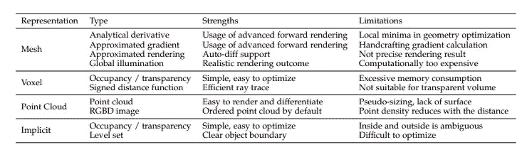

表来自[可区分渲染:调查](https://arxiv.org/pdf/2006.12057.pdf)

我们讨论一类新的表示法，叫做隐含表示法，它因为所有正确的理由而制造了许多噪音。其中之一被称为非常著名的神经辐射场或 NeRF，仅在去年一年就产生了 15-20 种变体。NeRF 非常擅长表现整个场景，并且可以从任何角度观看。然而，我们不能以任何方式编辑场景。因此，我们进一步研究了在使用 NeRF 作为场景表示时可以执行重新照明和材质编辑的变体。

# 隐性表征

最近出现了一种新的表示法，称为隐式表示法。区别主要在于，我们在这里学习一个描述几何的函数。例如，对于一个圆，隐式方程是 f(x，y) = x +y -R，其中 R 是圆的半径。对于任意一点(x，y)，我们知道它是在圆上，在圆内，还是在圆外。因此，给定许多点及其相对于圆的位置信息，我们可以估计圆的半径。

类似地，我们也将同样的想法扩展到 3D。我们知道点是在一个特定的表面之上、之内还是之外，因此我们可以估计我们的物体表面。还有什么比神经网络更好的函数逼近器呢，神经网络是“通用函数逼近器”

根据我们想要如何渲染场景，有两类隐式表示。表面表示旨在找到对象的表面和相应的颜色。相比之下，体积表示并不明确地寻找表面，而是尝试对该点的深度及其相应的颜色进行建模。

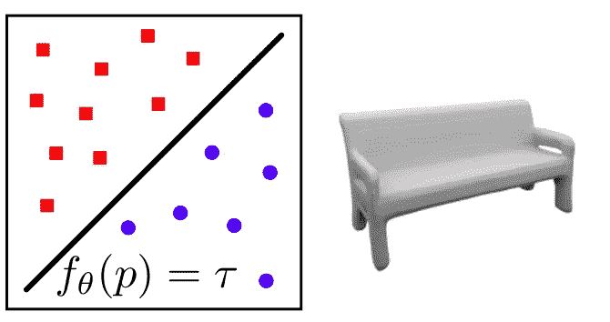

[占位网络:学习功能空间中的 3D 重建](https://arxiv.org/pdf/1812.03828.pdf)

隐式表面表示包括占用网络和带符号的距离场(SDF)。这里的想法是，我们有一个神经网络，它预测给定点相对于对象的位置，即，它是在表面上，在对象内部，还是在对象外部。因此，当我们发射一束光线并在其上采样点时，网络会学习它们相对于物体的位置。利用这一点，我们可以对更接近表面的点进行采样，并找到表面。

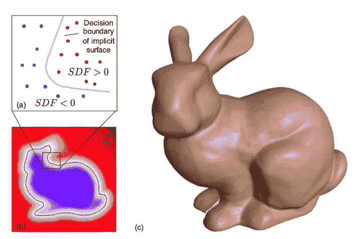

[DeepSDF:学习用于形状表示的连续符号距离函数](https://arxiv.org/pdf/1901.05103)

占位网络和带符号距离场的主要区别在于占位网络给出的是二元答案。如果点在外面，那么它是 0，如果在里面，它是 1，在表面上，值是 0.5。另一方面，带符号的距离字段给出了点到表面的距离。因此，我们的工作是找出满足 f(x) = 0 的所有点。我们在物体内部得到正值，在外部得到负值。我们可以用光线行进法或球体追踪法找到这些表面。类似地，可以通过特定 3D 点的网络输出来找到表面的颜色。虽然它们非常有名，但它们只在光线可以与表面相互作用的地方工作。

其他作品使用隐式表面表示，如 [SRN](https://arxiv.org/abs/1906.01618) 、[可微分体绘制](https://arxiv.org/abs/1912.07372)、[皮夫](https://arxiv.org/abs/1905.05172)等。

# （把汽车拆卸减重后举行的短程高速驾驶比赛中）冲撞别的汽车

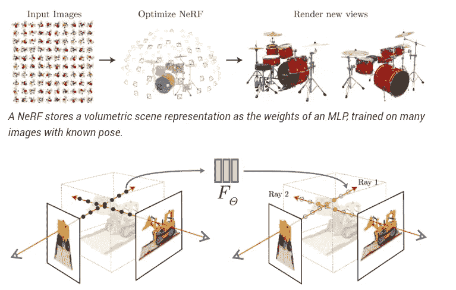

[NeRF:将场景表示为用于视图合成的神经辐射场](https://arxiv.org/pdf/2003.08934)

我们可以执行体绘制，而不是找到所有对象的表面。这就是 NeRF 及其变体出现的原因。这个想法是，我们不是学习一个表面，而是学习整个体积，不仅包括物体，还包括介质的影响。Neural Volumes 是第一批对场景进行编码的作品之一，但它是以不可缩放的基于体素的表示进行编码的。

另一方面，NeRF 使用 MLPs 对场景进行编码。对于从每个像素发出的光线，我们对光线上的点进行采样。现在每个点都有一个 3D 位置和相应的观察方向。我们传递这个 5D 向量，并获得相应的颜色和体积深度。我们对光线上的所有样本都这样做，然后将它们合成在一起，得到一个像素颜色。NeRF 有两个网络，一个是粗略的，它在光线上均匀地采样点，另一个是精细的网络，它做的一切都一样，除了我们使用重要性采样。这意味着我们对更有深度的点，也就是物体，进行更多的采样。采用观察方向有助于对依赖于观察的效果进行建模，例如镜面效果，例如光亮表面的反射[1]。合成这些信息使用经典的体绘制技术，这给了我们最终的图像。

到目前为止，我们读到的方法可以很好地表示场景的几何形状，并且以一种合理的内存高效的方式。然而，正如我们注意到的，这些方法直接学习和预测表面或场景的特定点的颜色。因此，它直接烘烤的材料和照明效果，我们不能编辑。因此，虽然这些网络可以很好地执行视图合成，但它们不能改变场景中的照明或对象的材质。

# 渲染方程

在我们继续之前，让我们了解计算机图形如何建模材料和照明。考虑一个有一个光源、一些物体和一个照相机的场景。现在我们想知道物体上的一个点是什么样子的。我们可以用一些古老的物理学来计算这个。通过利用能量平衡，在某一特定点我们可以说[6]:

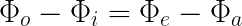

功率守恒方程

即离开物体的能量和进入物体的能量之差，等于物体发出的能量和吸收的能量之差。为了加强表面的能量平衡，出射辐射 Lo 必须等于发射辐射加上散射入射辐射的分数[6]。发射辐射由 Le 给出，散射辐射由散射方程给出，该方程给出

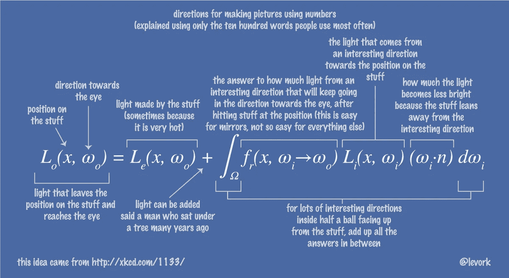

来自[源](https://twitter.com/levork/status/609603797258600448)的渲染方程

不要担心它看起来太专业。在一个特定的点上，我们总结了整个半球反射光的贡献。因子 f 被称为双向反射分布函数或 BRDF，它告诉我们特定材料会反射和吸收多少功率。BRDF 告诉我们一种材料的特性。BRDF 有很多模式，像库克-托兰斯，迪士尼等。如果 BRDF 对于每个点都是不同的，比如在一个纹理中，我们称之为空间变化 BRDF 或 SVBRDF。

还有另一个版本叫做渲染方程的表面版本，我们将来也会提到它:

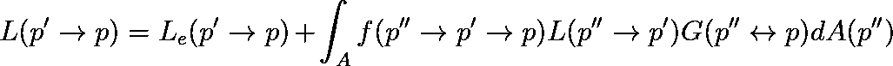

渲染方程的曲面形式

这里 p '是我们的表面，p 是观察者表面或相机。“p”是光线照射的表面，A 是所有的表面。g 是几何耦合项，代表:

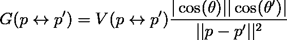

几何耦合项

v 是可见度函数，它是能看到彼此的表面之一。

既然我们已经了解了材质和照明是如何建模的，我们就可以理解在隐式表示中赋予我们材质和照明编辑能力的各种工作思路。

# 神经

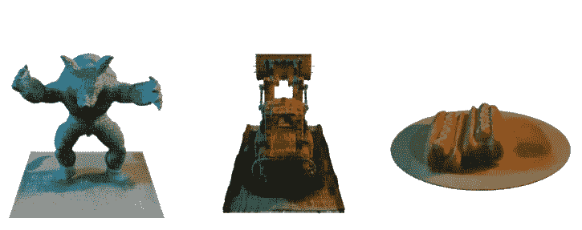

[神经:用于重新照明和视图合成的神经反射和可见度场](https://arxiv.org/abs/2012.03927)

用于重新照明和视图合成的神经反射和可见性场或神经尝试使用多个点光源重新照明场景。在 NeRF 中，我们假设光线上采样的点都不反射光线。然而，由于我们想执行重新照明，我们需要模拟每个点对直接和间接照明的反应。因此，现在我们需要计算每个点的反射率函数，而不是每个点都是一个发射器。

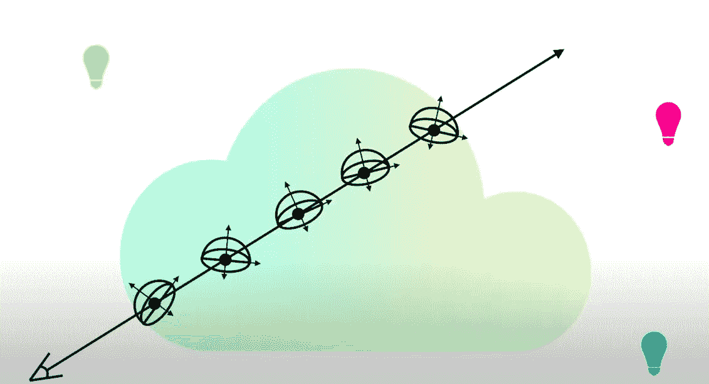

从[源](https://youtu.be/4XyDdvhhjVo?t=61)看，每个点都是一个反射场

因此，首先，用两个 MLP 替换 NeRF 的辐射 MLP:输出体积密度σ的“形状”MLP 和输出任何输入 3D 点的 BRDF 参数的“反射”MLP。该方法使用的 BRDF 模型用三维反照率矢量和粗糙度常数对其建模。

现在，我们可以沿着光线解析地计算每个点的反射函数。我们需要查询光线在击中一个点后击中的每个对应点的可见性。但是，这种操作非常非常昂贵，而且这只是为了直接照明。对于间接照明，我们需要递归地做同样的事情。因此，相反，我们做的是我们有一个能见度 MLP 和距离 MLP。可见性 MLP 计算给定点的可见性因子，而距离 MLP 计算一次反弹后光线的终止点。

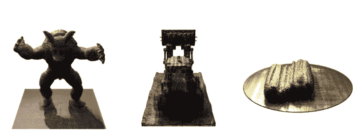

来自[源](https://arxiv.org/pdf/2012.03927)的神经素材编辑结果

总而言之，事情是这样的:

*   对每条光线进行采样，并查询体积密度、曲面法线和 BRDF 参数的形状和反射率 MLP
*   用直射光给光线上的每个点着色。通过使用由每个采样点的相应 MLP 预测的能见度和 BRDF 值来计算。
*   用间接照明给光线上的每个点加阴影。使用预测的终点，然后通过沿该射线采样并结合每个点的贡献来计算其效果。
*   像在 NeRF 中一样组合所有这些量来得到结果

NeRV 设计用于精确处理多个点光源。培训是计算密集型的。一旦训练完毕，我们就可以修改 BRDF 参数，并对整个场景进行材质编辑。

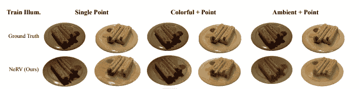

来自[的神经重新点燃结果来源](https://arxiv.org/pdf/2012.03927)

> TLDR；NeRV 使用形状 MLP 来预测体积，使用 BRDF MLP 来预测反照率和粗糙度，使用可见度 MLP 来预测每个点的可见度，使用距离 MLP 来预测一次反弹后光线的终止。结果通过每个点的渲染方程进行组合，然后像 NeRF 一样使用经典的体积渲染技术合成在一起。

# 缺乏社交能力者

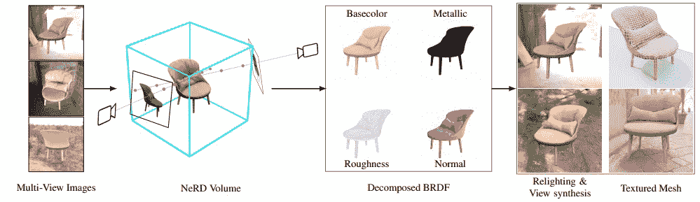

[NeRD:来自图像集合的神经反射分解](https://arxiv.org/pdf/2012.03918)

神经反射分解(NeRD)将基于物理的渲染或 PBR 整合到了 NeRF 框架中。如前所述，一个点的颜色是入射光和 SVBRDF 乘积在半球上的积分。一个点可能由于材质、遮挡或者表面法线指向远处而变暗[3]。所有这些因素都没有被 NeRF 考虑在内，因为它在辐射中烘烤。

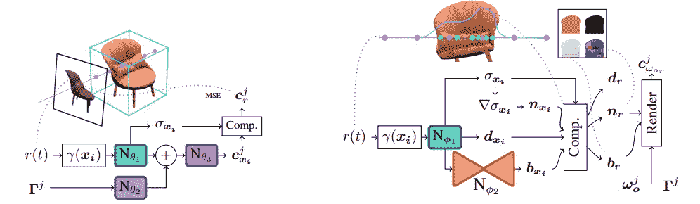

书呆子网来自[来源](https://arxiv.org/abs/2012.03918)

NeRD 有两个 MLP，即采样 MLP 和分解 MLP。采样 MLP 输出独立于视图但依赖于照明的颜色和场景的体积密度。像 NeRF 一样，在这个网络中，光线上的点是均匀采样的，体积密度用于第二个网络中对象上的重要采样点。采样网络中的最后一个要素是特定图像的照明。我们不传递环境光，而是传递它的球面高斯表示。球面高斯类似于 2D 的傅立叶变换。我们这样做的原因是我们不能解析地计算渲染方程。因此，我们把它转换成球面高斯形式，积分转换成乘积运算。现在我们可以快速地计算这个方程。因此，我们从采样网络中学习照明、音量和照明颜色。

分解网络扩展了 NeRF 的第二个网络。除了颜色和体积密度，我们还计算一个向量，并将其传递给另一个小的自动编码器，以输出对象的 BRDF 参数。这里，BRDF 参数不同于 NeRV，因为模型输出反照率、金属和粗糙度。自动编码器可以优化训练并提高结果。最后，我们像 NeRF 一样组合输出，并通过经典的体绘制来输出图像。

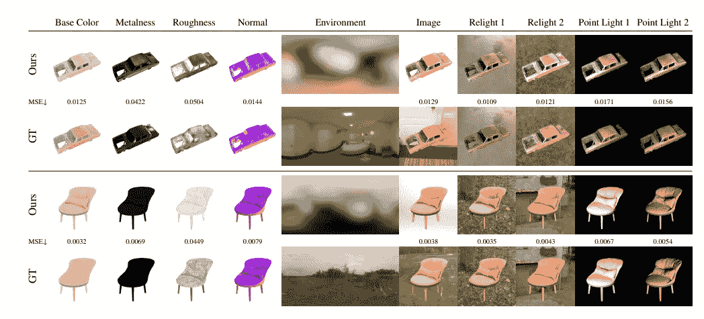

书呆子结果来自[来源](https://arxiv.org/pdf/2012.03918)

NeRD 使场景视图的颜色独立，并学习照明和 BRDF 属性。一旦学会，建模重新照明是简单的，因为我们知道照明是如何组合起来产生颜色的。

> TLDR；NeRD 分解场景，分别学习场景的光照和 BRDF 参数。NeRF 的两个网络被增强以学习独立于视图和依赖于照明的颜色，并且一旦被训练，执行重新照明是简单的。

# 神经因素

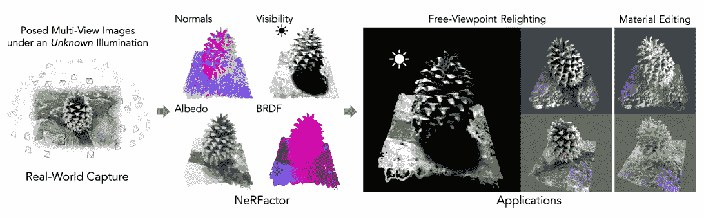

[神经因子:未知光照下形状和反射率的神经因子分解](https://arxiv.org/pdf/2106.01970)

NeRFactor 与我们迄今为止看到的所有作品都非常不同，因为它提炼了经过训练的 NeRF 模型，这是迄今为止该领域中没有其他作品做到的，因为 NeRF 在整个体积上工作，而它在表面点上工作。它可以执行自由视点重新照明以及材质编辑。

神经因素网络来自[来源](https://arxiv.org/pdf/2106.01970)

首先，我们在现场训练一个 NeRF 网络。然后，我们保留粗网络并冻结其权重。然后，我们在 MERL 数据集上训练一个 BRDF MLP。MERL 数据集包含 100 种不同材料的反射率函数。然后，我们使用来自预训练的 NeRF 的预测体积来初始化法线贴图和可见性贴图。这些图非常嘈杂，因此我们没有冻结它们，而是将它们作为初始化。

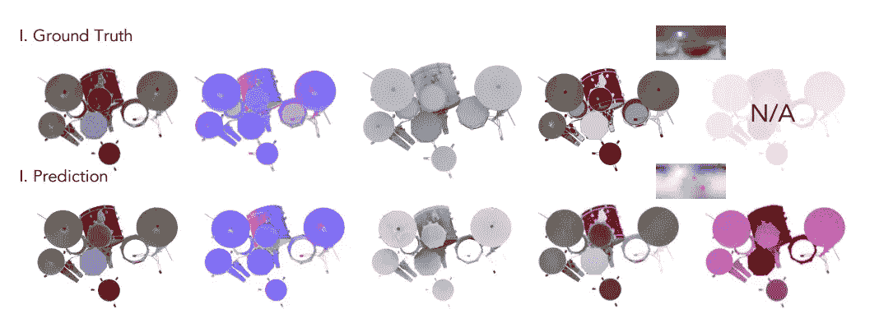

来源于[的神经因子结果](https://arxiv.org/pdf)

现在我们首先预测光线将在哪里照射到表面。使用它作为输入，我们训练 4 个 MLP，即光能见度 MLP、BRDF 识别 MLP、反照率 MLP 和正常 MLP。因为我们已经初始化了可见性和法线，所以它们被称为预训练。现在我们输入表面点并得到输出。BRDF MLP 输出将用于素材编辑的潜在向量 z。反照率网络处理漫反射颜色分量。我们还估计每个表面点的照明。NeRFactor 可以通过显式建模灯光可见性来分离阴影和反照率，并在任意光照条件下合成逼真的软阴影或硬阴影。所有的输出然后像在 NeRF 中一样被组合，并使用经典的体积渲染进行渲染。

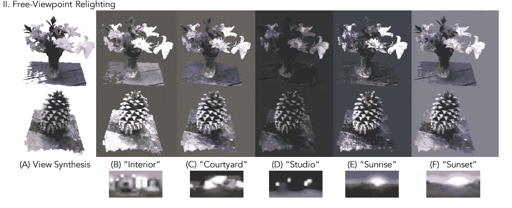

来自[的神经因子重新点燃结果来源](https://arxiv.org/pdf)

NeRFactor 不能预测 BRDF 参数。相反，它学习一个潜在的向量，可以很容易地用于渲染材料编辑。最重要的是，它不是在体积的任何地方取点，而是只在物体的表面取点。

> TLDR；NerFactor 使用经过训练的 NeRF 来初始化法线和可见度图，并使用经过训练的 BRDF MLP 来学习潜在向量表示。然后，它搜索物体表面上的点，并学习其各种参数。学习后，我们可以进行重新光照和材质编辑。

# 外卖食品

我们通过三种方法让 NeRF 至少有了重新点燃的能力。NeRV 通过计算每个点的直接和间接照明的效果来实现这一点，并使用 MLP 近似可见性和光线终止。另一方面，NeRFactor 通过首先找到对象的表面进行分解，然后学习照明和 BRDF 参数(在这种情况下，是一种潜在的矢量表示)。NeRD 处于中间位置，其分解网络使用加权采样计算对象的表面法线，并使用它来渲染场景，但仍然对体积中的所有点运行。

我们注意到，越来越多的方法倾向于表面表现，以获得对场景编辑的更多控制，因为我们并不太关心介质会发生什么。很兴奋看到这个领域将会把两篇论文带向哪个方向。

# 参考

[1] [本·米尔登霍尔](https://arxiv.org/search/cs?searchtype=author&query=Mildenhall%2C+B)，[普拉图尔·p·斯里尼瓦桑](https://arxiv.org/search/cs?searchtype=author&query=Srinivasan%2C+P+P)，[马修·坦西克](https://arxiv.org/search/cs?searchtype=author&query=Tancik%2C+M)，[乔纳森·t·巴伦](https://arxiv.org/search/cs?searchtype=author&query=Barron%2C+J+T)，[拉维·拉马穆尔蒂](https://arxiv.org/search/cs?searchtype=author&query=Ramamoorthi%2C+R)，[任·吴](https://arxiv.org/search/cs?searchtype=author&query=Ng%2C+R)，[内尔夫:将场景表示为用于视图合成的神经辐射场](https://arxiv.org/abs/2003.08934)【2020 ECCV】

[2] [普拉图尔·p·斯里尼瓦桑](https://arxiv.org/search/cs?searchtype=author&query=Srinivasan%2C+P+P)，[柏杨·邓](https://arxiv.org/search/cs?searchtype=author&query=Deng%2C+B)，[张秀明](https://arxiv.org/search/cs?searchtype=author&query=Zhang%2C+X)，[马修·坦西克](https://arxiv.org/search/cs?searchtype=author&query=Tancik%2C+M)，[本·米尔登霍尔](https://arxiv.org/search/cs?searchtype=author&query=Mildenhall%2C+B)，[乔纳森·t·巴伦](https://arxiv.org/search/cs?searchtype=author&query=Barron%2C+J+T)，[神经:用于重新照明和视图合成的神经反射和可见度场](https://arxiv.org/abs/2012.03927)【2021】CVPR

[3] [马克·博斯](https://arxiv.org/search/cs?searchtype=author&query=Boss%2C+M)、[拉斐尔·布劳恩](https://arxiv.org/search/cs?searchtype=author&query=Braun%2C+R)、[瓦伦·詹帕尼](https://arxiv.org/search/cs?searchtype=author&query=Jampani%2C+V)、[乔纳森·t·巴伦](https://arxiv.org/search/cs?searchtype=author&query=Barron%2C+J+T)、[刘策](https://arxiv.org/search/cs?searchtype=author&query=Liu%2C+C)、[亨德里克 P.A 伦施](https://arxiv.org/search/cs?searchtype=author&query=Lensch%2C+H+P)、[讷德:来自图像集合的神经反射分解](https://arxiv.org/abs/2012.03918)、【2021 arxiv】

[4] [张秀明](https://arxiv.org/search/cs?searchtype=author&query=Zhang%2C+X)，[普拉图尔·p·斯里尼瓦桑](https://arxiv.org/search/cs?searchtype=author&query=Srinivasan%2C+P+P)，[柏杨·邓](https://arxiv.org/search/cs?searchtype=author&query=Deng%2C+B)，[保罗·德贝维奇](https://arxiv.org/search/cs?searchtype=author&query=Debevec%2C+P)，[威廉·t·弗里曼](https://arxiv.org/search/cs?searchtype=author&query=Freeman%2C+W+T)，[乔纳森·t·巴伦](https://arxiv.org/search/cs?searchtype=author&query=Barron%2C+J+T)，[神经因子:未知光照下形状和反射率的神经因子分解](https://arxiv.org/abs/2106.01970)【2021 arxiv】

[5] [加藤广治](https://arxiv.org/search/cs?searchtype=author&query=Kato%2C+H)，[德尼兹·贝克](https://arxiv.org/search/cs?searchtype=author&query=Beker%2C+D)，[米哈伊·莫拉里乌](https://arxiv.org/search/cs?searchtype=author&query=Morariu%2C+M)，[田崎敬浩·安藤](https://arxiv.org/search/cs?searchtype=author&query=Ando%2C+T)，[松冈彻](https://arxiv.org/search/cs?searchtype=author&query=Matsuoka%2C+T)，[瓦迪姆·凯尔](https://arxiv.org/search/cs?searchtype=author&query=Kehl%2C+W)，[阿德里安·盖登](https://arxiv.org/search/cs?searchtype=author&query=Gaidon%2C+A)，[可微分渲染:综述](https://arxiv.org/abs/2006.12057)【2020 arxiv】

[6]马特·法尔，文泽尔·雅各布，格雷格·汉弗莱斯，[基于物理的渲染:从理论到实现](https://pbr-book.org/)

[7]弗兰克·德拉雷特， [NeRF 爆炸 2020](https://dellaert.github.io/NeRF/)

[8]李泽宇，[光线追踪——渲染方程式洞察](http://viclw17.github.io/2018/06/30/raytracing-rendering-equation/)