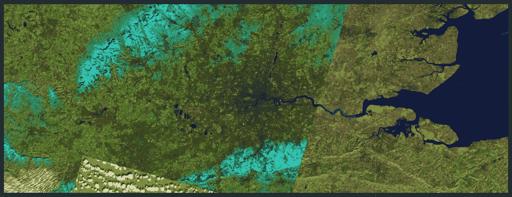

# 使用 Python 进行遥感

> 原文：<https://towardsdatascience.com/remote-sensing-using-python-59a2dd94df51?source=collection_archive---------12----------------------->

## Jupyter 的卫星数据分析，了解伦敦有多绿！

我一直在与一个潜在的油气能源客户互动，我为他开发了一个关于在石油钻井现场使用声音数据的概念验证。下周我还有一个会议，会上我们将与公司的城市规划部门讨论卫星图像数据的使用案例。我想以编程方式学习 GIS 数据分析的基础知识，这样下周我就不是新手了，并想出一个与城市规划部门相关的业务用例。因此，我一直在寻找一个足够强大的 python 库来完成所有复杂的遥感任务。就在那时，我遇到了 ArcGIS。


由 [Ed van duijn](https://unsplash.com/@eddyvanduijn?utm_source=medium&utm_medium=referral) 在 [Unsplash](https://unsplash.com?utm_source=medium&utm_medium=referral) 上拍摄的照片

石油和能源公司花费数百万购买最先进的遥感软件，但大部分用于石油勘探、测量热和湿度指数或水文研究。

尽管这超出了我的能力范围，但我想提出一个令人信服的因素，它可以为已经令人窒息的城市地区的增长提供一个可持续的解决方案。如果人类住房和其他所谓的发展活动的绿色覆盖正在减少，那么我们需要寻找替代的地方和城市。

在这项工作中，我们将使用 ArcGIS 的 python API 并探索寻找城市绿色覆盖的功能。

我们走吧！！

资料来源:Giphy.com

## 问题陈述

> 找出伦敦绿色的百分比。绿色区域包括森林、公园、灌木和从卫星上可以看到的花园形式的绿地。

首先，安装 ArcGIS API。我建议您在虚拟环境中这样做。

```
 pip install arcgis
```

检查安装是否成功完成。下面的命令应该在 Jupyter 笔记本中正确执行。

```
 import arcgis
```

在[https://developers.arcgis.com/sign-up/](https://developers.arcgis.com/sign-up/)创建一个免费账户，这样你就可以使用用户名和密码来访问 GIS API。

你可以在我的回购访问 [GitHub 代码。](https://github.com/Prashantmdgl9/Remote-Sensing-python)

## 1.进口

## 2.GIS 连接

连接到 GIS 并搜索多光谱 Landsat 图层。

## 3.搜索英国

我们将搜索英国的边界，它将在区，县，人口普查区的边界。我在英国的时间教会了我一两件事，所以我将继续县一级，这是第一层。

```
UK_items = gis.content.search('United Kingdom', item_type="Feature Layer", outside_org=True)[0]UK_boundaries = UK_items.layers[1]
```

## 4.找到伦敦

资料来源:Giphy.com

使用地理编码查找伦敦，并将其添加到 Landsat 的范围对象中。伦敦的范围将是一个键值对，表示地图上伦敦城的宽度和高度。


按作者分类的图像(有一个键值对形式的范围对象)

```
london_area = geocode("London, GB", out_sr=landsat.properties.spatialReference)[0]landsat.extent = london_area['extent']
```

## 5.查找伦敦的经度和纬度对

在 UK_boundaries 对象中，#7 属于伦敦，我们可以提取纬度-经度的所有对。

```
london = UK_boundaries.query(where='OBJECTID=7')
london_geom = london.features[0].geometrylondon_geom['spatialReference'] = {'wkid':4326}london.features[0].extent = london_area['extent']
```

## **6。地球资源卫星数据中的伦敦十字路口**

```
selected = landsat.filter_by(where="(Category = 1) AND (cloudcover             <=0.2)", time=[datetime(2015, 1, 1), datetime(2019, 12, 31)],                          geometry=arcgis.geometry.filters.intersects(london_area['extent']))
```



作者图片(伦敦的某处)

许多包含这种图像的数据集会出现在 Landsat 中，我们需要过滤出正确的图像。

```
df_selected = selected.query(out_fields="AcquisitionDate, GroupName, CloudCover, DayOfYear",order_by_fields="AcquisitionDate").sdf
```

将发布一个数据帧:


作者图片

让我们从上面的框架中取出 objected = 2918532，看看它对我们有什么作用；随便拿别的身份证。

```
london_image = landsat.filter_by('OBJECTID=2918532')apply(london_image, 'Natural Color with DRA')
```


作者图片

## 7.NDVI(归一化差异植被指数)

NDVI 是一种基于植物如何反射不同光波的植物健康指标。这是通过测量植物强烈反射的近红外线和吸收的红光之间的差异来实现的。NDVI 的范围总是从-1 到+1。

由于植物的表面反射特性，NDVI 度量可以用于识别地形中的绿色斑块。

```
ndvi_colorized = apply(london_image, 'NDVI Raw')ndvi_colorized
```


作者图片(原始 NDVI 图片)

## 8.将所有东西整合在一起

从上面的 NDVI 图片中截取伦敦的纬度和经度。

```
london_clip = clip(ndvi_colorized, london_geom)
london_clip.extent = london_area['extent']
london_clip
```


作者图片(伦敦金融城)

这非常整洁！我们已经从地球资源卫星图像中提取出了伦敦的地图。现在我们可以找到城市的绿色部分。

## 9.绿色伦敦

伦敦地图的剪辑是 NDVI 图像，我们可以在它上面放置一个遮罩，并找出哪些部分是绿色的。


这座城市看起来很绿(图片由作者提供)

## 10.量化调查结果

计算图像中绿色的像素，也可以通过绘制直方图来完成。

> 伦敦的总绿化面积约占伦敦总地理面积的 39%


作者提供的图片(我们使用遥感技术发现，伦敦 40%的地方是绿色的)

如果你曾经在伦敦生活过，那么你会知道它是一个绿色的城市，拥有大量的公园，比如摄政公园、海德公园、里士满公园、詹姆斯公园、维多利亚公园、汉普斯特德希思公园、巴特西公园等等。这座城市正处于最佳位置，森林覆盖率正适合它所服务的人口数量(约 1000 万)。

## 结论

1.使用 python APIs，可以完成软件能完成的所有工作。复杂的任务只能用昂贵的软件来完成的日子已经一去不复返了。

2.ArcGIS 有一个学习曲线。文档会对你有所帮助，但是你需要花几个小时来理解这个概念。

3.伦敦是一座绿色城市；应该在重复的时间间隔内密切监测绿色植被，以了解城市的动态并采取纠正措施。

我喜欢伦敦的公园和这座城市里自由漫步的狐狸。应该维持现状。


拉克伦·戈恩在 [Unsplash](https://unsplash.com?utm_source=medium&utm_medium=referral) 上的照片

## 参考资料:

[](https://developers.arcgis.com/python/api-reference/) [## ArcGIS API for Python 的 API 参考- arcgis 1.8.3 文档

### 编辑描述

developers.arcgis.com](https://developers.arcgis.com/python/api-reference/)