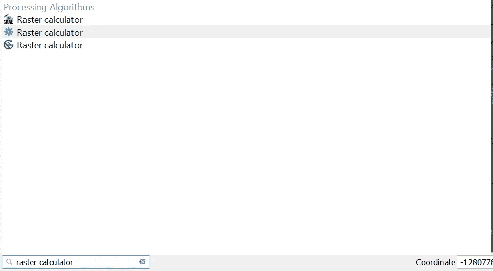

# QGIS 遥感:计算 NDVI

> 原文：<https://towardsdatascience.com/remote-sensing-with-qgis-calculate-ndvi-c2095f0de21b?source=collection_archive---------14----------------------->

## 这可能是最常用的遥感指数

NDVI 根据地球资源卫星 8 号的图像计算得出。所有照片由作者提供。

植被指数是一种主要的遥感产品，归一化差异植被指数(NDVI)可能是使用最广泛的植被指数。要计算 NDVI，你只需要合适的图像和一个允许你与图像数据交互的程序。QGIS 是 GIS 程序的一个很好的免费选项，它提供了显示、分析和呈现遥感数据的工具。

使用 QGIS 栅格计算器在 QGIS 中计算 NDVI 非常简单。您所需要的只是包含红色和近红外波段的影像以及安装在您机器上的 QGIS。这两样东西都可以完全免费获得。

# 什么是 NDVI，为什么使用它？

NDVI 测量光谱的红色和近红外部分的反射差与红色和近红外反射之和的比率。绿色健康的植物反射光谱中近红外部分的光，吸收红光。NDVI 值的范围从 1.0 到-1.0，较大的正值表示绿色植被。

NDVI 用于许多不同的应用中。具体来说，它是野生动物和牲畜饲料数量和质量的重要指标。NDVI 还用于评估农田，确定地表水的位置和范围。

# NDVI 方程

NDVI 是光谱的红色和近红外部分的反射差除以红色和近红外反射的总和。数学上它被写成如下。

# 如何在 QGIS 中计算 NDVI

要在 QGIS 中计算 NDVI，请使用栅格计算器从近红外(NIR)波段中减去红色波段的值，然后除以红色和 NIR 波段的总和。所有你需要的是来自任何种类的图像和 QGIS 装置的红色和 NIR 波段的反射值。本文的其余部分将带您了解如何使用 Landsat 8 影像进行这种计算。也可以[观看文末视频](https://opensourceoptions.com/blog/remote-sensing-with-qgis-calculate-ndvi/#qgis-ndvi-video)进行演示。

# 下载 Landsat 卫星图像

在开始之前，你需要一些数据。如果您不确定如何获取 Landsat 数据，下面的视频将带您了解如何免费下载 Landsat Analysis Ready 数据(ARD)。

观看此视频演示如何下载地球资源卫星数据。

# 将 Landsat 数据添加到 QGIS

一旦有了用于计算的数据，就将红色和 NIR 波段添加到 QGIS 中。对于 Landsat 8，红色是波段 4，NIR 是波段 5。你可以在[的陆地卫星网站](https://landsat.gsfc.nasa.gov/)上查看每个波段的光谱范围的描述。

下图显示了 QGIS 图层面板，其中来自 ARD 陆地资源卫星的波段 4 和波段 5 已添加到 QGIS 项目中。

QGIS 目录中 Landsat 8 的 NIR 和红色波段。

每个 Landsat 波段每个像素仅包含一个值，因此默认情况下，数据将以灰度显示(如下所示)。如果您使用不同的数据源将数据存储为多个波段，您可能会看到真彩色图像。这也没关系，你仍然需要知道哪些波段是红色和近红外波段。

单一 Landsat 8 波段示例。

# 使用栅格计算器计算 NDVI

打开 QGIS 栅格计算器。找到栅格计算器最简单的方法是在 QGIS 界面的左下角进行搜索(见下图)。您可能会看到多个栅格计算器选项。QGIS、GDAL 和 SAGA 都具有 QGIS 中可用的栅格计算器。对于本教程，将使用 QGIS 栅格计算器。它是由齿轮代表的(在下图中以灰色突出显示)。您也可以从处理面板访问 QGIS 栅格计算器。

定位 QGIS 栅格计算器。

在栅格计算器界面中，您会在左侧看到一个框(标记为“图层”)，其中显示了 QGIS 中显示的所有栅格图层。每个栅格图层的名称后面会跟一个“@”符号和一个数字。该数字是该栅格图层的波段。在本例中，每个栅格图层只有一个波段(波段号 1)。如果您使用不同的数据，您可能会看到每次输入相同的文件名，但在末尾有不同的数字，代表该图层的各个波段。

名为“表达式”的白色方框是我们输入 NDVI 公式的地方。双击“图层”框中的栅格波段，将其添加到表达式中。您可以单击运算符按钮将它们添加到表达式中，或者使用键盘输入它们。记住使用括号来强制正确的操作顺序。

完成后，您的表达式应该类似于以下内容(用反斜杠“\”替换除法符号):

请记住，您将使用适合您的特定数据源的图层和波段组合来替换“NIRband”和“Redband”。下图显示了使用 Landsat 8 数据的表达式(尽管很难看到)。

QGIS 栅格计算器中的 NDVI 方程。

我们需要解决一个更重要的设置，以确保输出层与输入层并行(对齐)。选择省略号(。。。)用于参考图层选项。然后检查用于计算 NDVI 的任何一个图层(见下图)。这将设置所选图层的 CRS(投影)、像元大小和范围。这意味着栅格计算器结果将与您在此选择的图层对齐。

QGIS 栅格计算器 NDVI 计算的参考图层。

你会注意到“预定义表达式”可能被设置为 NDVI。这个不用担心。栅格计算器正在使用您输入的表达式进行计算。NDVI 是默认的预定义表达式，这只是巧合。

现在你只需要选择一个输出选项和文件名，然后点击“运行”。

准备运行光栅计算器。

栅格计算器运行完毕后，生成的 NDVI 图层将被添加到 QGIS 界面。NDVI 将显示为灰度图像。

NDVI 灰度显示。

# 创建自定义 NDVI 符号系统

用灰度的方式来看 NDVI 是一种非常无聊的方式。您可以在图层属性的“符号系统”选项卡中自定义符号系统。文章末尾的视频演示了如何创建彩色 NDVI 地图。

# 结论

NDVI 是一个简单的植被指数，用于识别植被的“绿色”，并在许多不同的应用中使用。计算 NDVI 很简单，最困难的部分是获取数据。QGIS 栅格计算器是计算 NDVI 和其他植被指数的有效方法。学习使用 QGIS 栅格计算器是学习遥感分析的重要一步。

# 观看视频

*最初发表于*[T5【https://opensourceoptions.com】](https://opensourceoptions.com/blog/remote-sensing-with-qgis-calculate-ndvi/)*。*