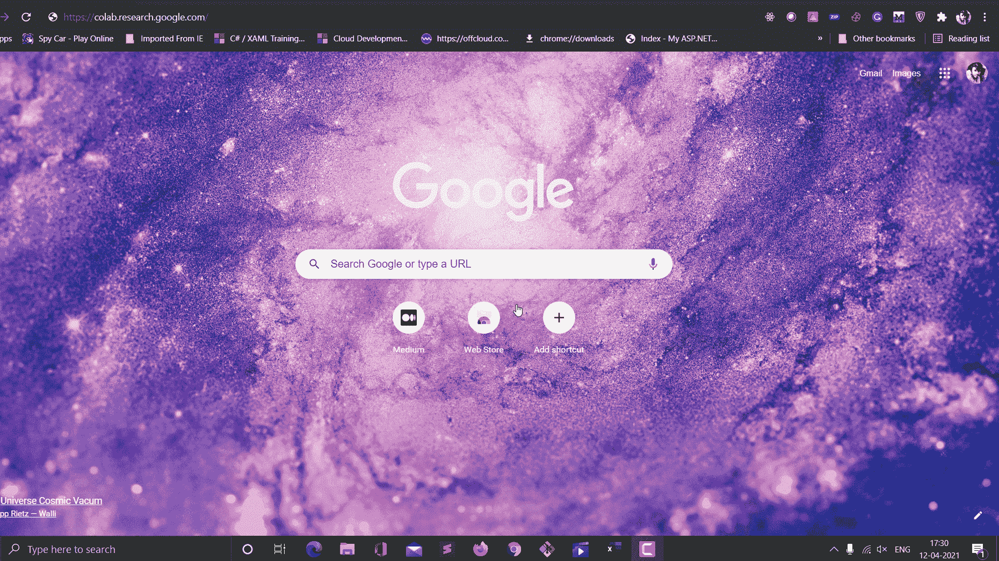
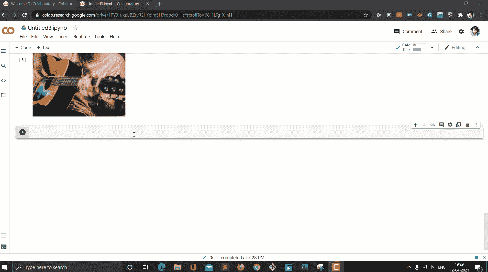

# 使用深度学习去除身体纹身

> 原文：<https://towardsdatascience.com/remove-body-tattoo-using-deep-learning-4f12942a0fe6?source=collection_archive---------41----------------------->

## 只需要你 5 分钟的时间，photoshop 在这方面没有优势


照片由 [**马体·米罗什尼琴科**](https://www.pexels.com/@tima-miroshnichenko?utm_content=attributionCopyText&utm_medium=referral&utm_source=pexels) 发自 [**像素**](https://www.pexels.com/photo/man-in-pink-shirt-playing-acoustic-guitar-5045947/?utm_content=attributionCopyText&utm_medium=referral&utm_source=pexels)

深度学习很有趣，也是我最喜欢的研究领域。我真的很喜欢玩深度学习实践者正在做的新研究开发。我刚刚从计算机视觉小组的一个同事那里看到了一个令人惊讶的 GitHub repo。我太喜欢它了，以至于想和你们一起分享。

GitHub 回购基于 GANs(生成对抗网络)模型。它可以去除身体部位的任何纹身。

我将带您一步步了解如何使用您自己的映像利用相同的回购。

# 启动 Google Colab

Google Colab 为我们提供了免费的 GPU 能力，可以在更短的时间内运行或训练我们的深度学习模型。好的一面是它是免费的。

在浏览器中键入以下 URL，然后按 enter 键

```
[https://colab.research.google.com/](https://colab.research.google.com/)
```



按作者

启动后，使用您的 Google 帐户登录。如果你有谷歌已经登录，它会选择主要帐户登录。别担心！你的数据在这里是安全的。

登录后，转到文件并打开一个新的笔记本。


按作者

# 克隆 GitHub Repo

现在，我们必须在刚刚创建的笔记本中运行下面的命令。

```
!git clone https://github.com/vijishmadhavan/SkinDeep.git SkinDeep
```


按作者

这个命令将在您的 colab 环境中克隆 GitHub 代码。

现在，下一步，我们必须利用克隆的回购。为此，在笔记本的下一个单元格中运行以下命令。

```
cd SkinDeep
```

# 安装库

在下一个单元中运行以下命令，安装所有必需的库。

```
!pip install -r colab_requirements.txt
```


按作者

# 定义模型架构

现在，是初始化模型架构的时候了。该架构在我们克隆的同一个 GitHub repo 中可用。

在下一个单元格中运行以下代码来初始化模型。

# 正在加载模型文件

一旦模型初始化，我们就可以[下载预先训练好的 GANs 模型去纹身](https://github.com/vijishmadhavan/SkinDeep)。在下一个单元格中运行以下命令。

```
MODEL_URL = "https://www.dropbox.com/s/vxgw0s7ktpla4dk/SkinDeep2.pkl?dl=1"urllib.request.urlretrieve(MODEL_URL, "SkinDeep2.pkl")path = Path(".")learn=load_learner(path, 'SkinDeep2.pkl')
```

# 定义输入图像

最后，您可以定义想要测试的输入图像。在下面的代码段中替换你的图片 URL。

# 测试模型并获得结果

现在有趣的部分来了。让我们运行模型，得到答案。在下一个单元格中运行下面几行代码。

```
p,img_hr,b = learn.predict(img_fast)Image(img_hr).show(figsize=(8,8))
```



按作者

# 结论

本文到此为止。我们已经讨论了如何一步一步地使用 SkinDeep 模型去除皮肤上的纹身。

感谢阅读！保持联系。

# 参考

<https://github.com/vijishmadhavan/SkinDeep> 