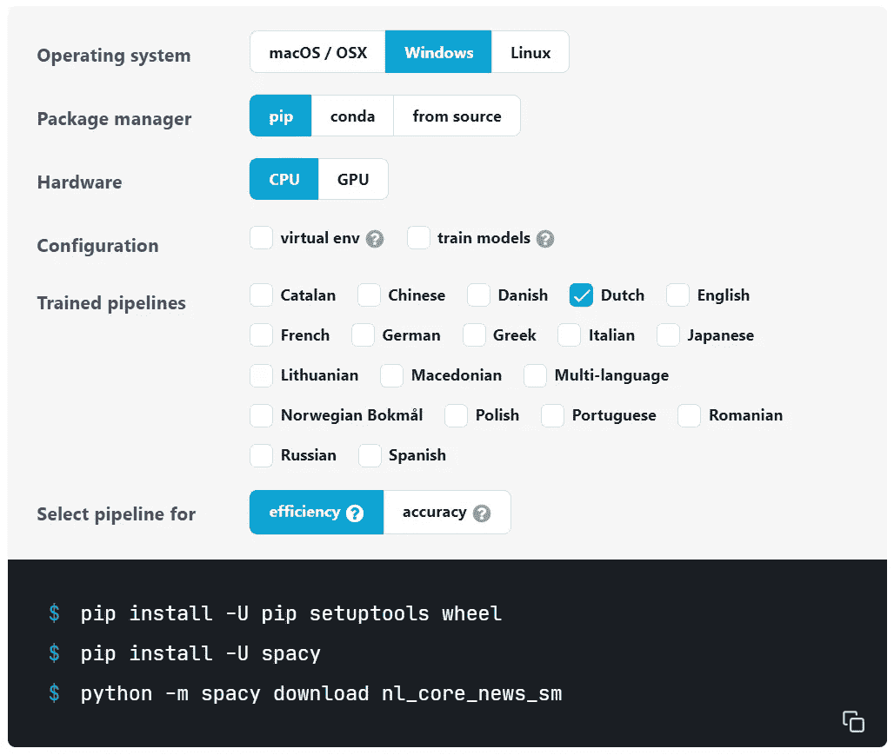

# 使用 Python 从文本中移除个人信息—第二部分

> 原文：<https://towardsdatascience.com/remove-personal-information-from-a-text-with-python-part-ii-ner-2e6529d409a6?source=collection_archive---------8----------------------->

## 在 Python 中实现隐私过滤器，通过命名实体识别(NER)移除个人可识别信息(PII)


照片来自 [Unsplash](https://unsplash.com/) 上的 [Michael Dziedciz](https://unsplash.com/@lazycreekimages)

这是我的[上一篇关于从短信中删除个人信息的文章](/remove-personal-information-from-text-with-python-232cb69cf074)的后续。

GDPR 是欧盟的*通用数据保护法规*。其目的是保护所有欧洲居民的数据。保护数据也是开发人员的内在价值。通过控制对列和行的访问，保护行/列数据结构中的数据相对容易。但是自由文本呢？

在我的上一篇文章中，我描述了一个基于正则表达式和禁用词列表的解决方案。在本文中，我们添加了一个基于*命名实体识别(NER)* 的实现。完整的实现可以在 github PrivacyFilter 项目中找到。

## 什么是命名实体识别？

据[维基百科](https://en.wikipedia.org/wiki/Named-entity_recognition) NER 是:

> 命名实体识别(NER)(也称为(命名)实体识别、实体分块和实体提取)是信息提取的一个子任务，它试图定位非结构化文本中提到的命名实体并将其分类到预定义的类别中，例如人名、组织、位置、医疗代码、时间表达式、数量、货币值、百分比等。

因此，这是所有关于寻找和识别文本中的实体。一个实体可以是一个单词，也可以是一系列连续的单词。实体被分类到预定义的类别中。例如，在下面的句子中，找到了三个实体:实体**个人**“巴斯蒂安·特龙】，实体**组织**“谷歌”，实体**日期**“2007”。


实体识别示例(来源: [Spacy.io](https://spacy.io/usage/visualizers)

NER 是人工智能领域*自然语言处理* (NLP)的子集。这个领域包含处理和分析自然语言的算法。当 NER 能够识别自然语言中的实体时，如果这些实体是隐私相关的实体，如**人**、**组织**、**日期**或**位置**，则可以从文本中删除这些实体。

## 用 NER 过滤 PII

首先，我们需要一个 NLP 处理包。因为所有语言都有自己的语法，所以 NLP 包是按语言进行训练的。我们正在与荷兰，所以我们需要一个理解这一点。我们将使用 Spacy 作为我们的隐私过滤器。

在 Spacy 网站上可以找到一个[工具](https://spacy.io/usage)来帮助安装 Spacy。在选择 Python 环境和语言之后，它会给出适当的命令来安装 Spacy:



Spacy 安装工具(来源: [Spacy.io](https://spacy.io/usage)

选定的管道(效率或准确性)决定了 NER 模型的准确性与规模和速度。选择“效率”会产生更小、更快的模型，但与“准确度”相比，准确度较低。这取决于您的用例，哪个模型更合适。对于开发，我们选择使用效率模型。运行第一次 NER 分析:

在第 2 行导入 Spacy 包之后，使用 *spacy.load()* 方法加载一个模型。在这种情况下，加载荷兰的有效模型。模型由其名称指定，该名称与上一步中用于下载模型的名称相同。要切换到准确的荷兰语模型，请将“nl_core_news_sm”替换为“nl_core_news_lg”。对于上面的例子，这导致相同的输出。

一个快速、简单的性能测试表明，加载小模型需要大约 2.0 秒，而加载大模型需要大约 4.5 秒。分析一个句子需要 5.5 毫秒，而不是 6.0 毫秒。大型号似乎需要大约 500 MB 的额外内存。

词性(POS)标签的含义可以在[这个网站](https://universaldependencies.org/docs/u/pos/)上找到。对于我们的示例，它们是:

```
Geert PROPN PERSON     Proper noun, person
werkt VERB             Verb
sinds ADP              Adposition, case marking
2010  NUM DATE         Numeral, date
voor  ADB              Adposition
HAL   PROPN ORG        Proper noun, organisation
.     PUNCT            Punctuation
```

为了过滤 PII，我们对 POS 类型 NUM 和 PROPN 感兴趣。我们将用描述实体类型的标签来替换 POS 文本元素。

代码的第一部分加载语言模型，并将输入字符串解析为一个标记列表( *doc* )。第 8–16 行的循环通过遍历文档中的所有标记来构建过滤后的文本。如果令牌的类型是 PROPN、NOUN 或 NUMBER，则用标签< … >替换，其中标签等于 Spacy 识别的实体类型。所有标记都用前缀空格连接到新字符串。前缀是必需的，因为对字符串进行标记会移除这些前缀。对于标点符号，不添加前缀空格(第 12–13 行)。

在循环之后，新字符串的第一个字符是一个空格，因为第 11 或 13 行，所以我们需要删除这个空格(第 17 行)。这导致字符串中没有隐私信息。

**有多好？**

在上一篇文章中，我们已经建立了一个基于禁用单词列表的隐私过滤器。与 NER 相比，这种方法需要更多的代码和工作。但是他们如何比较呢？

*   NER 要求语法正确的句子。在这种情况下，隐私信息的替换很有效，即使名字拼错了。NER 优于禁语列表。
*   无论上下文如何，禁用词过滤器都会替换禁用词。尤其是街道名称和城市名称的列表，导致大量不必要的删除单词。例如，像植物名称、动物或像城堡这样的物体这样的词作为街道名称是常见的，并且将从文本中移除。这可能会删除许多不必要的单词，降低结果文本的可用性。NER 会表现得更好。
*   如果文本语法不正确(例如，问题“你叫什么名字？”的答案“Peter”不会被 NER 过滤掉。这些句子在聊天信息和谈话记录中很常见。NER 方法在这些情况下会失败，因为 NER 算法不能用一个或几个词来确定这些答案的性质。

因此，这完全取决于您的使用案例和所需的过滤级别。这种组合决定了最佳方法是使用禁用列表版本、NER 版本还是两者的组合。后者将结合两种方法的优点(但也是它们的部分缺点)。为了找到最佳的方法，请选取数据的一个子集来过滤和测试不同的算法和/或组合，以找到最合适的方法。

一些例子来比较 NER 和被禁词列表(FWL):

```
INPUT: Geert werkt sinds 2010 voor HAL.
NER  : <FILTERED> werkt sinds <FILTERED> voor <FILTERED>.
FWL  : <FILTERED> werkt sinds <FILTERED> voor HAL.INPUT: Heert werkt sinds 2010 voor HAL.
NER  : <FILTERED> werkt sinds <FILTERED> voor <FILTERED>.
FWL  : Heert werkt sinds <FILTERED> voor HAL.INPUT: Wat is je naam? Geert.
NER  : Wat is je naam? Geert.
FWL  : Wat is je naam? FILTERED.INPUT: Geert kijkt naar de duiven op het dak.
NER  : <FILTERED> kijkt naar de duiven op het dak.
FWL  : <FILTERED> kijkt naar de <FILTERED> op het dak.
```

(为了便于比较，所有像<person>这样的标签都被替换为通用标签</person>

第一个例子显示 tat FWL 不能删除公司名称，因为它没有公司名称列表。NER 算法已经在句子中确定“HAL”是一个名词，更具体地说是一个组织。

第二个例子表明，NER 可以处理名称中的类型错误，因为它查看句子的结构，而 FWL 不识别“Heert”作为名称。名称列表只包含正确拼写的版本。

第三个例子表明，NER 需要语法正确的句子来识别“Geert”是一个名字。这可能是对话的文字记录，也可能是聊天中的互动。它展示了 NER 如何很好地运用书面语，但却难以理解口语。

在最后一个例子中，FWL 去掉了单词“duiven ”,因为它不仅描述动物(duiven 在荷兰语中是鸽子的意思),而且还是一个城市的名称。

Github 上的[隐私过滤器代码包含两种方法，在初始化期间，可以选择 NER 方法或 FWL 方法。在本文中，我们没有涉及正则表达式，但是选择 NER 方法也将执行正则表达式(NER 不能识别和替换 URL 等)。它还包含一些使用和过滤的示例文本，以查看现实生活中美国案例中两种方法之间的差异。](https://github.com/lmeulen/PrivacyFilter)

# 最后的话

本文和上一篇文章描述了两种删除文本中个人信息的方法。这两种方法各有优缺点，不可能为所有用例选择一种方法。删除更多的隐私信息也会导致删除更多的非隐私信息，从而降低过滤文本的价值。NER 在删除已识别的隐私信息方面更准确，但需要结构良好的句子才能操作。为了获得最大的安全性，甚至可以将两种方法结合起来。请随意在 Github 上试验[的实现。](https://github.com/lmeulen/PrivacyFilter)

我希望你喜欢这篇文章。要获得更多灵感，请查看我的其他文章:

*   [用 Python 删除文本中的个人信息](/remove-personal-information-from-text-with-python-232cb69cf074)
*   [Python 中字符串的并排比较](/side-by-side-comparison-of-strings-in-python-b9491)
*   [使用 Python 实现并行 web 请求](/parallel-web-requests-in-python-4d30cc7b8989)
*   [所有公共交通工具都通向乌得勒支，而不是罗马](/all-public-transport-leads-to-utrecht-not-rome-bb9674600e81)
*   [使用 OTP 和 QGIS 可视化行程时间](/visualization-of-travel-times-with-otp-and-qgis-3947d3698042)

*免责声明:本文包含的观点和看法仅归作者所有。*