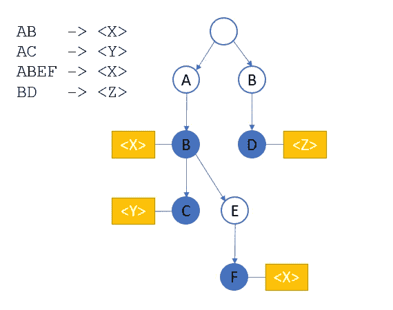

# 用 Python 删除文本中的个人信息

> 原文：<https://towardsdatascience.com/remove-personal-information-from-text-with-python-232cb69cf074?source=collection_archive---------8----------------------->

## 实施 Python privacy textfilter，通过删除*个人身份信息* (PII)来保护用户的隐私。

来自[的照片在](https://unsplash.com/@lazycreekimages) [Unsplash](https://unsplash.com/) 上

GDPR 是欧盟的*通用数据保护法规*。其目的是保护所有欧洲居民的数据。保护数据也是开发人员的内在价值。通过控制对列和行的访问，保护行/列数据结构中的数据相对容易。但是自由文本呢？

为了满足我们的隐私要求，我们可以修改自由文本字段的内容，用标签代替隐私相关信息。文本的含义没有改变，但不能通过匿名与个人联系起来。目标是翻译以下文本(日期为荷兰):

> 自 2014 年以来，可能性增加了，特别是与 2012 年相比，hè Kees？该系统有不同的功能来处理数据。日期是 2021 年 1 月 12 日(或 2021 年 1 月 12 日或 2021 年 1 月 12 日)。你可以在 nam@provider.com 找到我，我住在鹿特丹。我的地址是马斯特拉大街 13 号，1234AB。我叫托马斯·德·弗里斯，我有痤疮。哦，我用雷尼替丁来做这个。

并替换为

> 从<number>开始可能性就增加了，尤其是和<number>相比，hè <name>？该系统有不同的功能来处理数据。日期为<date>(或<date>或<date>)。你可以通过<邮箱>联系到我，我住在<地方>。我的地址是<地址> <号码>，<邮政编码>。我叫<名字>名字<名字>我有<病>。哦，我用<药>治这个。</date></date></date></name></number></number>

本文描述了一个简单的隐私过滤器，它将执行以下操作:

*   用标签<date>替换日期</date>
*   用标签<url>替换一个 URL</url>
*   用<email>替换电子邮件地址</email>
*   用<postalcode>替换邮政编码</postalcode>
*   用<number>替换数字</number>
*   用<place>替换城市和地区</place>
*   将街道名称替换为
*   用<name>替换名字和姓氏</name>
*   将疾病替换为<disease></disease>
*   将药品名称替换为

添加最后两个是因为医疗信息需要额外的关注。发生的次数很少，但是当这些信息泄露时，影响是巨大的。

前四个动作将使用正则表达式执行，而后五个动作将由替换函数实现。我们的隐私过滤器类具有以下结构:

PrivacyFilter 类实现了不同的过滤器。在创建和初始化之后，这个对象可以用来过滤文本。它与正则表达式和 [FlashText 文字处理器](https://github.com/vi3k6i5/flashtext)一起工作。

## 使用正则表达式过滤

前四个过滤器用正则表达式实现。替换数字是第一个也是最简单的替换:

这个正则表达式用标签<number>替换所有包含一个或多个数字的单词。这将取代文本中的银行账户、电话号码、身份证号码等。最后执行这个过滤，这样邮政编码和日期就可以被它们相应标记代替，而不是一系列数字标记。</number>

更高级一点的是删除邮政编码的功能。荷兰的邮政编码格式为 0000AA，数字和字母之间有一个可选的空格。使用下面的正则表达式来替换它们:

添加了带标点符号的可选部分，以防止单词前两个字母的四个数字序列被替换，例如，我们不想用“订单 <postcode>ems”替换“订单 4000 件”。</postcode>

由于电子邮件地址更复杂的性质，删除电子邮件地址变得有点棘手:

正则表达式在网站上找到的[邮件正则表达式 99.99%管用](https://emailregex.com/)。在那里可以找到用各种语言实现的电子邮件检查器。正则表达式的另一个好来源是 [Murani.nl](https://murani.nl/blog/2015-09-28/nederlandse-reguliere-expressies/) 。

用一个正则表达式删除日期是不可能的，因为月份可以写成数字、缩写和全名。要删除日期，我们需要三个正则表达式:

第一个正则表达式匹配以数字形式写成的日期 *dd-mm-yyyy* 。支持日期部分之间的不同分隔符。第二个和第三个匹配日期与文本中的月份名称。

## 使用关键字处理器过滤

如果像前面的替换集一样构建，对地点、街道、姓名、药物和疾病进行过滤需要数千个正则表达式。即使在一个正则表达式中组合一系列名称也是很昂贵的。

为了解决这个问题，Alfred V. Aho 实现了 [Aho-Corasick 算法](https://en.wikipedia.org/wiki/Aho%E2%80%93Corasick_algorithm)，该算法定位存储在类似字典的结构中的字符串。从所有搜索词创建一个图，遍历该图以解析文本。

示例树(作者图片)

该图包含字符串“AB”、“ABEF”、“AC”和“BD”，因为只有蓝色节点是端节点。当第一个字母是“AB”时，它是一个结束节点，除非后面是字母“C”和“E”。为了在关键字处理器中使用，替换标签与图中的末端节点相关联。这样，所有不同的隐私元素都可以被添加到一个图中，并且仍然可以被适当的标签替换。

该算法有几种实现方式，这里我们将使用 Github 的 [Flashtext](https://github.com/vi3k6i5/flashtext) 实现。该算法在 [*中描述，在*](https://arxiv.org/abs/1711.00046) *中替换和检索文档中的关键字。*它包含一个 *KeywordProcessor* ，其中添加了关键字及其替换:*keyword processor . add _ keyword(' keyword '，' replacement')* 。端节点存储要放置到位的替换。

在*数据集*文件夹中，有几个文件每行都有一个关键字，例如一个全部是名字的文件，或者至少有 10.000 个最常见的名字。我们可以将该文件中的所有元素添加到图中，替换标记为<名称为>，如下所示:

在构造函数中，创建了一个区分大小写的关键字处理器。我们使用区分大小写的处理器，因为在荷兰语中有几个名字也是动词。这样，我们只在它们以输入文件中的大写字母开头时替换它们。如果想更安全，可以使用不区分大小写的处理器。

输入文件被读入一个列表(第 5 行和第 6 行)，从这个列表中删除重复项(第 7 行)，并根据最小长度过滤列表。列表中的每个项目都被添加到处理器中(从而添加到图表中)，并带有适当的标签“<name>”。</name>

在*初始化*功能中，可以为街道名称、地点、姓氏、药品等添加更多数据文件。

位置名称按大小进行过滤，因为数据是从 OpenStreetMap 中提取的，空字段、零长度字段和简短缩写位于获取的数据集中。最小尺寸可根据您的安全要求量身定制。

## 过滤文本

所有函数就绪后，我们可以编写实际的过滤方法:

调用基于正则表达式的方法，然后是区分大小写和不区分大小写的处理器。因为不同的数据集被集成在关键字处理器中，所以只需要执行一次。这将产生所需的输出。

但是性能呢？替换 textparts 可能会变得非常昂贵，尤其是有大量的禁用词，在这种情况下大约。136.000 (!！！).在我的计算机上，类的初始化需要 3.1 秒，但是过滤前面给出的文本只需要 0.5 毫秒。太快了！这对于在实际用例中使用来说足够快了。

## 最后的想法

本文介绍了一个简单但非常有效的自由文本隐私解析器。改进总是可能的，但这段代码是从文本中过滤隐私信息的最佳方法。

可以通过用记号化器替换算法来进行改进。这使得有可能引入 [Levenshtein 函数](https://blog.paperspace.com/implementing-levenshtein-distance-word-autocomplete-autocorrect/)来测量单词之间的距离，从而支持删除有打字错误的单词。

完整的代码可以在 Github 上找到:【https://github.com/lmeulen/PrivacyFilter 

标签和例句是荷兰语，但源代码可以很容易地被其他语言采用。在知识库中，还有一个程序可以收集荷兰语的不同数据集。请注意，这些操作向数据文件添加了第一行数据名称。 *PrivacyFiler* 类在读取数据文件时过滤第一行。

我希望你喜欢这篇文章。要获得灵感，请查看我的其他文章:

*   [使用 Python 实现并行 web 请求](/parallel-web-requests-in-python-4d30cc7b8989)
*   [使用开放数据和开普勒](/visualization-of-crowdedness-for-dutch-trains-with-kepler-f55057a3ba24)可视化荷兰火车的拥挤程度
*   [使用 OTP 和 QGIS 可视化行程时间](/visualization-of-travel-times-with-otp-and-qgis-3947d3698042)
*   [所有公共交通工具都通向乌得勒支，而不是罗马](/all-public-transport-leads-to-utrecht-not-rome-bb9674600e81)

*免责声明:本文包含的观点和看法仅归作者所有。*