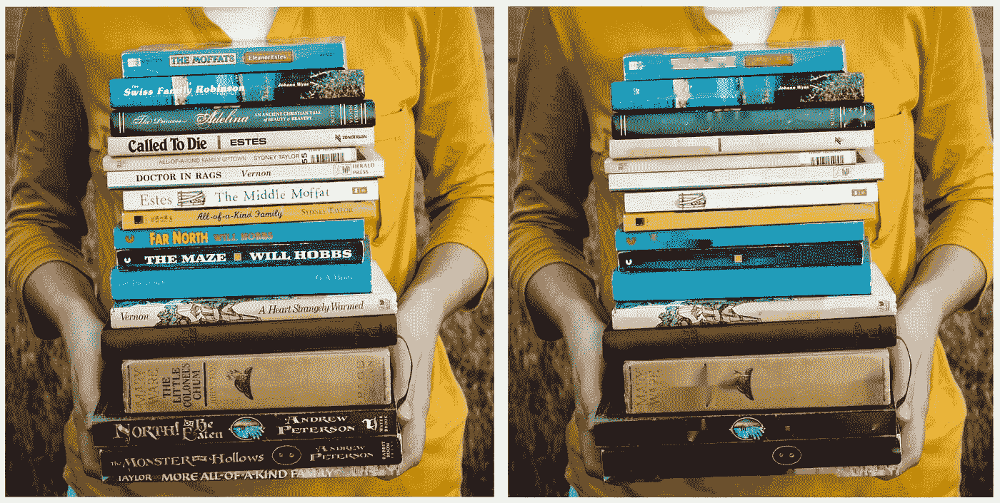
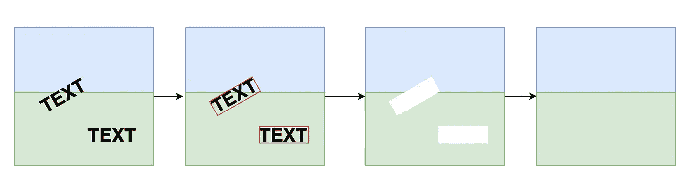
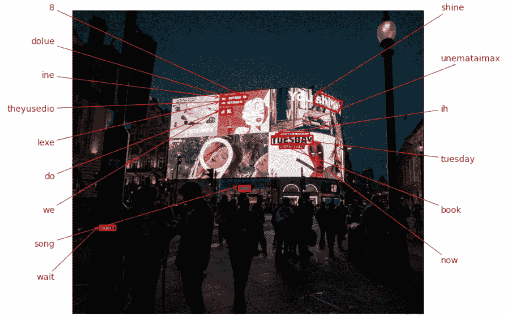
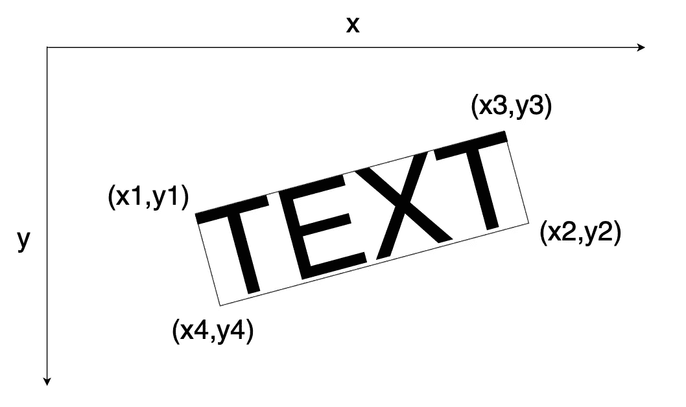
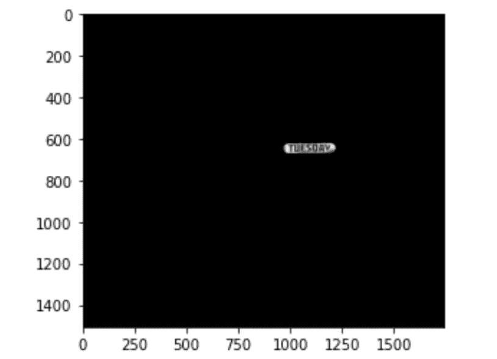
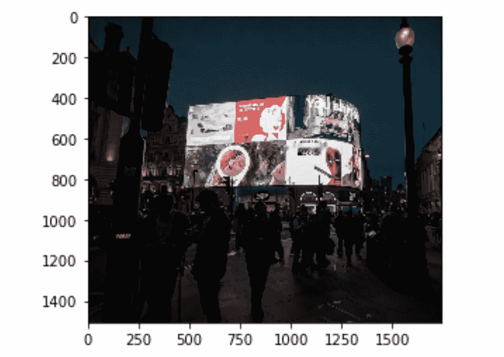
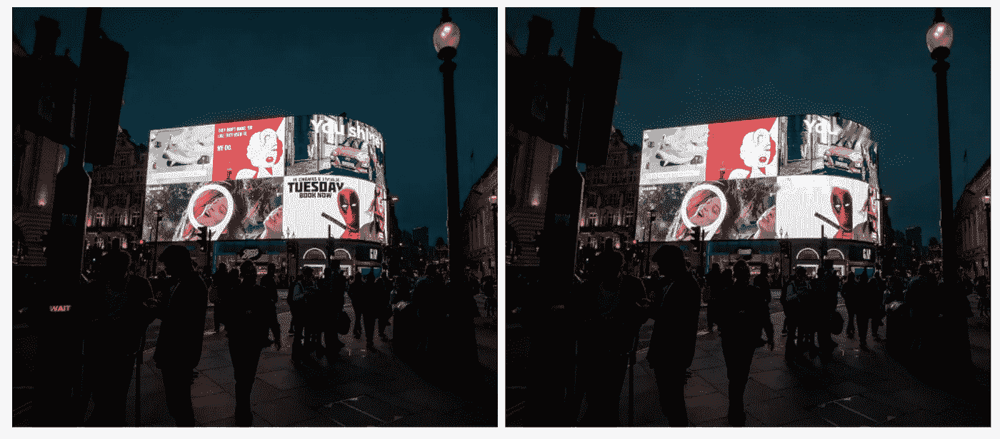
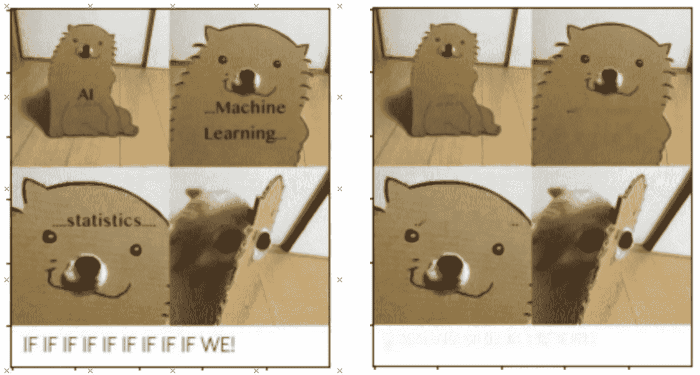
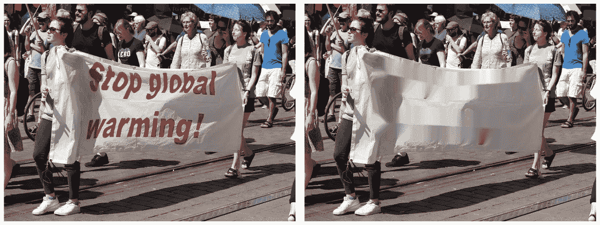

# 使用 CV2 和 Keras-OCR 从图像中移除文本

> 原文：<https://towardsdatascience.com/remove-text-from-images-using-cv2-and-keras-ocr-24e7612ae4f4?source=collection_archive---------1----------------------->

## 如何使用 Python 自动修改图像使其无文本



使用 Cv2 和 Keras 移除文本前后的示例。来源:图片由作者处理图片由 [morningbirdphoto](https://pixabay.com/users/morningbirdphoto-129488/?utm_source=link-attribution&amp;utm_medium=referral&amp;utm_campaign=image&amp;utm_content=1605416) 发自 [Pixabay](https://pixabay.com/?utm_source=link-attribution&amp;utm_medium=referral&amp;utm_campaign=image&amp;utm_content=1605416) 。

# **简介**

在这篇文章中，我将讨论如何快速从图像中去除文本，作为图像分类器或多模态文本和图像分类器的预处理步骤，这些分类器涉及带有文本(如模因)的图像(例如脸书的[仇恨模因挑战](https://ai.facebook.com/blog/hateful-memes-challenge-and-data-set/))。

出于各种原因，删除文本可能是有用的，例如，我们可以使用无文本图像进行数据扩充，因为我们现在可以将无文本图像与新文本配对。

在本教程中，我们将使用 OCR(光学字符识别)来检测图像中的文本，并使用修复(一种填充照片缺失部分以生成完整图像的过程)来删除我们检测到的文本。

# 该过程

为了擦除图像中的文本，我们将经历三个步骤:

1.  使用 Keras-ocr 识别图像中的文本并获得每个文本的边界框坐标。
2.  对于每个边界框，应用一个遮罩来告诉算法我们应该修补图像的哪一部分。
3.  最后，使用 cv2，应用修补算法来修补图像的蒙版区域，产生无文本图像。



从有文本的图像到无文本图像的过程的表示。来源:图片由作者提供。

# 实施

## **Keras-ocr 的简要概述**

`Keras-ocr`提供现成的 OCR 模型和端到端的培训渠道，以构建新的 OCR 模型(参见:[https://keras-ocr.readthedocs.io/en/latest/](https://keras-ocr.readthedocs.io/en/latest/))。

在这种情况下，我们将使用预先训练好的模型，它对我们的任务相当有效。

Keras-ocr 会自动下载检测器和识别器的预训练权重。

当通过 Keras-orc 传递图像时，它将返回一个(单词，框)元组，其中框包含单词的四个框角的坐标(x，y)。

这里有一个简单的例子:

```
import matplotlib.pyplot as plt
import keras_ocrpipeline = keras_ocr.pipeline.Pipeline()#read image from the an image path (a jpg/png file or an image url)
img = keras_ocr.tools.read(image_path)# Prediction_groups is a list of (word, box) tuples
prediction_groups = pipeline.recognize([img])#print image with annotation and boxes
keras_ocr.tools.drawAnnotations(image=img, predictions=prediction_groups[0])
```



来源:图片由来自 [Pixabay](https://pixabay.com/?utm_source=link-attribution&utm_medium=referral&utm_campaign=image&utm_content=3794348) 的 [Paul Steuber](https://pixabay.com/users/paulsteuber-2493539/?utm_source=link-attribution&utm_medium=referral&utm_campaign=image&utm_content=3794348) 提供。

如果我们看一看`prediction_groups`,我们会看到每个元素对应一对单词框坐标。

例如，`prediction_groups[0][10]`应该是这样的:

```
('tuesday',
 array([[ 986.2778 ,  625.07764],
        [1192.3856 ,  622.7086 ],
        [1192.8888 ,  666.4836 ],
        [ 986.78094,  668.8526 ]], dtype=float32))
```

数组的第一个元素对应左上角的坐标，第二个元素对应右下角，第三个元素是右上角，而第四个元素是左下角。



文本边界框及其坐标的表示。来源:图片由作者提供。

## **cv2 修复功能概述**

当使用 OpenCV 应用修补算法时，我们需要提供两幅图像:

1.  **带有我们想要删除的文本的输入图像。**
2.  **蒙版图像，显示我们要删除的文本在图像中的位置。**第二幅图像应该与输入图像具有相同的尺寸。蒙版将显示非零像素，这些像素对应于输入图像中包含文本并需要修复的区域，而零像素区域不会被修改。

Cv2 具有两种可能的修复算法，并允许应用矩形、圆形或线条遮罩(参见:[https://opencv 24-python-tutorials . readthedocs . io/en/latest/py _ tutorials/py _ photo/py _ inpainting/py _ inpainting . html](https://opencv24-python-tutorials.readthedocs.io/en/latest/py_tutorials/py_photo/py_inpainting/py_inpainting.html))

在这种情况下，我决定使用线条蒙版，因为它们更灵活地覆盖不同方向的文本(矩形蒙版只适用于平行或垂直于 x 轴的文字，圆形蒙版会覆盖不必要的区域)。

为了应用遮罩，我们需要提供线条起点和终点的坐标，以及线条的粗细:

起点将是框的左上角和左下角之间的中点，而终点将是右上角和右下角之间的中点。

对于厚度，我们将计算左上角和左下角之间的直线长度。

```
import math
import numpy as npdef midpoint(x1, y1, x2, y2):
    x_mid = int((x1 + x2)/2)
    y_mid = int((y1 + y2)/2)
    return (x_mid, y_mid)#example of a line mask for the word "Tuesday"box = prediction_groups[0][10]x0, y0 = box[1][0]
x1, y1 = box[1][1] 
x2, y2 = box[1][2]
x3, y3 = box[1][3] 

x_mid0, y_mid0 = midpoint(x1, y1, x2, y2)
x_mid1, y_mi1 = midpoint(x0, y0, x3, y3)
thickness = int(math.sqrt( (x2 - x1)**2 + (y2 - y1)**2 ))
```

现在我们可以创建我们的面具:

```
mask = np.zeros(img.shape[:2], dtype="uint8")
cv2.line(mask, (x_mid0, y_mid0), (x_mid1, y_mi1), 255, thickness) 
```

我们还可以检查屏蔽区域，以确保它正常工作。

```
masked = cv2.bitwise_and(img, img, mask=mask)
plt.imshow(masked)
```



与单词“星期二”相对应的掩蔽区域。

最后，我们可以修复图像。在这种情况下，我们将使用`cv2.INPAINT_NS`，这是指在论文**“纳维尔-斯托克斯，流体动力学，图像和视频修复”中描述的修复算法。**

```
img_inpainted = cv2.inpaint(img, mask, 7, cv2.INPAINT_NS)
plt.imshow(img_inpainted)
```



正如您所看到的，作品“星期二”已从图像中移除。

# 实施

现在让我们总结一下，创建一个函数来修复任何图像中的文本。

我们只需要生成一个框的列表，迭代屏蔽和修复每个文本框。

```
import matplotlib.pyplot as plt
import keras_ocr
import cv2
import math
import numpy as npdef midpoint(x1, y1, x2, y2):
    x_mid = int((x1 + x2)/2)
    y_mid = int((y1 + y2)/2)
    return (x_mid, y_mid)pipeline = keras_ocr.pipeline.Pipeline()def inpaint_text(img_path, pipeline):
    # read image
    img = keras_ocr.tools.read(img_path)
    # generate (word, box) tuples 
    prediction_groups = pipeline.recognize([img])
    mask = np.zeros(img.shape[:2], dtype="uint8")
    for box in prediction_groups[0]:
        x0, y0 = box[1][0]
        x1, y1 = box[1][1] 
        x2, y2 = box[1][2]
        x3, y3 = box[1][3] 

        x_mid0, y_mid0 = midpoint(x1, y1, x2, y2)
        x_mid1, y_mi1 = midpoint(x0, y0, x3, y3)

        thickness = int(math.sqrt( (x2 - x1)**2 + (y2 - y1)**2 ))

        cv2.line(mask, (x_mid0, y_mid0), (x_mid1, y_mi1), 255,    
        thickness)
        img = cv2.inpaint(img, mask, 7, cv2.INPAINT_NS)

    return(img)
```

而这里是最终的结果(之前 vs 之后):



我还列举了另外几个例子:



来源:图片由作者处理来自[黑客日](https://www.facebook.com/hackernoon/?__tn__=-UC*F)的模因生成。



来源:图片由作者通过处理来自 [Pixabay](https://pixabay.com/?utm_source=link-attribution&utm_medium=referral&utm_campaign=image&utm_content=5026397) 的 [Alfred Derks](https://pixabay.com/users/derks24-5892478/?utm_source=link-attribution&utm_medium=referral&utm_campaign=image&utm_content=5026397) 的图片生成。

请注意，如果您想要保存图像，您需要将其转换为 RGB 格式，否则颜色将会反转！

```
img_rgb = cv2.cvtColor(img, cv2.COLOR_BGR2RGB)cv2.imwrite(‘text_free_image.jpg’,img_rgb)
```

如果您只对删除某些单词感兴趣，可以包含如下 if 条件:

给定要删除的单词列表

```
remove_list = [‘tuesday’, ‘monday’]
```

我们可以在 for 循环中包含`if`条件

```
def inpaint_text(img_path, remove_list, pipeline):
    # read image
    img = keras_ocr.tools.read(img_path)
    # generate (word, box) tuples 
    prediction_groups = pipeline.recognize([img])
    mask = np.zeros(img.shape[:2], dtype="uint8")
    for box in prediction_groups[0]:
        if box[0] in remove_list: x0, y0 = box[1][0]
           x1, y1 = box[1][1] 
           x2, y2 = box[1][2]
           x3, y3 = box[1][3] 

           x_mid0, y_mid0 = midpoint(x1, y1, x2, y2)
           x_mid1, y_mi1 = midpoint(x0, y0, x3, y3)

           thickness = int(math.sqrt( (x2 - x1)**2 + (y2 - y1)**2 ))

           cv2.line(mask, (x_mid0, y_mid0), (x_mid1, y_mi1), 255,    
           thickness)
           img = cv2.inpaint(img, mask, 7, cv2.INPAINT_NS)

    return(img)
```

这当然只是一个快速区分大小写的例子，展示了如何将修补应用于特定的单词列表。

# 结束注释

在本文中，我们讨论了如何实现一种算法，通过使用 Keras 的预训练 OCR 模型和使用 cv2 的修复算法从图像中自动删除文本。该算法似乎可以很好地从图像中快速删除文本，而无需为这一特定任务训练模型。当文本框靠近其他对象时，它的性能通常不太好，因为它可能会扭曲周围的环境。

编辑:这个实现是使用 Python 3.7 执行的，我收到了一些使用 OpenCv 遇到的问题的反馈，这些问题在使用 Python 3.9 等其他版本时会发生。我建议尝试用 3.7 来解决这个问题。

我感谢任何反馈和建设性的批评！我的电子邮件是 carbor100@gmail.com