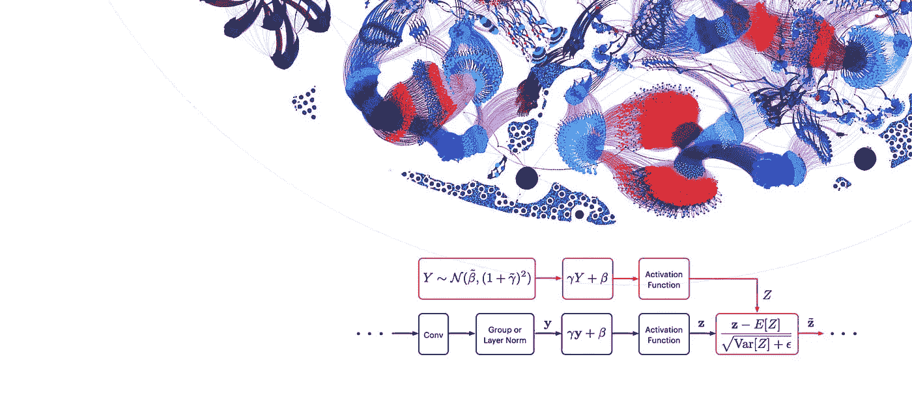
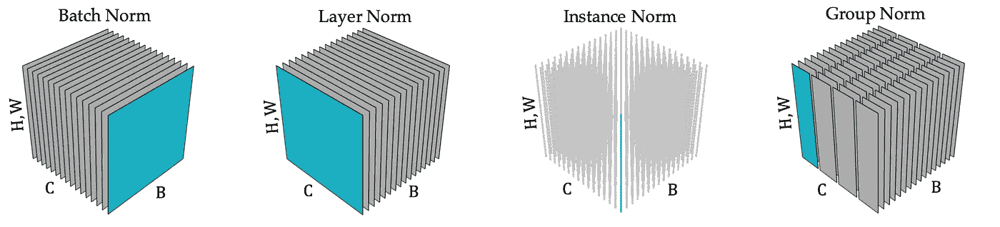
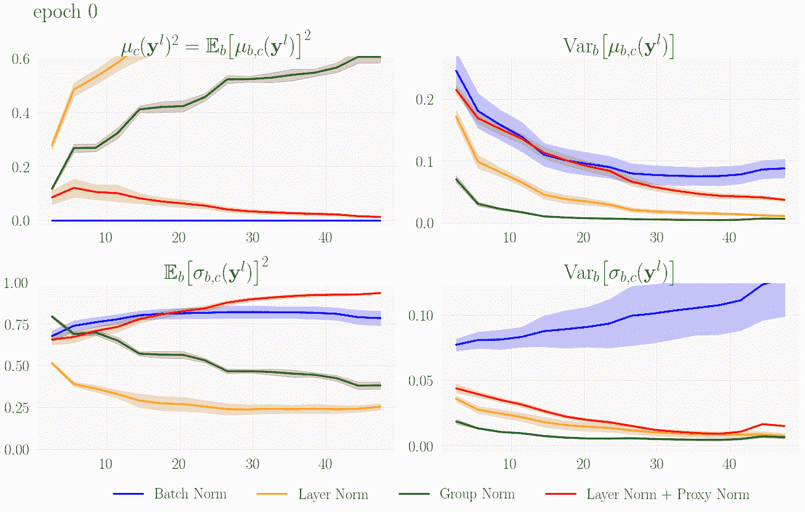
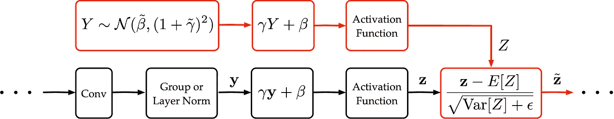
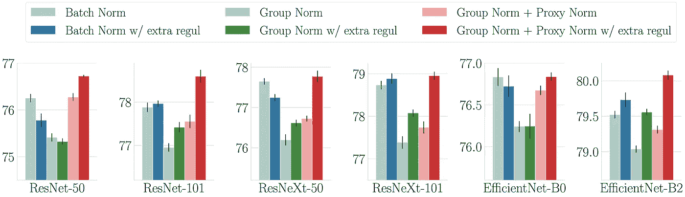

# 通过代理规范化激活消除 CNN 中的批处理依赖

> 原文：<https://towardsdatascience.com/removing-batch-dependence-in-cnns-by-proxy-normalising-activations-bf4824eb0ba4?source=collection_archive---------33----------------------->

## [思想和理论](https://towardsdatascience.com/tagged/thoughts-and-theory)

## 记忆高效的卷积神经网络训练

这篇文章旨在介绍我们在 NeurIPS 2021 上发表的论文“[代理规范化激活以匹配批处理规范化，同时移除批处理依赖](https://arxiv.org/abs/2106.03743)”中介绍的新技术“代理规范”。

代理范数为卷积神经网络的更高存储效率的训练铺平了道路。它保留了批处理规范化的优点，同时消除了以前导致低效执行的批处理依赖的复杂性。随着机器学习模型的规模不断增长，数据集不断变大，Proxy Norm 可以帮助人工智能工程师确保未来的执行效率。

# 标准化的挑战

标准化对于成功地将神经网络扩展到大而深的模型是至关重要的。虽然标准化的范围最初仅限于输入处理[1]，但随着批量标准化技术[2]的引入，标准化被带到了另一个层面，批量标准化技术保持了整个网络中的中间激活标准化。

Batch Norm 强加的特定归一化是一种**通道归一化**。具体来说，这意味着 Batch Norm 通过减去通道方式的平均值并除以通道方式的标准偏差来标准化中间激活。值得注意的是，Batch Norm 实现了这种通道标准化，而没有改变神经网络的表达能力。这意味着批量标准化网络的表达能力与非标准化网络的表达能力相同。我们将会看到这两个特性，即**通道标准化**和**保持表达性**，都是有益的。

然而，批处理规范带来了同样重要的复杂性:**批处理依赖**。由于整个数据集的通道均值和方差不容易计算，Batch Norm 通过将当前小批量视为整个数据集的代理来近似这些统计数据(参见图 1)。给定小批量统计在批量定额计算中的使用，由神经网络关联到给定输入的输出不仅取决于该输入，还取决于小批量中的所有其他输入。换句话说，小批量统计对全批量统计的近似在神经网络的计算中引入了**批量依赖性**。

图 1:每个子图对应于一种特定的归一化技术，其特征在于各组分量共享相同的归一化统计量。在每个子图中，中间激活的张量由批轴 B、通道轴 C 和空间轴(H，W)构成。图片由作者提供，改编自[3]。

现在让我们更详细地看看 Batch Norm，以理解为什么通道规范化和表达性的保持是有益的，以及为什么批处理依赖是一个复杂的问题。在此之后，我们将引入新技术代理规范，如我们在 NeurIPS 2021 论文“[代理规范化激活以匹配批量规范化，同时移除批量依赖性](https://arxiv.org/abs/2106.03743)”中所述。

# 批处理规范的第一个好处是:通道标准化

如上所述，批处理规范在每一层保持中间激活通道式标准化“接近”非线性。这种渠道标准化有两个好处:

1.  由于非线性“作用于”接近归一化的信道式分布，所以相对于这些信道式分布，它实际上是非线性的。每一层都增加了表达能力，神经网络有效地利用了它的整体深度。
2.  由于不同的信道具有可比较的方差，信道被很好地平衡，并且神经网络有效地使用其整个宽度。

**简而言之，通道标准化允许神经网络有效地利用其全部能力。**然而，这种优势并没有保留在批次标准的原型批次无关替代品中(见图 1)。事实上，虽然实例范数[4]保留了通道式归一化，但层范数[5]或组范数[6]没有保留它。在图 2 的左上图中，这转化为具有层范数和组范数的不可忽略的通道方式平方均值。

# 批处理规范的第二个好处是:保持表达能力

如前所述，采用批次范数的通道标准化不会以改变神经网络的表达能力为代价。这意味着，如果适当选择批处理范数的尺度和移位参数，任何非标准化网络都可以等效地表示为批处理标准化网络(在全批处理设置中)。相反，如果适当选择卷积权重和偏差，任何批量标准化网络(在全批量设置中)都可以等效地表示为非标准化网络。**简而言之，批处理规范相当于对神经网络的解空间进行简单的重新参数化。**

这种对表达性的保留是批处理规范的第二个好处。为了理解为什么表达性的这种保持是有益的，理解为什么用与批次无关的替代物替代批次标准来改变表达性是有害的是有用的。在组范数的情况下，表现性改变的症状是实例的平均值和标准偏差的方差的缺乏，如图 2 中最右边的两个子曲线所示。这种实例统计方差的缺乏对于学习是有害的，因为它倾向于与神经网络深层中的高级概念的表达不兼容。

图 2:在 ImageNet 上用各种范数训练 ResNet-50 时，实例均值(上)和实例标准差(下)的均方值(左)和方差(右)。在层的不同深度(x 轴)归一化之后，计算实例统计。图片作者。

# 批次规范的复杂性:批次依赖性

批次范数的批次依赖性的主要症状是在每个小批次中随机选择不同输入产生的噪声。当用小批量统计近似全批量统计时，这种噪声在批量定额层之间传播，并在每个批量定额层“加剧”。**因此，小批量越小，噪音越大。**这种现象转化为批量范数的特定正则化[7]，其强度取决于噪声幅度，因此取决于小批量大小。

不幸的是，这种规范化不容易控制。当目标是降低这种规范化的强度时，实现这一目标的唯一方法是增加小批量。根据任务和所需的调整强度，Batch Norm 会在与最佳性能兼容的情况下对最小批量施加一个下限。当“计算”小批量低于此下限时，保持最佳性能需要跨多个工人进行“昂贵的”统计同步，以产生大于“计算”小批量的“标准化”小批量[8]。**批处理依赖可能导致的主要问题是执行效率低下。**

当使用 Graphcore 的 IPU 时，解决这个问题将会产生真正的影响，因为 IPU 提供的额外加速和节能是以更严格的内存限制为交换条件的。即使替代加速器较少依赖本地内存，这个问题在未来也可能变得很严重。随着数据集变得越来越大，我们确实希望使用越来越大的模型会带来更强的内存约束。对于给定的模型大小，使用更大的数据集也意味着需要更少的正则化，导致需要越来越大的“归一化”小批量，以保证使用批量范数时的最佳性能。

# 代理定额:保留批量定额的优点，同时消除批量依赖性

那么我们如何在去除批处理依赖的同时保留批处理规范的好处呢？

批处理规范的两个好处(即通道标准化和表达能力的保持)不能同时保留与原型批处理无关的规范。一方面，Layer Norm 在保持表现性方面做得很好，但只是以通道反规范化为代价。另一方面，实例范数保证了通道规范化，但代价是表达能力的强烈改变。虽然组规范在层规范的问题和实例规范的问题之间提供了更好的折衷，但它仍然不能解决问题。简而言之，所有典型的批次无关规范都会导致性能下降。

为了解决这个问题，我们需要一个独立于批处理的规范，它可以避免通道反规范化，同时保持表达能力。我们可以通过指出以下几点来使这两个要求更加精确:

1.  负责通道式反规格化的主要操作是:(I)可学习的仿射变换；(二)激活功能。
2.  当将仿射运算插入到神经网络中时，保持了表达能力。

这些观察指导了我们的新技术代理规范的设计。代理范数将归一化操作的输出同化为高斯“代理”变量，该变量被假定为接近信道方式归一化。该高斯代理被馈入与真实激活相同的两个操作中，即相同的可学习仿射变换和相同的激活函数。在这两个操作之后，代理的均值和方差最终被用于标准化真实激活本身。这如图 3 所示。

图 3:通过在预先存在的黑色操作之上添加“廉价的”红色操作，代理范数被并入神经网络。图片作者。

代理范数能够保持表达性，同时补偿通道式反规格化的两个主要来源，即可学习的仿射变换和激活函数。这导致我们采用一种与批次无关的归一化方法，即**将代理范数与层范数或具有少量组的组范数相结合**。从图 2 中可以看出，这种与批次无关的方法保留了通道标准化，同时最小化了表达性的任何改变。通过这种方法，我们保留了 Batch Norm 的优点，同时消除了批次依赖性。

下一个问题是这种方法在实践中是否也能带来好的表现。将批次范数与批次无关方法进行比较时，需要特别小心，以正确考虑批次依赖与批次范数所带来的额外正则化。为了“减去”这种正则化效应，我们在每个实验中都加入了额外的正则化。

从图 4 中可以看出，当特别小心时，我们的独立于批次的方法的 ImageNet 性能在各种模型类型和大小上一致地匹配或超过批次标准(注意，我们的 EfficientNet 变体在另一篇[论文](https://arxiv.org/abs/2106.03640)中介绍)。这意味着我们的批处理独立方法不仅在行为上，而且在性能上也符合批处理规范！

**我们认为，作为我们分析的副产品，虽然有效的规范化对于良好的 ImageNet 性能是必要的，但它也必须伴随着适当的规范化。**在更大的数据集上，我们预计有效的归一化本身就足够了，因为需要的正则化较少[9，10]。

图 4:使用批定额、组定额和组定额+代理定额的各种模型类型和大小的 ImageNet 性能。图片作者。

# 结论

在这项工作中，我们深入研究了卷积神经网络归一化的内部工作原理。我们已经收集了理论和实验证据，证明有效的标准化应该:(I)保持通道标准化和(ii)保持表达性。虽然批处理规范保持了这两个属性，但它也引入了批处理依赖的复杂性。

当研究批次范数的原型批次无关替代方案时，我们发现难以同时获得通道标准化和保持表达性。这导致我们设计了新的技术代理规范，它保留了表达性，同时保持了通道的规范化。然后，我们采用了一种与批次无关的归一化方法，该方法将代理范数与层范数或具有少量组的组范数相结合。**我们发现，这种方法在行为和性能上始终符合批量标准，同时始终保持批量独立性。**

我们的方法为卷积神经网络的更高存储效率的训练铺平了道路。这种内存效率为 Graphcore 的 IPU 等加速器提供了优势，这些加速器利用本地内存来提高执行效率。从长远来看，我们预计这种内存效率将是至关重要的，即使是在替代硬件上。

[看报](https://arxiv.org/abs/2106.03743)

# 谢谢你

感谢 Dominic Masters、Zach Eaton-Rosen 和 Carlo Luschi，他们也为这项工作做出了贡献，也感谢我们其他同事富有洞察力的讨论。

# 参考

[1] Y. LeCun，L. Bottou，G. B. Orr 和 K.-R. Müller，[有效反向投影](http://yann.lecun.com/exdb/publis/pdf/lecun-98b.pdf) (1998)，神经网络:交易技巧

[2] S. Ioffe 和 C. Szegedy，[批量归一化:通过减少内部协变量移位加速深度网络训练](http://proceedings.mlr.press/v37/ioffe15.pdf) (2015)，ICML 2015

[3] N. Dimitriou 和 O. Arandjelovic，[重影规范化新论](https://arxiv.org/pdf/2007.08554.pdf) (2020)，arXiv 2020

[4] D. Ulyanov，A. Vedaldi 和 V. S. Lempitsky，[实例规范化:快速风格化的缺失成分](https://arxiv.org/pdf/1607.08022v2.pdf) (2016)，arXiv 2016

[5] L. J. Ba，J. R. Kiros 和 G. E. Hinton，[图层归一化](https://arxiv.org/pdf/1607.06450.pdf) (2016)，arXiv 2016

[6]吴彦祖，何国光，[群体规范化](https://arxiv.org/pdf/1803.08494.pdf) (2018)，2018

[7]罗，王，邵伟，彭，【2019】，2019

[8] C. Ying，S. Kumar，D. Chen，T. Wang 和 Y. Cheng，[超级计算机规模的图像分类](https://arxiv.org/pdf/1811.06992.pdf) (2018)，NeurIPS 2018 和开源软件系统研讨会

[9] A .科列斯尼科夫，l .拜尔，x .翟，j .普伊格韦，j .容，s .盖利和 n .豪斯比，[大迁移(BiT):一般视觉表征学习](https://arxiv.org/pdf/1912.11370.pdf) (2020)，2020

[10] A. Brock，S. De，S. L. Smith 和 K. Simonyan，[无需归一化的高性能大规模图像识别](https://arxiv.org/pdf/2102.06171.pdf) (2021)，ICML 2021