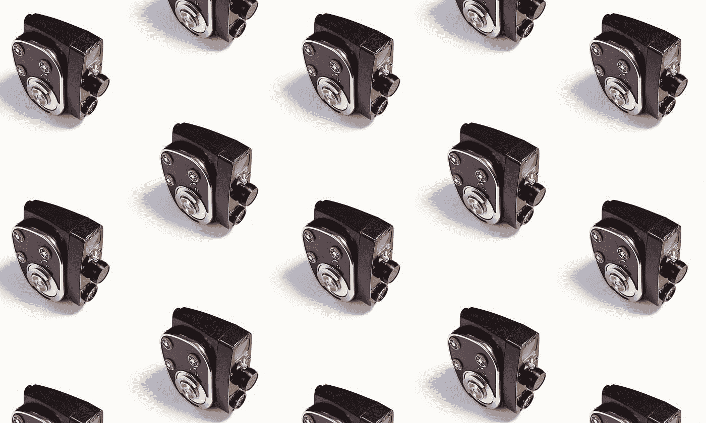
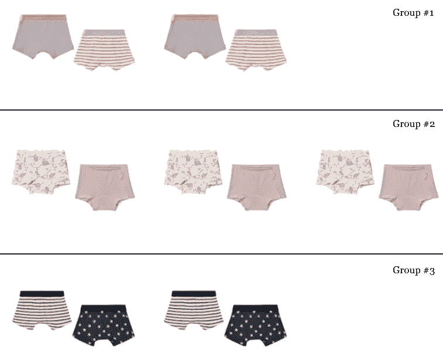

# 在 Python 中移除重复或相似的图像

> 原文：<https://towardsdatascience.com/removing-duplicate-or-similar-images-in-python-93d447c1c3eb?source=collection_archive---------10----------------------->

## 当训练使用图像作为输入的机器学习模型时，检查数据集中相似或重复的图片是相关的。这里有一个最有效的方法。



Anton Maksimov juvnsky 在 [Unsplash](https://unsplash.com?utm_source=medium&utm_medium=referral) 上的照片

# 介绍

检测重复图像的最简单的方法之一是通过检查所有值是否相同来逐个像素地进行比较。然而，当测试大量图像时，这变得非常低效。

第二种非常常见的方法是提取两幅图像的加密哈希，并使用 MD5 或 SHA-1 等流行的哈希算法比较它们是否相同。虽然这种方法更有效，但它只能检测相同的图像。如果其中一个像素不同(例如，由于光照的轻微变化)，哈希将完全不同。

其原因是这些加密算法使用的数据仅基于图像的像素和随机种子。相同的数据和相同的种子会产生相同的结果，但是不同的数据会产生不同的结果。

> 对于我们的用例，相似的图像有相似的散列更有意义，对吗？

这正是图像哈希算法的目标。他们专注于图像的结构及其视觉外观来计算散列。根据您的使用情况，有些算法会比其他算法更好。

例如，如果您希望形状相同但颜色不同的图像具有相同的哈希，可以使用感知哈希或差异哈希。


由 **phash** 算法检测到的重复项 [ImageHash 存储库的第一个例子。](https://github.com/JohannesBuchner/imagehash)

请记住，总是有可能使用更大的图像哈希大小，并获得不太相似的图像，这取决于用例，必须进行超调优。

# 履行

在 Python 中使用，我推荐 [ImageHash 库](https://github.com/JohannesBuchner/imagehash)，支持多种图像哈希算法，如*平均*、*感知*、*差异*、*小波*、 *HSV-color* 、*抗裁剪*。

可以使用以下命令轻松安装它:

```
pip install imagehash
```

如上所述，每个算法可以调整其散列大小，该大小越高，散列对变化越敏感。根据我的经验，我推荐使用散列大小为 8 的 dhash 算法和存储库中可用的 z 变换。

下面您可以看到加载图像、转换图像和计算 d-hash 所需的代码，这些代码封装在 dhash_z_transformed 方法中。

要在数据管道中应用它，只需用想要散列的图像的路径调用 dhash_z_transformed 方法。如果该方法为两个图像产生相同的散列，这意味着它们非常相似。然后，您可以选择通过保留一个副本或两个都不保留来删除副本，这取决于您的用例。



在我最近的一个项目中，项目按散列分组的例子。

我鼓励您通过更改 hash_size 来调整敏感度阈值，以便根据您的用例获得更好的结果。

# 结论

在这篇短文中，我介绍了在训练接收图像作为输入的机器学习模型时要考虑的一个重要步骤。

我没有展示如何只检测相同的图像，而是介绍了图像哈希算法来识别相似的图像(不同大小但相同的图像，亮度的轻微变化……)。最后，我提供了如何使用外部库在 Python 中计算这些图像散列的例子。

如果你想发现更多像这样的帖子，你可以在下面找到我:

*   [GitHub](https://github.com/angeligareta)
*   [领英](https://www.linkedin.com/in/angeligareta/)
*   [个人网站](https://angeligareta.com/)