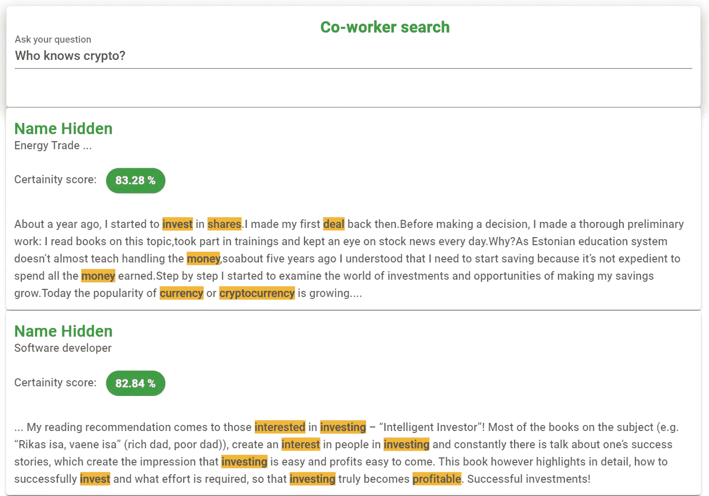

# 消除 80%盲点:如何使非结构化组织数据可用于决策

> 原文：<https://towardsdatascience.com/removing-the-80-blind-spot-how-to-make-unstructured-organizational-data-available-for-decision-e5ddc8147135?source=collection_archive---------20----------------------->

图片作者。

## 使用预训练语言表示模型进行非结构化数据分析

据估计，超过 80%的企业数据是非结构化的(电子邮件、文档、工作描述等)。).另一方面，大多数决策纯粹基于结构化数据。

在这篇文章中，我将描述我们如何在预先训练的机器学习模型和语义搜索的帮助下，将非结构化数据转化为有用的信息。具体的用例是关于我们员工的非结构化个人资料描述，以及我们如何开始询问关于员工的任意问题(例如，我可以和谁谈论小狗？).

# 选择正确的技术

我们通过对知识图技术的研究，开始了非结构化数据表示的任务。

知识图是在图结构数据模型(下图)中通过数据的含义和上下文来表示数据的一种方式。这个想法很吸引人，因为你可以通过对象之间的关系而不是特定的关键字来搜索知识图。

*用节点、边和属性对知识图进行传统表示(图片由作者提供)。*

虽然在概念上和视觉上很吸引人，但我们意识到，与传统数据库相比，它只带来了极小的价值，因为您仍然需要自己定义所有的关系(例如`{马特*访问过*卢浮宫}以及`{卢浮宫*在*法兰西} `)。

> **我们没有使用知识图表，因为您仍然需要自己构建数据。**

接下来，我们将注意力转向预先训练的语言表示模型。这些是机器学习模型(例如 [BERT](https://arxiv.org/abs/1810.04805) )，已经在数百万个文本文档上进行训练，以学习各种上下文中单词之间的表示和连接。

我们可以将每个对象表示为一系列数字，而不是直接定义人和对象之间的关系(知识图方法)。这些数字不能直接解释，但它们带有潜在的(隐藏的)含义(例如，猫和狗比猫和大象彼此更亲近。)

一般工作流程如下:

1.  首先，我们收集员工的非结构化描述(文本)，
2.  其次，我们将这些描述传递给预先训练好的语言模型。
3.  第三，我们收到每个人的一个数字列表，它用数字表示了对一个人的描述。

*图二。使用预先训练的语言模型将非结构化文本编码为数字向量的过程(图片由作者提供)。*

在这一点上，我们似乎没有取得多大的成就，因为每个人的神秘数字列表并不比非结构化文本好多少。但是机器喜欢数字，因为这个数字向量总是有相同的长度(在我们的例子中是 300 个元素)，我们可以很容易地开始计算。把每个数字想象成一个点就是空间。如果我们每个人只有 3 个数字，我们可以在三维图表上看到它们(下图)。这些点彼此越接近，它们就越相似。现在，我们不能画一个 300 维的图表，但逻辑是一样的。

*图 3。预训练模型的输出是一个数字向量。当我们有了物体的数字表示，我们就可以开始测量它们之间的距离和关系。上图显示了一个人的简化(三维)表示(图片由作者提供)。*

# 语义搜索

语义搜索是指根据搜索短语的含义搜索内容的能力。所以，当我问“谁去过法国？”我也应该能找到所有写过参观埃菲尔铁塔的人。

此时，我们已经对员工进行了编码(通过预先训练的模型),语义搜索可以按如下方式进行:

1.  问个问题。
2.  通过预先训练好的语言表征模型传递问题。
3.  计算问题和员工描述之间的距离。
4.  返回到问题表示的距离最短的员工。

*图四。通过测量问题的数字表示和答案之间的距离来执行语义搜索(图片由作者提供)。*

# 示范

最后，让我展示两个来自我们的员工搜索应用程序的例子。出于隐私原因，真实姓名和暴露的工作职位是隐藏的。

在第一个例子中，我试图通过“谁知道加密？”这个问题找到了解加密货币的员工。第一个搜索结果是一位对投资感兴趣的同事，他提到了加密货币。第二个结果也谈到了投资但没有提到加密货币。这正是我们想要实现的——系统理解我们的问题与投资等概念密切相关。

> *语义搜索在预先训练的语言模型的帮助下，能够根据意思而不是特定的关键字进行查询！*

*图 5。语义搜索的例子——引擎理解“加密”和投资股票是相似的概念(来自我们的应用程序的快照)。*

下面的例子是关于寻找可以一起组建乐队的同事。请注意，我提到了两个概念:1)拥有一个车库，2)希望组建一支乐队。这个系统足够聪明，能够理解这里的重点是乐队制作。第一个人似乎有很长的乐队演奏经验，第二个人是音乐制作人(尼斯🙂).此外，第二个结果没有提到单词“band ”,但是系统知道音乐制作和乐队制作密切相关。

*图 5。语义搜索的例子——引擎知道:1)重点是乐队制作，而不是拥有一个车库，2)音乐制作与乐队制作密切相关。*

# 后续步骤

同事的语义搜索只是非结构化数据如何用于任意信息查询的例子之一。其他常见任务包括情感分析、关于文本的抽取问题回答、表格问题回答、命名实体识别和自动文本摘要。要了解更多，请看这篇文章中的[(带有描述和代码示例)](/using-hugging-face-models-on-non-english-texts-aa0b4cb9ad08)。