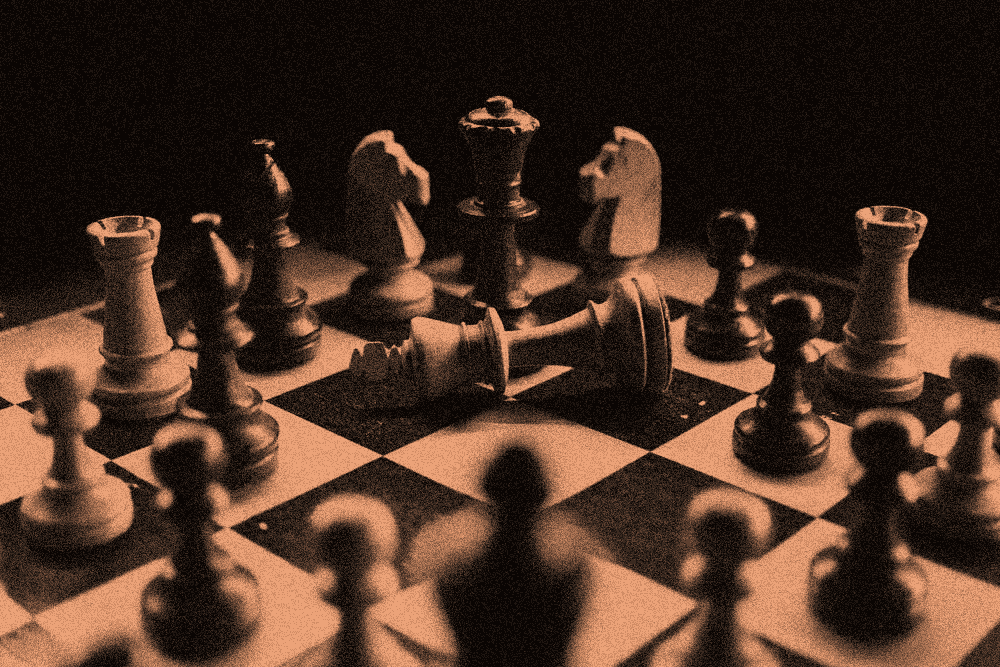
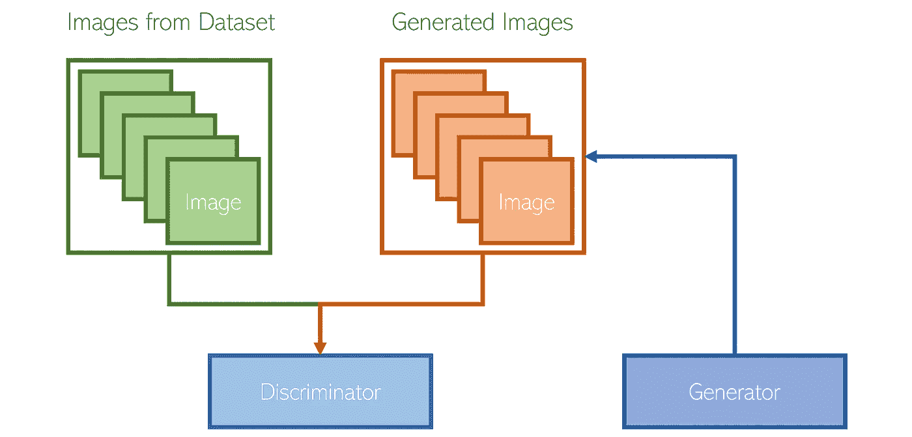
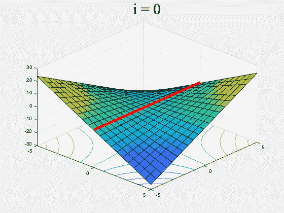
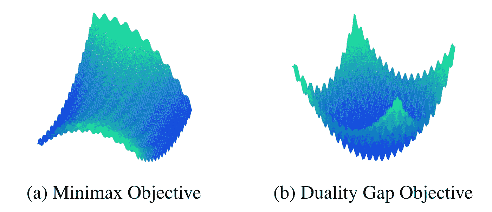
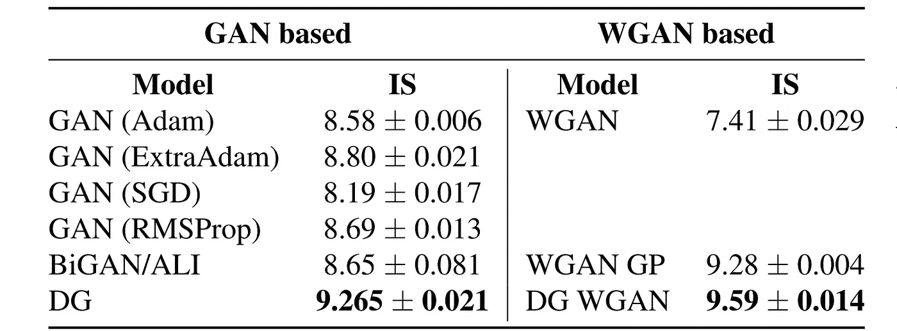

# 消除生成对抗网络中的“对抗”

> 原文：<https://towardsdatascience.com/removing-the-adversarial-in-generative-adversarial-networks-5ba4110d0b8c?source=collection_archive---------17----------------------->

[来源](https://unsplash.com/photos/nAjil1z3eLk)

## 无竞争 GAN 的再思考

生成对抗网络是深度学习的一个重要发展；它的公式启发了新一代的模型集合，它们以各种方式相互作用，产生令人难以置信的结果。

竞争是甘设计的血液——“对抗性”是它的名字。鉴别器和生成器这两个模型相互竞争。理想的结果是:生成器在生成令人信服的图像方面变得很棒，因为它在与一个有价值的对手(鉴别者)竞争。

然而，有趣的是，可以在没有竞争的情况下重构 GAN。这种重构在许多方面都优于竞争对手的 GAN 设计。

作为基础——GANs 设计用于生成数据，最常用于图像(尽管它们也可用于其他目的)。它由两个模型组成:

*   *发电机*。给定一个随机输入作为“种子”，生成一幅图像。
*   *鉴频器*。给定一幅图像，分类它是真的(来自数据集)还是假的(由生成器生成)。

相应地，模型的目标是:

*   *发电机的目标*。为了**最大化鉴别器的损失**，生成与数据集图像无法区分的令人信服的图片。
*   *鉴别器的目标*。**通过对真实或虚假图像进行高性能分类，最大限度地减少鉴别器的损失**。

这种竞争很重要:生成器和鉴别器持续地处于“学习循环”中。如果生成器生成令人信服的图像，鉴别器应该能够绕过它，并对生成器提出新的挑战。如果鉴别器成功地利用了生成器中的某种弱点，后者应该能够解决它。

单模型设计对损失函数进行优化。当模型对损失感到“满意”时，进展通常会在一段时间后停滞。另一方面，在竞争状态下，有两个学习实体——而不是一个。这使得合奏作为一个整体能够持续学习更长的时间。

然而，这可能是一个问题。GANs 中的竞争是以一种可能永远无法解决的往复方式制定的。GANs 的一个常用算法是梯度下降-上升，它在两个步骤之间交替。

1.  发生器执行梯度下降步骤，将鉴频器损耗降至最低。
2.  鉴频器执行梯度上升步骤，使鉴频器损耗最大化。

结果是——没有收敛的保证。发生器和鉴别器轮流混乱地“戳”对方，结果发生器和鉴别器都无法以更稳定的方式工作。这将理想地确保发生器和鉴别器不会“压倒”彼此，或者遵循经常导致不规则训练结果的不可预测的行为。

红线代表理想模型应该收敛的理想解。来源: [OffConvex](http://www.offconvex.org/assets/GDA_spiral_2.gif)

还有另外两个问题。首先，梯度下降-上升的循环模式需要极慢的学习速度。第二，没有办法衡量学习的进展，因为鉴别器和发生器是相互对立的。

梯度下降-上升的其他变体已经提出了解决不收敛问题的解决方案。尽管如此，他们都有下降和上升的核心框架，这是两个模型之间竞争的数学公式。

这就引出了一个问题——GAN 问题可以用一种不涉及梯度下降和上升的方式来重新构建吗？

答案是肯定的。Paulina Grnarova 等人提出“生成最小化网络”(GMN)作为网络，其中*鉴别器和生成器都工作以最小化损失函数，而不是以竞争的方式在相反的方向上工作。*

*人们可以从博弈论的角度来考虑 GAN 框架。鉴别器和生成器是零和游戏中的参与者，也就是说，一个参与者的收益是以另一个参与者的成本为代价的，所有参与者的所有收益和成本总和为零/相互抵消。*

*就本文的目的而言，玩家的效用表示在给定他们的状态和其他玩家的状态的情况下，他们在游戏中“赢”的可能性有多大。也就是说，效用考虑了两个参与者。*

*设 *U* 代表鉴频器的效用。因为这是一个零和游戏，所以生成器的效用是-*U*。因此，我们有以下目标:*

*   *鉴别器想要*最大化*鉴别器的效用。它想增加最坏情况下的效用。*
*   *发生器希望*最小化鉴别器的*效用。它想降低鉴别器的最坏情况效用。*

*在这两种情况下，玩家都试图最大化自己的效用。两个参与者可以联合收敛到一个解决方案，在这个方案中，鉴别器和生成器都不能提高它们的效用。这就是所谓的*纯均衡*，我们可以定义如下(大量滥用符号):*

*至关重要的是，效用 *U* 不是一个恒定的变量，而是根据玩家的当前状态不断变化的。均衡导致了*二元差距*的概念，二元差距可以被认为是两个玩家离达到均衡有多远:*

*因此，鉴别器和生成器的目标都可以被框定为最小化对偶间隙。虽然这是一个零和游戏，但两个模型都将对偶差距最小化，以增加自己的效用。此外，两者都朝着纯粹的平衡努力，这可以被认为是梯度下降-上升的更有组织的目标。*

*从经验上看，使用二元差距作为目标是有希望的。*

*   *收敛速度比其他常用的 GAN 物镜更快。*
*   *就解决方案的位置而言，使用二元差距来转换地貌非常接近真实地貌(见下图)。*

**

*最小最大目标——一个玩家努力上升，另一个努力下降。二元差距目标——两个玩家都努力下降。两者的最优解都在同一个地方。来源: [Gnarova 等人](https://arxiv.org/pdf/2103.12685.pdf)。*

*在性能方面，它远远超过现有的模型。*

**

*IS =初始得分(越高越好)。DG =二元差距。WGAN =的变化。来源:[格纳罗娃等人](https://arxiv.org/pdf/2103.12685.pdf)。*

*总而言之，*

*   *生成敌对网络通常通过梯度下降和上升以竞争的方式进行优化，其中鉴别器和生成器以相反的方向进行优化。*
*   *二元差距是鉴别器和生成器的目标之间的差异。它以一种方式改变了优化前景，使得两个模型都为最小值而优化。*
*   *使用对偶间隙显示了改进的性能、收敛速度和收敛稳定性。*

*在这里看论文[。](https://arxiv.org/pdf/2103.12685.pdf)*

## *感谢阅读！*

*如果你喜欢，你可能会喜欢我的一些关于深度学习研究有趣的最新发展的文章:*

* [## 2021 年值得关注的 5 项激动人心的深度学习进展

### 正在进行的研究的暗流

towardsdatascience.com](/5-exciting-deep-learning-advancements-to-keep-your-eye-on-in-2021-6f6a9b6d2406)  [## 将非图像数据转换成图像进行分类的效果惊人

### 跨越深度学习的边界和障碍

towardsdatascience.com](/turning-non-image-data-into-images-for-classification-is-surprisingly-effective-70ce82cfee27) 

除非另有说明，否则图片由作者创作。*