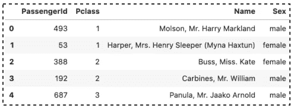
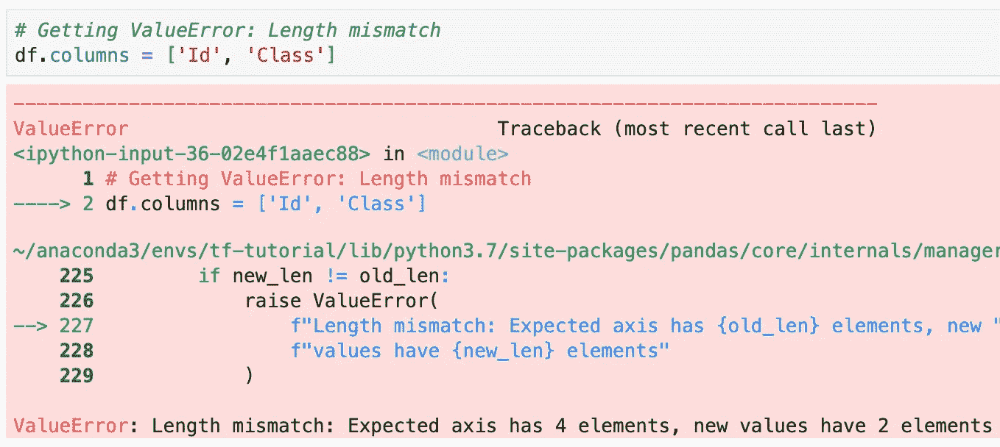

# 重命名熊猫数据框架中的列

> 原文：<https://towardsdatascience.com/renaming-columns-in-a-pandas-dataframe-1d909360ddc6?source=collection_archive---------8----------------------->

## 熊猫帮助你开始数据分析的提示和技巧


克里斯·劳顿在 [Unsplash](/s/photos/change-name?utm_source=unsplash&utm_medium=referral&utm_content=creditCopyText) 上拍摄的照片

在数据分析中，我们可能会处理没有列名或列名包含一些不需要的字符(例如空格)的数据集，或者我们可能只是想重命名列以获得更好的名称。这些都要求我们重命名 Pandas 数据框架中的列。

在本文中，您将学习 5 种不同的方法。这篇文章的结构如下:

1.  将名称列表传递给`columns`属性
2.  使用`rename()`功能
3.  读取 CSV 文件时重命名列
4.  使用`columns.str.replace()`方法
5.  通过`set_axis()`重命名列

为了演示，我们将使用 Kaggle 上可用的 [Titanic 数据集](https://www.kaggle.com/c/titanic/overview)的子集。

```
def load_data(): 
    df_all = pd.read_csv('data/titanic/train.csv')
    # Take a subset
    return df_all.loc[:, **['PassengerId', 'Pclass', 'Name', 'Sex']**]df = load_data()
```



作者图片

> 请查看[笔记本](https://github.com/BindiChen/machine-learning/blob/master/data-analysis/033-pandas-rename-columns/pandas-rename-columns.ipynb)获取源代码。

# 1.将姓名列表传递给`columns`属性

Pandas DataFrame 为我们提供了一个`columns`属性来访问列名。也可以通过直接将新名称列表传递给`columns`属性来重命名列名。

```
# Access column names
>>> df.**columns**
Index(['PassengerId', 'Pclass', 'Name', 'Sex'], dtype='object')# Rename PassengerId to Id, Pclass to Class
>>> df**.columns = ['Id', 'Class', 'Name', 'Sex']**
```


使用`columns`属性重命名列(图片由作者提供)

然而，这种方法的一个缺点是，我们需要为所有列提供名称，即使我们只想重命名其中的一些列。否则，我们将得到一个"**值错误** : **长度不匹配"**:



值错误:长度不匹配

# 2.使用`rename()`功能

Pandas 有一个名为`rename()`的内置函数来更改列名。当您想要重命名一些选定的列时，这很有用。

## 2.1 使用字典映射重命名列

要重命名列，我们可以将字典传递给`columns`参数。键是要更改的列，值是这些列的新名称。我们还可以将参数`inplace`设置为`True`，以便在现有的数据帧中进行更改。

```
# Rename columns
#   PassengerId  ->  Id
#   Pclass       ->  Classdf.rename(
    **columns=({ 'PassengerId': 'Id', 'Pclass': 'Class'})**, 
    **inplace=True**,
)df.head()
```


用熊猫 Rename()重命名列(图片由作者提供)

## 2.2 使用函数重命名列

除了字典映射，我们还可以向`columns`参数传递一个函数。例如，要将列名转换成小写，我们可以传递一个`str.lower`函数:

```
df.rename(**columns=str.lower**).head()
```


用熊猫 Rename()重命名列(图片由作者提供)

我们还可以创建一个自定义函数，并将其传递给`columns`参数。

```
**def toUpperCase(string):
    return string.upper()**df.rename(**columns=toUpperCase**).head()
```

我们也可以使用 lambda 表达式:

```
df.rename(**columns=lambda s: s.upper()**).head()
```

当您需要用相同的命名约定更新许多列或所有列时，这很有用。

## 2.3 重命名索引

原来`rename()`也可以用来重命名索引。让我们首先创建一个数据帧:

```
df = pd.DataFrame(
    { "ID": [1, 2], "City": ['London', 'Oxford']}, 
    index=['A1', 'A2'],
)
```

我们可以使用字典映射来重命名索引:

```
df.rename({ **'A1': 'B1'**, **'A2': 'B2'** })
```


用熊猫 Rename()重命名列(图片由作者提供)

我们还可以传递一个函数，并将`axis`参数设置为`0`或`'index'`

```
df.rename(**str.lower**, **axis=0**)
```


用熊猫 Rename()重命名列(图片由作者提供)

# 3.使用带有`names`参数的`read_csv()`

我们实际上可以在读取 CSV 文件时重命名列。下面是我们可以覆盖列名的方法:

```
new_names = ['ID', 'Survived', 'Class', 'Name', 'Sex']df = pd.read_csv(
    'data/titanic/train.csv', 
    **names=new_names,**           # Rename columns
    **header=0,**                  # Drop the existing header row
    usecols=[0,1,2,3,4],       # Read the first 5 columns
)
```

我们创建了一个列名列表`new_names`，并将其传递给`names`参数。CSV 文件已经包含一个标题行，因此需要参数`header=0`来覆盖列名。

如果你想了解更多关于`read_csv()`的信息，请查看下面的文章。

[](/all-the-pandas-read-csv-you-should-know-to-speed-up-your-data-analysis-1e16fe1039f3) [## 所有你应该知道的熊猫 read_csv()加速你的数据分析

### 一些最有帮助的熊猫技巧来加速你的数据分析

towardsdatascience.com](/all-the-pandas-read-csv-you-should-know-to-speed-up-your-data-analysis-1e16fe1039f3) 

# 4.使用`columns.str.replace()`方法

有一种叫做`columns.str.replace()` [1]的方法允许我们用另一个指定的短语替换一个指定的短语，例如，用下划线替换空格。

```
df = pd.DataFrame(
    { "account id": [1, 2], "uk city": ['London', 'Oxford']}, 
    index=['A1', 'A2'],
)df.columns = df.**columns.str.replace(' ', '_')**
```


用 columns.str.replace()重命名列(图片由作者提供)

该方法也可用于通过`df.index.str.replace()`进行索引。

# 5.通过`set_axis()`重命名列

最后，我们还可以通过设置轴来更改列名。这种方法很好，但是它没有前两种方法有多少优势。

```
df.**set_axis**(**['ID', 'Survived', 'Class', 'Name', 'Sex']**, axis=1)
```


用熊猫 set_axis()重命名列(图片由作者提供)

# 结论

本文展示了在 Pandas DataFrame 中重命名列的 5 种不同方法。以下是总结:

*   `columns`属性是最简单的，但是它要求我们提供所有列的名称，即使我们只想重命名其中的一部分。当处理只有几列的数据帧时，这种方法是明智的。
*   当读取 CSV 文件时，使用带有`names`参数的`read_csv()`来重命名列可能更明智。
*   当您想要重命名一些选定的列时，`rename()`功能是最佳选择。
*   `columns.str.replace()`只有在你想替换字符的时候才有用。注意，向`rename()`传递一个自定义函数也可以做到这一点。
*   最后，我们还可以通过`set_axis()`设置轴来更改列名。

我希望这篇文章能帮助你节省学习熊猫的时间。我推荐你去看看那些 API 的熊猫[文档](https://pandas.pydata.org/docs/)，并了解你可以做的其他事情。

感谢阅读。请查看[笔记本](https://github.com/BindiChen/machine-learning/blob/master/data-analysis/033-pandas-rename-columns/pandas-rename-columns.ipynb)获取源代码，如果您对机器学习的实用方面感兴趣，请继续关注。

## 你可能会对我的其他一些熊猫文章感兴趣:

*   [所有熊猫 json_normalize()你应该知道的扁平化 JSON](/all-pandas-json-normalize-you-should-know-for-flattening-json-13eae1dfb7dd)
*   [熊猫系列实用介绍](/a-practical-introduction-to-pandas-series-9915521cdc69)
*   [使用熊猫方法链接提高代码可读性](https://medium.com/@bindiatwork/using-pandas-method-chaining-to-improve-code-readability-d8517c5626ac)
*   [如何对熊猫数据帧进行自定义排序](/how-to-do-a-custom-sort-on-pandas-dataframe-ac18e7ea5320)
*   [为了数据分析你应该知道的所有熊猫移位()](/all-the-pandas-shift-you-should-know-for-data-analysis-791c1692b5e)
*   [何时使用熊猫变换()函数](/when-to-use-pandas-transform-function-df8861aa0dcf)
*   [你应该知道的熊猫串联()招数](/pandas-concat-tricks-you-should-know-to-speed-up-your-data-analysis-cd3d4fdfe6dd)
*   [Pandas 中应用()和转换()的区别](https://medium.com/@bindiatwork/difference-between-apply-and-transform-in-pandas-242e5cf32705)
*   [所有熊猫合并()你应该知道](/all-the-pandas-merge-you-should-know-for-combining-datasets-526b9ecaf184)
*   [在熊猫数据帧中处理日期时间](/working-with-datetime-in-pandas-dataframe-663f7af6c587)
*   [熊猫阅读 _csv()你应该知道的招数](https://medium.com/@bindiatwork/all-the-pandas-read-csv-you-should-know-to-speed-up-your-data-analysis-1e16fe1039f3)
*   [用 Pandas read_csv()](/4-tricks-you-should-know-to-parse-date-columns-with-pandas-read-csv-27355bb2ad0e) 解析日期列应该知道的 4 个技巧

更多教程可以在我的 [Github](https://github.com/BindiChen/machine-learning) 上找到

参考

*   [1]数据学校:[如何重命名熊猫数据框架中的列](https://www.youtube.com/watch?v=0uBirYFhizE)