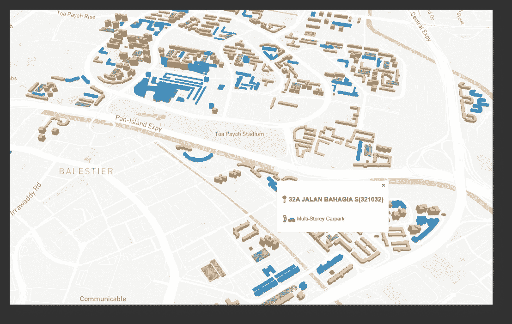
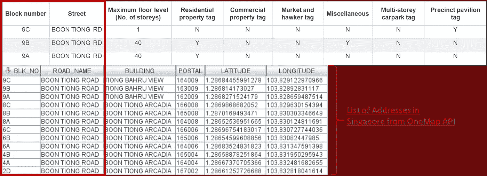
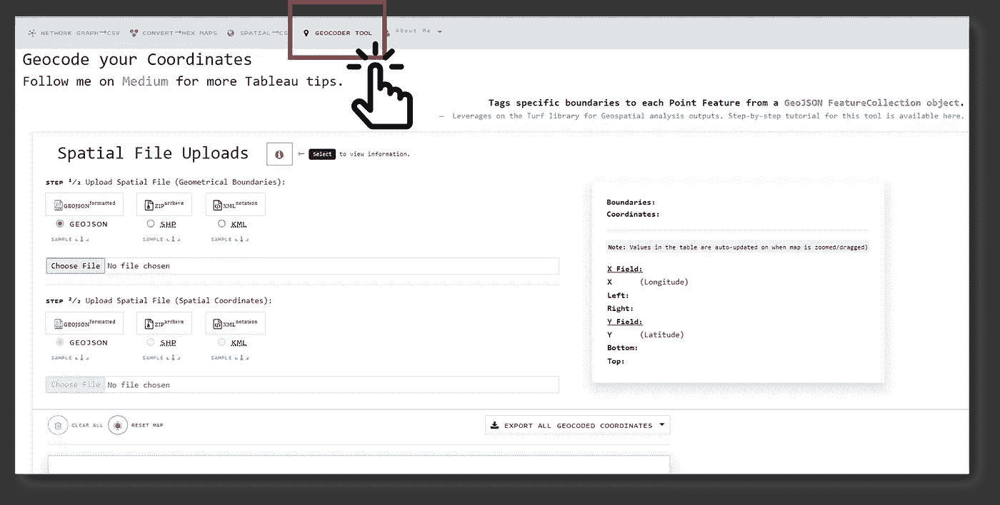
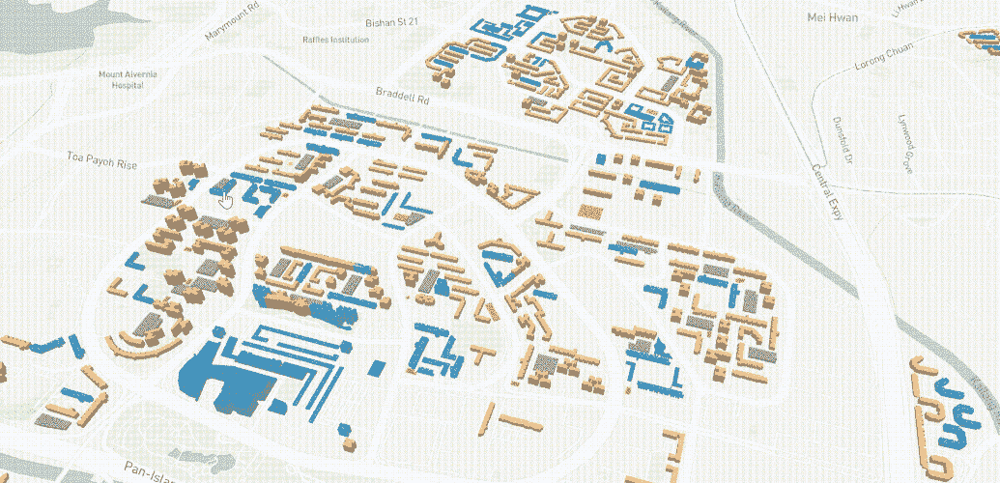

# 在地理空间 WebGL 可视化中渲染 3D 建筑物

> 原文：<https://towardsdatascience.com/render-3d-buildings-in-geospatial-webgl-visualisations-c5325eadb347?source=collection_archive---------10----------------------->

## [实践教程](https://towardsdatascience.com/tagged/hands-on-tutorials)

## 使用 2D GeoJSON 的 MapboxGL、MapTalks & Three.js 渲染 3D 建筑模型

作者截图|在 [MapboxGL](https://www.mapbox.com/) 中渲染的最终输出|展示了新加坡的 HDB 建筑层|在 MapBox WebGL 中部署在 [SG HDB 建筑层](https://sg-hdb-building-layer-in-3d.onrender.com/)

# 辅助项目的灵感

在过去的几个月里，一些国家已经将展示其国内 COVID 热点的地图可视化作为公共服务。一些现成的例子包括雅加达和新加坡:

作者截图|左图截图摘自[Peta Sebaran | Covid 19 . go . id](https://covid19.go.id/peta-sebaran)(雅加达的 COVID 地图 Viz) |右图截图摘自[卫生部(moh.gov.sg)](https://www.moh.gov.sg/)(新加坡的 COVID 地图 Viz)

> 在寻找一个探索的副业时，我被分配了创建右边地图的任务，这是一个壮举，我在几个小时内就完成了。令我非常惊讶的是，那件作品在我的国家成为了几天的头条新闻，完全超出了我的预期。

随着对地图和地理信息系统(GIS)领域越来越多的关注，我决定将我的下一个副业项目的范围也转移到与 GIS 相关的领域。此后，我开始在网上浏览作品寻找灵感，并在[新加坡组屋 3D 建筑开放数据发布会上偶然发现了一个项目|城市分析实验室|新加坡(ual.sg)](https://ual.sg/post/2019/08/25/release-of-3d-building-open-data-of-hdbs-in-singapore/)

作者截图|新加坡住宅公寓的 3D 建筑层记录于[新加坡组屋 3D 建筑开放数据发布|城市分析实验室|新加坡(ual.sg)](https://ual.sg/post/2019/08/25/release-of-3d-building-open-data-of-hdbs-in-singapore/)

## 注意:一定要看看研究团队的上述工作，因为这确实是他们的一个精彩项目😄

由于数据源是开源的，可供公众使用，因此不存在违反保密性的风险，因此我决定开始自己的旅程来重现团队已经完成的工作— **将新加坡的住宅建筑渲染到 3D 地图上，但进行了自己的调整和修改**。

# 数据源和数据处理步骤列表

## 数据来源(1/3): [HDB 建筑信息数据集](https://data.gov.sg/dataset/hdb-property-information)

该数据集中需要注意的关键数据字段是:

作者插图|由于数据集不包含空间信息，因此幸运的是,“街区编号”和“街道”值可用于后续地理编码，以获得其最终坐标。

## 数据来源(2/3):新加坡地址和邮政编码列表

**目的:对每栋住宅楼的点坐标进行地理编码**

虽然[城市分析实验室](https://ual.sg/post/2019/08/25/release-of-3d-building-open-data-of-hdbs-in-singapore/)的研究团队使用了一个名为 [OneMap](https://www.onemap.gov.sg/docs/) 的地图服务提供商，但由于我有一个来自完全相同的 API 的最新地址列表，我只需在相关字段之间进行映射，以标记每个建筑物的**【纬度】** & **【经度】**坐标:

作者插图|为每个建筑标注唯一的邮政编码值和[纬度]+[经度]字段，使每个建筑块能够在地图上进行空间绘制

*—要了解如何抓取某个地区/城市/国家的地址列表，请参考我下面的文章(带代码实现):*

 [## 我是如何用 Java 爬取一个国家的邮政编码列表的

### 从 OneMap.sg 中检索新加坡的 141，848 个邮政编码—代码实现

towardsdatascience.com](/how-i-crawled-the-entire-list-of-postal-codes-in-a-country-with-java-fde6259a8353) 

这一步的输出文件可以在我的 GitHub 链接中找到: [HDB_Only.json](https://gist.githubusercontent.com/incubated-geek-cc/20cdf422ba6488c3ac963a364858be7b/raw/045a9a5c73e4320865b03ce91daecc9cb9aedd29/HDB_Only.json)

为了将文件转换成 GeoJSON 格式，我使用了简单的 JavaScript 并导出了以下内容:

然而，由于上面的输出只给**提供了建筑块的点坐标**，我不得不从别处获取每个建筑的**多边形几何图形**。

> 回想一下，这个项目的结果是输出每个建筑的 3D 模型。因此，先决条件是获得对应于每个积木块的 2D 多边形形状。

## 数据来源(3/3):新加坡建筑层来自[data.gov.sg](https://data.gov.sg/dataset/master-plan-2019-building-layer)

在这一点上，我没有模仿[城市分析实验室](https://ual.sg/post/2019/08/25/release-of-3d-building-open-data-of-hdbs-in-singapore/)团队在**所做的事情，即使用**[**OpenStreetMap(OSM)**](https://www.openstreetmap.org/#map=11/1.3649/103.8229)**社区**提供的建筑物足迹，而是从与[data.gov.sg](https://data.gov.sg/dataset/master-plan-2019-building-layer)的建筑物信息相同的数据源中检索空间数据集。

**数据处理步骤【1/2】:从 GeometryCollection 数组中分离多边形几何对象**

虽然 building layer 数据集包含所需的所有建筑物覆盖区，但为了轻松地建立每个住宅建筑的 3D 网格，我决定将所有嵌入的多边形几何从其多个 GeometryCollection 数组中提取到各个多边形对象中。

## 基本原理:将每个建筑处理为 2D 多边形，然后[挤压](https://all3dp.com/2/blender-extrude-simply-explained/)与读取嵌套多边形数组相比，这将节省渲染阶段所需的大量后续数据处理。

在将标识符字段**【ID】**&**【SUBID】**分配给每个多边形对象后，我成功地导出了以下名为[building _ layer . geo JSON](https://github.com/incubated-geek-cc/sg-hdb-building-layer-in-3D/raw/main/public/data/building_layer.geojson)*(请注意文件大小超过 30MB)*

**数据处理步骤【2/2】:标注每个多边形到点建筑物**

使用 [TurfJS](https://turfjs.org/docs/#centroid) 的功能，我继续利用我在**【地理编码器工具】**选项卡下的 [Tableau 数据实用程序](https://tableau-data-utility.onrender.com/)中部署的 GIS 工具:

作者截图|这是一个 GIS 实用工具和其他 Tableau 实用工具，可从标题菜单中选择，标题菜单是我为自己的一些其他文章创建的|可在:[https://tableau-data-utility.onrender.com/](https://tableau-data-utility.onrender.com/)访问

本质上，上述工具利用 JavaScript 库 [TurfJS](http://turfjs.org/) 来交叉检查每个点坐标与上传的任何多边形几何重叠。

插图作者| [TurfJS](http://turfjs.org/) 返回一个布尔值，表明一个点坐标是否在多边形几何的边界内

对于那些对此工具感兴趣的人，请随意查看下面的文章，该文章深入探讨了如何基于自定义边界实施 [TurfJS](http://turfjs.org/) 进行地理编码:

 [## 使用 Turf.js 通过自定义边界对坐标进行地理编码

### 这个位置属于❝Which 地区/区域/区域吗？❞

towardsdatascience.com](/using-turf-js-to-geocode-coordinates-with-custom-boundaries-bb843b7150d0) 

结果输出由唯一的多边形标识符**【ID】**&**【SUBID】**组成，专门标记到每个点坐标。此后，基于这些标识符字段，最终得到的住宅建筑多边形层被输出为:[hdb _ building _ polygons . geo JSON](https://github.com/incubated-geek-cc/sg-hdb-building-layer-in-3D/raw/main/public/data/hdb_building_polygons.geojson)*(请注意文件大小超过 30MB)*

# 新加坡 HDB 住宅建筑图层的三维渲染

我总共有 2 种方法来模拟新加坡的住宅建筑。在这两个场景中，**【楼层数】**被用作渲染到地图上的建筑物高度的代理。

## 实现 1) [MapBoxGL JS](http://mapbox.com)

作者图片| MapBox web GL 上的 3D 模型地图演示|部署在以下链接

 [## 地图框 WebGL 中的 SG HDB 建筑层

### 一个地理空间 web 应用程序，展示了通过拉伸以 3D 方式渲染的新加坡 HDB 建筑图层。

sg-hdb-building-layer-in-3d.onrender.com](https://sg-hdb-building-layer-in-3d.onrender.com/) 

这个的源代码可以在我的 GitHub Repo: [链接](https://github.com/incubated-geek-cc/sg-hdb-building-layer-in-3D)找到

## 实现 2)[MapTalk JS](https://maptalks.org/)+[three JS](https://threejs.org/)

然而，尽管 MapBoxGL JS 可以漂亮地呈现空间文件，但在以下情况下展示 3D 地图仍是一个挑战— **(1)互联网访问不存在**或 **(2)如果地图服务提供商离线**，因为这将禁用几何图形的 3D 功能。为了说明这种情况，我探索了替代方案，并遇到了[MapTalk JS](https://maptalks.org/)+[three JS](https://threejs.org/)。

ThreeJS + [OneMap 底图](https://www.onemap.gov.sg/docs/maps/grey.html) **(纯离线设置)**中 3D 建筑模型的最终本地实现如下:

作者图片|使用 [ThreeJS](https://threejs.org/) 渲染的 3D 建筑物|根据每个多边形的顶点渲染每个建筑物的网格| [灰度一个地图底图](https://www.onemap.gov.sg/docs/maps/grey.html)使用 [mbtiles](https://docs.mapbox.com/help/glossary/mbtiles/#:~:text=MBTiles%20is%20a%20file%20format,from%20many%20different%20data%20sources) 离线渲染

# 结语:关于 [MapBoxGL](http://mapbox.com) & [三个 j](https://threejs.org/)的思考

总之，虽然 [MapBoxGL](http://mapbox.com) 与 [ThreeJS](https://threejs.org/) 相比提供了更快的实现形式，但是后者支持更大形式的定制，例如照明&摄像机视角。显然，通过比较和对比我上面的两个实现，在 [MapBoxGL](http://mapbox.com) 中，建筑物网格上反射的光照看起来比 [ThreeJS](https://threejs.org/) 中的要模糊一些，因为我没有考虑光照和摄像机角度的计算。

## 进一步探索:

在 2， [ThreeJS](https://threejs.org/) 之间，肯定有更大的勘探潜力，因为它迎合了许多其他 3D 建模领域，而不仅仅是地理空间。然而，在许多情况下，由于时间的原因 [MapBoxGL](http://mapbox.com) 仍然是将 2D 几何图形渲染到 3D 地图上的首选。

## 非常感谢你坚持到这篇文章的结尾！❤ *希望你喜欢我这边项目的叙述，如果你想了解更多 GIS、数据分析& Web 应用相关内容，请随时* [*关注我。会非常感激😀TGIF！*](https://medium.com/@geek-cc)

 [## 通过我的推荐链接加入灵媒——李思欣·崔

### 获得李思欣·崔和其他作家在媒体上的所有帖子！😃您的会员费直接…

geek-cc.medium.com](https://geek-cc.medium.com/membership)