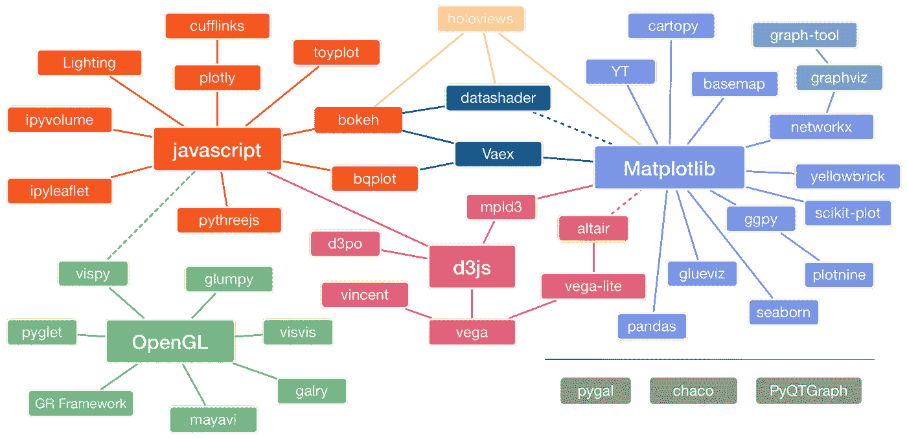
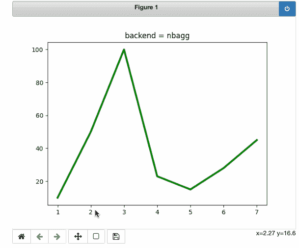
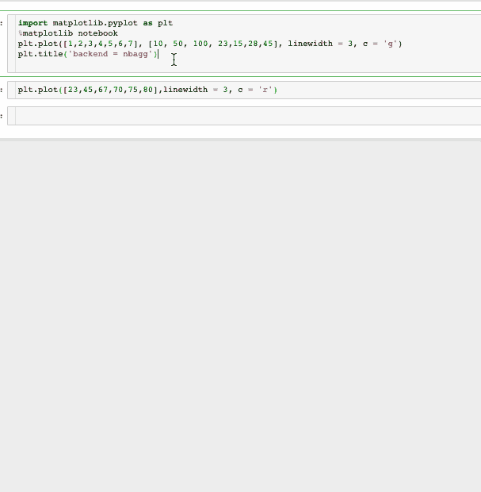
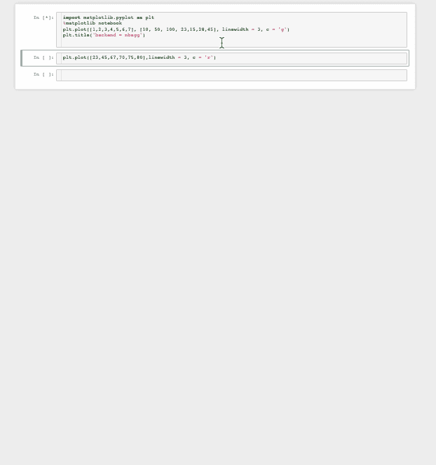
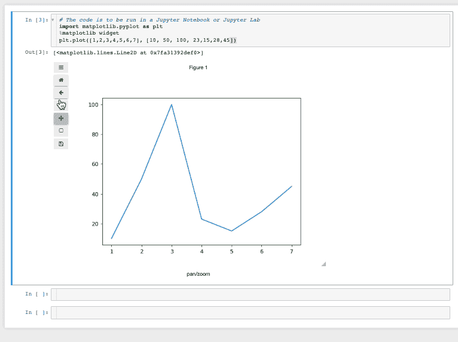

# 使用 Matplotlib 渲染交互式绘图

> 原文：<https://towardsdatascience.com/render-interactive-plots-with-matplotlib-2cf0918d89c9?source=collection_archive---------3----------------------->

## [实践教程](https://towardsdatascience.com/tagged/hands-on-tutorials)

## 支持交互性的 matplotlib 后端研究


作者图片

> 好的图表有效地传达信息。好的图表可以帮助、通知和改进决策。”—但丁·维塔利亚诺

互动图表受到所有人的喜爱，因为它们可以更有效地讲述一个故事。在数据科学和相关领域也是如此。探索性数据分析是数据预处理管道中的一个重要步骤，生态系统中有很多库可以实现这一点。下图很好地概括了这个想法。



来源:[皮兹(尼古拉斯·p·罗杰尔)](https://pyviz.org/overviews/index.html)改编自杰克·范德普拉斯的原图

即使有这么多选择，被亲切地称为 python 可视化包的**祖父的 Matplotlib 仍然是许多人的最爱。然而，缺乏交互性仍然是一个瓶颈。因此，人们设计了一些变通方法，通过一些第三方库来实现交互性。但是您知道吗，如果您使用交互式后端，也可以直接使用 matplotlib 创建交互式绘图。本文将只使用 matplotlib 来研究两个这样的后端，以及它们如何在笔记本中呈现交互性。**

# Matplotlib 后端

Matplotlib 迎合不同的用户，因此支持各种后端。根据[文件](https://matplotlib.org/stable/tutorials/introductory/usage.html#what-is-a-backend):

> “前端”是面向用户的代码，即绘图代码，而“后端”在幕后做所有的艰苦工作来制作图形。

这意味着交互性的先决条件是拥有一个交互式后端。Jupyter 笔记本的默认后端是内嵌后端，由 `%matplotlib inline.`启用，它擅长渲染静态图像，但不提供交互式功能，如平移、缩放或自动更新其他单元格中的数字。

相反，有后端，当启用时，呈现交互式图像。本文将介绍两种常见的方法，以便您可以在数据可视化任务中使用它们。

# `1\.` NBA gg 后端

`[backend_nbagg](https://matplotlib.org/stable/api/backend_nbagg_api.html#module-matplotlib.backends.backend_nbagg)`在笔记本中渲染交互式图形。它利用了为 webagg 后端开发的[基础设施。](https://matplotlib.org/stable/users/prev_whats_new/whats_new_1.4.html#the-nbagg-backend)

**启用后端**

要在 Jupyter 笔记本中启用后端，请键入以下内容

```
%**matplotlib** notebook
```

**用法**

这里有一个简单的例子来展示`nbagg`后端的用法。

```
# The code is to be run in a Jupyter Notebook
import matplotlib.pyplot as plt
%matplotlib notebookplt.plot([1,2,3,4,5,6,7], [10, 50, 100, 23,15,28,45], linewidth = 3, c = 'g')
```



带有 nbagg 后端的交互式 matplotlib 绘图|图片由作者提供

也可以从其他单元格自动更新数字。例如，可以通过下图中后续单元格中执行的代码来更新折线图。



根据作者从 Matploltib | Image 中的其他单元格自动更新图形

使用`blue button`可以轻松关闭该功能🔵位于右侧角落。点击后，交互会停止，下一个单元格会生成新的地块。就这么简单。



关闭交互性|作者图片

交互性不仅限于 **2D** 图，还可以在 **3D** 图中观察到。代码摘自 matplotlib 的官方文档。

```
# The code is to be run in a Jupyter Notebook or Jupyter Labimport matplotlib.pyplot as plt
from mpl_toolkits.mplot3d import axes3d
%matplotlib notebook
fig = plt.figure()
ax = fig.add_subplot(111, projection='3d')# Grab some test data.
X, Y, Z = axes3d.get_test_data(0.05)# Plot a surface plot.
ax.plot_surface(X, Y, Z, rstride=10, cstride=10, )plt.show()
```


使用 Matplotlib(nbagg 后端)创建的 3D 交互式绘图|图片由作者提供

## 不足之处

这个选项工作得很好，可以完成我们的工作，但是它与 Jupyter 实验室不兼容。因此，对于 Jupyter 实验室的用户来说，它没有多大用处。此外，保存选项似乎对我不起作用。有一个更好的替代方案可以达到同样的效果，尽管后端不同。

# 2.Ipyml 后端——更好的选择

ipyml 后端呈现“经典”笔记本和 Jupyter 实验室中的交互式图形。ipyml 后端使用 [ipywidget](https://ipywidgets.readthedocs.io/en/latest/) 框架，需要单独安装。小部件用于在笔记本环境中构建交互式图形用户界面。在滑块、文本框等控件的帮助下。，用户可以与他们的可视化无缝交互。

## 装置

使用`pip`或`conda`可以轻松安装 Ipympl。更多细节请参考[文档](https://github.com/matplotlib/ipympl)。

```
pip install ipymplor conda install -c conda-forge ipympl
```

对于 Jupyter 实验室用户，还需要`node js`和`jupyterLab`扩展管理器。为了更好的体验，建议使用 JupyterLab > = 3。

```
conda install -c conda-forge nodejs
jupyter labextension install [@jupyter](http://twitter.com/jupyter)-widgets/jupyterlab-manager jupyter-matplotlib
```

**启用后端**

为了能够使用`ipyml`后端，需要输入以下内容:

```
%matplotlib widget
```

现在我们已经满足了所有的要求，是时候进行演示了。

## 使用

我们将使用与上一节相同的例子。这也有助于我们比较这两种功能。

```
# The code is to be run in a Jupyter Notebook or Jupyter Lab
import matplotlib.pyplot as plt
%matplotlib widgetplt.plot([1,2,3,4,5,6,7], [10, 50, 100, 23,15,28,45])
```


带有 Ipyml 后端的交互式 matplotlib 绘图|图片由作者提供

ipyml 后端也适用于 3D 可视化。


使用 Matplotlib(ipyml 后端)创建的 3D 交互式绘图|图片由作者提供

在这种情况下，控件位于图的右侧，但除此之外，它与上一节中获得的图非常相似。这是真的，但是有一些微妙的区别，如果你已经注意到:

*   **图可以保存为静态图像。**



将图保存为静态图像|按作者排序的图像

*   **绘图小工具可以通过用户界面调整大小。**

这是一个很棒的特性，我在大多数其他可视化库中都没有见过。


按作者使用 UI |图像调整绘图大小

*   ipyml 后端支持 matplotlib 和所有基于 matplotlib 构建的库(如 Pandas、Geopandas、Seaborn 等)之间的交互。

# 结论

以下是我们在本文中所涉及内容的总结。我们了解了一些 matplotlib 的后端，以及支持交互性的后端。`nbagg`和`ipyml`看起来都很棒，但是`ipyml`有更多更好的特性。我相信您会喜欢试验这些后端，并亲自看看交互特性。如果您喜欢这篇文章，我相信您也会喜欢我写的其他几篇直接或间接涉及 matplotlib 的文章。

*   如果您想使用 matplotlib 库来创建一些引人入胜的动画。

[](/animations-with-matplotlib-d96375c5442c) [## Matplotlib 动画

### 动画是展示一种现象的有趣方式。我们人类总是被动画和…

towardsdatascience.com](/animations-with-matplotlib-d96375c5442c) 

*   使用 Pandas 绘图语法直接创建 Plotly 和 Bokeh 绘图的教程

[](/get-interactive-plots-directly-with-pandas-13a311ebf426) [## 直接和熊猫获取互动剧情。

### 使用 Pandas 绘图语法直接创建 Plotly 和 Bokeh 绘图的教程

towardsdatascience.com](/get-interactive-plots-directly-with-pandas-13a311ebf426) 

*   matplotlib 中的一些高级图，可以让我们的分析更上一层楼。

[](/advanced-plots-in-matplotlib-part-1-30dbb02b09ae) [## Matplotlib 中的高级绘图—第 1 和第 2 部分

### python 可视化环境由几个有用的 Python 库组成。每个图书馆都有自己独特的亮点…

towardsdatascience.com](/advanced-plots-in-matplotlib-part-1-30dbb02b09ae)