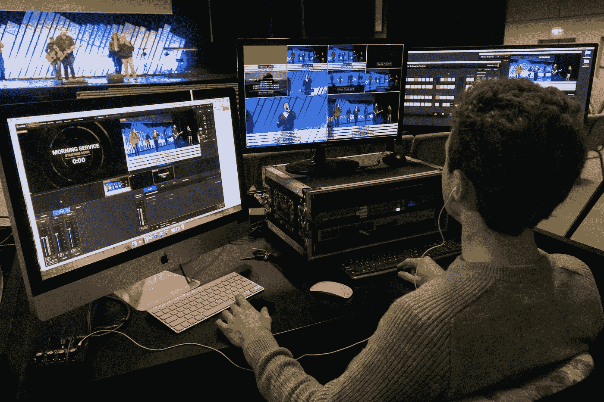
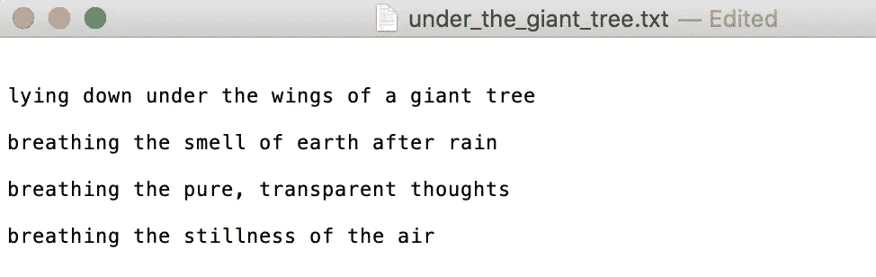
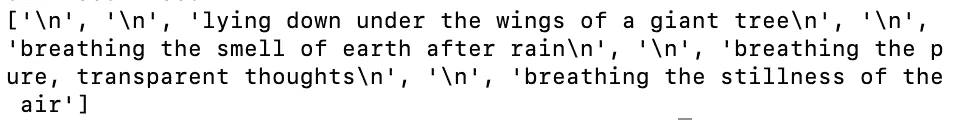
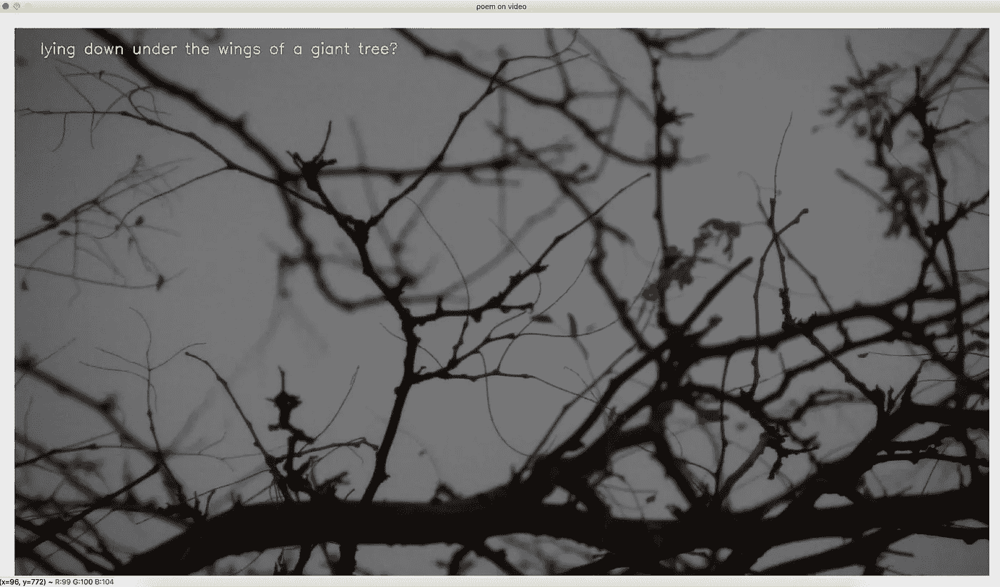

# 使用 Python 渲染视频上的响应文本

> 原文：<https://towardsdatascience.com/rendering-responsive-text-on-video-using-python-a3863c7bbb2e?source=collection_archive---------39----------------------->

## 使用 OpenCV 进行计算机视觉项目实践



BBC 创意在 [Unsplash](https://unsplash.com/s/photos/video-editing?utm_source=unsplash&utm_medium=referral&utm_content=creditCopyText) 上拍摄的照片

在这篇文章中，我将向你展示如何使用 Python 渲染视频中的响应文本。我们将在整个项目中使用 OpenCV python 包。这可能听起来有点难以做到，只是 OpenCV，这是一个计算机视觉包，但在这个项目中，你会看到它在视频编辑方面也很好。我做了一个和这个类似的项目，可以在这里找到[。在那篇文章中，我展示了如何在视频上添加静态文本。但是这一次，我决定通过添加一个可更新的响应文本来增加一些趣味，而不是使用像 MoviePy 这样的视频编辑库。](/rendering-text-on-video-using-python-1c006519c0aa)

我希望你会喜欢这个项目。我们开始吧！

## 目录

*   *简介*
*   *步骤 1 —导入视频*
*   *步骤 2 —阅读文本文档*
*   *步骤 3 —响应文本功能*
*   *最后一步——渲染视频*

# 介绍

正如我前面提到的，我们将在这个项目中只使用 OpenCV 包。而且是超级酷的计算机视觉库。当处理像这样的机器学习或计算机视觉项目时，我们需要首先安装软件包。这样，我们就有权力使用它。我先分享一点 OpenCV 的定义，然后我们安装。

> **OpenCV** (开源计算机视觉库)是一个开源的计算机视觉和机器学习软件库。OpenCV 旨在为计算机视觉应用提供一个公共基础设施，并加速机器感知在商业产品中的应用。作为一个 BSD 许可的产品，OpenCV 使得企业利用和修改代码变得很容易。
> 
> 来源:[https://opencv.org](https://opencv.org/)

现在，让我们使用 PIP 安装它。如果你想知道更多关于安装的信息，请随意搜索“如何将 OpenCV 安装到 Windows 或 macOS”。顺便说一下，在您的终端中运行这一行之前，请确保已经安装了 Python。

```
pip install opencv-python
```

安装完成后，我们可以进入文本编辑器并开始编程。这个项目我不推荐用 Jupyter 笔记本；由于我们将创建一个在新窗口上运行的视频播放器，这样更容易打开和关闭窗口。否则，程序可能会冻结并且没有响应。

这是我在文本编辑器中的第一行。我正在使用 *import* 方法导入我们刚刚安装到程序中的 OpenCV 包。

```
import cv2
```

完美！现在我们可以进入下一步，我们将选择一个视频并将其导入到程序中。

# 步骤 1 —导入视频

这将是一个简单的步骤。我们将做两件事:导入一个视频，并找到视频的帧速率。我们将使用帧速率来计算视频中的秒数，以便我们可以计算不同文本的渲染持续时间。

让我们使用*视频捕获*方法导入视频。如果你想了解更多关于*视频捕捉*的信息，这里是[官方参考](https://docs.opencv.org/3.4/d8/dfe/classcv_1_1VideoCapture.html)页面。

```
tree_video = cv2.VideoCapture('tree.mov')
```

现在，让我们来计算导入视频的帧速率。

```
fps = tree_video.get(cv2.CAP_PROP_FPS)
print(fps)#result
23.97
```

当我运行这条线时，终端上显示出 23.97。这意味着视频基本上是每秒 24 帧。所以 24 次的捕捉循环相当于 1 秒钟的视频。我将分享更多关于我如何在*响应文本函数*步骤中进行计算的信息。

# 步骤 2 —阅读文本文档

在这一步中，我们将从文本文档中读取文本。我们将使用 *open* 函数，这是 Python 自带的内置函数。这是我将要导入的文本文档的截图。



作者图片

这几行是我写的一首诗，叫做《大树下的[](https://sonsuzdesign.blog/2019/12/14/under-the-giant-tree/)*》。*

*确保每个句子都在新的一行。在阅读文本文档时，我们会将每一行转换成一个列表项。*

```
*poem = open('under_the_giant_tree.txt')
poem_lines = list(poem)print(poem_lines)*
```

**

*作者图片*

# *步骤 3 —响应文本功能*

*在这一步，我们将编写一个函数来更新文本。我决定根据不同的时间戳更新文本，但可以随意将其更改为不同的大小写。*

```
*frame_ = 0def text_update(frame_):
 if frames_ < (5*fps):
  text = str(poem_lines[2])
 elif frames_ < (10*fps):
  text = str(poem_lines[4])
 elif frames_ < (15*fps):
  text = str(poem_lines[6])
 elif frames_ < (20*fps):
  text = str(poem_lines[8])
 else:
  text = "no text found"
 return text*
```

*我正在使用 if-else 来了解正在播放的视频的时间戳。开关盒也可以做到这一点。请随意摆弄代码。*

*我已经定义了一个名为" *frame_"* 的新变量来传入视频帧。这样，我可以用秒来计算持续时间。我们已经知道了第一步中的每秒帧数，即 24 fps。在此功能中，文本将每五秒更新一次。我将这首诗的诗句赋给文本变量。*

*现在，让我们进入最后一步。*

# *最后一步——渲染视频*

*太好了！我们差不多完成了。在这最后一步，我们将结合我们迄今为止所做的一切。我们将使用 while 循环来触发程序。我们可以使用“escape”或“q”键结束循环。*

```
*while(True):ret, frame = tree_video.read()font = cv2.FONT_HERSHEY_SIMPLEXon_video_text = text_update(frame_)

  cv2.putText(frame, on_video_text, (50, 50), font, 1, (0, 255, 255),
    2, cv2.LINE_4)frame_ = frame_ + 1cv2.imshow('poem on video', frame)if cv2.waitKey(1) & 0xFF == ord('q'):
    breaktree_video.release()cv2.destroyAllWindows()*
```

*那么上面的代码中发生了什么呢:*

*   *我们从读取导入的视频记录开始。*
*   *然后，我们定义想要用于文本的字体。*
*   *然后，我们调用 *text_update* 函数来更新文本。*
*   *我们使用 *putText* 方法在视频上添加我们的响应文本。[这里的](https://docs.opencv.org/master/d6/d6e/group__imgproc__draw.html)是官方参考链接，在这里你可以了解更多关于 *putText 的信息。**
*   *之后，我们正在更新 frame 变量，以便将正确的帧传递给我们的 *text_update* 函数。*
*   *为了在新窗口上显示视频，我们使用了 *imshow* 方法。*
*   *最后，用 if 语句结束 while 循环。当按下“escape”或“q”键时，程序将停止运行。如果没有按任何键，视频结束时窗口将关闭。*

*下面是我运行程序后播放的视频截图:*

**

*作者图片*

*恭喜你。！我们已经学习了如何使用 Python 在视频上呈现可更新的响应文本。我希望你喜欢这个动手的计算机视觉项目。从事动手编程项目是提高编码技能的最佳方式。如果你今天学到了新东西，我会很骄傲。*

*如果您在执行代码时有任何问题，请随时[联系我](https://sonsuzdesign.blog/)。我尽力在两周内回来。*

> *我们来连线。查看我的[博客](https://medium.com/@lifexplorer)和 [youtube](https://www.youtube.com/behicguven) 以获得灵感。谢谢你，*

## *更多计算机视觉和机器学习相关的项目*

*[](/building-a-face-recognizer-in-python-7fd6630c6340) [## 用 Python 构建人脸识别器

### 使用 OpenCv 库进行实时人脸识别的分步指南

towardsdatascience.com](/building-a-face-recognizer-in-python-7fd6630c6340) [](/extracting-speech-from-video-using-python-f0ec7e312d38) [## 使用 Python 从视频中提取语音

### 使用 Google 语音识别 API 的简单实用项目

towardsdatascience.com](/extracting-speech-from-video-using-python-f0ec7e312d38)*