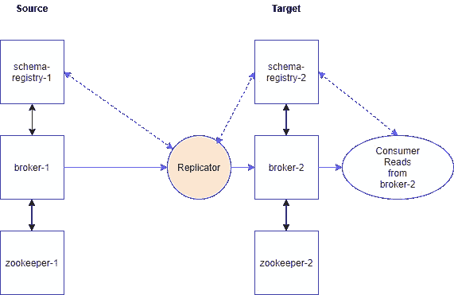

# 将 Avro 消息复制到目标

> 原文：<https://towardsdatascience.com/replicate-avro-messages-to-target-part2-conflicting-schema-exists-on-target-same-subject-4aafb3bad3d?source=collection_archive---------37----------------------->

## 第 2 部分(目标上存在冲突模式，相同主题)

## 当 Replicator 无法将消息插入目标主题，因为主题的主题版本与模式冲突时，该怎么办？


查尔斯·福尔舍尔在 [Unsplash](https://unsplash.com?utm_source=medium&utm_medium=referral) 上的照片

这是一篇基于 [**this**](https://medium.com/p/8489df60fd05/edit) 的后续文章，其中我们讨论了当 replicator 试图将带有 Avro 消息的主题复制到目标时会发生什么，但是目标模式注册中心已经具有驻留在不同主题中的相同模式 ID(它被嵌入到消息中),并且该模式对象与它在源上的完全不同。在本文中，我们将看到当同名主题已经存在于目标模式注册中心，而该注册中心的版本与模式冲突时，Confluent Replicator 将如何表现。

在阅读本文之前，读者需要了解代理、连接、模式注册中心和合流复制器。

下面是我们在源和目标上的环境。



作者图片

## 实际场景:

假设您想要复制“bar”主题，该主题包含模式 id 为“1”的 Avro 消息。在目标端，您有一个单独的 schema-registry 实例，该实例已经注册了版本 1 的 subject，即“bar-value”(主题名称策略)，并且该版本与源 schema registry 上的版本冲突。

下面是重现此问题的步骤，其中汇合复制程序无法将消息插入目标主题。稍后，我将讨论我们可以实现什么变通办法来补救这一点。

1.  **在源卡夫卡上产生消息**

使用 Avro 控制台生成器在源 Kafka 集群的“bar”主题中生成 Avro 消息。

```
/usr/bin/kafka-avro-console-producer \
--broker-list broker-1:9092 --topic bar \
--property schema.registry.url=[http://schema-registry-1:8081](/${SCHEMA_REGISTRY}:8081) \
--property value.schema='{"type":"record","name":"myrecord","fields":[{"name":"f1","type":"string"},{"name":"f2","type":"string"}]}'{"f1":"string1","f2":"string2"}
{"f1":"string1","f2":"string2"}
{"f1":"string1","f2":"string2"}
^C
```

记下我们发送的模式，它由字符串数据类型的“f1”和“f2”字段组成。我启用了 auto schema registered，这意味着如果 schema registry 中没有已经存在的“bar-value”主题，它将首先创建主题(使用主题名 strategy ),然后创建它的第一个版本。还有其他可用的主题命名策略，如记录名策略和主题记录名策略，但为了简单起见，我使用主题名策略。如果您有兴趣了解更多信息，请参考本文档。

让我们检查上面在源环境的模式注册表中创建的主题。

```
curl -s -X GET [http://schema-registry-1:8081/subjects/bar-value/versions](http://${SCHEMA_REGISTRY}:8081/subjects/bar-value/versions)
[1]curl -s -X GET [http://schema-registry-1:8081/subjects/bar-value/versions/1](http://${SCHEMA_REGISTRY}:8081/subjects/bar-value/versions/1)
{"subject":"bar-value","version":1,"id":1,"schema":"{\"type\":\"record\",\"name\":\"myrecord\",\"fields\":[{\"name\":\"f1\",\"type\":\"string\"},{\"name\":\"f2\",\"type\":\"string\"}]}"}
```

**2。检查目标模式注册表上的模式**

正如在上面的场景中所讨论的，主题的主题已经存在于目标模式注册中心，并且有一个版本是冲突的模式。

```
curl -s -X GET [http://schema-registry-2:8081/subjects/bar-value/versions](http://${SCHEMA_REGISTRY}:8081/subjects/bar-value/versions)
[1]curl -s -X GET [http://schema-registry-2:8081/subjects/bar-value/versions/1](http://${SCHEMA_REGISTRY}:8081/subjects/bar-value/versions/1)
{"subject":"bar-value","version":1,"id":1,"schema":"{\"type\":\"record\",\"name\":\"firstrecord\",\"fields\":[{\"name\":\"age\",\"type\":\"int\"},{\"name\":\"phone\",\"type\":\"int\"},{\"name\":\"housenumber\",\"type\":\"int\"},{\"name\":\"distance\",\"type\":\"int\"}]}"}
```

“bar-value”主题下的这个模式有四个字段，它们的类型都是“int”。这使得与我们在源模式注册表中的完全不同。该模式使用 4 个全“int”数据类型的字段，而不是源模式上的 2 个“string”数据类型的字段。这使得两种模式彼此不兼容，当 replicator 试图序列化消息并且无法在目标上插入/注册模式时，我们很快就会看到这一点。查看这个[文档](https://docs.confluent.io/platform/current/schema-registry/avro.html)，了解 schema registry 提供的兼容性设置。

**3。在目标上运行复制器**

将 replicator 作为连接器部署在目标环境的连接实例上。我将使用以下配置。

如果现在检查连接器的状态，我们将看到其失败，并出现错误“io . confluent . Kafka . Schema registry . client . rest . exceptions . restclientexception:正在注册的模式与早期的模式不兼容；错误代码:409 "

下图对此进行了描述


图片由作者提供。复制器尝试在“bar-value”主题中插入新版本，但由于与版本 1 架构不兼容而失败

通过我们在属性“value.converter”中使用的“AvroConverter”类，replicator 在插入时尝试序列化数据，并且还尝试将模式注册为“bar-value”主题下的新版本，因为该模式尚不存在。schema registry 将拒绝在 subject 下注入这个新版本的模式，因为它针对 subject 的“最新”版本(即我们前面看到的“int”数据类型)所发布的内容运行模式兼容性检查，因为这个新发布的模式不兼容(如上所述),因此 replicator 将报错上述错误。

有几个变通办法可以帮助解决这个问题。我会涵盖一些

## 变通办法:

**在 replicator 配置中使用“topic . rename . format”**:使用 replicator 连接器配置中的这个附加属性，您将在目标模式注册表中获得一个新的 subject，replicator 将能够在其下成功创建它的第一个版本。让我们检查一下这个

如果现有连接器仍然存在，请将其删除

```
curl -s -X DELETE [http://connect-2:8083/connectors/bar-avro-replicator](http://${CONNECT}:8083/connectors/bar-avro-replicator)
```

使用“topic.rename.format”重新部署连接器

状态应显示“正在运行”

```
curl -s -X GET [http://connect-2:8083/connectors](http://${CONNECT}:8083/connectors)   
{
    "connector": {
        "state": "RUNNING",
        "worker_id": "x.x.x.x:8083"
    },
    "name": "bar-avro-replicator",
    "tasks": [
        {
            "id": 0,
            "state": "RUNNING",
            "worker_id": "x.x.x.x:8083"
        }
    ],
    "type": "source"
}
```

让我们检查复制器是否创建了一个带有“-repica”后缀的新主题

```
curl -s -X GET [http://schema-registry-2:8081/subjects/](http://${SCHEMA_REGISTRY}:8081/subjects/)
["bar-value","**bar-replica-value**"]
```

是的，“条形图-副本-价值”是根据主题名称策略创建的。现在让我们检查这个主题下的版本

```
curl -s -X GET [http://schema-registry-2:8081/subjects/bar-replica-value/versions](http://${SCHEMA_REGISTRY}:8081/subjects/bar-replica-value/versions)
[1]curl -s -X GET [http://](http://${SCHEMA_REGISTRY}:8081/subjects/bar-replica-value/versions/1)[schema-registry-2](http://${SCHEMA_REGISTRY}:8081/subjects/bar-replica-value/versions)[:8081/subjects/bar-replica-value/versions/1](http://${SCHEMA_REGISTRY}:8081/subjects/bar-replica-value/versions/1)
{"subject":"bar-replica-value","version":1,"id":**2**,"schema":"{\"type\":\"record\",\"name\":\"myrecord\",\"fields\":[{\"name\":\"f1\",\"type\":\"string\"},{\"name\":\"f2\",\"type\":\"string\"}],\"connect.version\":1,\"connect.name\":\"myrecord\"}"}
```

现在，replicator 已经成功创建了此模式，请注意此版本引用的模式 ID，即“ **2** ”。现在是时候从目标卡夫卡的“酒吧复制品”主题中消费我们的信息了。

```
/usr/bin/kafka-avro-console-consumer \
--property print.schema.ids=true \
--property schema.id.separator=: \
--property schema.registry.url=[http://schema-registry-2:8081](/${SCHEMA_REGISTRY}:8081) \
--bootstrap-server broker-2:9092 --topic bar-replica --from-beginning
{"f1":"string1","f2":"string2"}:**2**
{"f1":"string1","f2":"string2"}:**2**
{"f1":"string1","f2":"string2"}:**2**
```

消费者还运行并通过查找模式 ID“2”成功地反序列化了消息。如果你需要更多关于为什么我们看到的模式 ID 是“2”而不是“1”的信息，那么看看这篇文章</replicate-avro-messages-to-target-part1-conflicting-schema-exists-on-target-8489df60fd05>****有更多的细节。****

******删除目标模式注册表上的版本:**一个简单的选项(但不总是一个选项)是删除目标模式注册表上“bar-value”主题的版本“1”(这是冲突的)。****

```
**curl -s -X DELETE [http://schema-registry-2:8081/subjects/bar-value/versions/1](http://${SCHEMA_REGISTRY}:8081/subjects/bar-value/versions/1)     
1**
```

******为“bar-value”subject**设置“NONE”兼容性设置:同样，这也很容易做到，只需将“bar-value”subject 的兼容性设置更改或更新为 NONE，复制器应该能够插入新的模式并继续复制消息。****

****获取当前配置设置****

```
**curl -s -X GET [http://schema-registry-2:8081/config/bar-value](http://${SCHEMA_REGISTRY}:8081/config/bar-replica-value)
{"error_code":40401,"message":"Subject not found."}**
```

****不要被这个误导性的错误所迷惑。当不存在主题级兼容性配置时，它将显示此错误。****

****更新主题兼容性设置。****

```
**curl -s -X PUT -H "Content-Type: application/json" [http://schema-registry-2:8081/config/bar-value](http://${SCHEMA_REGISTRY}:8081/config/bar-replica-value) --data '{"compatibility": "NONE"}'
{"compatibility":"NONE"}**
```

****如果您现在尝试执行 GET，您应该能够看到当前适用的兼容性设置。****

```
**curl -s -X GET [http://schema-registry-2:8081/config/bar-value](http://${SCHEMA_REGISTRY}:8081/config/bar-replica-value)
{"compatibilityLevel":"NONE"}**
```

****有了这个，复制者应该可以继续了。****

> ****请注意，设置无兼容性设置首先会破坏数据治理的目的。因此，我们在设置“NONE”时应该非常小心，因为这实际上禁用了 schema registry 为我们进行的兼容性检查，并且在生产环境中使用是不安全的。****

## ****结论:****

****通过使用 replicator 连接器的“topic.rename.format”属性，将会自动创建一个新的主题，并注入 replicator 从源读取的新模式(在反序列化时)。在我看来，这是最安全的选择。****

****</replicate-avro-messages-to-target-part1-conflicting-schema-exists-on-target-8489df60fd05> ****