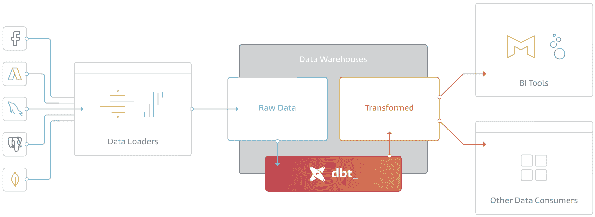
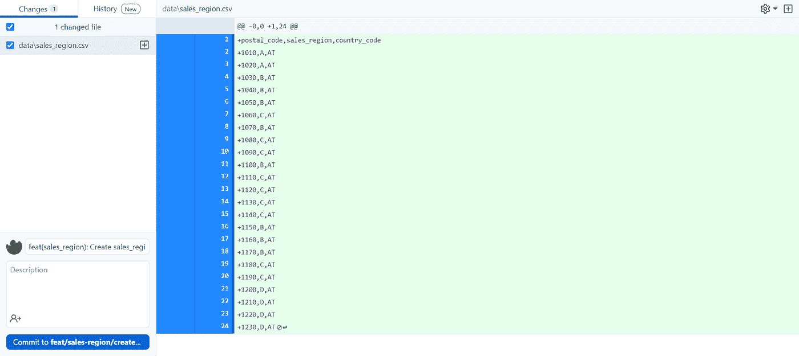
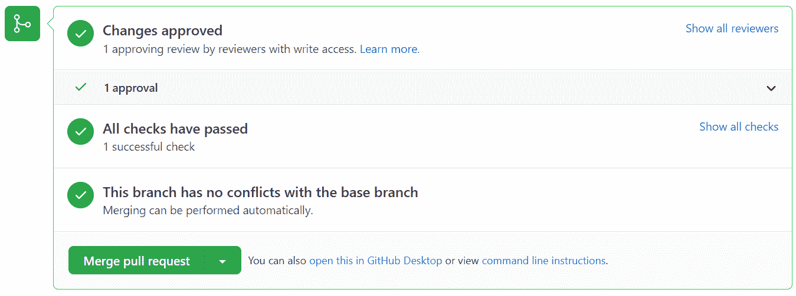
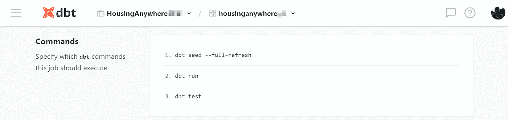

# 使用 dbt 种子将 csv 文件复制到您的数据仓库

> 原文：<https://towardsdatascience.com/replicating-csv-files-to-your-data-warehouse-with-dbt-seeds-74bab7f0dca8?source=collection_archive---------19----------------------->

## 管理序列化 csv 文件的简单而优雅的方式

照片由 [Kian Lem](https://unsplash.com/@kianlem?utm_source=medium&utm_medium=referral) 在 [Unsplash](https://unsplash.com?utm_source=medium&utm_medium=referral) 上拍摄

在 [HousingAnywhere](https://housinganywhere.com/) ，我们使用 [dbt](https://www.getdbt.com/) 进行数据建模，以创建简洁的视图和物化，作为交易数据表和分析师&数据科学家之间的一层，他们将这些数据用于他们的应用。dbt 不仅仅是一个创建模型的好工具，它还提供了一个非常方便的方法将 csv 文件从 GitHub 复制到您的数据仓库。以 GitHub 作为起点有很多好处；序列化/版本控制、同行评审和低/无准入门槛(核心功能是免费的，许多组织已经在使用 GitHub)。我们一直在使用 dbt 种子特性，它提供了这种功能，在过去非常成功地存储了很少改变并且依赖于手动调整的业务逻辑。

## 什么是业务逻辑，为什么应该将它存储在数据仓库中

几乎所有商业智能(BI)系统中都实现了业务流程和业务规则。因为这两者经常会发生变化，所以它们应该以一种易于维护的方式在软件系统中定义。在软件工程、数据科学和商业智能等领域，维护这样的变更通常通过版本控制系统(VCS)来实现。目前，版本控制系统由分布式版本控制工具主导，如 Git——结果是 Git 存储库即服务(GitHub、GitLab、Bitbucket)。

将业务规则存储在这样的服务中非常有益，因为它为您提供了将所有内部业务定义存储在一个集中存储库中的机会。它促进了简单的可维护性，因为如果修改这些规则，只有一个地方需要调整。此外，通过使用 Git 的版本控制和同行评审特性，它提供了强大的透明性和可问责性。

## dbt 和种子

dbt(数据构建工具)是一个命令行工具，使数据分析师和工程师能够更有效地转换他们仓库中的数据。dbt 的主要用例是 ELT 中的 T。它不提取或加载数据，但它非常擅长转换已经加载到您的仓库中的数据。这种“加载后转换”架构被称为 ELT(提取、加载、转换)。

*来源:*[*【https://blog.getdbt.com/what-到底-是-dbt-/*](https://blog.getdbt.com/what--exactly--is-dbt-/)

可以非常容易地建立 dbt 部署和 git 存储库之间的连接。启用这个连接后，dbt 将总是知道存储库中模型的当前状态。它还提供了其他很棒的特性，比如在 GitHub 上打开拉请求时自动构建临时 CI 模式的[触发器以及种子特性。](/setting-up-a-ci-using-dbt-cloud-and-snowflake-f79eecbb98ae)

种子是 dbt 项目(通常在数据目录中)中的 CSV 文件，dbt 可以使用 **dbt seed** 命令将这些文件加载到数据仓库中。因为这些 CSV 文件位于您的 git 存储库中，所以它们是受版本控制和代码可审查的。种子最适合不经常改变的静态数据。

dbt 种子的良好使用案例包括:

*   将城市或邮政编码映射到地区(例如，报告负责不同地区的销售团队)
*   用于报告实际 KPI 与目标 KPI 的公司 KPI 目标
*   财务分析的总帐定义(边际贡献、CAC、CPA)
*   为其他 dbt 模型定义配置(例如，通过 dbt 进行[数据匿名)](/data-anonymization-layer-using-snowflake-and-dbt-c5f84e398358)
*   员工帐户 id 列表

## *工作流程*

1.  创建 dbt 项目

重要的事情先来。您需要[创建一个 dbt 项目](https://docs.getdbt.com/tutorial/create-a-project-dbt-cloud)并建立到您的存储库和您想要加载数据的目的地的连接。

2.在本地创建或编辑种子文件(默认情况下在 data 文件夹中或在 dbt_project.yml 中指定),并在 GitHub 上提出一个 Pull 请求

通过 GitHub 提高公关

3.同行评审更改和合并请求

审核和批准变更

4.在您的项目上运行 **dbt seed** (或者更好:设置一个作业来按计划运行 **dbt seed**

运行“dbt 种子”

如前所述，dbt 最终是一个命令行工具。通过运行这 3 个简单的命令，整个工作负载被执行。

**dbt seed —完全刷新**—dbt seed 命令将位于 dbt 项目的数据路径目录(默认情况下，可以在配置文件中更改)中的 csv 文件加载到数据仓库中。默认情况下，dbt 截断现有的表并重新插入数据。如果列被重命名，或者新列被添加到 csv 文件中，这些语句将会失败，因为表结构已经改变。 **—完全刷新**标志将强制 dbt 在重建表之前删除它。

dbt_project.yml

**dbt run —** 在大多数情况下，种子将被用作创建下游模型的基础。 **dbt run** 针对当前目标数据库执行编译后的 sql 模型文件。dbt 连接到目标数据库，并使用指定的具体化策略运行具体化所有数据模型所需的相关 SQL

**dbt 测试—** 确保数据质量并检测不符合质量要求的情况是每个可靠应用的重要组成部分。 **dbt 测试**将根据生产数据运行项目中定义的所有测试，并通知您每个失败的测试。