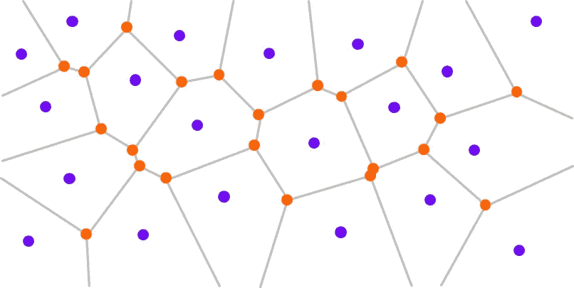
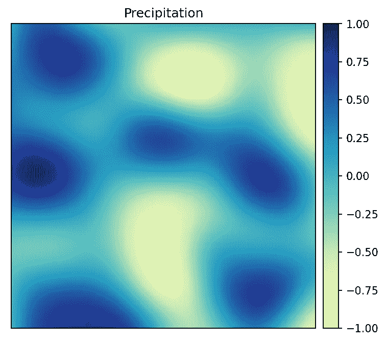
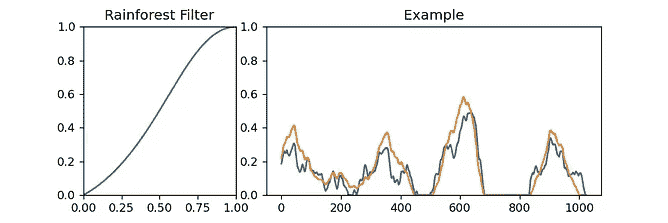

# 用 Python 复制《我的世界》世界一代

> 原文：<https://towardsdatascience.com/replicating-minecraft-world-generation-in-python-1b491bc9b9a4?source=collection_archive---------0----------------------->

## 使用 Voronoi 图和大量柏林/单纯形噪声

图片作者。

《我的世界》，有史以来最畅销的游戏，以其像素化的积木和*无限世界*而闻名，有着惊人的程序生成的地形，有洞穴，水域，甚至不同的生物群落。

过程生成是计算机图形学的重要组成部分。它主要用于视频游戏或电影中。它有助于生成没有“机器般”感觉的随机结构。

同样，过程化生成在机器学习中起着重要的作用。它可以帮助生成难以收集的数据。训练机器学习模型需要庞大的数据集，收集和处理这些数据集可能很困难，成本也很高。按程序生成数据可以很容易地适应所需数据的确切类型。

我小时候经常玩《我的世界》，我总是想知道它是如何产生永无止境的世界的。在本文中，我将尝试用 Python 来复制这一点。

# 定义和限制

我们首先要定义我们的世界将如何产生。

*   世界是三维的、离散的(由单位大小的块组成)，在 z 轴上由`0`和`255`界定，在 x 轴和 y 轴上没有界限。
*   世界包含生物群落，每一个都跨越大的水平区域，定义了生物群落所占据的空间的性质。
*   世界包含河流、湖泊和海洋。

每个世界都是由一粒种子定义的。**同样的种子将永远产生同样的世界。**

# 生成世界

一大块。图片作者。

为了使生成过程简单，我们将把我们的世界分成块。每个块将占用 1024×1024×256 个块的空间。

每个块都是单独生成的。这将帮助我们保存、加载世界，并轻松生成世界的更多部分。

# 生物群落边界

我们要做的第一件事是将我们的世界分成 x 轴**和 y 轴**上的细胞，每一个细胞都是特定的生物群落。我们将为每个细胞指定一个代表其中心的点。

## Voronoi 图

给定一组点，Voronoi 图将帮助我们把我们的世界分成单元。Voronoi 图背后的主要思想是一个点所属的单元是其中心最近的单元。

移动的点用离它最近的点的颜色来着色。图片作者。

我们可以对 **xy** 平面中的每一个点都这样做，以获得这 3 个点的 Voronoi 图。

3 点的 Voronoi 图，动画。作者图片

虽然这种方法很有效，但是它非常慢，尤其是当点数很多的时候。

20 点的 Voronoi 图，动画。图片作者。

在 Python 中，`scipy.spatial`有一个名为`Voronoi`的类，可以更高效地计算 Voronoi 图，并为我们提供更多关于图的信息。

作者使用 scipy.spatial. Image 计算的 Voronoi 图。

`scipy.spatial`的`Voronoi`返回一个顶点、区域和脊的列表，这在以后会很有用。

Voronoi 图中的区域和脊。图片作者。

这些额外的点有助于形成所谓的**德劳内镶嵌**。

Voronoi 镶嵌上的 Delaunay 镶嵌。图片作者。

## 劳埃德松弛算法

现在，我们必须生成细胞所在的随机点。

如果我们使用来自`numpy.random`的类似`random`的函数来生成多个点并计算其 Voronoi 图，我们会得到以下结果:

随机点的 Voronoi 图。图片作者。

你可能已经注意到有些点彼此靠得太近了。这就是所谓的集群。细胞应该是均匀分布的。

当我们缩小(或增加点数)时，这一点更加明显:

请注意一些点是如何聚集在一起的，而其他区域是空的。图片作者。

为了解决这个问题，我们必须把这些点分开。

解决这个问题的一种方法是使用[劳埃德松弛算法](https://en.wikipedia.org/wiki/Lloyd%27s_algorithm)，该算法利用了点的 Voronoi 图。

劳埃德算法**背后的思想是计算我们点的 Voronoi 图，然后将每个点移动到其单元的*质心*。并且重复该过程一定次数**

多边形的质心是其顶点的平均值。

这是一个 Voronoi 图，单元格点用蓝色**表示，单元格质心用红色**表示。

带有单元点(蓝色)和单元质心(红色)的 Voronoi 图。图片作者。

然后，我们可以一遍又一遍地用细胞质心(红色)替换细胞点(蓝色)。

劳埃德松弛算法动画。图片作者。

这会产生更好看的随机点。

# 柏林/单工噪声:我们为什么需要它？

为了生成随机地形，我们必须生成随空间随机变化的属性，如海拔、温度或降雨量。

人们可以想到使用`random`，这是有道理的。

我们将为我们世界中的 **xy** 平面上的每个区块生成一个 0 到 255 之间的随机数。

这会产生以下结果:

这太随意了。图片作者。

嗯，这看起来更像一个二维码，而不是《我的世界》世界。

问题是我们的随机值没有连贯的结构。每个值都是单独生成的，与相邻值无关。

为了克服这个问题，我们将使用[柏林噪声](https://en.wikipedia.org/wiki/Perlin_noise)。

柏林噪音。图片作者。

柏林噪音是由肯·柏林在 1983 年发明的。不像普通的随机噪音，它是有结构的。它看起来更接近于自然界中发现的随机模式(云、森林分布)。

单工噪声也是由肯·佩林自己创造的。它比柏林噪声有许多优点。柏林噪声和单纯形噪声今天被用于几乎所有的程序生成。

我们将使用 Python 中名为`noise`的单工噪声实现。(Python 模块)。

我们有 4 个变量可以玩:**音阶**，**八度音阶**，**持续性**，**空隙度**。我不会解释每一个是做什么的，但是我会给你留下我制作的这些 gif，让你自己感受一下。

参数变化时的柏林噪声。图片作者。

返回的噪声值介于-1 和 1 之间。

## 细胞的规则性——模糊边界

虽然我们上面为细胞生成的点间隔得很好，但我们的细胞看起来几乎像正多边形。

为了克服这个问题，我们将使用柏林噪声。对于每个点，我们将在其邻域中选择一个随机点，并将新选择的点的单元分配给当前点。

为此，我们需要两张噪波图，一张用于 x 轴的位移，另一张用于 y 轴。

我们可以通过将噪声(值在-1 和 1 之间)乘以一个恒定长度来控制边界的噪声。

边界噪声长度动画。图片作者。

边界噪声八度动画。图片作者。

# 选择生物群落

《我的世界》有 60 多个不同的生物群落。每个都有不同的属性。既然我们已经把我们的世界分成了细胞，我们必须给每个细胞分配一个生物群落。为此，我们将使用柏林噪声。

## 温度-降水图

我们将根据两个参数定义生物群落:**温度**和**降水**，使用**温度-降水图**。在环境生物学中，生物群落通常是这样定义的。

*纳瓦拉的《气候对陆地生物群落的影响》属于公共领域，CC0*

我们将以此图为灵感，设计我们自己的温度-降水量图。

温度-降水图。图片作者。

## 温度和降水图

现在，我们将使用柏林噪声为每个像元分配一个温度和一个降水量值。我们将生成两个图，每个图包含块中所有块的噪声值。

温度和降水地图。图片作者。

## 直方图均衡

如果我们使用上面的温度和降水图，我们会遇到一个问题。基于柏林噪声的值不一致。接近 *0* 的值比接近 *-1* 或 *1* 的值多。这区分了温度-降水图边缘的生物群落。

为了进一步理解这种不均匀性，我绘制了温度和降水图的 1D 直方图和令人惊叹的 2D 直方图。

温度和降水图的 1D 直方图(左)和 2D 直方图(右)。图片作者。

如你所见，边缘的值受到歧视。为了解决这个问题，我们将使我们的价值观平等。

[直方图均衡](https://en.wikipedia.org/wiki/Histogram_equalization)用于调整图像的曝光。为此我用了`skimage`的`exposure`函数。

均衡的直方图是平坦的。

温度和降水图的均衡 1D 直方图(左)和均衡 2D 直方图(右)。图片作者。

由于我们分别均衡了温度和降水量，2D 直方图并不完全平坦。

我们可能不希望直方图完全平坦。如果我们想对直方图的平坦度有一些控制，我们可以混合不均衡的值和均衡的值。

直方图均衡化动画。图片作者。

现在，我们可以控制我们的价值观有多平等。

## 平均单元格

我们将对每个像元内的地图进行平均，以获得每个像元的温度和降水量值。

细胞温度和降水图。图片作者。

现在，每个单元格都有一个温度和一个降水值，在 *-1* 和 *1* 之间。

## 量化

为了简化我们处理温度和降水值的方式，我们将把它们转换成整数。我们将使用`np.uint8`作为数据类型来存储这些值。

为了转换上面映射中的值，我们将它们映射到[0， *255]* ，并将值四舍五入为最接近的整数。

量子化不会改变温度和降水的样子。

现在，我们可以通过一张 *256×256* 的图像来定义我们的温度-降水量图。

温度-降水图。图片作者。

## 生物群落图

我们可以使用温度-降水图、温度图和降水图为每个细胞指定一个生物群落。对每个单元格都这样做，会产生以下结果:

彩色生物群落地图。图片作者。

# 高度图

我们二维世界中的每一个点都有一个高度。为了生成高度图，我们将使用噪波图。

高度遮罩。图片作者。

使用这个高度图(值在-1 和 1 之间)，我们可以创建一个空白的遮罩。大于 0 的值是陆地，小于 0 的值是海洋。

陆地面具。图片作者。

结合之前生成的图像:

应用了土地遮罩的生物群落地图。图片作者。

为了可视化的高度，我们将添加一些阴影到地图上。

带土地掩膜的生物群落图(左)，带土地掩膜的阴影生物群落图(右)。图片作者。

到目前为止，结果看起来很有希望。但是高度与生物群落无关。我们需要改变每个生物群落的高度图。我们将通过在高度图上应用一个函数来实现这一点。

## 高度图细节

我们将使用两个不同细节层次的高度图。这是通过改变柏林噪声中八度音阶的数量来实现的。

这是我们的两张身高图:

清晰(左)和平滑(右)高度图。图片作者。

## 高度贴图过滤器

我们将使用陆地中的高度图(值在 0 和 1 之间)。每个生物群落都将使用两种高度图的组合(平滑和清晰的高度图)。然后对其应用过滤器(函数)。

应用滤镜的想法将受到 Photoshop 曲线的启发。我们将使用**三次贝塞尔曲线**来定义一个我们将应用于高度图的函数。

以下是一些过滤器示例:

我们将为每个生物群落创建并调整过滤器。

沙漠，稀树草原和热带林地过滤器。图片作者。

苔原、季节性森林和雨林过滤器。图片作者。

温带森林、温带雨林和北方过滤器。图片作者。

为了将这些滤镜应用到我们的高度贴图中，我们将使用遮罩。蒙版是一张地图，在某个生物群落区包含 1，在其他区包含 0。

生物群落面具。图片作者。

如果我们使用硬地图，我们将有巨大的高度变化。这就是为什么我们在使用口罩之前会将它们羽化。我们还将从这张地图中移除海洋(通过乘以陆地遮罩)，因此我们只对陆地应用滤镜。

羽化(模糊)的生物群落遮罩(左)，只有陆地(右)。图片作者。

我们将使用上面的遮罩在高度图上应用每个生物群落的过滤器。我们得到以下结果:

## 最终的 3D 高度图结果

我们可以使用 Blender 来渲染这些 3D 地图。我们将在 Blender 的置换修改器中使用高度贴图。

彩色生物群落的高度图渲染。用搅拌机做的。图片作者。

彩色生物群落的高度图渲染。用搅拌机做的。图片作者。

彩色生物群落的高度图渲染。用搅拌机做的。图片作者。

# 河流和湖泊

## 边界

我们将在生物群落的边界之间增加河流。首先，我们需要计算生物群落之间的界限。

为此，我们将遍历地图上的每个点。如果该点的所有邻居都属于同一生物群落，则该点不在边界上。如果它的邻居有一种以上的生物群落，那么它就是边界的一部分。

边框像素的插图。图片作者。

边界的示例。图片作者。

将这种技术应用于我们的生物群落图会产生以下结果。

生物群落地图(左)和河流(右)。图片作者。

我们可以通过改变包含邻居的盒子的大小来控制河流的大小。

大小不一的河流。图片作者。

我们将使用 2 种不同的河流:生物群落河和细胞河。生物群落河比较大，放在生物群落的边界，而细胞河比较小，放在细胞的边界。然后，我们使用陆地遮罩将河流限制为陆地。

河流也将被限制在中低海拔。

河流。图片作者。

我们将使用这个河流遮罩来更改高度图。我们将模糊这个河流蒙版，然后用原来的河流蒙版来蒙版。这将创建一个在河流中间具有高值的地图，这些高值在河流的边缘慢慢淡化为低值。

这里是河流面具与模糊和蒙面河流面具的比较。

河流面具。图片作者。

河流面具的横截面。图片作者。

我们将使用此地图在高度图中“雕刻”河流。

生物群落图(左)和带有河流的生物群落图(右)。图片作者。

# 树木和植被

为了给我们的地图添加树，我们将使用前面讨论过的劳埃德松弛算法。这种采样方法有助于我们生成间隔开的随机点。

随机采样点(左)，放松点(右)。图片作者。

我们将根据生物群落生成不同密度的树木。

不同等级的树木密度。作者图片，

我们将把一组树木与之前讨论过的生物群落遮罩和土地遮罩结合起来，用树木填充生物群落。每个生物群落都有不同的密度，当然也有不同种类的树木。

有树的生物群落地图。

我的混合技能限制了我用树来可视化 3D 地图。

# 源代码

> 这里有一个 [**Jupyter 笔记本**](https://github.com/BilHim/minecraft-word-generation) 包含了文章中所有步骤的代码。

**警告:**代码很乱，没有文档记录。

# 结论

程序生成是计算机图形学中非常强大的一部分。它让生成的内容看起来很随意，但却很有艺术感和结构感。如前所述，这可以用于机器学习，以生成覆盖使用正常真实世界数据收集难以覆盖或成本高昂的区域的数据集。

这篇文章只是一个有趣的项目，我想做一年多。一路走来，我学到了很多概念，也获得了很多乐趣。还欠缺很多。例如，我需要创建地下洞穴、村庄，并创建一个可以无缝组合组块的算法。

# 灵感

在写我的文章时，我受到了许多文章的启发。如果你喜欢这篇文章，那么你肯定也想看看这些:

*   [流浪者——地图生成| pvigier 的博客](https://pvigier.github.io/2019/05/12/vagabond-map-generation.html)
*   [为游戏生成多边形地图(stanford.edu)](http://www-cs-students.stanford.edu/~amitp/game-programming/polygon-map-generation/)
*   【程序世界:2016 年 7 月(procworld.blogspot.com)T2

你也可以看看我之前的一篇关于用 Python 进行 [**交通模拟的文章，这篇文章讲述了如何程序化地生成交通数据。**](/simulating-traffic-flow-in-python-ee1eab4dd20f)