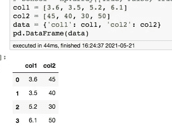
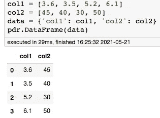

# 复制 Python 的熊猫库

> 原文：<https://towardsdatascience.com/replicating-pythons-pandas-library-4c959f8bbbe3?source=collection_archive---------24----------------------->

## 面向对象编程和熊猫如何在幕后工作

# 语境

我已经和 Python——主要是熊猫——一起工作了好几年，我喜欢它；它使用起来非常简单，并且有足够的方法来为任何需求进行非常复杂的数据建模。

然而，如果我所做的大部分都是`read_csv, filtering, and groupby`的话，我声称了解 Python 可能有点原始。因此，为了在更有经验的 Python 程序员面前不显得无能，我决定稍微挖掘一下熊猫[源代码](https://github.com/pandas-dev/pandas)来找出事情是如何在引擎盖下工作的，*就像深入了解本质的那种*，而不是成为其各种应用程序的盲目用户。我想带着几个目标离开这个练习:(1)对 Python 中的 OOP 有一些实践经验，(2)学习 Python 中的包是如何工作的，以及(3)理解 Pandas 是如何使用它的时髦功能的。

在这篇文章中，我将详细介绍我的一些发现，以及通过一个简单的代码来内化所学到的知识，在这里，我试图重新创建 pandas 的一个核心组件的更简单的版本:**它的 DataFrame 类**。如果你是 Python 的新手，或者只是一个好奇的读者，那么这篇文章就是为你准备的！

先不说这个，让我们把这篇文章分成几个部分:

*   先决条件
*   设置我们的熊猫复制品工作空间
*   创建我们的 DataFrame 对象
*   将数据读入我们的数据框架
*   实现一些数据框架方法
*   在笔记本电脑环境中使用我们的数据框架

链接到[熊猫 _ 副本源代码](https://github.com/reubenlee3/pandas-replica)

# 先决条件

在我做这个练习的时候，我发现对一些核心 Python 概念有一个坚实的理解对于阅读源代码是非常必要的。下面我列出了几个真正有帮助的地方——我不会详细介绍它们，但我会附上有用的文档和教程链接，以帮助那些不熟悉这些概念的人。

## 理解 Python 中的面向对象编程(OOP)

对于任何想了解 Python 中 OOP 的人来说，有大量的资源可供参考，其中我特别喜欢的一个资源是科里·斯查费的这个[演练](https://www.youtube.com/watch?v=ZDa-Z5JzLYM&list=PL-osiE80TeTsqhIuOqKhwlXsIBIdSeYtc)。他非常详细地描述了类的工作方式，为什么/如何使用它，什么是属性和方法，以及更高级的主题，如 magic/dunder 方法和 decorators。因为这篇文章将依赖于对 Python 中的类的一些理解，所以请尝试一下这个演练吧！

## Python 中的包

因为我们将使用 pandas(它最终是一个包)，所以理解包是如何构造的(特别是常规包)是有帮助的。当谈到与 Python 中的包相关的概念时， [importlib](https://docs.python.org/3/reference/import.html#importlib) 文档和[包](https://docs.python.org/3/tutorial/modules.html#packages)文档解释得相当直截了当。

## 数据帧的定义

在我们开始复制任何东西之前，理解数据帧到底是什么是很重要的。来自[熊猫文档](https://pandas.pydata.org/pandas-docs/stable/user_guide/dsintro.html#dataframe):

> 二维、大小可变、潜在异构的表格数据。
> 
> 数据结构还包含带标签的轴(行和列)。

让我们快速浏览一下上述定义的含义:

*   二维:*你可以把它想象成一个 excel 电子表格。*
*   Size-mutable: *您可以增加/减少行数或列数。*
*   潜在的异构表格数据:*列可能有不同的类型(int、str 等)。*
*   带标签的轴:*你可以给你的行加标签，给你的列命名。*

# 设置我们的熊猫复制品工作空间

在做任何事情之前，我给自己设置了一个快速挑战:找到 DataFrame 模块在 [Pandas Github repo](https://github.com/pandas-dev/pandas/tree/master/pandas) 上的位置。*快速提示—检查 __init__ 文件以找到 DataFrame 模块的引用。*

眯着眼看了几分钟后，我终于在[熊猫>内核> frame.py](https://github.com/pandas-dev/pandas/blob/master/pandas/core/frame.py) 里找到了它。根据我们可以在回购上找到的目录树，我们可以制作一个相当简单的工作区，如下所示:

```
pandas_replica
|
|- core
|    |-__init__.py
|    |- frame.py
|
|- __init__.py
|- test_notebook.ipynb
```

让我们创建这些文件，并让它们暂时为空，我们将在以后填充它们。快速浏览一下我们拥有的文件:

*   __init__。顾名思义，py 初始化“pandas_replica”主包和“core”子包。这也复制了熊猫的[常规包](https://docs.python.org/3/reference/import.html#packages)结构。导入 pandas_replica.core 将隐式执行`pandas_replica/__init__.py`和`pandas_replica/core/__init__.py`。
*   py 本质上是我们的 DataFrame 模块，类似于我们在 pandas repo 中看到的。
*   ipynb 是一个加载了 autoreload 扩展的笔记本环境，供我们试验和测试我们的熊猫复制品。

# 创建我们的 DataFrame 对象

首先，让我们创建并测试我们自己的 DataFrame 对象。

英寸/core/frame.py:

```
class DataFrame:
    def __init__(self):
        print('I am a pandas-replica DataFrame!!')
```

[*有用资源:什么是 __init__？什么是“自我”？*](https://realpython.com/python3-object-oriented-programming/#how-to-define-a-class)

英寸/__init__。py:

```
from pandas_replica.core.frame import DataFrame
```

打开 jupyter 笔记本，运行以下程序:

```
import pandas_replica as pdrpdr.DataFrame()**Expected Output:**
I am a pandas-replica dataframe!!
<pandas_replica.core.frame.DataFrame at xxxxxxxxxxx>
```

太好了！如果您获得了预期的输出，那么恭喜您，我们已经创建了自己的数据框架(虽然在功能性方面有所欠缺，但我们会实现的)。`I am a pandas-replica dataframe!!`成功打印的事实表明我们的类正在以正确的方式初始化，现在我们准备用更多的属性和方法来充实它。

# 将数据读入我们的数据框架

数据帧的主要思想是存储数据。直观地说，这意味着当我们初始化数据帧时，我们应该将传递给它的数据赋值为属性。为了更进一步，还应该有适当的检查来确保我们传递到我们的数据框架中的数据类型满足特定的标准。

## 从字典中读取数据

熊猫文档中列出的构建数据帧的方法之一是通过[字典](https://pandas.pydata.org/docs/reference/api/pandas.DataFrame.html)。为了简单起见，我们将使用字典的方式，注意将这篇文章中的思想外推至其他输入类型(pd。Series，np.array)是非常可行的。

## 对输入类型建立检查

当我们在 pandas 的数据框架上修改输入类型时，会出现两个明显的错误。

错误 1: `ValueError: DataFrame constructor not properly called!`

尝试运行下面的代码，您将得到错误 1，因为输入类型是 int 而不是 dict(或者是 pandas 支持的类型)。

```
import pandas as pd pd.DataFrame(100000)
```

错误 2: `ValueError: arrays must all be same length`

在下面的代码中，col1 和 col2 的长度不同，因此抛出了上面的错误。*注意:我们应该把数组改成 pd 吗？不会引发错误，但这只是不同输入类型的单独情况。*

```
import pandas as pdcol1 = [3.6, 3.5, 5.2, 6.1] # len = 4
col2 = [45, 40, 30] # len = 3
data = {'col1': col1, 'col2': col2}
pd.DataFrame(data)
```

复制错误 1 相当简单。pandas 的源代码中穿插了内置的`isinstance`,如果输入符合它的众多标准，它就像一百万个不同的检查。我们可以利用这一点来检查输入类型是否是 dict 类型。类似地，对于错误 2，我们只需要检查字典中的每个键，它的值的长度与其他键的值的长度相同(本质上是`len(col1) == len(col2)`)。

让我们删除我们在初始 DataFrame 类中编写的所有代码，并添加以下代码。

英寸/core/frame.py:

```
class DataFrame: **def __init__(self, data):
        self._check_dict(data)
        self._check_array_length(data)** **def _check_dict(self, data):
        if not isinstance(data, dict):
            raise ValueError('DataFrame constructor not properly called!')** **def _check_array_length(self, data):
        raw_lengths = [len(x) for x in data.values()]
        lengths = list(set(raw_lengths))
        if len(lengths) > 1:
            raise ValueError('arrays must all be same length')**
```

好东西！让我们回到 jupyter 笔记本，运行下面的代码来测试我们新制作的数据帧。

```
**Recreate Error 1:**
import pandas_replica as pdrpdr.DataFrame(100000)**Recreate Error 2:**
import pandas_replica as pdrcol1 = [3.6, 3.5, 5.2, 6.1] # len = 4
col2 = [45, 40, 30] # len = 3
data = {'col1': col1, 'col2': col2}
pdr.DataFrame(data)**Run with no Error:**
import pandas_replica as pdrcol1 = [3.6, 3.5, 5.2, 6.1] # len = 4
col2 = [45, 40, 30, 50] # len = 4
data = {'col1': col1, 'col2': col2}
pdr.DataFrame(data)
```

## 设置数据属性

现在上面的问题已经解决了，剩下的就是将输入“附加”到我们的数据帧上。它就像在我们的 __init__ 方法中添加下面一行一样简单。

```
self.data = data
```

# 实现一些数据框架方法

## 列方法

在 pandas 中，columns 方法返回一个包含数据帧的列标签(或者只是列标题)的列表。

在熊猫身上:

```
import pandas as pdcol1 = [3.6, 3.5, 5.2, 6.1] # len = 4
col2 = [45, 40, 30, 50] # len = 4
data = {'col1': col1, 'col2': col2}
pd.DataFrame(data).columns**Expected Output:**
Index(['col1', 'col2'], dtype='object')
```

注意，这实际上是输入字典的键，因此要在我们的熊猫崇拜者身上复制它，我们需要一个函数来返回输入字典的键。幸运的是，在 dict 上调用`list`函数实际上会返回 dict 的键列表。让我们在 DataFrame 类中添加一个名为`columns`的方法。[我们包含了](https://www.youtube.com/watch?v=ZDa-Z5JzLYM&list=PL-osiE80TeTsqhIuOqKhwlXsIBIdSeYtc) `[property](https://www.youtube.com/watch?v=ZDa-Z5JzLYM&list=PL-osiE80TeTsqhIuOqKhwlXsIBIdSeYtc)` [装饰器，这样我们可以像调用属性一样调用它，而不是方法](https://www.youtube.com/watch?v=ZDa-Z5JzLYM&list=PL-osiE80TeTsqhIuOqKhwlXsIBIdSeYtc)(本质上是使用`df.columns`而不是`df.columns()`来调用它)。

```
class DataFrame: def __init__(self, data):
        self._check_dict(data)
        self._check_array_length(data) def _check_dict(self, data):
        if not isinstance(data, dict):
            raise ValueError('DataFrame constructor not properly called!') def _check_array_length(self, data):
        raw_lengths = [len(x) for x in data.values()]
        lengths = list(set(raw_lengths))
        if len(lengths) > 1:
            raise ValueError('arrays must all be same length') **@property
    def columns(self):
        return list(self.data.keys())**
```

现在让我们回到笔记本上来测试一下:

```
import pandas_replica as pdrcol1 = [3.6, 3.5, 5.2, 6.1] # len = 4
col2 = [45, 40, 30, 50] # len = 4
data = {'col1': col1, 'col2': col2}
pdr.DataFrame(data).columns**Expected Output:**
['col1', 'col2']
```

瞧啊。非常管用！

## 形状方法

在 pandas 中，shape 方法返回一个表示数据帧的行数和列数的元组。

在熊猫身上:

```
import pandas as pdcol1 = [3.6, 3.5, 5.2, 6.1] # len = 4
col2 = [45, 40, 30, 50] # len = 4
data = {'col1': col1, 'col2': col2}
pd.DataFrame(data).shape**Expected Output:**
(4, 2)
```

注意，这实际上是我们计算(1)字典中数组的长度和(2)字典中键的数量。假设我们已经通过了`_check_array_length`方法，我们应该能够相当容易地检索(1 ),我们将把它作为我们可以在字典中找到的第一个数组的长度。类似地，对于(2)，使用`len()`功能可以很容易地计算键的数量。

```
class DataFrame: def __init__(self, data):
        self._check_dict(data)
        self._check_array_length(data) def _check_dict(self, data):
        if not isinstance(data, dict):
            raise ValueError('DataFrame constructor not properly called!') def _check_array_length(self, data):
        raw_lengths = [len(x) for x in data.values()]
        lengths = list(set(raw_lengths))
        if len(lengths) > 1:
            raise ValueError('arrays must all be same length') @property
    def columns(self):
        return list(self.data.keys()) **@property
    def shape(self):
        return (len(list(self.data.values())[0]), len(self.data))**
```

回到我们值得信赖的笔记本:

```
import pandas_replica as pdrcol1 = [3.6, 3.5, 5.2, 6.1] # len = 4
col2 = [45, 40, 30, 50] # len = 4
data = {'col1': col1, 'col2': col2}
pdr.DataFrame(data).shape**Expected Output:**
(4, 2)
```

# 在笔记本电脑环境中使用我们的数据框架

我们上面所做的一切都很酷，但是如果我想将我的数据快照打印到笔记本上呢？



熊猫数据框笔记本输出

关于 jupyter notebook 如何显示这些项目的快速背景:因为 jupyter notebook 在浏览器上运行，输出的格式必须是一个 [html 表格格式](https://www.w3schools.com/html/html_tables.asp)。在 [pandas 源代码](https://github.com/pandas-dev/pandas/blob/master/pandas/core/frame.py#L996)中，他们有一个叫做`_repr_html_`的方法，将输入数据格式化成一个时髦的 html 表格，适合浏览器。我们重建这个的想法是这样的:

*   创建包含列标题的第一行。
*   然后，我们将使用索引以及 array[index]的相应值来填充这些行。

让我们试一试。在 DataFrame 类的底部，我们添加以下代码:

```
class DataFrame:... def _repr_html_(self): **# Part 1**
        html = '<table><thead><tr><th></th>' 
        for col in self.columns:
            html += f'<th>{col}</th>'        html += '</tr></thead><tbody>' **# Part 2**
        for i in range(len(list(self.data.values())[0])):
            html += f'<tr><td><strong>{i}</strong></td>'
            for _, values in self.data.items():
                html += f'<td>{values[i]}</td>'
            html += '</tr>' html += '</tbody></table>' return html
```

第 1 部分:我们在这里做的是准备好表格元素来存储数据。然后我们将继续用列标题填充我们的。注意，第一个列标题是空的，因为我们需要它作为索引列。一旦我们完成了这些，我们就关闭并准备向我们的表体添加数据。

第 2 部分:然后我们继续遍历 dict 中的数组长度，添加索引 *i* ，并将该特定索引处的值添加到一行中。一旦我们填充了整行，然后我们继续下一行。完成后，我们关闭表格并返回刚刚创建的 html。

回到美好的老沙盒:

```
import pandas_replica as pdrcol1 = [3.6, 3.5, 5.2, 6.1] # len = 4
col2 = [45, 40, 30, 50] # len = 4
data = {'col1': col1, 'col2': col2}
pdr.DataFrame(data)
```



熊猫 _ 副本数据框笔记本输出

我看不错！

# 结论

所以我知道这篇文章有点长，是时候停下来了。让我们回顾一下上面的三个目标，看看我们是否已经成功检查了我们要达到的所有学习点:

1.  对 Python 中的 OOP 有一些实践经验——我们能够创建、实例化和添加方法/属性到我们的 DataFrame 类中。除此之外，我们还接触了一点 property decorator(这非常酷)。
2.  了解 Python 中的包是如何工作的——我们成功复制了 pandas 的包结构，并将其导入到我们的笔记本环境中。
3.  理解 Pandas 如何使用其时髦的函数——我们能够进行一些初始输入类型检查，运行`df.columns`和`df.shape`方法，并将表格输出打印到我们的笔记本环境中。

这绝不是 pandas 包的复杂性和全面性，但有了这种理解，它减少了理解 pandas 源代码中所发生的一切的障碍，并让像我这样的普通人深入了解那些如此融入我们日常生活的包是如何工作的。这是一个非常有趣的练习，我期待着将来能有更多的练习！