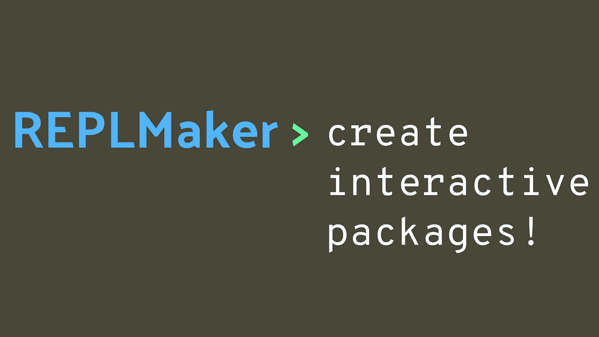

# jl:创建交互式 Julia 包

> 原文：<https://towardsdatascience.com/replmaker-jl-create-interactive-julia-packages-67be382f3eb8?source=collection_archive---------39----------------------->

## Pkg 探索

## 快速浏览使用 Julia 的 REPLMaker.jl 包为最终用户创建交互式代码



(图片由作者提供)

# 介绍

交互在科学和计算计算领域的程序员中并不经常被谈论。然而，不仅拥有交互式软件，而且拥有交互式软件包也有许多独特的优势。有时，当使用许多高级编程语言的包时，可能真的需要一个简单的读取求值打印循环，或 REPL。虽然这可能并不总是必要的，但在包中使用它肯定是一件很酷的事情，并且可以通过潜在的更简单的命令和定制的语法使找到问题的解决方案变得更加容易和方便。

幸运的是，对于 Julia 用户来说，有一个非常酷的工具可以做到这一点！这个包名为 REPLMaker.jl，您当然可以像使用大多数包一样使用 Pkg 来添加它。它已经被注册到了 Julia General package registry，但是那些希望使用不同分支的人总是可以通过 Git 添加它。

```
using Pkg; Pkg.add("REPLMaker")
```

说到 REPLs，如果您仍然使用上面的方法来添加包，您可能需要熟悉一下 Pkg REPL。它提供了我前面提到的同样的好处，缺少语法和简单的命令，但也为包提供了额外的功能，使它更容易做许多您可能想不到的不同事情。

# 概述

在整个 Julia 生态系统的各种包中有许多使用 REPLMaker.jl 的例子。也就是说，我认为有一个特别的例子非常突出，那就是 Genie.jl。我认为 Genie.jl 提供了一个非常可靠的例子，说明各种 REPLs 是如何非常有用的，并且这个包将这些好处带到了 web 开发的奇妙世界。

使用 Genie，可以为不同的交互体验提供单独的文件，为您加载环境。这对于服务器来说尤其方便，因为命令通常是在带有虚拟监管器的 Unix 计算机上运行的。将建立一个监督程序来运行

```
. shell_script_file.sh
```

以便在没有用户在场的情况下创建应用程序的实例。然后，该服务将被添加到与原始主管拥有相同权限的进程列表中。这对 Genie 意味着，可以用来访问 Genie REPL 的相同命令也可以用来加载虚拟环境和启动使用 web 框架的 web 服务器。

我认为更多的包应该应用这种方法，因为 REPLs 肯定是一个有用的工具。此外，我认为许多软件包可以以这种方式和其他方式利用 REPLs，在 Julian 软件的整个范围内创造一个普遍的交互和愉快的体验。

# 使用复制器

REPLMaker 包中将要使用的主要方法几乎肯定是 initrepl()。这个方法是导出的，所以我们将通过简单地导入包来获得它:

```
using ReplMaker
```

initrepl()方法接受一个位置参数和大量决定 repl 外观的关键字参数。然而，就功能而言，我们真正需要的是一个解析器。解析器将会对我们输入到 REPL 中的字符串进行解码。我们可以使用 Base 创建一个基本的表达式解析器。Meta 的解析器与我们的字符串:

```
exprparse(s) = quote Meta.parse($s) end
```

您可能已经注意到这个函数使用了“quote”语句。对于那些不熟悉 Julian 元编程的人来说，引用表达式基本上是告诉语言，这里包含的代码将是一个一致的表达式，而不是一系列的表达式。

现在我们可以调用 initrepl()方法并提供我们的解析函数来创建一个新的 repl。我们可能还想提供另一个名为“start key”的关键字参数，这将允许我们通过按键盘上的特定键来输入 REPL。

```
initrepl(exprparse, 
                prompt_text="Parse />",
                prompt_color = :blue, 
                start_key=')', 
                mode_name="Expr_mode")
```

现在，从朱莉娅·REPL，使用我们设置的开始字符，我们可以初始化我们刚刚创建的新 REPL。这个新的 REPL 将接受并计算我们可以作为字符串传递的 Julia 表达式。这并不十分有用，但是这个基本概念为库和应用程序打开了一扇大门。

# 结论

REPLMaker 对于朱莉娅编程语言来说是一个非常酷的工具，它使得在朱莉娅 REPLs 上实现令人敬畏的复制器变得又快又容易。这可以使用户通过执行命令来更容易和更快地处理包，而不需要担心语法。最重要的是，创建和使用它们相当有趣，这使得它们对教育更有价值。创建解析器相当有趣，但是创建一个有效的解析器的一个非常困难的部分是创建一个求值循环，并为解析器分配要访问的内存。也就是说，有了这两件事的照顾，我们可以非常简单地获得一些非常出色的结果！