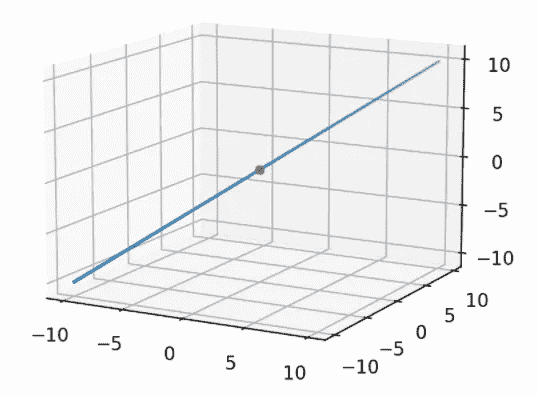
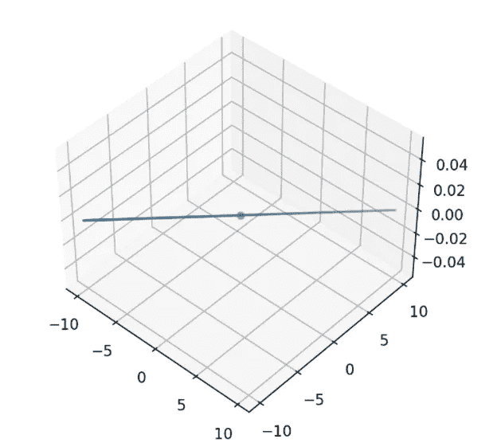
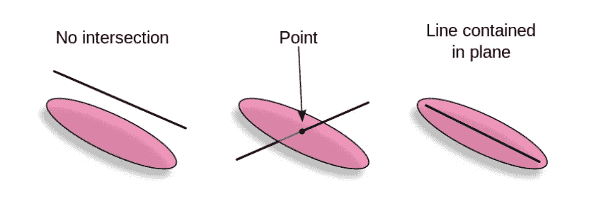

# 表示 3D 空间中的平面和直线

> 原文：<https://towardsdatascience.com/representing-planes-and-lines-in-3d-space-410845a8747e?source=collection_archive---------15----------------------->

迈克尔·泽兹奇在 [Unsplash](https://unsplash.com?utm_source=medium&utm_medium=referral) 上的照片

平面和直线是三维计算机视觉和计算机图形学中有用的几何实体。将它们表示为一组点是低效的，根据用于生成这些点的步长，这导致了大量的存储器需求。在本文中，我将讨论如何使用平面和直线的矢量方程来表示它们。我还将介绍如何使用向量形式找到直线与平面的交点。

# 三维线条

我们可以用下面的等式[1]来表示矢量形式的直线。

**p =l₀+l .**d**，** *d ∈ R*

其中 **l** 是直线方向的矢量， **l₀** 是直线上的一点，d 是实标量。

**p** 是直线上的一般点，这些点的轨迹定义了它。因此，为了定义一条线，我们只需要知道 6 个数字/参数就可以用矢量形式完整地表示它。

我已经创建了一个类来表示一个线向量并绘制它。它由一个向量和一个线上点来参数化。两者都是 3x1 numpy 列向量。

为了得到直线上的点以便绘图，我们可以使用矢量方程本身。改变 *d* 并将矢量的缩放版本添加到线上的点，您将获得线上的点！然后可以使用任何绘图库来绘制它们。

我将展示一些样本线。

向量(1，1，1)点(0，0，0)[来源:作者]

如果你想要一条横跨 2D 平面的线，那么你可以用一个只有两个坐标中非零值的向量，你会得到一条 2D 平面的线。

向量(1，1，0)点(0，0，0)[来源:作者]

# 三维平面

我们可以用下面的等式用矢量形式表示一个平面。

**(p**——**p₀)。n = 0，**其中 **n** 是平面的法向矢量 **p₀** 是平面上的一点。

上式中所有点 **p** 的轨迹定义了该平面。术语 **(p** — **p₀)** 表示平面中的矢量，而 **n** 是与平面正交的矢量。因此，对于位于平面上的所有点 **p** 的这些向量，这两个彼此正交的向量的点积将为零。

如此优雅的表达一个只有 6 个数字的平面的方式！

下面是 Python 中使用上述定义的一个平面类。

你可以在本文中了解更多平面表现方式:[https://medium . com/@ Daniel . j . Lenton/part-iii-projective-geometry-in-3d-37f 36746733 b](https://medium.com/@daniel.j.lenton/part-iii-projective-geometry-in-3d-37f36746733b)作者[丹尼尔·伦顿](https://medium.com/u/ee44ad5a4b38?source=post_page-----410845a8747e--------------------------------)。

接下来，我们来看看如何求一条直线与平面的交点。

# 3D [1]中点与平面的相交

现在我们知道了如何在 3D 中表示点和平面，我们可以看看如何找到这两个几何实体之间的交集。如果一条线和一个地方相交于一个点 **p，**，它将满足直线和平面方程。所以，求交点，通过把 **p** 的值从一条直线的方程代入一个平面的方程。

((**l₀+l .***d*)——**p₀**)**。n = 0**

展开这些项得到下面的等式。

(**法律条文)** d + ( **l₀ — p₀)。n = 0**

求解 d 得出:

p₀——l₀。(法律名称)

这是 d 的值，它给了我们一个点，这个点既在直线上，又在平面上，平面就是定义的交点。

有三种情况相交。

1.  首先是没有交点，即直线和平面平行，但直线不在平面内。
2.  接下来，正好有一个交点。
3.  最后，直线平行于平面并位于平面上，在这种情况下，直线上的每一点也将位于平面上。因此，在这种情况下会有无穷多个点同时满足这两个方程。

来源:[https://en . Wikipedia . org/wiki/Image:Plane-line-intersection . png](https://en.wikipedia.org/wiki/Image:Plane-line-intersection.png)

对于前两种情况， **l . n = 0** ，因为 **l** 将垂直于它们的法向量 **n** 。否则，我们将得到一个实数值 *d* ，它可以被代入直线方程以得到交点:

**p =l₀+l .**t34】d

我已经为平面和直线类编写了一个基于上述等式计算交集的函数。注意，函数是同一个方程，唯一不同的是代码语法。

我们现在可以使用 plane 和 line 类来查找它们之间的交点。

例如:

我们可以使用 sympy 来验证结果:

我们使用 sympy 实现也得到同样的结果，它验证了我们的代码。

来源:作者

# 结论

在这篇文章中，我们看了 3D 中的直线和平面。我们看到了它们的向量方程，以及如何用向量和点来表示它们。这允许只有 6 个数字的非常紧凑的表示。我们终于看到了如何找到两者之间的交集，并查看了三种可能的交集情况。我希望你觉得这很有用。关注更多有趣的文章。感谢您的阅读！

# 参考

[1][https://en . Wikipedia . org/wiki/Line % E2 % 80% 93 plane _ intersection](https://en.wikipedia.org/wiki/Line%E2%80%93plane_intersection)