# 如何在不编码的情况下用 Python 分析数据

> 原文：<https://towardsdatascience.com/reproducible-data-analysis-in-python-without-coding-806a7652dd34?source=collection_archive---------29----------------------->

## 使用导出 Python 代码的免费 pandas/plotly GUI


Marc-Olivier Jodoin 在 [Unsplash](https://unsplash.com?utm_source=medium&utm_medium=referral) 上拍摄的照片

***免责声明*** *: ⚠️前方傻笑话！此外，我是 bamboolib 的共同创建者。*

数据无处不在，现在比以往任何时候，我们都有免费的工具来探索它们。用于数据争论和探索的最流行的 python 库之一是 pandas(我猜你已经第 1354 次读到这句话了)。但是，说实话，它没有最直观的语法。这不仅使它很难学，而且如果你不天天和熊猫一起工作，也很难记住它的语法。

> 熊猫没有最直观的语法

此外，编写 pandas 代码有时感觉有点像用北欧战斧切菜:它完成了工作，我在做这件事的时候莫名其妙地觉得很酷，但当看到结果时，它看起来并不好，所以我宁愿不积极参与那种混乱。

脑海中浮现出这个怪异的画面，我有一种强烈的冲动，想创建一个 GUI 来为我生成 Python 代码，这样我就可以专注于从我的数据中获得见解，并与我心爱的人分享它们……嗯……我是说，我的同事。

# 遇见 bamboolib

bamboolib 是一个免费的 GUI，可以让你准备和探索你的数据。每次编辑数据以及使用该工具创建的每个交互式绘图，它都会为您创建 python 代码。这样，您可以跟踪您的步骤，重复您的分析，并创建交互式报告。

> 专注于获取和分享见解，而不是编码

如果您想使用 Jupyter Notebook/JupyterLab 使用 Python pandas 分析和探索数据，但是 a)完全是初学者，b)不想一直查找 pandas 语法，或者 b)只是想快速理解您的数据，而不必在笔记本中编写太多代码，那么这篇博客文章就是为您准备的。

您将了解到:

*   如何立即探索一个你从未见过的数据集(*手指交叉*)，而不必自己写一行代码
*   同时还在生产 python 代码。

## 一个小实验

关于博客帖子的格式，我想我会做一个实验:我将探索一个我以前从未见过的数据集**并和你一起经历我的 EDA 步骤。所以，不管这些数据有多乱/干净/无聊/令人兴奋，我都会探索并写一篇关于它的博客文章与你分享。而你(读这几行)是我做的见证人！**

那么，从哪里获取数据呢？由于我过去经常编写 R 代码并且[写了很多关于它的文章](https://www.statworx.com/de/blog/show-me-your-pipe/)，我去了[的数据科学“TidyTuesday”网站](https://github.com/rfordatascience/tidytuesday)，搜索了第一个引起我注意的随机数据集。

我在那里找到了它:关于“[全球森林砍伐——大豆生产和使用](https://github.com/rfordatascience/tidytuesday/blob/master/data/2021/2021-04-06/readme.md)”❤️.的数据这听起来就像“和公公婆婆在孤岛上呆一个月……”一样有趣，但至少引起了我的注意。

简而言之，数据集显示了生产了多少吨大豆用于动物饲料、人类食物和燃料。

# 安装 bamboolib

在我们开始之前，让我们按照[文档](https://docs.bamboolib.8080labs.com/)中的描述安装 bamboolib。

```
pip install bamboolib
python -m bamboolib install_extensions
```

# 探索全球大豆的使用

让我们打开一个 Jupyter 笔记本或 JupyterLab，无论你喜欢哪个。你可以自己输入数据

```
import pandas as pd
soybean_use = pd.read_csv('https://raw.githubusercontent.com/rfordatascience/tidytuesday/master/data/2021/2021-04-06/soybean_use.csv')
```

让我们用 bamboolib 来看看。在笔记本单元格中运行以下代码:

```
import bamboolib as bamsoybean_use
```

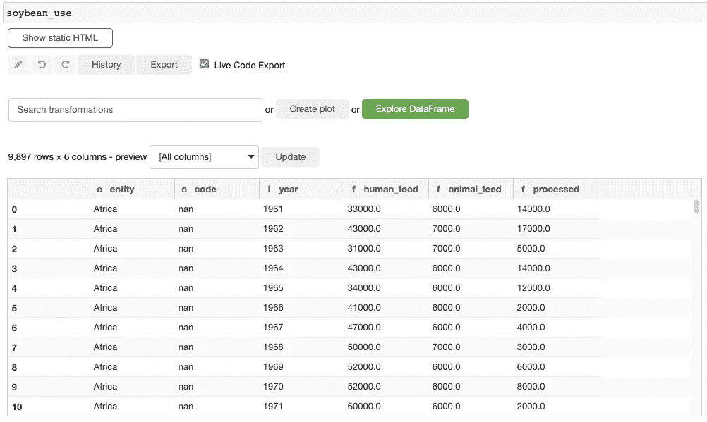

我们数据的交互视图。bamboolib 在静态熊猫 HTML 输出中添加了一个绿色小按钮。如果你点击那个按钮，你会看到如上所示的数据。

列**实体**引起了我的注意，因为我不确定它会包含什么值。第一个观察结果来自非洲，所以我认为**实体**可能包含大洲，但是滚动数据会发现**实体**也包含国家和一些人工聚类，如“净粮食进口发展中国家”。

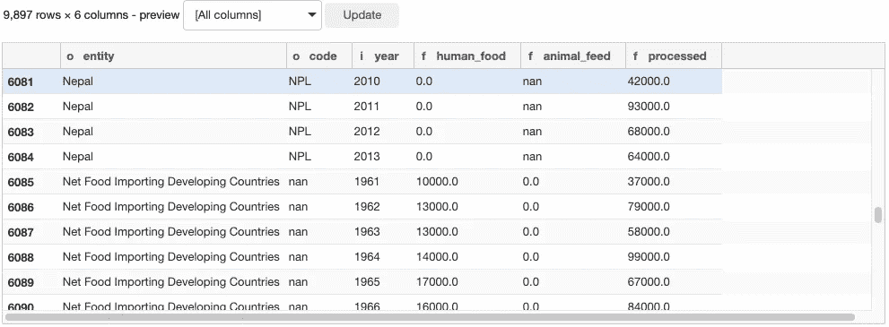

我滚动浏览这些行，找到了国家名称和人造集群的名称。

我只对国家感兴趣。那么剩下的怎么去除呢？

我有一种感觉**代码**指的是国家代码(开个玩笑，其实在[数据描述](https://github.com/rfordatascience/tidytuesday/blob/master/data/2021/2021-04-06/readme.md#soybean_usecsv)里是这么说的)，所以如果我把所有没有**代码**的行都去掉，我的数据里应该只有国家。但是在盲目丢弃任何行之前，我首先检查缺失代码的实体确实不是国家(“因为我们是谨慎的数据科学家！”).我这样做是通过过滤掉所有缺少**代码**的行，然后查看过滤后的数据来验证数据中不再有国家。

为此，我在搜索字段中搜索“filter ”,并使用 UI 过滤掉所有缺少代码的行

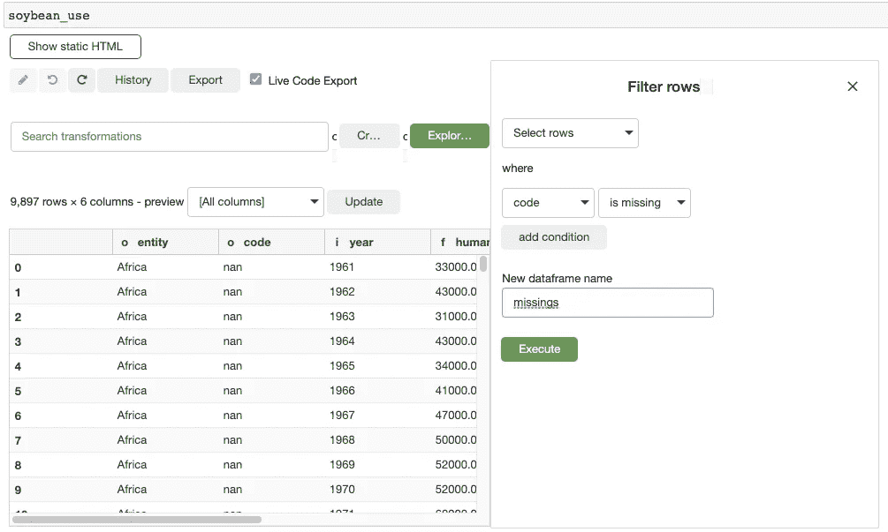

我给这个临时数据起了一个新名字 *missings* ，因为我不想覆盖原来的数据集。执行过滤器后，我从界面得到一些反馈，有 8，163 行(82%的数据)被删除了。另外，bamboolib 为我生成了以下代码:

```
missings = soybean_use.loc[soybean_use['code'].isna()]
```

当我点击新的*缺失*数据框的**实体**列标题时，我得到一个列摘要:

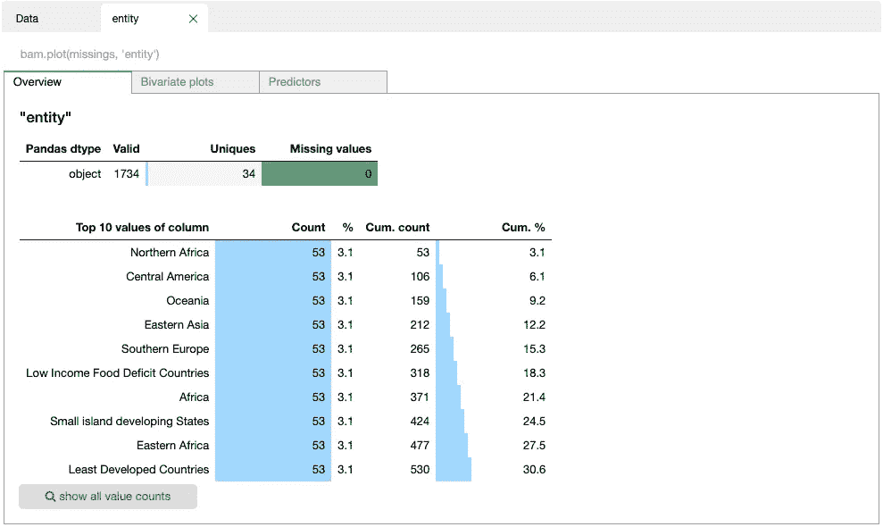

我们的缺失数据框中 ***实体*** *列的汇总*

我点击了 *show all value counts* 按钮，滚动了所有的实体值，正如所料，数据中不再有国家(如果你认为“北非”是一个国家，请给我发消息:-)。

因为我现在知道删除缺少代码的行不会丢弃任何国家，所以我从上面撤销那个过滤器(通过点击*撤销*按钮)并选择所有缺少**代码**是*而不是*的行。

过滤后，我的数据看起来像这样:

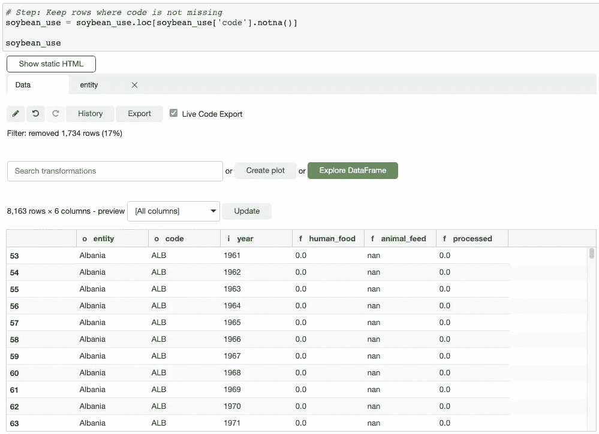

现在，让我们来看看其余的列。

*   **年份**明显。
*   **人类食物**包含用于人类食物(豆豉、豆腐、豆浆、毛豆等)的大豆数量(以吨为单位)
*   **动物饲料**包含直接喂给动物的大豆数量(吨)*。*
*   ***已加工**包含加工成植物油、生物燃料和加工动物饲料(如豆饼)的大豆数量(以吨计)*

**

# *一点数据争论*

*目前，数据是宽格式的，但我希望它是长格式的，以便更容易绘制(长格式数据(也称为整齐数据)使聚合和绘制更方便。你可能会问，为什么？你一会儿就会明白了)。*

*为此，我们需要重塑我们的数据。*

*我现在可以继续尝试在文本中解释从宽到长的重塑，但我更愿意将一些❤️放入一个漂亮的彩色图像中，以便更好地解释这一点。最后，我想得到的是以下内容:*

*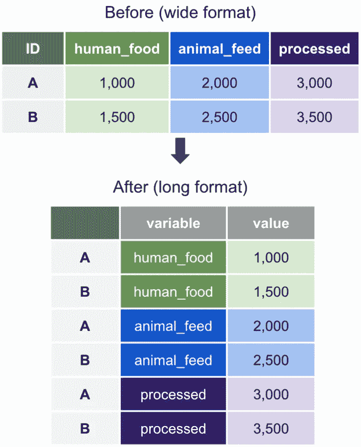*

*在我的例子中，ID 将对应于三列**实体**、**代码**和**年份。***

*在 UI 中，我搜索“重塑”，得到两个选项可供选择。因为我想变宽→变长，所以我选择“Unpivot/Melt”转换。*

*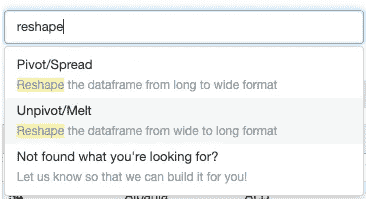*

*重塑— 1*

*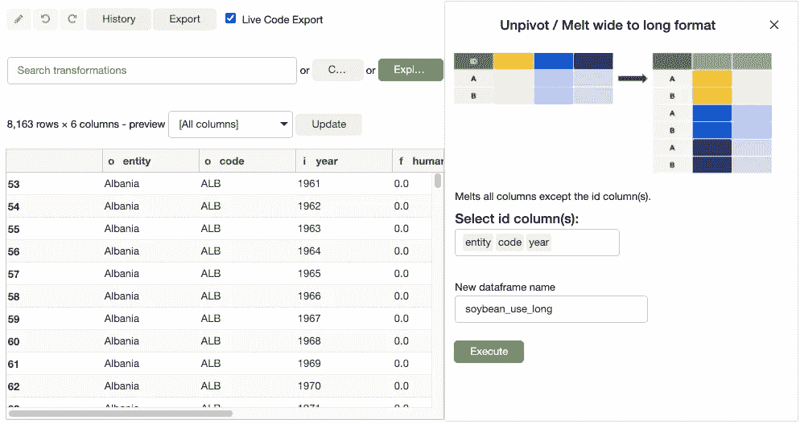*

*重塑— 2*

*我选择**实体**、**代码**和**年份**作为 ID 列。瞧:*

*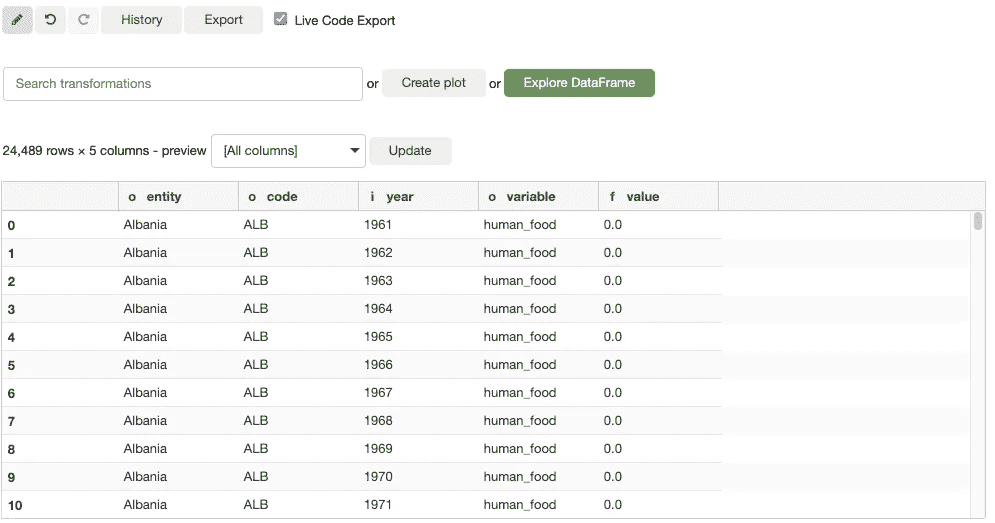*

*生成的代码是:*

```
*# Step: Melt columns based on the index columns entity, code, year
soybean_use_long = soybean_use.melt(id_vars=['entity', 'code', 'year'])*
```

*我还会给两列**变量**和**值**起更直观的名字。为此，我使用了“重命名列”转换。*

*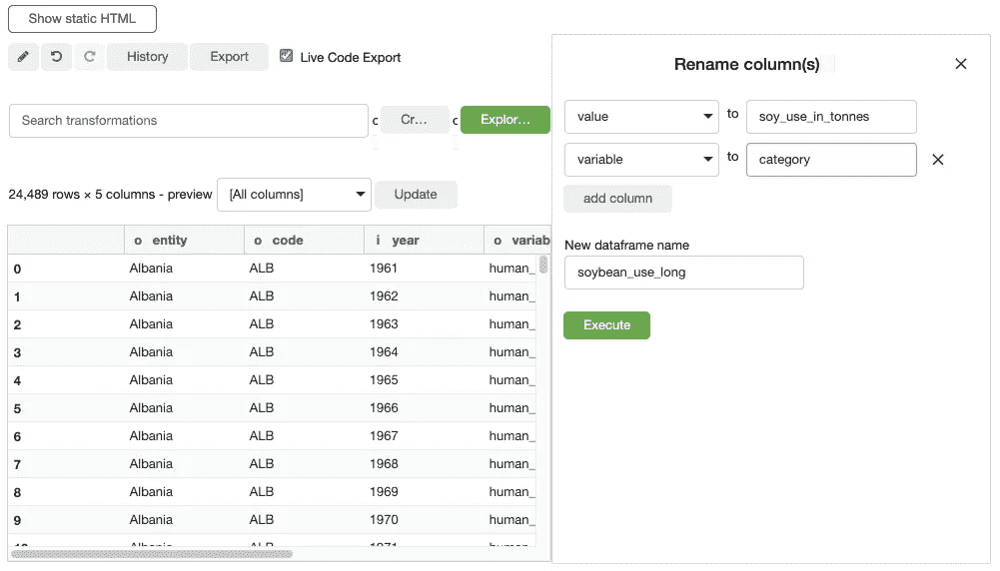*

*生成的代码是:*

```
*# Step: Rename multiple columns
soybean_use_long = soybean_use_long.rename(columns={'value': 'soy_use_in_tonnes', 'variable': 'category'})*
```

# *一些交互式可视化？*

*有了这些数据，我觉得可以开始一些可视化了。例如，我想展示以下内容:*

1.  *全球大豆产量如何随时间变化(假设我有地球上每个国家的数据)*
2.  *世界范围内大豆使用在各个类别中的变化*
3.  *还有更多的，但这将变得和我奶奶主持的长达 4 小时的 dia 节目一样无聊。所以让我们只关注上面的两个项目。*

*但在我们开始回答问题之前，我只是好奇看看哪些国家的大豆使用量最高，所以我把我的数据按**大豆使用量吨降序排列。***

*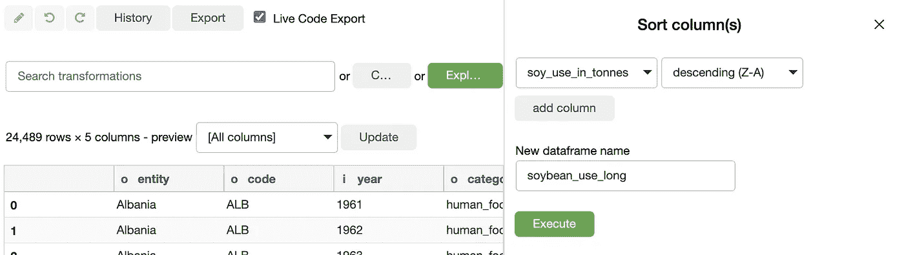*

*它产生代码*

```
*# Step: Sort column(s) soy_use_in_tonnes descending (Z-A)
soybean_use_long = soybean_use_long.sort_values(by=['soy_use_in_tonnes'], ascending=[False])*
```

*这样做的时候，我发现我们的数据中仍然有条目不是来自一个国家，而是包含了整个世界！*

*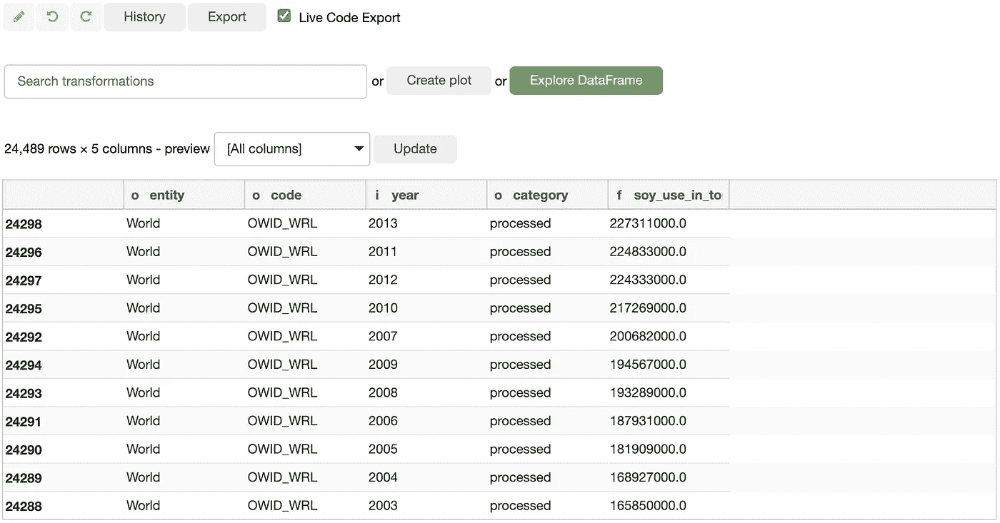*

*这是相当幸运的！无论如何，我想显示全球大豆的使用量，所以我不用自己生成总数，而是简单地使用来自世界实体的数据。*

*我这样做是通过过滤**实体**等于“World”的行。我称这些数据为大豆使用世界。你可怜的拇指(或者指针，如果你用电脑和鼠标阅读这篇文章的话)今天可能会让你浏览更多的东西，所以我在这里给你省略了截图。生成的代码是:*

```
*# Step: Keep rows where entity is one of: World
soy_use_world = soybean_use_long.loc[soybean_use_long['entity'].isin(['World'])]*
```

*所以有了 *soy_use_world* 在我手里，让我们最终创造一些互动的剧情吧！*

# *最后，一些交互式可视化！*

*随着时间的推移，全球大豆产量发生了怎样的变化？为了回答这个问题，我们使用 *soy_use_world* 和 sum**soy _ use _ in _ tonts**。为此，我在文本字段中搜索“aggregate”。*

*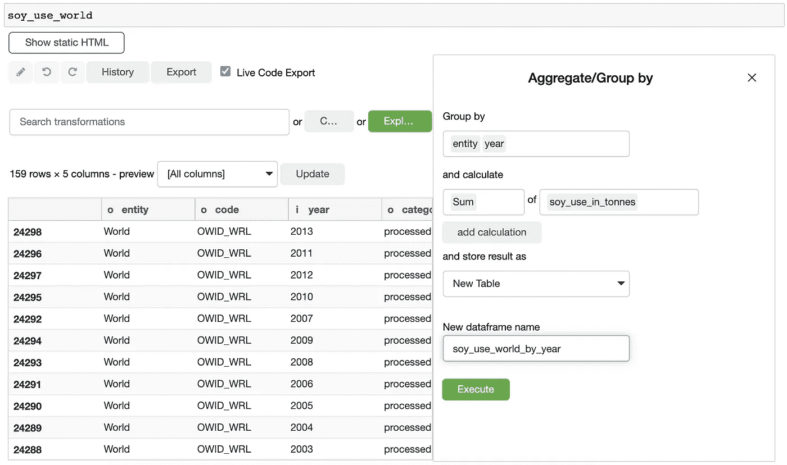*

*代码:*

```
*# Step: Group by and aggregate
soy_use_world_by_year = soy_use_world.groupby(['entity', 'year']).agg(soy_use_in_tonnes_sum=('soy_use_in_tonnes', 'sum')).reset_index()*
```

*然后，我点击*创建情节*。*

*让我们创建一个面积图(因为折线图是如此 2020！)显示了大豆产量随时间的变化。*

*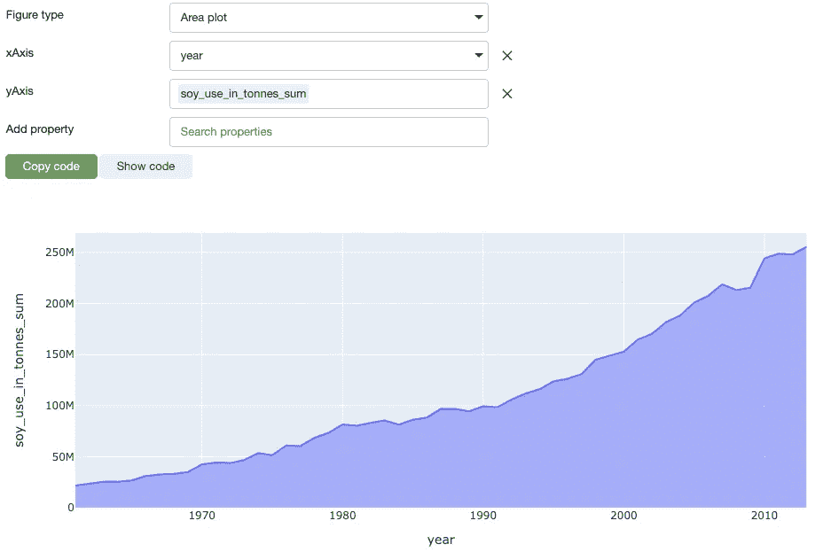*

*全球大豆产量(吨)*

*已经生成的代码是:*

```
*import plotly.express as px
fig = px.area(soy_use_world_by_year, x='year', y='soy_use_in_tonnes_sum')
fig*
```

*接下来，我将大豆在各个类别中的使用情况进行可视化。为此，我撤销了上面的聚合步骤，并创建了以下可视化:*

*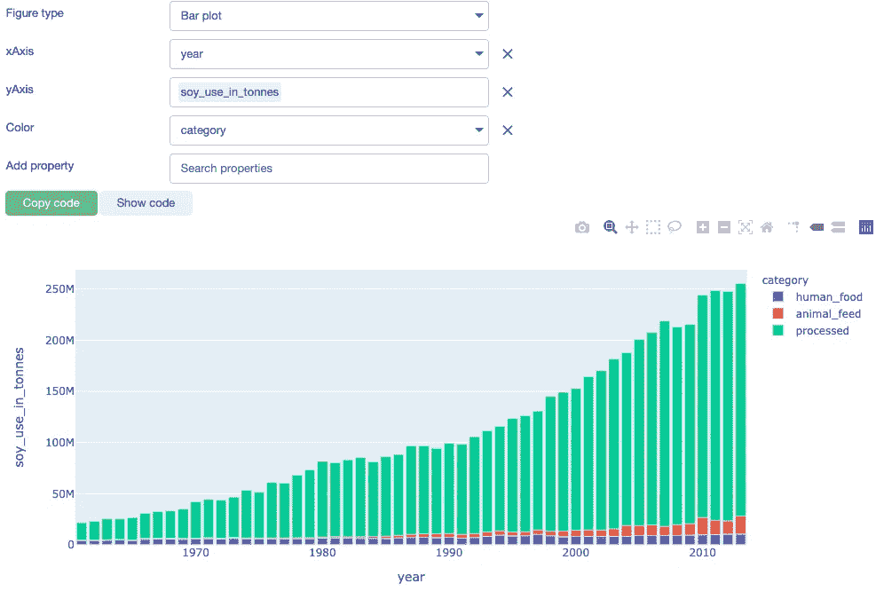*

*按类别分列的全球大豆产量(吨)*

*还记得我在上面写的关于将数据从宽到长重新整形的文章吗？没有吗？别担心，你不是唯一一个浏览博客文章寻找相关内容的人；-).但是如果你阅读了到目前为止的所有内容，你最终会明白为什么我改变了数据。我这样做是因为对于长格式的数据，我只需选择**类别**作为我的绘图的颜色属性，就可以用 plotly 创建一个堆积条形图。这就是哈德利·韦翰称之为“整洁数据”( T21)的美妙之处。*

*有意思！看起来大多数大豆被加工成油、燃料和豆饼。*

## *一些更好的可视化！*

*我想给你看的最后一件事是:使用 plot creator，你可以调整你的图形。让我们给它一个更好的调色板和一般的图形主题，创建一个吸引人的图形标题，并删除轴标签。*

*最终的剧情看起来是这样的:*

*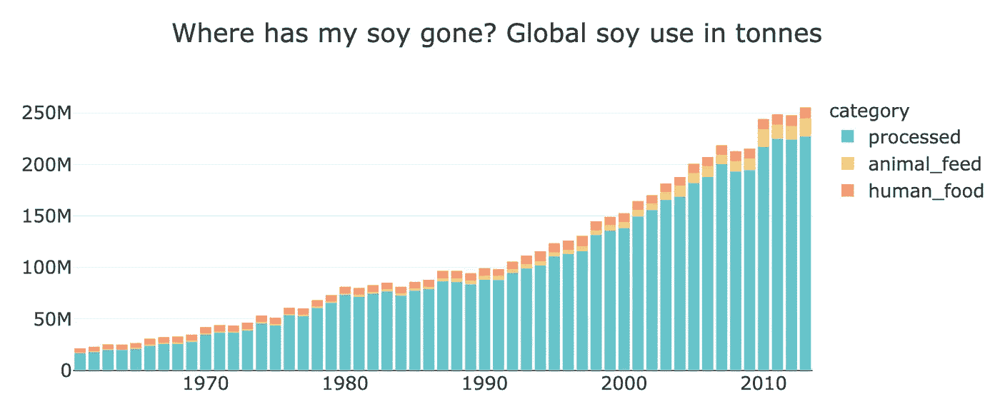*

*很漂亮，是吧？嗯，代码并不整洁:*

```
*import plotly.express as px
fig = px.bar(soy_use_world, x='year', y='soy_use_in_tonnes', color='category', color_discrete_sequence=px.colors.qualitative.Pastel, template='presentation', title='Where has my soy gone? Global soy use in tonnes', labels={'soy_use_in_tonnes': ' ', 'year': ' '})
fig*
```

*还好我不用自己去谷歌那些东西！*

# *离别的思绪*

*在这篇博文中，我们看了一个数据集，希望我们俩都没见过(至少我没见过！)—大豆的全球生产和使用。我们在几分钟内探索、准备并可视化了数据，没有搜索语法，也没有编写一行代码，同时仍然在创建代码。*

*我希望 bamboolib 能帮助你更快地从数据中获得洞察力，并在你即将到来的项目中减少认知负荷。*

*最后一件事:您可以用插件扩展 bamboolib(例如，创建一个类似“大写所有列名，然后只保留以' *_xyz'* '结尾的列，最后计算每对列之间的百分比差异”的转换)。在这里阅读更多关于如何为 bamboolib 自己编写插件的[。](https://github.com/tkrabel/bamboolib/tree/master/plugins)*

**如果你喜欢这篇文章，请告诉我你接下来想读什么！**