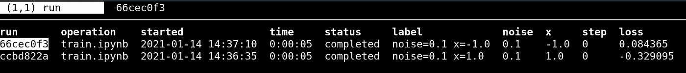
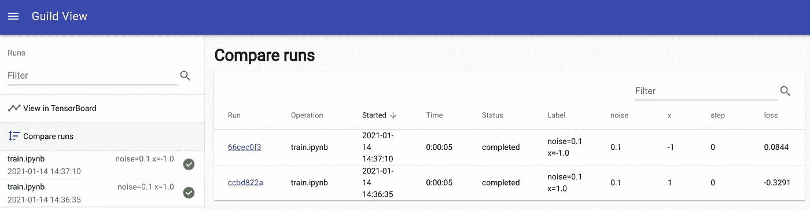
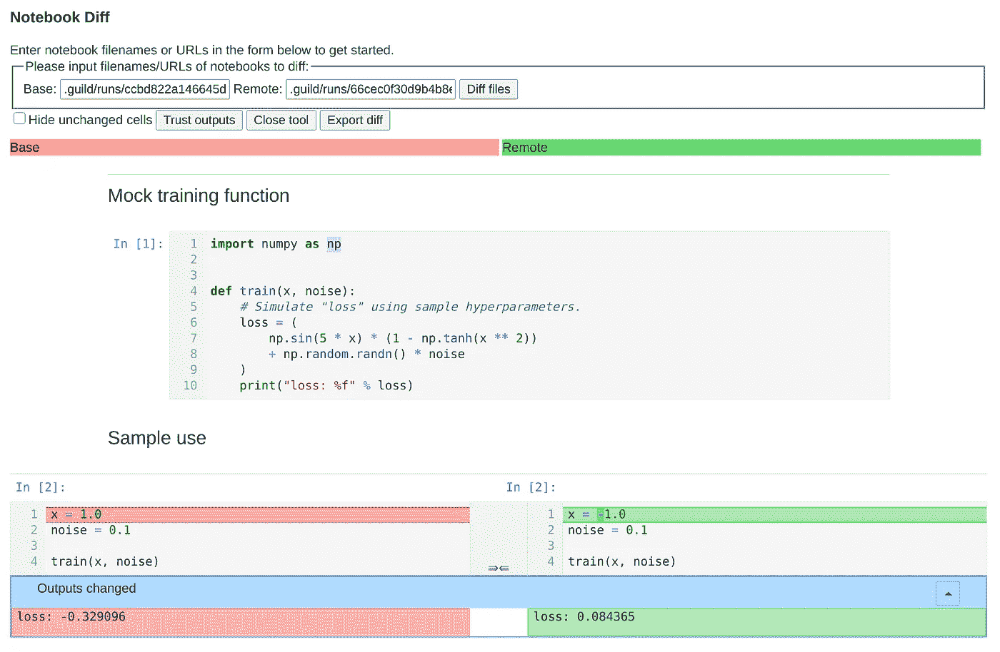
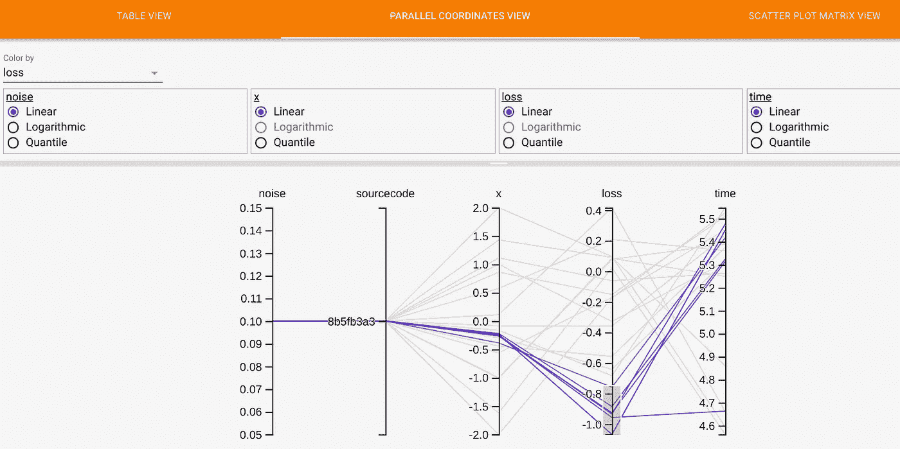
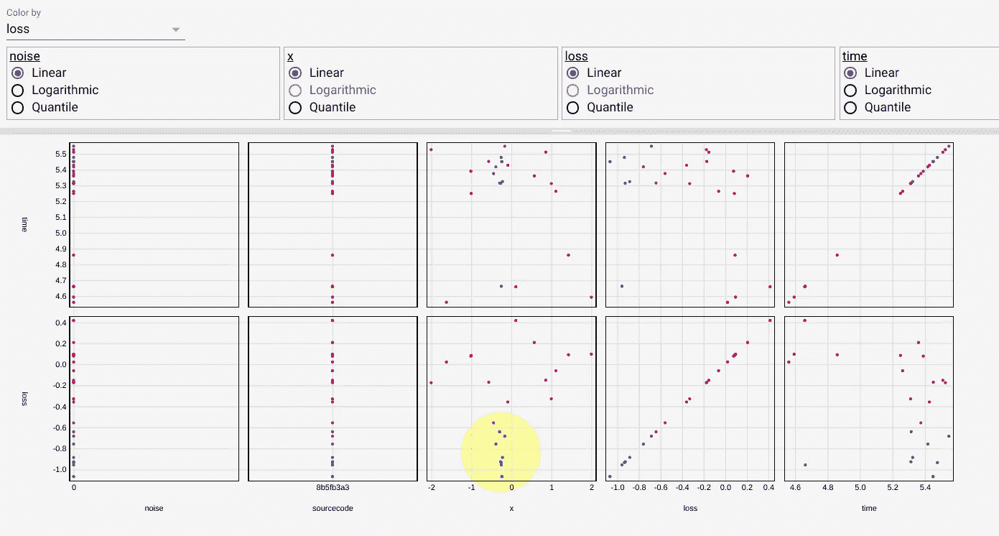
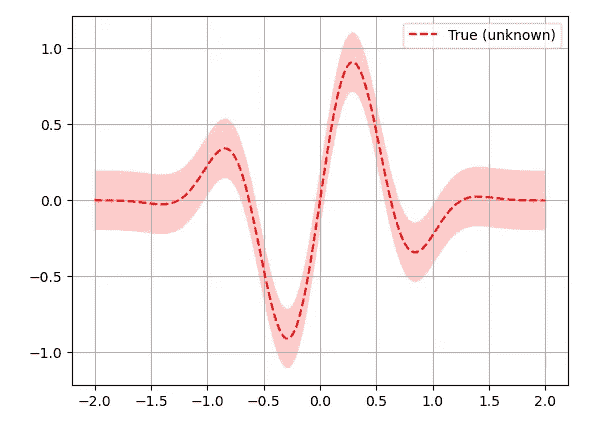
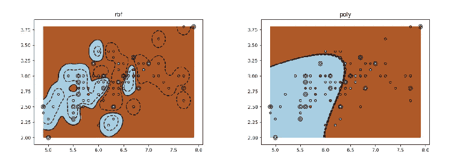

# 使用 Jupyter 笔记本和 Guild AI 进行可重复的实验

> 原文：<https://towardsdatascience.com/reproducible-experiments-with-jupyter-notebooks-and-guild-ai-3bd3c0d84456?source=collection_archive---------40----------------------->

笔记本是为灵活的专门 Python 开发而设计的。这给再现性带来了挑战。单元可以按任何顺序运行，并可以随时修改。您如何确定电池输出准确反映了电流源？即使有仔细的训练，你也不能确定一个结果与代码一致。

[Guild AI](https://guild.ai)——一个轻量级、[开源](https://github.com/guildai/guildai/blob/master/LICENSE.txt)实验跟踪工具——使用一个简单的方案来解决这个问题:

**自上而下执行一个笔记本副本作为实验神器。**

结果是一个笔记本，其输出准确地反映了执行时的源代码。这是一份可靠的实验记录。

Guild 在运行 Jupyter 笔记本时会执行额外的任务:

*   使用特定于运行的参数值修改笔记本副本(例如，在实验中使用不同的学习率)
*   保存实验元数据、输出和生成的文件
*   将完全执行的笔记本导出为 HTML 格式，以便于查看
*   在 [TensorBoard](https://www.tensorflow.org/tensorboard) 中保存图像和标量汇总用于比较

# 示例:运行笔记本

这是一个模拟训练跑步的笔记本示例。代码改编自 [*带目的的贝叶斯优化*](https://scikit-optimize.github.io/stable/auto_examples/bayesian-optimization.html) *。*

Jupyter 笔记本示例

`train`功能模拟训练过程。它将两个超参数作为输入，并打印一个“损失”样本。

用 Guild AI 运行这个笔记本作为实验:

```
$ guild run train.ipynb
```

公会检查笔记本，发现两个超参数:`x`和`noise`。

```
You are about to run train.ipynb
  noise: 0.1
  x: 1.0
Continue? (Y/n)
```

确认后，公会首先将`train.ipynb`复制到一个唯一的目录中，该目录包含实验数据。这确保了该实验不同于原始笔记本和任何其他实验。Guild 修改实验副本以反映为运行指定的标志值。在这种情况下，Guild 使用笔记本中定义的默认值。接下来，Guild 从上到下运行笔记本副本中的所有单元格。每个单元格的结果都保存在笔记本副本中。原笔记本未修改。

以下是运行的输出:

```
INFO: [guild] Initializing train.ipynb for run
INFO: [guild] Executing train.ipynb
loss: -0.116769
INFO: [guild] Saving HTML
```

因为笔记本副本在运行后不会改变，所以它是一个值得信赖的记录。

再次运行原来的笔记本，这次使用不同的`x:`值

```
$ guild run train.ipynb x=-1.0
You are about to run train.ipynb
  noise: 0.1
  x: -1.0
Continue? (Y/n)
```

公会用另一个笔记本副本创建了一个新的实验。副本对`x`使用不同的值。

```
INFO: [guild] Initializing train.ipynb for run
INFO: [guild] Executing train.ipynb
loss: 0.349546
INFO: [guild] Saving HTML
```

注意，在这个实验中，损耗更高。`x`的新值似乎是次优的。

你现在有两个实验，每个实验都有不同的`x`值和相应的损失。显示可用行程:

```
$ guild runs
[1:66cec0f3]  train.ipynb  completed  noise=0.1 x=-1.0
[2:ccbd822a]  train.ipynb  completed  noise=0.1 x=1.0
```

除了运行和记录实验，Guild 还提供了一些特性来验证它们:

*   比较结果——例如，找到损失最低的运行
*   查看特定实验的文件和元数据
*   比较文件以查看不同实验之间的变化
*   比较图和图像
*   使用结果为新实验建议最佳超参数

# 比较运行

直接从命令行比较不同实验的标记和结果:

```
$ guild compare
```

公会显示了两个回合各自的旗值和损失。如果您对模型性能有疑问，请使用此方法快速评估结果。请注意，出现在顶行的最新实验的损耗高于第一个实验。



从命令行比较运行

按`q`退出程序。

您也可以用图形方式比较运行:

```
$ guild view
```

这个命令会在你的浏览器中打开*公会视图*，你可以使用它来浏览跑步细节并并排比较结果。要退出，返回命令提示符并按下`Ctrl-c`。



以图形方式比较运行

# 不同笔记本

通过将每个实验保存为单独的笔记本，您可以通过*区分*它们的笔记本文件来比较两个实验。Guild 使用 [**nbdime**](https://nbdime.readthedocs.io/en/latest/) 如果安装的话在你的浏览器中并排显示差异。

显示两个实验笔记本文件之间的差异:

```
$ guild diff --path train.ipynb
```

该命令适用于最近两次运行的`train.ipynb`。您可以根据需要指定不同的管路。



并排比较实验笔记本

注意不同之处:

*   `x`的值从`1.0`变为`-1.0`
*   损失增加，表明`x`的值`-1.0`是次优的

还要注意的是，每个实验的`train`功能都是相同的。如果修改了函数，上面会显示精确的逐行修改。这可以让你评估实验的所有相关方面。

# 超参数搜索

Guild 支持*批处理运行*用一个命令生成多个实验。这用于多种超参数[搜索方法](https://en.wikipedia.org/wiki/Hyperparameter_optimization)，包括网格搜索、随机搜索和顺序优化。

例如，您可以使用贝叶斯优化和高斯过程来运行搜索，以找到最小化`loss`的`x`值:

```
$ guild run train.ipynb x=[-2.0:2.0] --optimizer gp --minimize loss
You are about to run train.ipynb with 'skopt:gp' optimizer (max 20 trials, minimize loss)
  noise: 0.1
  x: [-2.0:2.0]
Optimizer flags:
  acq-func: gp_hedge
  kappa: 1.96
  noise: gaussian
  random-starts: 3
  xi: 0.05
Continue? (Y/n)
```

该命令使用`-2.0`和`2.0`之间的`x`值运行一系列实验，根据之前的结果，这些值更有可能最小化`loss`。默认情况下，公会产生 20 个回合。您可以根据需要对其进行更改，以运行更多或更少的实验。

当 Guild 完成命令时，你有 22 次运行——最初的两次加上搜索的 20 次。

使用`guild compare`或`guild view`(见上文)比较运行。

您可以使用[张量板](https://www.tensorflow.org/tensorboard)评估超参数。Guild 集成了 TensorBoard 作为跑步的可视化工具。

```
$ guild tensorboard
```

此命令在浏览器中打开 TensorBoard。点击 **HPARAMS** ，然后点击**PARALLEL COORDINATES VIEW**来可视化超参数对结果指标的影响。

在`loss`轴的下部点击并拖动鼠标。这突出显示了使用`x`最佳值的实验。



使用平行坐标视图评估实验结果

您可以看到`x`的最佳值落在`-0.5`和`0.0`之间

接下来，点击**散点图矩阵视图**。



用散点图评估超参数和度量之间的关系

这显示了比较超参数和度量的图。`x`和`loss`之间的比较显示了最佳运行——即`loss`最低的位置——沿着底部轴聚集，使`x`的值刚好低于`0`。该区域在上面以黄色突出显示。

根据`train`函数，将突出显示的散点图与`x`和`loss`之间的已知关系进行比较:



x 与损失([信用](https://scikit-optimize.github.io/stable/auto_examples/bayesian-optimization.html))的关系

散点图中的点对应于`x`和`loss`之间的已知关系。与其他价值观相比，全球负面的`loss`结果相对更多。这表明贝叶斯模型对于预测最优超参数的某种程度的有效性，至少对于这个简单的例子是如此。

真实世界的模型没有这么简单。这个例子仅仅强调了我们已经知道的关于`x`和`loss`的事情。尽管如此，您可以将这种技术应用于任何模型，以获得重要的见解和优化，如果没有系统的度量，这将是困难的。

# 再现性和 Jupyter 笔记本

这种方法支持完全可再现的笔记本实验。要重现实验，使用 Guild 运行笔记本，并将结果与基线进行比较。

结果可以进行数字比较，例如比较诸如*损失*、*准确性*、 *auc* 等指标。也可以通过并排比较图和其他实验工件来定性地比较结果。

考虑以下两个实验的 [SVM](https://en.wikipedia.org/wiki/Support-vector_machine) 分类界限(与我们的模拟例子无关):



比较 SVM 分类界限

分类损失*的简单数字比较*可能显示这些模型表现相似。他们实际上是非常不同的。当你看这些情节时，这是显而易见的。一个结果是否成功地复制了另一个结果是一个需要进一步讨论的问题。无论如何，拥有全面的评估标准是这一过程的关键。

# 轻量级方法

请注意 Guild 运行和跟踪实验的轻量级方法:

*   原笔记本没有修改支持公会功能。标志、输出、度量和绘图都可以作为结果使用，无需使用特定于公会的 API。
*   运行实验不需要额外的代码。您使用外部命令。这适用于单次运行和批量超参数优化。
*   结果保存在本地磁盘上。你不需要安装数据库或其他服务。你不会把数据发送到云端。
*   Guild 集成了一流的工具，而不是与之竞争。您使用 TensorBoard 和 nbdime，它们都是功能丰富的工具，专门用于特定的任务。

# 摘要

为了用 Jupyter 笔记本准确记录实验，单元格输出反映单元格源代码是很重要的。这对于笔记本来说是一个挑战，因为你可以在任何时候以任何顺序自由地编辑和执行单元格。虽然这种灵活性适用于特定的实验性开发，但是您需要可靠的控制来进行精确的实验跟踪。

公会人工智能通过自动化笔记本执行来解决这个问题。当你用 Guild 运行一个笔记本时，没有手动干预或无序单元执行的机会。Guild 为每个实验创建一个笔记本副本，并从上到下执行其单元格。这将产生一致的结果，并确保对原始笔记本的更改不会影响它们。

除了这个执行模型，Guild 还提供了查看和比较实验的特性。有了这些工具，您可以利用您的工作来对后续步骤做出明智的决策。您可以检测回归并捕捉意外的变化。

Guild 作为一个轻量级的、功能丰富的工具提供了这种支持，可以在 Apache 2 开源许可下免费获得。

# 链接

有关更多信息，请参见以下链接:

*   [朱庇特笔记本实验文档](https://my.guild.ai/docs/jupyter-notebook-experiments/)
*   [公会 AI 网站](https://guild.ai)
*   [在线社区](https://my.guild.ai)
*   [GitHub 库](https://github.com/guildai)
*   [训练二元分类器的分步示例笔记本](https://my.guild.ai/examples/binary-classifier-notebook)