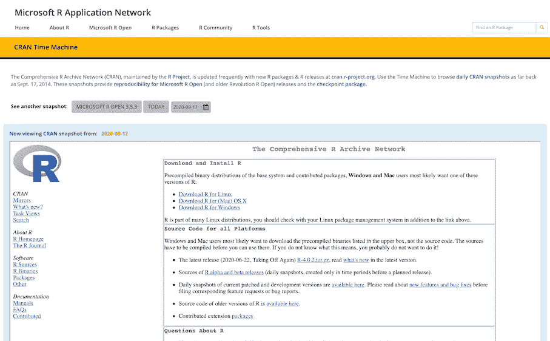

# R 中的可复制作品

> 原文：<https://towardsdatascience.com/reproducible-work-in-r-e7d160d5d198?source=collection_archive---------12----------------------->

## 为什么以及如何在日常工作流程中使用 Docker

# 疼痛源

*   作为数据科学家，我们在处理生产级代码库时面临的最大挑战之一是确保端到端的可重复性和长期稳定性。
*   这也会延伸到学术界，但我不是院士。
*   基本的 R setup 没有内置的功能来存储包版本和依赖关系(例如，不像在 conda 环境中运行)。
*   如果你的默认库是 CRAN，这是一个大问题，因为 CRAN 每天都在更新。
*   我发现像`pkgdown`这样的解决方案用起来太麻烦了。我甚至尝试过在 conda 环境下工作，但我不是一个粉丝。
*   数据科学家之间的团队合作增加了额外的复杂性。根据我的经验:
*   一个团队中的成员可以拥有所有东西的不同版本——OS、R 内核、包、库、环境变量…!
*   一些人在升级他们的系统上是保守的；其他人很乐意尝试新版本的软件包
*   跨操作系统工作经常会带来意想不到的问题(IME，特别是那些允许并行计算的函数`mcapply`、`future`)。)
*   当在本地系统(可能是 Windows)上开发代码库，但在另一个环境(可能是 Linux)中部署代码库时，这就成了问题

# 解决办法

根据我的经验，我下面概述的解决方案为我提供了一个长期可再现性和代码稳定性的优秀方法:

1.  使用 MRAN 快照锁定您的 R 包版本
2.  使用 Docker 图像锁定您的工作环境
3.  在 Docker 容器中进行所有开发
4.  为所有项目附上 Docker 图像

这非常有效，我已经有半年多没有在本地机器上使用 R/Rstudio 了。

# 1.MRAN 时间机器

微软 R 应用网(MRAN)提供了一款“[时光机](https://mran.microsoft.com/timemachine)”。这项服务为 [CRAN 仓库](http://cran.r-project.org)仓库拍摄每日快照，时间可以追溯到 2014 年 9 月。您可以在他们的页面上浏览快照:



MRAN 网站截图。来自作者。

MRAN 快照使用日期作为“索引”，帮助我们锁定软件包版本。例如，运行:

```
install.packages("lattice", 
                 repos = "https://mran.microsoft.com/snapshot/2020-10-01")
```

将于 2020 年 10 月 1 日安装`{lattice}`版本。

现在，这种方法并没有使选择随时间发布的包*的*特定版本*变得更容易，而是允许您锁定一个日期，只获得在所选日期可用的那些版本。这意味着在 10 月 1 日之后的任何一天运行“更新包”都不会改变你的包配置。*

```
> options(repos = "https://mran.microsoft.com/snapshot/2020-10-01")
> getOption("repos")
[1] "https://mran.microsoft.com/snapshot/2020-10-01"
```

# 2.Docker 图像

# 文档文件

`Dockerfile`保存了如何构建 docker 映像的定义。我用来维护这个博客的 Dockerfile 保存在[这里](https://github.com/rsangole/blog/blob/master/docker/Dockerfile)。它也在 hub.docker.com 举办。

下面是对该文件的快速解释。要更深入地了解 Dockerfiles，网上有很多资源 [1](https://rollout.io/blog/a-beginners-guide-to-the-dockerfile/) 、 [2](https://linuxhint.com/understand_dockerfile/) 、 [3](https://blog.hipolabs.com/understanding-docker-without-losing-your-shit-cf2b30307c63) 。

## 从

我使用的是`rocker/tidyverse:4.0.0` [图像](https://hub.docker.com/layers/rocker/tidyverse/4.0.0/images/sha256-b5dca99adfd18ae14ba50dcbc4aaaec2674138bc75015104a77a9805694c157a?context=explore)，它提供了一个很好的起点。它预装了 R 4 . 0 . 0 版和 tidyverse 包。

```
FROM rocker/tidyverse:4.0.0
```

## 奔跑

这将安装后续 R 包工作所需的许多 linux 库。我还安装了一些有用的实用软件包，如`curl`、`jq`和`vim`。

```
RUN apt-get update && apt-get install -y --no-install-recommends \
        libgit2-dev \
        libxml2-dev \
        ... \
        ... \
        curl \
        tree \
        jq \
        htop \
        texinfo \
        vim \
        man-db \
        less
```

## 环境+ R PKG 安装

我在这里设置 MRAN 的构建日期，然后安装我需要的 R 包，使用`install2.r`和`-r`参数指向 MRAN 时间机器而不是 CRAN。

```
ENV MRAN_BUILD_DATE=2020-09-01# Install Basic Utility R Packages
RUN install2.r -r https://cran.microsoft.com/snapshot/${MRAN_BUILD_DATE} \
    --error \
    rgl \
    data.table \
    reprex \
    # ~ 30 more R Packages
    ... \
    ... 
```

## 构建和推送

构建 docker 映像并将其推送到`hub.docker.com`。

```
docker build . -t hatmatrix/blog:latest
docker push hatmatrix/blog:latest
```

你的 docker 图片现在可以在线提供给任何运行你的项目的人。

# 3.在 Docker 中开发

现在我有了一个稳定的 docker 图片，可以用在这个博客上。我可以用这个 shell 命令运行映像:

```
docker run 
    -d 
    -e PASSWORD=1234 
    -v ~/github/:/home/rstudio/projects/ 
    -p 3838:3838 
    -p 8787:8787 
    hatmatrix/blog:latest
```

该命令的组成部分包括:

*   `docker run`:运行 docker 镜像…
*   `-d`:在分离模式下，即一旦图像在后台运行，您将得到您的 shell 提示
*   `-e PASSWORD=1234` : `-e`是附加参数。这里，我们将 Rstudio 密码设置为 1234
*   `-v`:这将我本地机器上的`~/github/`映射到 docker 容器中的`~/home/rstudio/projects/`
*   这些参数将端口从我的本地机器映射到 docker 中的端口。我们需要一个用于 rstudio (8787)的，一个用于我们从 rstudio (3838)中启动的任何闪亮的应用程序
*   `hatmatrix/blog:latest`:这是 docker 图像的名称

**`**-v**`**:**没有`-v`你将无法访问 docker 容器中的任何本地文件。请记住，docker 容器与您的本地机器完全隔离。此外，由于容器是短暂的(即短暂的&临时的)，一旦容器关闭，您将永久丢失存储在其中的任何数据。映射到本地文件夹允许您处理本地存储在容器中的项目。**

# **4.Docker 图像伴随 R 项目**

**只需在您的工作项目目录中创建一个`/docker`文件夹，并保存您的 docker 文件。这里是我的博客的例子:[示例 docker 文件夹](https://github.com/rsangole/blog/tree/master/docker)。可选地，创建一个`docker-build.sh`来节省一些输入。**

# **就是这样！**

**这是一个轻量级的工作流程，无论我在哪个操作系统上工作，它都允许我保持完全的可再现性和代码稳定性。**

# **有用的链接**

*   **[https://mran.microsoft.com/timemachine](https://mran.microsoft.com/timemachine)**
*   **[https://github.com/rocker-org/rocker](https://github.com/rocker-org/rocker)**