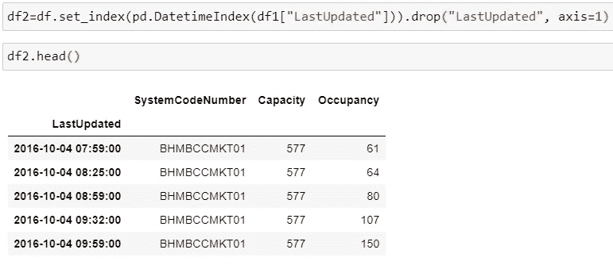
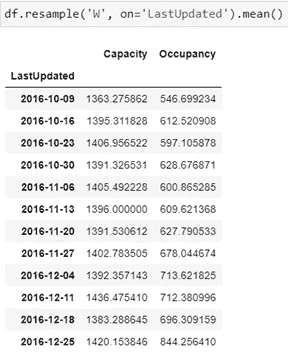
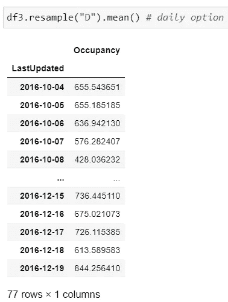
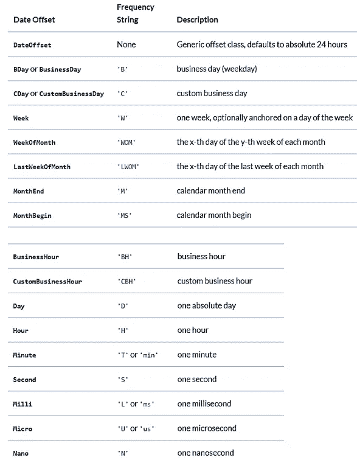
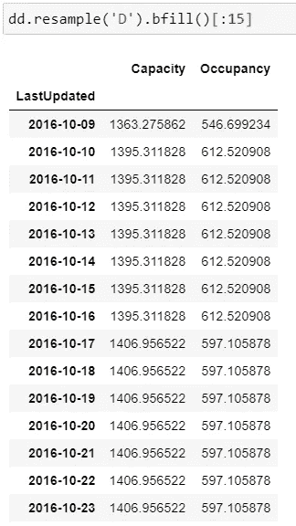
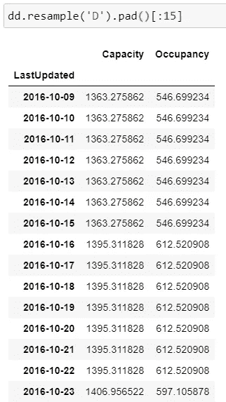
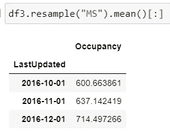
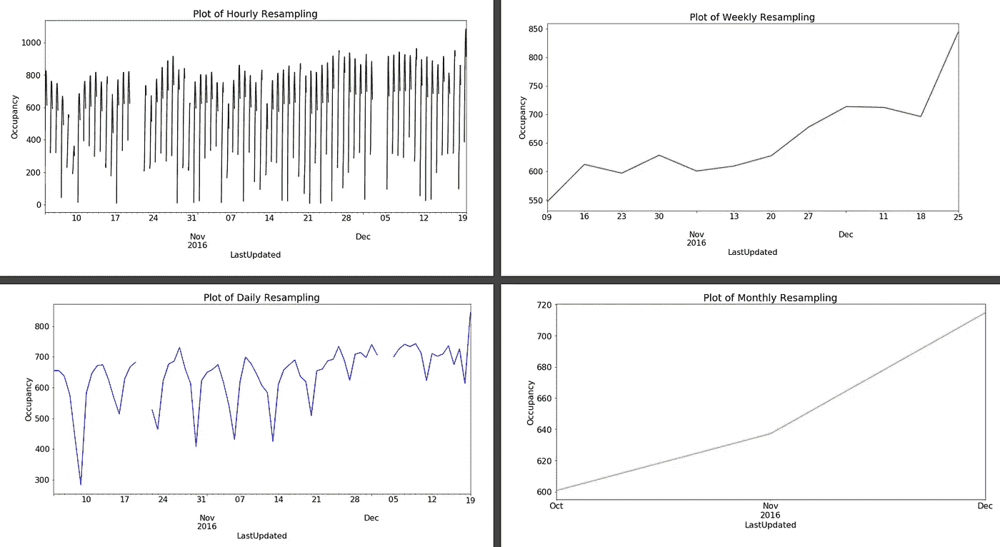

# 熊猫的重采样功能

> 原文：<https://towardsdatascience.com/resample-function-of-pandas-79b17ec82a78?source=collection_archive---------4----------------------->

## pandas 的重采样功能在时间序列数据中的应用

Nathan Dumlao 在 Unsplash 上拍摄的照片

重采样用于时间序列数据。对于时间序列数据的频率转换和重采样，这是一种方便的方法。尽管它的工作条件是对象必须具有类似日期时间的索引(例如，DatetimeIndex、PeriodIndex 或 TimedeltaIndex)。简而言之，如果想按月、周、日等模式排列时间序列数据。，这个功能很有用。熊猫图书馆有这个功能。为了演示的目的，使用了 https://archive.ics.uci.edu/ml/datasets/Parking+Birmingham 的 UCI 数据集，即。

**阅读数据**

在时序数据中，当我们从. csv 文件中读取数据时，日期变量的数据类型是 objects。因此，为了读取 datetime 格式的 date 列，我们使用了 **parse_dates** 参数。在研究数据中，LastUpdated 是日期变量，parse_dates=["LastUpdated"]参数正确读取日期格式，而当 parse_dates 参数不使用" LastUpdated "时，变量类型是对象。

作者图片

日期时间索引

由于重采样函数使用 DatetimeIndex、PeriodIndex 或 TimedeltaIndex，因此，现在我们需要将变量“LastUpdated”更改为 datetimeindex，如下所示:

作者图片

**重采样**

重采样是对时间序列进行频率转换和重采样。因此，如果需要将数据从每天更改为每月或每周等。反之亦然。为此，我们在 pandas 库中提供了重采样选项[2]。在重采样函数中，如果我们需要将日期更改为 datetimeindex，也可以选择参数“on ”,但该列必须是类似 datetime 的。

作者图片

在使用选项“D”进行重采样后，数据变为每日数据，即所有日期都将被考虑在内。375717 条记录降采样为 77 条记录。

作者图片

**其他规则选项**

规则(代表目标转换)最常用的选项如下，其他选项也可以在参考文献[1]中找到:

作者图片

重采样选项用于两个选项，即上采样和下采样。

**上采样:**在这种情况下，我们对更短的时间范围进行重采样，例如将月度数据重采样为每周/每两周/每天等。因此，许多容器是用 NaN 值创建的，为了填充这些容器，有不同的方法可用作填充方法和填充方法。例如，将周数据更改为日数据并使用 bfill 方法会得到以下结果，因此 bfill 会在重新采样的数据中反向填充新的缺失值:

作者图片

另一种方法是填充法，它向前填充如下值:

作者图片

我们还可以在 upsamling 中使用 asfreq()或 fillna()方法。

**下采样:**在这种情况下，我们对更宽的时间范围进行重新采样，例如将每日数据重新采样为每周/每两周/每月等。为此，我们有 sum()、mean()、max()等选项。例如，每日数据被重新采样为月初数据，均值函数如下所示:

作者图片

**重采样的图形表示**

按照四种不同的规则(即每小时、每天、每周和每月)对数据进行重采样后，会获得以下图表。我们可以清楚地看到较短时间框架和较长时间框架之间的差异。在小时图中，噪声更多，并且从每天到每周到每月都在减少。根据研究目标，我们可以决定哪种规则是最好的。

作者图片

谢谢！

参考资料:

1.  [https://pandas . pydata . org/pandas-docs/stable/user _ guide/time series . html](https://pandas.pydata.org/pandas-docs/stable/user_guide/timeseries.html)
2.  [https://pandas . pydata . org/pandas-docs/stable/reference/API/pandas。DataFrame.resample.html](https://pandas.pydata.org/pandas-docs/stable/reference/api/pandas.DataFrame.resample.html)