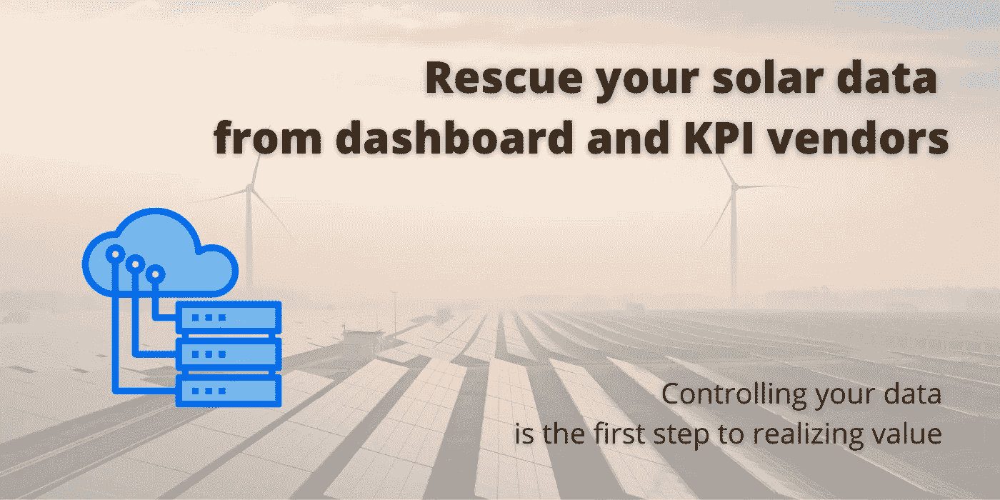
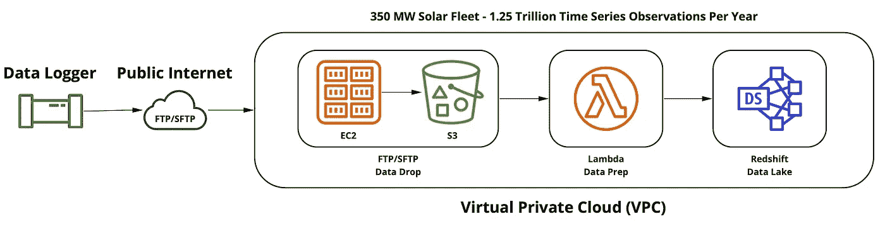

# 从仪表板和 KPI 供应商那里抢救您的太阳能数据

> 原文：<https://towardsdatascience.com/rescue-your-solar-data-from-hostage-taking-dashboard-and-kpi-vendors-9aafe8afbeed?source=collection_archive---------29----------------------->

## 控制数据是利用数据实现价值的第一步

图像通过 Canva.com 授权给约翰尼多宾斯。

**简介**

在过去的五年里，当我和我的团队为公用事业规模的太阳能分析开发我们所谓的“透明盒子”解决方案时，我注意到一种令人不安的数据保护主义模式，甚至是在该领域运营的流行仪表板和 kpi 供应商的直接劫持。

几乎每周，我都在帮助客户和潜在客户驾驭这个行业对充当数据湖提供商的“仪表板解决方案”的有毒依赖。随着太阳能数据分析领域在过去五年中的扩展，资产经理、性能工程师和数据科学家被迫使用“供应商 api”来获取自己的数据。

我将分析几点为什么这是不健康的；此外，我将为那些希望控制数据并开始为您的组织创造新价值的人分享一份路线图。

**作为这些数据的消费者，我们如何以及为什么允许供应商这样做？**

在我看到的每一个案例中，都是从数据收集设备或“数据记录器”开始的；这是安装在每个站点的物理硬件，连接到您的太阳能资产，收集数据，然后传输数据。通常，我们看到 Moxa IA240 和 UC81112 数据记录器这样做，但有许多类型。通常，太阳能运营商拥有这些设备。

图像通过 Canva.com 授权给约翰尼多宾斯。

当“仪表板和 kpi”供应商将设备配置为向/他们的/服务发送数据时，问题就出现了。那正是人质事件开始的时刻。

为什么这样不好？

1.  你必须通过供应商获得 API 密钥和访问你的数据；这可能会有成本甚至速率/容量限制。
2.  通常，您的供应商不会向与您合作的其他第三方承包商或供应商提供 API 密钥或访问权限。
3.  他们掌握着数据，促使你在公用事业规模的太阳能报告和分析中使用通常不合格的解决方案。

**绘制我们摆脱数据人质危机的路线图**

作者图片

作为数据记录器的所有者，你有能力控制和制止这种滥用。

上面的图表是一个简单的例子，它将花费你每年 15，000 美元。它解放了你的数据。如果您仍然希望仪表板和 kpi 供应商完成他们的工作，他们可以从您的数据湖中轻松完成。

通过让数据记录器将数据传输到您的私有云和存储，您可以为您的组织创造大量价值:

1.  通常，不同的站点计算 KPI 和报告的方式不同，不会采用供应商提供的一刀切的方法。
2.  您可以真正超越监控，并利用当今太阳能领域免费提供的任意数量的开源解决方案和库。
3.  您可以更轻松地利用更好的仪表板和真正的分析解决方案。

它是你的数据，你控制它；您可以轻松利用您的 SQL/REST 接口，随心所欲地使用它。

**结论**

当你委托新的太阳能站点时，坚持将数据记录器编程为向你自己的数据湖或历史学家提供数据。如果你不想处理拥有和管理你自己的，依靠流行的商业解决方案，如雪花或 OSISoft 的 PI 产品。最终，保持对数据的完全访问和控制是超越这些仪表板和 kpi 监控解决方案，为您的组织创造真正价值的唯一途径。

在我最近的文章中，我写了更多关于这个的内容，[*用你的能量数据*](/create-value-with-your-energy-data-26feaa723c07) 创造价值。

我在职业工程生涯中花了很多时间开发应用程序，帮助人们从他们的数据和内容中获得更多价值。

这方面的经验包括为佛罗里达州的 TBO.com 构建“防飓风”的新闻编辑室应用程序，为国家地理杂志构建“摄影比赛”应用程序，以及在过去的五年中，为运营商开发工具，帮助他们提高能源行业资产的性能和影响力。

> *>>>****导入此***